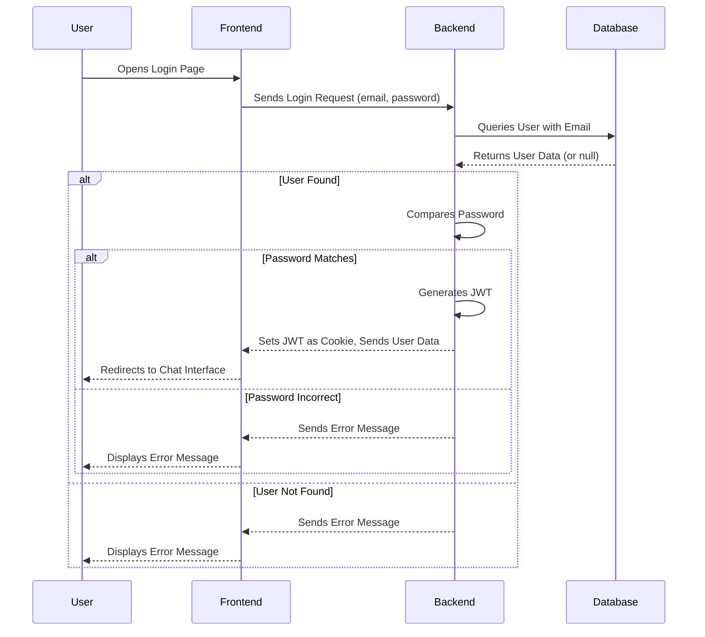
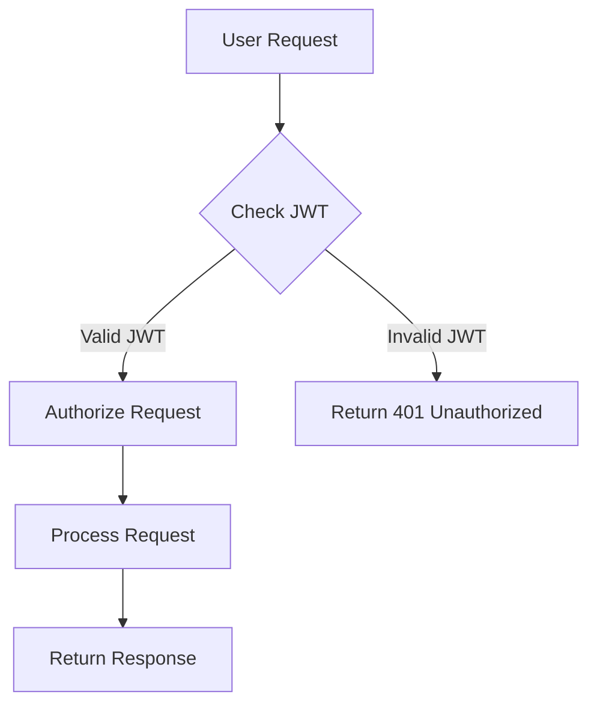

# Authentication and Authorization

This document outlines the authentication and authorization mechanisms implemented in the Chat-App-MERN application. It covers the processes for user registration, login, logout, profile updates, and the middleware used to protect routes.

## Authentication Flow

The application uses JSON Web Tokens (JWT) for authentication. When a user successfully signs up or logs in, a JWT is generated and stored as an HTTP-only cookie. This cookie is then sent with subsequent requests to the server. The server verifies the JWT to authenticate the user and authorize access to protected resources.

## Key Components

- **backend/src/controllers/auth.controller.js:** Handles user registration, login, logout, profile updates, and checks for username availability.
- **backend/src/middleware/auth.middleware.js:** Implements the `protectRoute` middleware, which verifies the JWT and authenticates the user.
- **backend/src/routes/auth.route.js:** Defines the authentication routes, including signup, login, logout, and profile updates.
- **frontend/src/store/useAuthStore.js:** Manages the authentication state on the frontend, including signup, login, logout, and checking authentication status.

## Signup Process

The signup process involves validating user input, checking for existing users with the same email or username, hashing the password, and creating a new user in the database. A JWT is then generated and sent as a cookie to the client.

```javascript title="backend/src/controllers/auth.controller.js"
export const signup = async (req, res) => {
    const {username, email, password} = req.body;
    try {
        if(!username || !email || !password) {
            return res.status(400).json({message: "Please fill in all fields."});
        }
        const user = await User.findOne({email});
        if (user) return res.status(400).json({message: "Email already exists."});
        
        const existingUserByUsername = await User.findOne({ username });
        if (existingUserByUsername) {
            return res.status(400).json({ message: "Username already exists. Please choose another." });
        }

        const salt = await bcrypt.genSalt(10);
        const hashedPassword = await bcrypt.hash(password, salt);

        const newUser = new User({
            username,
            email,
            password: hashedPassword,
            authProvider: 'email'
        });
        if(newUser){
            generateToken(newUser._id, res);
            await newUser.save();

            res.status(201).json({
                _id: newUser._id,
                username: newUser.username,
                email: newUser.email,   
                profilePic: newUser.profilePic,
                authProvider: newUser.authProvider
            });
        } else {
            res.status(400).json({message: "Invalid user data."});
        }
    } catch (error) {
        console.log("Error in signup controller", error.message)
        res.status(500).json({message: "Something went wrong."});
    }
};
```

[View on GitHub](https://github.com/shinymack/Chat-App-MERN/blob/main/backend/src/controllers/auth.controller.js)

Explanation:

- This code snippet shows the signup function in the `auth.controller.js` file.
- It first checks for the username, email and password.
- Then checks if the email is already in the database.
- Then encrypts password and save the new user in the db.
- Lastly it creates token and send the response.

## Login Process

The login process involves verifying the user's credentials and generating a JWT if the credentials are valid.

```javascript title="backend/src/controllers/auth.controller.js"
export const login = async (req, res) => {
    const {email, password} = req.body;
    try {
        const user = await User.findOne({email});

        if(!user) {
            return res.status(400).json({message: "Invalid credentials."});
        }

        const isPasswordCorrect = await bcrypt.compare(password, user.password);
        if(!isPasswordCorrect) {
            return res.status(400).json({message: "Invalid credentials."});
        }

        generateToken(user._id, res);
        res.status(200).json({
            _id: user._id,
            username: user.username,
            email: user.email,
            profilePic: user.profilePic,
            authProvider: user.authProvider,
        });
    } catch (error) {
        console.log("Error in login controller", error.message);
        res.status(500).json({message: "Something went wrong."});
    }
};
```

[View on GitHub](https://github.com/shinymack/Chat-App-MERN/blob/main/backend/src/controllers/auth.controller.js)

Explanation:

- This code snippet shows the login function in the `auth.controller.js` file.
- It finds user with email provided
- Then compares the password if the user exists
- Lastly it creates token and send the response.

## Logout Process

The logout process involves clearing the JWT cookie on the client-side.

```javascript title="backend/src/controllers/auth.controller.js"
export const logout = (req, res) => {
    try {
        res.cookie("jwt", "", {maxAge: 0});
        res.status(200).json({message: "Logged out successfully."})
    } catch(error) {
        console.log("Error in logout controller", error.message);
        res.status(500).json({message:"Internal Server Error"}); 
    }
};
```

[View on GitHub](https://github.com/shinymack/Chat-App-MERN/blob/main/backend/src/controllers/auth.controller.js)

Explanation:

- This code snippet shows the logout function in the `auth.controller.js` file.
- Which basically clears the JWT token by setting `maxAge` to 0.

## Authentication Middleware

The `protectRoute` middleware is used to protect routes that require authentication. It verifies the JWT and authenticates the user before allowing access to the route.

```javascript title="backend/src/middleware/auth.middleware.js"
import jwt from "jsonwebtoken"
import User from "../models/user.model.js"

export const protectRoute = async (req, res, next) => {
    try {
        const token = req.cookies.jwt;
        if(!token){
            return res.status(401).json({message: "Unauthorized - No Token Provided"});
        }

        const decoded = jwt.verify(token, process.env.JWT_SECRET)

        if(!decoded) {
            return res.status(401).json({message: "Unauthorized - Invalid Token"});
        }
        const user = await User.findById(decoded.userId).select("-password");

        if(!user) {
            return res.status(404).json({message: "User not found"});
        }
        req.user = user;

        next();
    } catch (error) {
        console.log("Error in protectRoute middleware", error.message);
        res.status(500).json({message: "Internal Server Error"});

    }

};
```

[View on GitHub](https://github.com/shinymack/Chat-App-MERN/blob/main/backend/src/middleware/auth.middleware.js)

Explanation:

- This code snippet shows the `protectRoute` middleware in the `auth.middleware.js` file.
- It checks for token in the cookies, if not present then unauthorized request
- Verifies token and gets the user, if token is invalid or user not found, then unauthorized request.
- Lastly, adds user in the req object for using it in other controllers

## Profile Update

Users can update their profile information, including their profile picture and username. The `updateProfile` controller handles this functionality.

```javascript title="backend/src/controllers/auth.controller.js"
export const updateProfile = async (req, res) => {
    try {
        const { profilePic, username } = req.body;
        const userId = req.user._id;
        let userToUpdate = await User.findById(userId);

        if (!userToUpdate) {
            return res.status(404).json({ message: "User not found." });
        }

        const fieldsToUpdate = {};
        let newUsername = username ? username.trim() : null;
        let usernameChanged = false;

        if (newUsername && newUsername !== userToUpdate.username) {
            if (newUsername.length < 3 || newUsername.length > 20) {
                return res.status(400).json({ message: "Username must be between 3 and 20 characters." });
            }
            const existingUserWithNewUsername = await User.findOne({ username: newUsername, _id: { $ne: userId } });
            if (existingUserWithNewUsername) {
                return res.status(400).json({ message: "This username is already taken by someone else." });
            }
            fieldsToUpdate.username = newUsername;
            usernameChanged = true;
        }

        if (profilePic) {
            const uploadResponse = await cloudinary.uploader.upload(profilePic);
            fieldsToUpdate.profilePic = uploadResponse.secure_url;
        }

        if (Object.keys(fieldsToUpdate).length === 0) {
            return res.status(400).json({ message: "No changes provided to update." });
        }

        const updatedUser = await User.findByIdAndUpdate(userId, { $set: fieldsToUpdate }, { new: true });

        if (!updatedUser) {
            return res.status(404).json({ message: "Failed to update user."});
        }

        generateToken(updatedUser._id, res);

        res.status(200).json(updatedUser);

    } catch (error) {
        console.error("Error in updateProfile controller", error.message);
        if (error.code === 11000 && error.keyValue && error.keyValue.username) {
            return res.status(400).json({ message: "This username is already taken." });
        }
        res.status(500).json({ message: "Internal Server Error while updating profile." });
    }
};
```

[View on GitHub](https://github.com/shinymack/Chat-App-MERN/blob/main/backend/src/controllers/auth.controller.js)

Explanation:

- This code snippet shows the `updateProfile` function in the `auth.controller.js` file.
- It validates username and profile picture then updates and saves the user
- Lastly, the function calls the generate token function to refresh the token with the updated details.

## Frontend Authentication State Management

The `useAuthStore` Zustand store manages the authentication state on the frontend. It provides functions for signup, login, logout, and checking authentication status.

```javascript title="frontend/src/store/useAuthStore.js"
import { create } from "zustand";
import { axiosInstance } from "../lib/axios";
import toast from "react-hot-toast";

export const useAuthStore = create((set, get) => ({
    authUser: null,
    isSigningUp: false,
    isLoggingIn: false,
    isUpdatingProfile: false,
    isCheckingAuth: true,

    checkAuth: async () => {
        try {
            const res = await axiosInstance.get("/auth/check");
            set({ authUser: res.data });
        } catch (error) {
            set({ authUser: null });
            console.log("Error in checkAuth: ", error);
        } finally {
            set({ isCheckingAuth: false });
        }
    },

    signup: async (data) => {
        set({ isSigningUp: true });
        try {
            const res = await axiosInstance.post("/auth/signup", data);
            set({ authUser: res.data });
            toast.success("Account created successfully");
        } catch (error) {
            toast.error(error.response.data.message);
        } finally {
            set({ isSigningUp: false });
        }
    },

    logout: async () => {
        try {
            axiosInstance.post("/auth/logout");
            set({ authUser: null });
            toast.success("Logged out successfully");
        } catch (error) {
            toast.error(error.response.data.message);
        }
    },

    login: async (data) => {
        set({ isLoggingIn: true });
        try {
            const res = await axiosInstance.post("/auth/login", data);
            set({ authUser: res.data });
            toast.success("Logged in successfully");

        } catch (error) {
            toast.error(error.response.data.message);
        } finally {
            set({ isLoggingIn: false });
        }
    },
    updateProfile: async (data) => {
        set({ isUpdatingProfile: true });

        try {
            const res = await axiosInstance.put("/auth/update-profile", data);
            set({ authUser: res.data });
            toast.success("Profile updated successfully");
        } catch (error) {
            console.log("error in update profile: ", error);
            toast.error(error.response.data.message);
        } finally {
            set({ isUpdatingProfile: false });
        }
    },
}));
```

[View on GitHub](https://github.com/shinymack/Chat-App-MERN/blob/main/frontend/src/store/useAuthStore.js)

Explanation:

- This code snippet shows the `useAuthStore` Zustand store
- It contains all the states and function related to auth like `authUser`, `isSigningUp`, `isLoggingIn`, `checkAuth`, `signup`, `login`, `logout` and `updateProfile`.

## Google Authentication

The application also provides Google Authentication, which uses Passport.js for handling the OAuth 2.0 flow.

```javascript title="backend/src/routes/auth.route.js"
router.get(
    '/google',
    passport.authenticate('google', { scope: ['profile', 'email'] })
);
router.get(
    '/google/callback',
    passport.authenticate('google', {
        failureRedirect: 'http://localhost:5173/login', 
        failureMessage: true
    }),
    googleAuthCallback 
);
```

[View on GitHub](https://github.com/shinymack/Chat-App-MERN/blob/main/backend/src/routes/auth.route.js)

Explanation:

- This code snippet shows the google auth routes.
- The `/google` route redirects the user to Google for authentication.
- The `/google/callback` route handles the callback from Google after authentication.

## Sequence Diagram of Authentication





## Authorization Flow





## Key Integration Points

- **JWT Management:**  The use of HTTP-only cookies for storing the JWT enhances security by preventing client-side JavaScript from accessing the token directly.
- **Middleware Protection:** The `protectRoute` middleware ensures that only authenticated users can access protected resources.
- **Frontend State Management:** The `useAuthStore` Zustand store simplifies the management of authentication state on the frontend, making it easy to track user authentication status and update the UI accordingly.
```