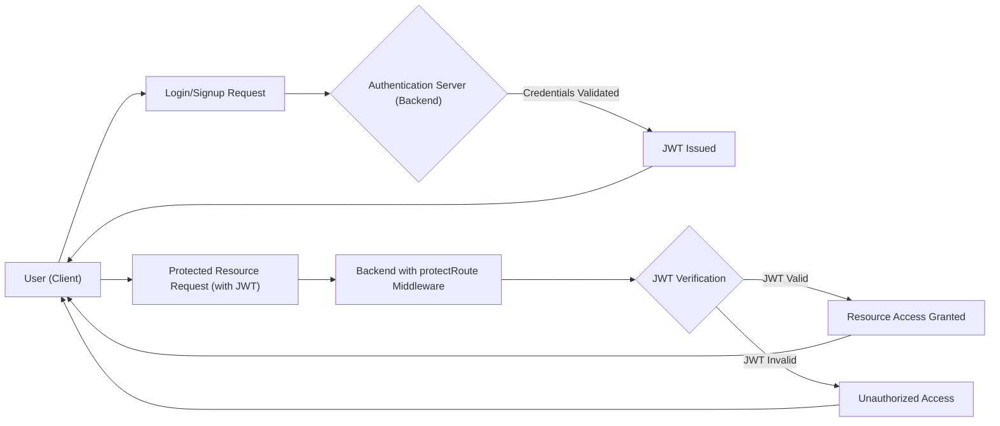

# Authentication and Authorization

This document outlines the authentication and authorization mechanisms implemented in the Chat-App-MERN project. It details how users are authenticated and authorized to access different parts of the application, both on the frontend and backend.

## Authentication Methods

The application supports user authentication through the following methods:

*   **Google OAuth 2.0:** Users can sign up and log in using their Google accounts.
*   **Traditional Email/Password:** Users can also create an account and log in using a traditional email and password combination.

## Backend Authentication and Authorization

The backend authentication and authorization logic is primarily handled by `backend/src/middleware/auth.middleware.js` and `backend/src/lib/passport.config.js`.

### Passport Configuration (backend/src/lib/passport.config.js)

This file configures the Passport.js library, which is used for handling Google OAuth 2.0 authentication.

```javascript title="backend/src/lib/passport.config.js"
import passport from 'passport';
import { Strategy as GoogleStrategy } from 'passport-google-oauth20';
import User from '../models/user.model.js';
import dotenv from 'dotenv';

dotenv.config();

export const configurePassport = () => {
    passport.use(new GoogleStrategy({
        clientID: process.env.GOOGLE_CLIENT_ID,
        clientSecret: process.env.GOOGLE_CLIENT_SECRET,
        callbackURL: process.env.GOOGLE_CALLBACK_URL,
        scope: ['profile', 'email']
    },
    async (accessToken, refreshToken, profile, done) => {
        try {
            let user = await User.findOne({ googleId: profile.id });

            if (user) {
                return done(null, user);
            } else {
                // Logic to create a new user
                let username = profile.displayName.replace(/\s+/g, '').toLowerCase() || `user${Date.now()}`;

                const existingUserByUsername = await User.findOne({ username });
                if (existingUserByUsername) {
                    username = `${username}${Date.now().toString().slice(-4)}`;
                }
                if (username.length > 20) username = username.substring(0,20);


                const newUser = new User({
                    googleId: profile.id,
                    email: profile.emails && profile.emails[0] ? profile.emails[0].value : null,
                    username: username,
                    authProvider: 'google',
                });

                if (!newUser.email) {
                    return done(new Error("Email not provided by Google. Cannot create account."), null);
                }

                const existingUserByEmail = await User.findOne({ email: newUser.email });
                if (existingUserByEmail && existingUserByEmail.authProvider !== 'google') {
                    return done(null, false, { message: `An account with email ${newUser.email} already exists. Please sign in using your original method.` });
                }

                await newUser.save();
                return done(null, newUser);
            }
        } catch (error) {
            return done(error, null);
        }
    }));

    passport.serializeUser((user, done) => {
        done(null, user.id);
    });

    passport.deserializeUser(async (id, done) => {
        try {
            const user = await User.findById(id);
            done(null, user);
        } catch (error) {
            done(error, null);
        }
    });
};

```

[View on GitHub](https://github.com/shinymack/Chat-App-MERN/blob/main/backend/src/lib/passport.config.js)

**Explanation:**

*   The code imports necessary modules like `passport`, `passport-google-oauth20`, and the `User` model.
*   `configurePassport` function sets up the Google OAuth 2.0 strategy.  It defines how to authenticate users using Google. It checks if a user with the Google ID already exists.  If not, it creates a new user. It handles cases where a user might already exist with the same email but a different authentication provider.
*   `passport.serializeUser` and `passport.deserializeUser` are used to manage user sessions. `serializeUser` stores the user ID in the session, and `deserializeUser` retrieves the user object from the database based on the ID stored in the session.

### JWT Protection Middleware (backend/src/middleware/auth.middleware.js)

The `protectRoute` middleware is responsible for verifying the JWT (JSON Web Token) sent by the client and ensuring that the user is authorized to access protected routes.

```javascript title="backend/src/middleware/auth.middleware.js"
import jwt from "jsonwebtoken"
import User from "../models/user.model.js"

export const protectRoute = async (req, res, next) => {
    try {
        const token = req.cookies.jwt;
        if(!token){
            return res.status(401).json({message: "Unauthorized - No Token Provided"});
        }

        const decoded = jwt.verify(token, process.env.JWT_SECRET)

        if(!decoded) {
            return res.status(401).json({message: "Unauthorized - Invalid Token"});
        }
        const user = await User.findById(decoded.userId).select("-password");

        if(!user) {
            return res.status(404).json({message: "User not found"});
        }
        req.user = user;

        next();
    } catch (error) {
        console.log("Error in protectRoute middleware", error.message);
        res.status(500).json({message: "Internal Server Error"});

    }

};
```

[View on GitHub](https://github.com/shinymack/Chat-App-MERN/blob/main/backend/src/middleware/auth.middleware.js)

**Explanation:**

*   The code retrieves the JWT from the `jwt` cookie.
*   It verifies the token using the `JWT_SECRET` environment variable.
*   If the token is valid, it decodes the token to extract the user ID.
*   It then retrieves the user from the database using the user ID.
*   The user object is attached to the `req.user` object, which can be accessed by subsequent middleware or route handlers.
*   If the token is invalid or the user is not found, the middleware returns an error response.

### Authentication Flow Diagram





## Frontend Authentication State Management (frontend/src/store/useAuthStore.js)

The `useAuthStore` in `frontend/src/store/useAuthStore.js` utilizes Zustand to manage the authentication state on the frontend. This includes user information, login status, and related actions like signing up, logging in, logging out, and updating profile.

```javascript title="frontend/src/store/useAuthStore.js"
import { create } from "zustand";
import { axiosInstance } from "../lib/axios";
import toast from "react-hot-toast";
import { io } from "socket.io-client";

const BASE_URL = import.meta.env.MODE == "development" ? "http://localhost:5001": "/";

export const useAuthStore = create((set, get) => ({
    authUser: null,
    isSigningUp: false,
    isLoggingIn: false,
    isUpdatingProfile: false,
    isCheckingAuth: true,
    onlineUsers: [],
    socket: null,

    checkAuth: async () => {
        try {
            const res = await axiosInstance.get("/auth/check");
            set({ authUser: res.data });
            get().connectSocket();
        } catch (error) {
            set({ authUser: null });
            console.log("Error in checkAuth: ", error);
        } finally {
            set({ isCheckingAuth: false });
        }
    },

    signup: async (data) => {
        set({ isSigningUp: true });
        try {
            const res = await axiosInstance.post("/auth/signup", data);
            set({ authUser: res.data });
            toast.success("Account created successfully");
            get().connectSocket();
        } catch (error) {
            toast.error(error.response.data.message);
        } finally {
            set({ isSigningUp: false });
        }
    },

    logout: async () => {
        try {
            axiosInstance.post("/auth/logout");
            set({ authUser: null });
            toast.success("Logged out successfully");
            get().disconnectSocket();
        } catch (error) {
            toast.error(error.response.data.message);
        }
    },

    login: async (data) => {
        set({ isLoggingIn: true });
        try {
            const res = await axiosInstance.post("/auth/login", data);
            set({ authUser: res.data });
            get().connectSocket();
            toast.success("Logged in successfully");

        } catch (error) {
            toast.error(error.response.data.message);
        } finally {
            set({ isLoggingIn: false });
        }
    },
    updateProfile: async (data) => {
        set({ isUpdatingProfile: true });

        try {
            const res = await axiosInstance.put("/auth/update-profile", data);
            set({ authUser: res.data });
            toast.success("Profile updated successfully");
        } catch (error) {
            console.log("error in update profile: ", error);
            toast.error(error.response.data.message);
        } finally {
            set({ isUpdatingProfile: false });
        }
    },

    connectSocket: () => {
        const { authUser } = get();
        if(!authUser || get().socket?.connected) return;

        const socket = io(BASE_URL, {
            query: {
                userId : authUser._id,
            },
        });
        socket.connect();
        set({socket: socket});

        socket.on("getOnlineUsers", (userIds) => {
            set({onlineUsers: userIds})
        });

    },

    disconnectSocket : () => {
        if(get().socket?.connected) get().socket.disconnect();
    }
}));
```

[View on GitHub](https://github.com/shinymack/Chat-App-MERN/blob/main/frontend/src/store/useAuthStore.js)

**Explanation:**

*   The code defines a Zustand store called `useAuthStore` to manage authentication state.
*   It includes states like `authUser`, `isSigningUp`, `isLoggingIn`, `isCheckingAuth`, `onlineUsers` and `socket` to hold user-related data and flags.
*   It provides asynchronous actions for `checkAuth`, `signup`, `login`, `logout`, and `updateProfile` that interact with the backend API using `axiosInstance`.  These actions update the store's state based on the API responses.
*   It uses `react-hot-toast` for displaying success and error messages.
*   It also manages socket connection, disconnection, and online users list with  `connectSocket` and `disconnectSocket` functions

### Checking Authentication Status

The `checkAuth` function is called to verify if the user is already authenticated when the application loads.

```javascript title="frontend/src/store/useAuthStore.js"
 checkAuth: async () => {
        try {
            const res = await axiosInstance.get("/auth/check");

            set({ authUser: res.data });

            get().connectSocket();
        } catch (error) {
            set({ authUser: null });
            console.log("Error in checkAuth: ", error);
        } finally {
            set({ isCheckingAuth: false });
        }
    },
```

**Explanation:**

*   This function makes a request to the `/auth/check` endpoint on the backend.
*   If the request is successful, it updates the `authUser` state with the user data received from the backend.
*   If the request fails (e.g., due to an invalid or expired token), it sets the `authUser` state to `null`.

## Key Integration Points

*   **Frontend - Backend Communication:** The frontend uses `axiosInstance` to communicate with the backend API for authentication-related requests.  The `axiosInstance` likely includes interceptors to automatically attach the JWT to the request headers.
*   **JWT Management:** The backend issues JWTs upon successful login or signup, and the frontend stores this token (likely in a cookie). Subsequent requests to protected resources include this JWT for authentication.
*   **State Management:** The `useAuthStore` Zustand store provides a centralized way to manage the authentication state on the frontend, making it easy for different components to access and update the user's authentication status.
*   **Socket.IO Integration:** Upon successful authentication the frontend establishes a websocket connection with the backend to enable real-time features.

## Security Best Practices

*   **Use HTTPS:** Ensure that all communication between the frontend and backend is encrypted using HTTPS.
*   **Secure JWT Storage:** Store the JWT securely, preferably in an HTTP-only cookie to prevent client-side JavaScript from accessing it.
*   **Regularly Update Dependencies:** Keep all dependencies up to date to patch any security vulnerabilities.
*   **Validate Input:** Always validate user input on both the frontend and backend to prevent injection attacks.
*   **Rate Limiting:** Implement rate limiting to prevent brute-force attacks.


```plaintext title=".env (Example)"
JWT_SECRET=your-secret-key-here
GOOGLE_CLIENT_ID=your-google-client-id
GOOGLE_CLIENT_SECRET=your-google-client-secret
GOOGLE_CALLBACK_URL=http://localhost:5001/auth/google/callback
```
Remember to replace the placeholder values with your actual secret key and Google OAuth credentials.