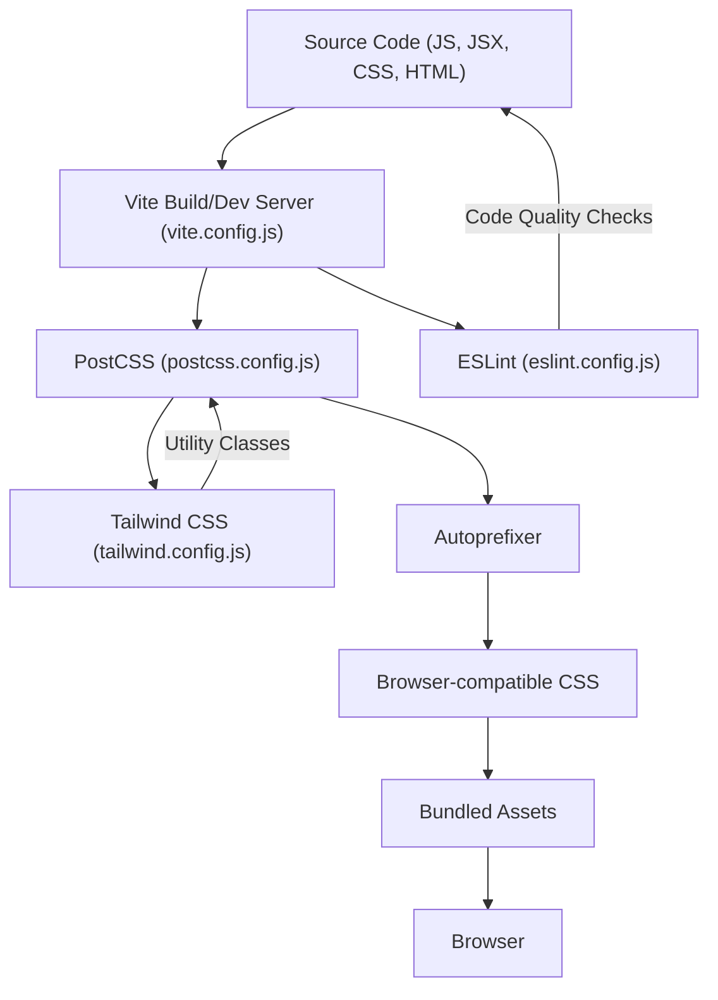
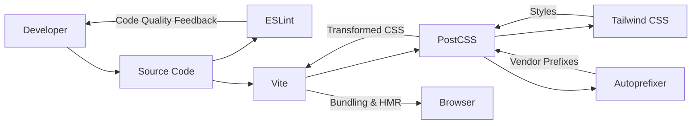

 # Configuration and Tooling

This section provides an overview of the development environment setup and core configurations for the frontend application. It covers essential tools like Vite for bundling, ESLint for code quality, Tailwind CSS for styling, PostCSS for CSS transformations, and their respective configurations. Understanding these files is crucial for maintaining, extending, and troubleshooting the frontend build and development process.

## Frontend Build and Development Environment

The frontend application leverages a modern tooling ecosystem designed for speed, efficiency, and developer experience.

### Vite Configuration (`frontend/vite.config.js`)

Vite serves as the build tool and development server for the frontend. Its configuration is minimal thanks to its convention-over-configuration approach and powerful plugin system.

The primary plugin used is `@vitejs/plugin-react`, which provides fast refresh and optimized JSX transformations for React components.

```javascript
// frontend/vite.config.js
import { defineConfig } from 'vite'
import react from '@vitejs/plugin-react'

// https://vitejs.dev/config/
export default defineConfig({
  plugins: [react()],
})
```
This simple configuration enables React support out-of-the-box, including Hot Module Replacement (HMR) for a seamless development experience.
[View on GitHub](https://github.com/shinymack/Chat-App-MERN/blob/main/frontend/vite.config.js)

### Tailwind CSS Configuration (`frontend/tailwind.config.js`)

Tailwind CSS is a utility-first CSS framework that enables rapid UI development by composing classes directly in markup. Its configuration allows for customization of the design system and integration with other plugins.

The `tailwind.config.js` file defines content paths, custom theme extensions, and additional Tailwind plugins.

```javascript
// frontend/tailwind.config.js
import daisyui from "daisyui"

/** @type {import('tailwindcss').Config} */
export default {
  content: [
    // Specifies files where Tailwind should scan for utility classes
    "./index.html",
    "./src/**/*.{js,ts,jsx,tsx}",
  ],
  theme: {
    extend: {
      // Extends Tailwind's default theme with custom font families
      fontFamily : {
        chivo : ['Chivo', 'sans-serif'],
      }
    },
  },
  plugins: [daisyui], // Integrates the daisyUI component library
  daisyui : {
    // Configures daisyUI themes
    themes: [
      "light", "dark", "cupcake", "bumblebee", "emerald", "corporate", "synthwave",
      "retro", "cyberpunk", "valentine", "halloween", "garden", "forest", "aqua",
      "lofi", "pastel", "fantasy", "wireframe", "black", "luxury", "dracula",
      "cmyk", "autumn", "business", "acid", "lemonade", "night", "coffee",
      "winter", "dim", "nord", "sunset",
    ],
  }
}
```
The `content` array is crucial as it tells Tailwind CSS which files to scan for utility classes. Any changes to this array are vital for ensuring that all used classes are included in the final CSS bundle.

The `theme.extend` section demonstrates how to add custom fonts, in this case, `Chivo`, to the project's design system. This allows for consistent application of specific typography.

The inclusion of `daisyui` as a plugin significantly enhances development speed by providing a collection of pre-designed, customizable UI components built on Tailwind CSS. The `daisyui.themes` array lists all available themes, allowing for easy theme switching and customization.
[View on GitHub](https://github.com/shinymack/Chat-App-MERN/blob/main/frontend/tailwind.config.js)

### PostCSS Configuration (`frontend/postcss.config.js`)

PostCSS is a tool for transforming CSS with JavaScript plugins. In this project, it's used to integrate Tailwind CSS and Autoprefixer into the CSS processing pipeline.

```javascript
// frontend/postcss.config.js
export default {
  plugins: {
    // Initializes Tailwind CSS
    tailwindcss: {},
    // Adds vendor prefixes to CSS rules
    autoprefixer: {},
  },
}
```
This configuration ensures that Tailwind CSS classes are correctly processed and converted into standard CSS. `autoprefixer` automatically adds vendor prefixes (e.g., `-webkit-`, `-moz-`) to CSS rules, ensuring broad browser compatibility without manual effort.
[View on GitHub](https://github.com/shinymack/Chat-App-MERN/blob/main/frontend/postcss.config.js)

### ESLint Configuration (`frontend/eslint.config.js`)

ESLint is a static code analysis tool that helps enforce coding standards and identify problematic patterns in JavaScript and JSX code. The configuration defines rules, plugins, and environments for linting.

```javascript
// frontend/eslint.config.js
import js from '@eslint/js'
import globals from 'globals'
import react from 'eslint-plugin-react'
import reactHooks from 'eslint-plugin-react-hooks'
import reactRefresh from 'eslint-plugin-react-refresh'

export default [
  // Ignores the 'dist' directory from linting
  { ignores: ['dist'] },
  {
    files: ['**/*.{js,jsx}'], // Applies rules to JavaScript and JSX files
    languageOptions: {
      ecmaVersion: 2020,
      globals: globals.browser, // Defines browser global variables
      parserOptions: {
        ecmaVersion: 'latest', // Supports the latest ECMAScript features
        ecmaFeatures: { jsx: true }, // Enables JSX parsing
        sourceType: 'module', // Enables ES modules
      },
    },
    settings: { react: { version: '18.3' } }, // Specifies the React version for the plugin
    plugins: {
      react, // Integrates React-specific linting rules
      'react-hooks': reactHooks, // Integrates React Hooks-specific rules
      'react-refresh': reactRefresh, // Integrates React Refresh-specific rules
    },
    rules: {
      ...js.configs.recommended.rules, // Applies recommended JavaScript rules
      ...react.configs.recommended.rules, // Applies recommended React rules
      ...react.configs['jsx-runtime'].rules, // Applies React JSX runtime rules
      ...reactHooks.configs.recommended.rules, // Applies recommended React Hooks rules
      'react/jsx-no-target-blank': 'off', // Disables rule for target="_blank" without rel="noreferrer"
      'react-refresh/only-export-components': [ // Warns about non-exported components for HMR
        'warn',
        { allowConstantExport: true },
      ],
      "react/prop-types" : "off", // Disables prop-types validation (often replaced by TypeScript)
    },
  },
]
```
This comprehensive ESLint configuration ensures high code quality for the React frontend. It leverages several plugins:
*   `@eslint/js`: Provides base JavaScript rules.
*   `eslint-plugin-react`: Adds React-specific linting rules.
*   `eslint-plugin-react-hooks`: Enforces rules of hooks.
*   `eslint-plugin-react-refresh`: Works with Vite's React Fast Refresh plugin to ensure components are correctly exported.

Specific rules like `"react/jsx-no-target-blank": "off"` and `"react/prop-types": "off"` are adjusted to fit the project's preferences, potentially favoring alternative approaches like TypeScript for type checking or accepting specific JSX patterns.
[View on GitHub](https://github.com/shinymack/Chat-App-MERN/blob/main/frontend/eslint.config.js)

### Frontend Asset Processing Flow

The following diagram illustrates how various configuration files and tools interact during the frontend build process.





## Key Integration Points

### Unified Styling with Tailwind CSS and daisyUI

The combination of Tailwind CSS and daisyUI is a powerful integration point. `tailwind.config.js` is the central place to customize the design system, extending Tailwind's defaults and configuring daisyUI. This allows for rapid prototyping with pre-built components while maintaining full control over the styling with utility classes. The `postcss.config.js` then ensures that these styles are correctly processed and optimized for all browsers.

### Efficient Development with Vite and ESLint

Vite provides an extremely fast development server with Hot Module Replacement (HMR). ESLint, configured via `eslint.config.js`, integrates directly into the development workflow, providing immediate feedback on code quality and potential issues. This tight integration ensures that developers write clean, consistent, and error-free code from the start, improving overall project maintainability and reducing debugging time. The `react-refresh/only-export-components` rule in ESLint is particularly important as it helps ensure that React Fast Refresh works correctly, providing a smooth development experience.

### Build Tooling Overview

The frontend development environment is structured around a robust set of tools, each playing a critical role in the development and build lifecycle. This setup provides a performant and maintainable foundation for the application.





This flow demonstrates how developer changes are processed: first by ESLint for immediate feedback, then by Vite which orchestrates PostCSS (with Tailwind and Autoprefixer) for styling, finally bundling everything for the browser with HMR for a dynamic development experience.