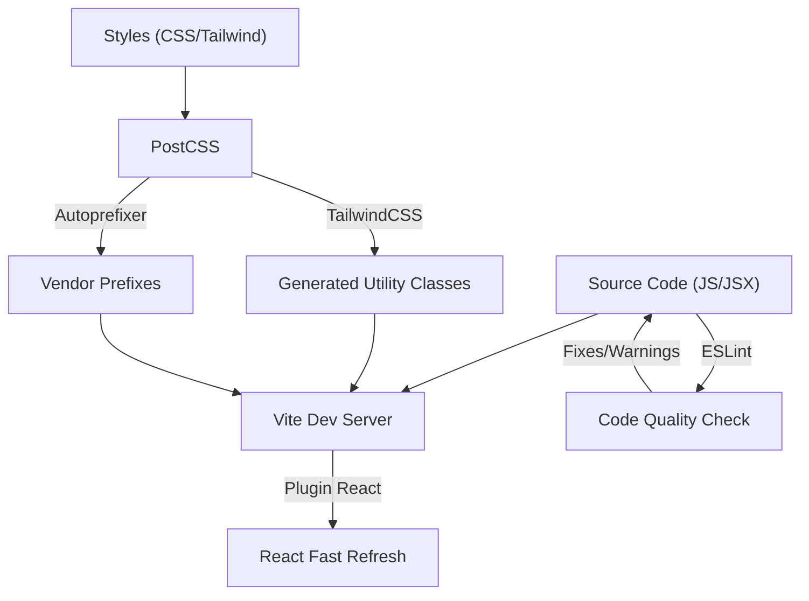

 # Configuration and Development

This section outlines the essential configurations for the frontend development environment, covering build processes, code quality, and styling. Understanding these files is crucial for maintaining and extending the application's client-side features, ensuring consistency, performance, and a streamlined development workflow.

We delve into the core configuration files that govern how the React application is built, styled, and validated, providing insights into their purpose and impact on the development process.

## Frontend Build and Development Environment

The frontend of this application leverages Vite for its build tool, ensuring a fast and efficient development experience. This section details the core configuration for Vite and other essential development tools.

### Vite Configuration (`frontend/vite.config.js`)

Vite is a next-generation frontend tooling that provides an extremely fast development server with Hot Module Replacement (HMR) and an optimized build process. The configuration for Vite is straightforward, primarily enabling React support.

```javascript
import { defineConfig } from 'vite'
import react from '@vitejs/plugin-react'

// https://vitejs.dev/config/
export default defineConfig({
  plugins: [react()],
})
```

This minimal configuration sets up Vite to correctly handle React components, enabling JSX transformation and other React-specific optimizations during both development and production builds.

-   **`defineConfig`**: A helper function from Vite that provides type intelisense for configuration options.
-   **`@vitejs/plugin-react`**: The official plugin for Vite that provides React Fast Refresh support and Babel transforms for JSX.

This setup ensures that when you run the development server (`npm run dev`), Vite quickly compiles and serves your React application, and when you build for production (`npm run build`), it generates optimized static assets.

For more details, refer to the [Vite Configuration documentation](https://vitejs.dev/config/) and [View `vite.config.js` on GitHub](https://github.com/shinymack/Chat-App-MERN/blob/main/frontend/vite.config.js).

### Code Quality and Linting (`frontend/eslint.config.js`)

Maintaining consistent code quality and catching potential errors early is paramount for collaborative development. ESLint is configured to enforce coding standards, detect anti-patterns, and ensure best practices for React applications.

```javascript
import js from '@eslint/js'
import globals from 'globals'
import react from 'eslint-plugin-react'
import reactHooks from 'eslint-plugin-react-hooks'
import reactRefresh from 'eslint-plugin-react-refresh'

export default [
  { ignores: ['dist'] },
  {
    files: ['**/*.{js,jsx}'],
    languageOptions: {
      ecmaVersion: 2020,
      globals: globals.browser,
      parserOptions: {
        ecmaVersion: 'latest',
        ecmaFeatures: { jsx: true },
        sourceType: 'module',
      },
    },
    settings: { react: { version: '18.3' } },
    plugins: {
      react,
      'react-hooks': reactHooks,
      'react-refresh': reactRefresh,
    },
    rules: {
      ...js.configs.recommended.rules,
      ...react.configs.recommended.rules,
      ...react.configs['jsx-runtime'].rules,
      ...reactHooks.configs.recommended.rules,
      'react/jsx-no-target-blank': 'off',
      'react-refresh/only-export-components': [
        'warn',
        { allowConstantExport: true },
      ],
      "react/prop-types" : "off",
    },
  },
]
```

This ESLint configuration is designed for modern React development, incorporating several key plugins:

-   **`@eslint/js`**: Provides the recommended baseline ESLint rules for JavaScript.
-   **`globals`**: Defines global variables for various environments; here, `globals.browser` is used to recognize browser-specific globals.
-   **`eslint-plugin-react`**: Enforces React-specific best practices and conventions.
-   **`eslint-plugin-react-hooks`**: Ensures correct usage of React Hooks.
-   **`eslint-plugin-react-refresh`**: Integrates with Vite's React Fast Refresh, specifically `only-export-components` to warn against non-exported components in modules that might break Fast Refresh.
-   **`react/prop-types: "off"`**: Disables prop-types validation, common in projects using TypeScript or relying on other forms of prop validation.
-   **`react/jsx-no-target-blank: "off"`**: Allows `target="_blank"` without requiring `rel="noreferrer noopener"`, though it's generally recommended for security.

This robust setup helps maintain high code quality, consistency, and prevents common pitfalls in React applications.

For further exploration of ESLint configurations, consult the [ESLint documentation](https://eslint.org/docs/latest/use/configure/) and [View `eslint.config.js` on GitHub](https://github.com/shinymack/Chat-App-MERN/blob/main/frontend/eslint.config.js).

### Frontend Development Tooling Diagram

The following diagram illustrates the relationship between the primary frontend development tools used in this project.





## Styling Configuration

The application's styling is managed through a combination of PostCSS, Tailwind CSS, and DaisyUI, providing a utility-first CSS framework with pre-built components.

### PostCSS Configuration (`frontend/postcss.config.js`)

PostCSS acts as a tool for transforming CSS with JavaScript plugins. It's an essential part of the styling pipeline, enabling the use of modern CSS features and optimizations.

```javascript
export default {
  plugins: {
    tailwindcss: {},
    autoprefixer: {},
  },
}
```

This configuration integrates two critical PostCSS plugins:

-   **`tailwindcss`**: This plugin processes your CSS to include Tailwind's utility classes based on your usage in the project.
-   **`autoprefixer`**: Automatically adds vendor prefixes to CSS rules, ensuring cross-browser compatibility without manual effort.

These plugins work in tandem to prepare your CSS for consistent rendering across different browsers and to leverage Tailwind CSS effectively.

For more information, see the [PostCSS documentation](https://postcss.org/) and [View `postcss.config.js` on GitHub](https://github.com/shinymack/Chat-App-MERN/blob/main/frontend/postcss.config.js).

### Tailwind CSS Configuration (`frontend/tailwind.config.js`)

Tailwind CSS is a utility-first CSS framework that allows for rapid UI development by composing classes directly in your markup. This configuration defines how Tailwind scans your files, customizes the default theme, and integrates with DaisyUI.

```javascript
import daisyui from "daisyui"

/** @type {import('tailwindcss').Config} */
export default {
  content: [
    "./index.html",
    "./src/**/*.{js,ts,jsx,tsx}",
  ],
  theme: {
    extend: {
      fontFamily : {
        chivo : ['Chivo', 'sans-serif'],
      }
    },
  },
  plugins: [daisyui],
  daisyui : {
    themes: [
      "light", "dark", "cupcake", "bumblebee", "emerald", "corporate",
      "synthwave", "retro", "cyberpunk", "valentine", "halloween", "garden",
      "forest", "aqua", "lofi", "pastel", "fantasy", "wireframe", "black",
      "luxury", "dracula", "cmyk", "autumn", "business", "acid", "lemonade",
      "night", "coffee", "winter", "dim", "nord", "sunset",
    ],
  }
}
```

Key aspects of this Tailwind configuration include:

-   **`content`**: Specifies the files Tailwind should scan to determine which utility classes are being used. This ensures only necessary CSS is generated, keeping the bundle size small.
-   **`theme.extend`**: Allows extending Tailwind's default theme. Here, a custom font family `'chivo'` is added, enabling its use via `font-chivo` class.
-   **`plugins: [daisyui]`**: Integrates DaisyUI, a Tailwind CSS component library that provides pre-built, semantic UI components like buttons, modals, and navbars.
-   **`daisyui.themes`**: An extensive list of themes available from DaisyUI, allowing for easy switching between different visual styles for the application. This provides great flexibility for branding or user preferences.

This comprehensive styling setup empowers developers to build beautiful and responsive UIs efficiently while offering a wide range of theming options.

For more details on customizing Tailwind, refer to the [Tailwind CSS documentation](https://tailwindcss.com/docs/configuration/) and [View `tailwind.config.js` on GitHub](https://github.com/shinymack/Chat-App-MERN/blob/main/frontend/tailwind.config.js).

## Key Integration Points

The configuration files detailed above are not isolated; they form an integrated system that orchestrates the frontend development and build process.

-   **Vite and React**: `vite.config.js` directly enables `eslint.config.js` with its React plugins, ensuring that the code Vite processes is also linted according to React best practices.
-   **Styling Pipeline**: `tailwind.config.js` defines the core styling framework, which is then processed by `postcss.config.js`. This allows for utility-first styling with component-like abstractions through DaisyUI, all while ensuring cross-browser compatibility via Autoprefixer.
-   **Development Workflow**: When you run the development server, Vite (configured in `vite.config.js`) watches for changes. Any `.js` or `.jsx` files are simultaneously linted by ESLint (`eslint.config.js`), and styling changes trigger PostCSS and Tailwind (`postcss.config.js`, `tailwind.config.js`) to recompile CSS, all feeding into Vite's HMR for instant updates.

This integrated approach ensures a smooth developer experience, high code quality, and a robust styling system for the application. Adhering to these configurations and understanding their interplay is vital for efficient feature development and maintenance.