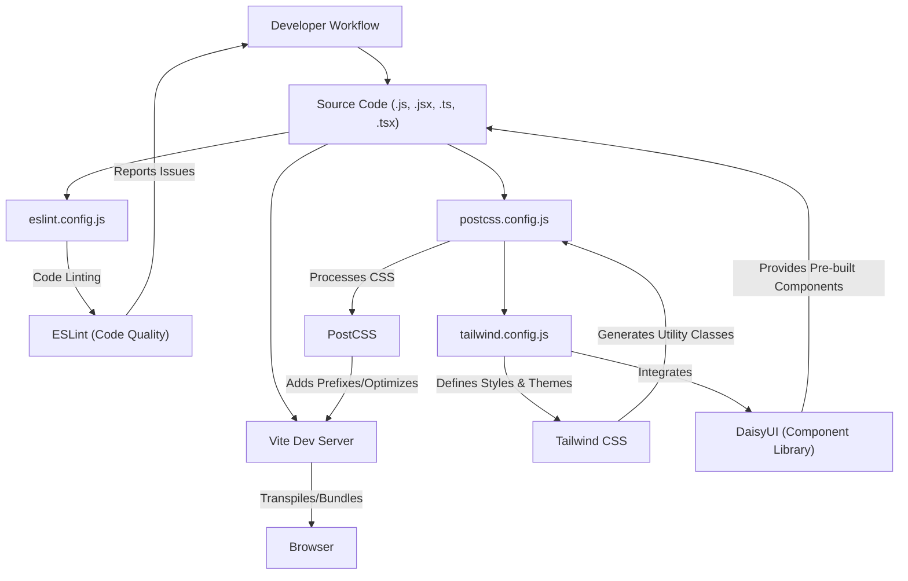

 # Development and Configuration

This section provides a comprehensive guide to understanding the development environment setup, build processes, and crucial configuration files for the frontend application. It details how tools like Vite, ESLint, PostCSS, and Tailwind CSS are integrated to ensure a smooth development workflow and consistent code quality.

## Frontend Development Environment

The frontend application leverages a modern toolchain to provide a fast and efficient development experience. Key tools include:

*   **Vite:** A next-generation frontend tooling that provides an extremely fast development server and optimized build process.
*   **React:** The core JavaScript library for building user interfaces.
*   **ESLint:** For maintaining code quality and consistency.
*   **PostCSS & Tailwind CSS:** For highly customizable and utility-first styling.
*   **DaisyUI:** A Tailwind CSS component library for rapid UI development.

### Frontend Toolchain Overview

The following diagram illustrates the interaction between the primary frontend development tools and configuration files:





### Vite Configuration

Vite is the build tool that powers the frontend development server and production build. It offers fast hot module replacement (HMR) and an optimized build process.

The main configuration file is `frontend/vite.config.js`.

```javascript
import { defineConfig } from 'vite'
import react from '@vitejs/plugin-react'

// https://vitejs.dev/config/
export default defineConfig({
  plugins: [react()],
})
```

**Explanation:**

*   **`defineConfig`**: A helper from Vite that provides autocompletion for configuration options.
*   **`plugins: [react()]`**: This line integrates the official `@vitejs/plugin-react` plugin, which enables React Fast Refresh (a form of Hot Module Replacement tailored for React) and handles JSX transformations.

[View `vite.config.js` on GitHub](https://github.com/shinymack/Chat-App-MERN/blob/main/frontend/vite.config.js)

### ESLint Configuration

ESLint is used to statically analyze the code to find problematic patterns and enforce code style. This helps in maintaining code quality and consistency across the project. The configuration is defined in `frontend/eslint.config.js`.

```javascript
import js from '@eslint/js'
import globals from 'globals'
import react from 'eslint-plugin-react'
import reactHooks from 'eslint-plugin-react-hooks'
import reactRefresh from 'eslint-plugin-react-refresh'

export default [
  { ignores: ['dist'] },
  {
    files: ['**/*.{js,jsx}'],
    languageOptions: {
      ecmaVersion: 2020,
      globals: globals.browser,
      parserOptions: {
        ecmaVersion: 'latest',
        ecmaFeatures: { jsx: true },
        sourceType: 'module',
      },
    },
    settings: { react: { version: '18.3' } },
    plugins: {
      react,
      'react-hooks': reactHooks,
      'react-refresh': reactRefresh,
    },
    rules: {
      ...js.configs.recommended.rules,
      ...react.configs.recommended.rules,
      ...react.configs['jsx-runtime'].rules,
      ...reactHooks.configs.recommended.rules,
      'react/jsx-no-target-blank': 'off',
      'react-refresh/only-export-components': [
        'warn',
        { allowConstantExport: true },
      ],
      "react/prop-types" : "off",

    },
  },
]
```

**Key Configuration Details:**

*   **`ignores: ['dist']`**: Prevents ESLint from linting files within the `dist` directory, which contains compiled output.
*   **`files: ['**/*.{js,jsx}']`**: Specifies that these rules apply to JavaScript and JSX files.
*   **`languageOptions`**: Configures JavaScript language features, enabling modern ECMAScript versions, browser globals, and JSX support.
*   **`plugins`**: Integrates several essential ESLint plugins for React development:
    *   `eslint-plugin-react`: General React-specific linting rules.
    *   `eslint-plugin-react-hooks`: Rules specific to React Hooks.
    *   `eslint-plugin-react-refresh`: Rules for integration with React Fast Refresh.
*   **`rules`**: Extends recommended rule sets from the included plugins and customizes specific rules:
    *   `'react/jsx-no-target-blank': 'off'`: Disables a rule that requires `rel="noreferrer"` on `target="_blank"` links, often unnecessary for internal links or specific use cases.
    *   `'react-refresh/only-export-components'`: Configures a warning for components that are not exported as the default, but allows constant exports. This rule is crucial for ensuring React Fast Refresh works correctly.
    *   `"react/prop-types" : "off"`: Disables prop-types validation, common in projects using TypeScript or alternative validation methods.

[View `eslint.config.js` on GitHub](https://github.com/shinymack/Chat-App-MERN/blob/main/frontend/eslint.config.js)

### PostCSS Configuration

PostCSS is a tool for transforming CSS with JavaScript plugins. In this project, it's used to integrate Tailwind CSS and Autoprefixer. The configuration is found in `frontend/postcss.config.js`.

```javascript
export default {
  plugins: {
    tailwindcss: {},
    autoprefixer: {},
  },
}
```

**Explanation:**

*   **`tailwindcss`**: This plugin processes your CSS to convert Tailwind's utility classes into actual CSS rules based on your `tailwind.config.js`.
*   **`autoprefixer`**: Automatically adds vendor prefixes to CSS rules, ensuring compatibility across different browsers.

[View `postcss.config.js` on GitHub](https://github.com/shinymack/Chat-App-MERN/blob/main/frontend/postcss.config.js)

### Tailwind CSS Configuration

Tailwind CSS is a utility-first CSS framework that enables rapid UI development by providing low-level utility classes. `frontend/tailwind.config.js` is its primary configuration file.

```javascript
import daisyui from "daisyui"


/** @type {import('tailwindcss').Config} */
export default {
  content: [
    "./index.html",
    "./src/**/*.{js,ts,jsx,tsx}",
  ],
  theme: {
    extend: {
      fontFamily : {
        chivo : ['Chivo', 'sans-serif'],
      }
    },
  },
  plugins: [daisyui],
  daisyui : {
 themes: [
      "light",
      "dark",
      "cupcake",
      "bumblebee",
      "emerald",
      "corporate",
      "synthwave",
      "retro",
      "cyberpunk",
      "valentine",
      "halloween",
      "garden",
      "forest",
      "aqua",
      "lofi",
      "pastel",
      "fantasy",
      "wireframe",
      "black",
      "luxury",
      "dracula",
      "cmyk",
      "autumn",
      "business",
      "acid",
      "lemonade",
      "night",
      "coffee",
      "winter",
      "dim",
      "nord",
      "sunset",
    ],
  }
}
```

**Key Configuration Details:**

*   **`content`**: This array specifies the files that Tailwind CSS should scan for class names. This is crucial for Tailwind's tree-shaking process, ensuring only used CSS is included in the final build.
*   **`theme.extend`**: Allows extending Tailwind's default theme. Here, a custom font family named `chivo` is added.
*   **`plugins: [daisyui]`**: Integrates DaisyUI, a component library that provides styled components on top of Tailwind CSS.
*   **`daisyui.themes`**: Configures the available themes for DaisyUI, offering a wide range of aesthetic options for the application, from "light" and "dark" to various creative themes like "synthwave" and "dracula."

[View `tailwind.config.js` on GitHub](https://github.com/shinymack/Chat-App-MERN/blob/main/frontend/tailwind.config.js)

## Key Integration Points

Understanding how these configurations work together is vital for effective development:

*   **Vite's Role:** Vite acts as the orchestrator. When you run `vite`, it uses its plugin system to integrate React support. It then passes the CSS files through PostCSS, which in turn leverages Tailwind CSS to generate the necessary styles.
*   **CSS Processing Flow:** Your application's CSS (e.g., `index.css`) includes Tailwind's directives. Vite's build process detects this, routes the CSS through PostCSS (as configured in `postcss.config.js`), where Tailwind CSS generates the utilities (based on `tailwind.config.js`) and Autoprefixer adds prefixes.
*   **Linting during Development:** ESLint, configured via `eslint.config.js`, runs alongside your development environment, typically integrated into your IDE or as a pre-commit hook. It provides real-time feedback on code quality and style, ensuring consistent and bug-free code. The `react-refresh` plugin ensures compatibility with Vite's Fast Refresh.
*   **Theming with DaisyUI:** DaisyUI, integrated as a Tailwind plugin, provides a powerful way to manage UI components and themes. By defining a rich set of themes in `tailwind.config.js`, developers can easily switch the application's entire look and feel, greatly enhancing design flexibility and consistency.

By understanding these files and their interdependencies, developers can efficiently manage the frontend's build process, styling, and code quality.