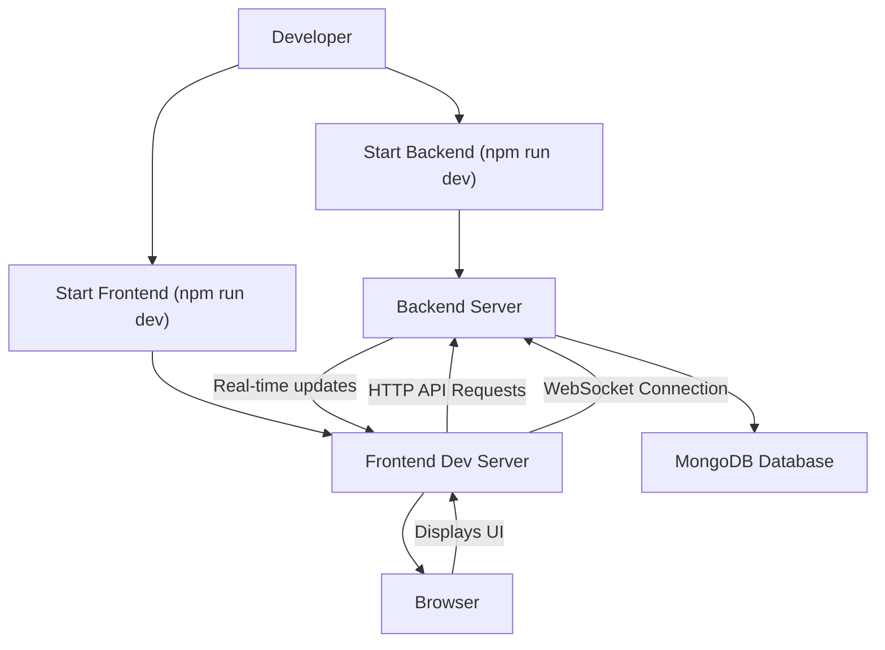
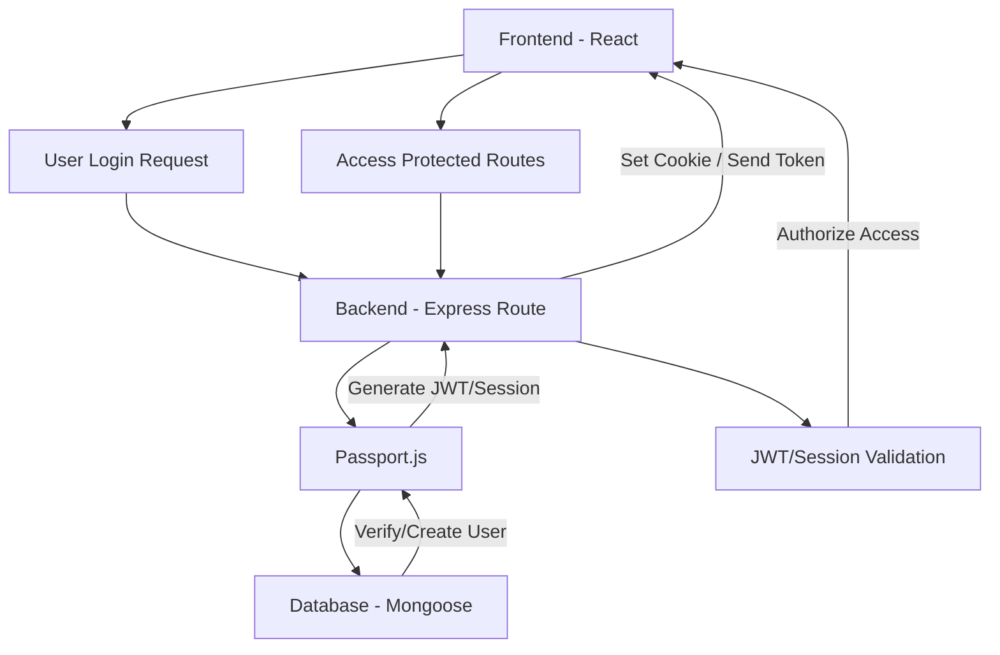

 # Development and Configuration

This section details the essential setup for developing and configuring both the frontend and backend components of the application. It covers environment setup, build tools, and key configuration files that dictate how the application runs, builds, and interacts with its dependencies. Understanding these configurations is crucial for local development, deployment, and troubleshooting.

## Backend Environment and Dependencies

The backend application is built using Node.js and Express.js, leveraging a robust set of libraries for various functionalities. The `backend/package.json` file serves as the central manifest for project metadata, scripts, and dependencies.

### Project Scripts

The `scripts` section in `package.json` defines commands to automate common tasks, making development and deployment workflows more efficient.

```json
// backend/package.json
{
  "name": "backend",
  "version": "1.0.0",
  "main": "src/index.js",
  "scripts": {
    "dev": "nodemon src/index.js",
    "start": "node src/index.js"
  },
  "author": "",
  "type": "module",
  "license": "ISC",
  "description": "",
  // ... other fields
}
```
**Explanation:**
- `dev`: This script uses `nodemon` to run the `src/index.js` file. `nodemon` automatically restarts the server when file changes are detected, which is ideal for development.
- `start`: This script uses `node` to run `src/index.js`. This is typically used for production environments where automatic restarts are not desired and the application should run continuously.

[View on GitHub](https://github.com/shinymack/Chat-App-MERN/blob/main/backend/package.json)

### Core Backend Dependencies

The `dependencies` section lists all external packages required for the backend to function correctly. These packages provide features like database interaction, authentication, real-time communication, and environment variable management.

```json
// backend/package.json
{
  // ... other fields
  "dependencies": {
    "bcryptjs": "^2.4.3",
    "cloudinary": "^2.5.1",
    "cookie-parser": "^1.4.7",
    "dotenv": "^16.4.7",
    "express": "^4.21.2",
    "express-session": "^1.18.1",
    "jsonwebtoken": "^9.0.2",
    "mongoose": "^8.9.5",
    "passport": "^0.7.0",
    "passport-google-oauth20": "^2.0.0",
    "socket.io": "^4.8.1"
  },
  "devDependencies": {
    "nodemon": "^3.1.9"
  }
}
```
**Explanation of Key Dependencies:**
-   **`express`**: The core web framework for building RESTful APIs.
-   **`mongoose`**: An ODM (Object Data Modeling) library for MongoDB, simplifying database interactions.
-   **`socket.io`**: Enables real-time, bidirectional, event-based communication between the server and clients, crucial for chat functionality.
-   **`bcryptjs`**: Used for hashing passwords, ensuring secure storage of user credentials.
-   **`jsonwebtoken`**: Provides capabilities for generating and verifying JSON Web Tokens (JWTs) for stateless authentication.
-   **`dotenv`**: Loads environment variables from a `.env` file into `process.env`, keeping sensitive configuration out of the codebase.
-   **`cookie-parser`**: Parses Cookie header and populates `req.cookies` with an object keyed by cookie names.
-   **`express-session`**: Simple session middleware for Express, often used with authentication strategies.
-   **`passport`**, **`passport-google-oauth20`**: Authentication middleware and a strategy for Google OAuth 2.0, allowing users to log in with their Google accounts.
-   **`cloudinary`**: Integration for cloud-based image and video management, likely used for user avatars or media sharing in chat.

[View on GitHub](https://github.com/shinymack/Chat-App-MERN/blob/main/backend/package.json)

## Frontend Environment and Build Process

The frontend is a React application powered by Vite, offering a fast development experience. The `frontend/package.json` file outlines the scripts for development, building, and dependency management.

### Project Scripts

The frontend scripts facilitate various development and build tasks, from starting the development server to creating production-ready builds.

```json
// frontend/package.json
{
  "name": "frontend",
  "private": true,
  "version": "0.0.0",
  "type": "module",
  "scripts": {
    "dev": "vite",
    "build": "vite build",
    "lint": "eslint .",
    "preview": "vite preview",
    "mobile": "vite --host"
  },
  // ... other fields
}
```
**Explanation:**
-   `dev`: Starts the Vite development server. This provides hot module replacement (HMR) for a smooth development workflow.
-   `build`: Compiles the React application into static assets for production deployment using Vite's build command.
-   `lint`: Runs ESLint to identify and report on patterns found in JavaScript/TypeScript code, ensuring code quality.
-   `preview`: Serves the static build artifacts locally, allowing a preview of the production build before deployment.
-   `mobile`: Starts the Vite development server with `--host`, making it accessible over the network, useful for testing on mobile devices or other machines.

[View on GitHub](https://github.com/shinymack/Chat-App-MERN/blob/main/frontend/package.json)

### Core Frontend Dependencies

The `dependencies` section lists the libraries vital for the React application's functionality, including UI components, state management, and API communication.

```json
// frontend/package.json
{
  // ... other fields
  "dependencies": {
    "axios": "^1.7.9",
    "cors": "^2.8.5",
    "lucide-react": "^0.471.1",
    "react": "^18.3.1",
    "react-dom": "^18.3.1",
    "react-hot-toast": "^2.5.1",
    "react-icons": "^5.5.0",
    "react-router-dom": "^7.1.1",
    "socket.io-client": "^4.8.1",
    "zustand": "^5.0.3"
  },
  "devDependencies": {
    "@eslint/js": "^9.17.0",
    "@types/react": "^18.3.18",
    "@types/react-dom": "^18.3.5",
    "@vitejs/plugin-react": "^4.3.4",
    "autoprefixer": "^10.4.20",
    "daisyui": "^4.12.23",
    "eslint": "^9.17.0",
    "eslint-plugin-react": "^7.37.2",
    "eslint-plugin-react-hooks": "^5.0.0",
    "eslint-plugin-react-refresh": "^0.4.16",
    "globals": "^15.14.0",
    "postcss": "^8.5.0",
    "tailwindcss": "^3.4.17",
    "vite": "^6.3.5"
  }
}
```
**Explanation of Key Dependencies:**
-   **`react`**, **`react-dom`**: The fundamental libraries for building user interfaces with React.
-   **`axios`**: A popular promise-based HTTP client for making API requests to the backend.
-   **`react-router-dom`**: Provides declarative routing for React applications, enabling navigation between different views.
-   **`socket.io-client`**: The client-side library for `socket.io`, facilitating real-time communication with the backend.
-   **`zustand`**: A small, fast, and scalable state-management solution for React.
-   **`react-hot-toast`**: A lightweight and customizable notification system for displaying toasts/alerts.
-   **`lucide-react`**, **`react-icons`**: Collections of popular SVG icons for use in React applications, enhancing the UI.
-   **`cors`**: Middleware to enable Cross-Origin Resource Sharing (CORS), which is often used in development or when frontend and backend are on different domains.

[View on GitHub](https://github.com/shinymack/Chat-App-MERN/blob/main/frontend/package.json)

### Vite Configuration

The `frontend/vite.config.js` file is where Vite-specific configurations are defined. For a React project, this typically involves specifying the React plugin.

```javascript
// frontend/vite.config.js
import { defineConfig } from 'vite'
import react from '@vitejs/plugin-react'

// https://vitejs.dev/config/
export default defineConfig({
  plugins: [react()],
})
```
**Explanation:**
-   `defineConfig`: A helper from Vite that provides type intelisense.
-   `plugins: [react()]`: This array includes the `@vitejs/plugin-react`, which is essential for Vite to understand and compile React components (JSX/TSX). It enables fast refresh, HMR, and other React-specific optimizations during development.

[View on GitHub](https://github.com/shinymack/Chat-App-MERN/blob/main/frontend/vite.config.js)

### Tailwind CSS and DaisyUI Setup

The `frontend/tailwind.config.js` file is crucial for configuring Tailwind CSS, a utility-first CSS framework, and its component library plugin, DaisyUI.

```javascript
// frontend/tailwind.config.js
import daisyui from "daisyui"

/** @type {import('tailwindcss').Config} */
export default {
  content: [
    "./index.html",
    "./src/**/*.{js,ts,jsx,tsx}",
  ],
  theme: {
    extend: {
      fontFamily : {
        chivo : ['Chivo', 'sans-serif'],
      }
    },
  },
  plugins: [daisyui],
  daisyui : {
    themes: [
      "light", "dark", "cupcake", "bumblebee", "emerald", "corporate", "synthwave",
      "retro", "cyberpunk", "valentine", "halloween", "garden", "forest", "aqua",
      "lofi", "pastel", "fantasy", "wireframe", "black", "luxury", "dracula",
      "cmyk", "autumn", "business", "acid", "lemonade", "night", "coffee",
      "winter", "dim", "nord", "sunset",
    ],
  }
}
```
**Explanation:**
-   `content`: This array specifies the files that Tailwind CSS should scan for class names. This is vital for Tailwind's tree-shaking process, ensuring only used CSS is included in the final build.
-   `theme.extend`: Allows extending Tailwind's default theme. Here, a custom font family "chivo" is added.
-   `plugins: [daisyui]`: Integrates DaisyUI, a Tailwind CSS component library, providing pre-built components like buttons, modals, and navbars with Tailwind classes.
-   `daisyui.themes`: This configuration lists all the available themes that DaisyUI provides. This allows for easy theme switching across the application.

[View on GitHub](https://github.com/shinymack/Chat-App-MERN/blob/main/frontend/tailwind.config.js)

## Application Development Flow

The development process involves separate but interconnected frontend and backend servers. Understanding how they interact is key to effective development.





**Explanation of Flow:**
1.  A "Developer" initiates both the "Backend Server" and "Frontend Dev Server" using their respective `npm run dev` scripts.
2.  The "Frontend Dev Server" serves the React application to the "Browser".
3.  The "Frontend Dev Server" communicates with the "Backend Server" for:
    *   "HTTP API Requests" (e.g., authentication, fetching user data, sending messages via REST endpoints).
    *   "WebSocket Connection" (established via `socket.io-client` on the frontend and `socket.io` on the backend) for real-time features like live chat updates.
4.  The "Backend Server" interacts with the "MongoDB Database" (via Mongoose) to persist and retrieve application data.
5.  Real-time updates from the "Backend Server" are pushed to the "Frontend Dev Server" via WebSockets, keeping the UI synchronized.

## Key Integration Points

This section highlights crucial points where different parts of the application or development workflow integrate.

### Authentication and Session Management

Authentication is a critical integration point, combining backend security with frontend user experience.





**Explanation of Authentication Flow:**
1.  The "Frontend - React" application initiates a "User Login Request" to the backend.
2.  This request hits a "Backend - Express Route" configured for authentication.
3.  "Passport.js" (possibly with `passport-google-oauth20` or local strategies) handles the authentication logic.
4.  "Passport.js" interacts with the "Database - Mongoose" to "Verify/Create User" records.
5.  Upon successful authentication, the backend will "Generate JWT/Session" tokens.
6.  The backend then sends these credentials back to the frontend, often by setting an HTTP-only cookie or sending the JWT directly to "Frontend - React".
7.  The "Frontend - React" can then "Access Protected Routes" by including the token/cookie in subsequent requests.
8.  The "Backend - Express Route" then uses "JWT/Session Validation" middleware to "Authorize Access" to the requested resources.

## Conclusion

The `package.json` files, along with `vite.config.js` and `tailwind.config.js`, are the backbone of this application's development and configuration. They define the environment, manage dependencies, and streamline the build process for both the backend and frontend. The integration points and development flow diagrams illustrate how these distinct components work in harmony to deliver a full-stack application experience. Understanding these configurations is vital for anyone contributing to the project, ensuring consistency and efficiency across the development lifecycle.