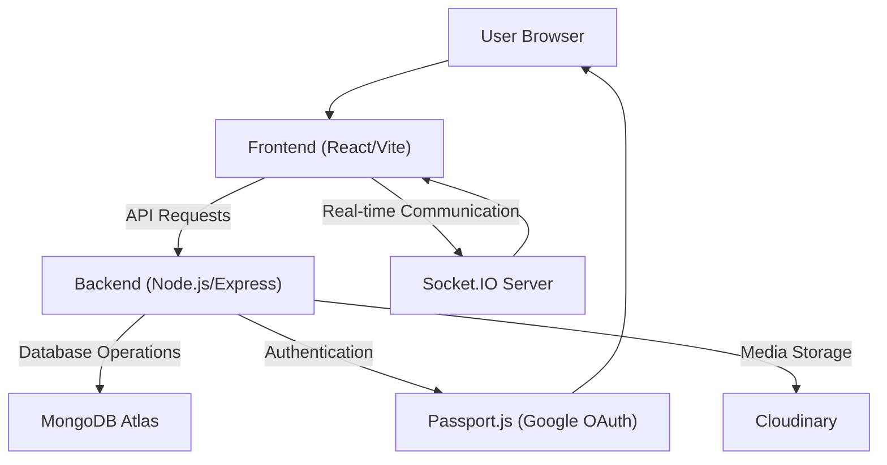

 # Development and Deployment

This document provides a comprehensive guide to setting up your development environment, understanding the project structure, and deploying the MERN Chatapp. It covers essential configurations and scripts to help you get started quickly.

The MERN Chatapp is a real-time chat application built using MongoDB, Express.js, React, and Node.js, leveraging Socket.IO for real-time communication and Cloudinary for media uploads. This project also integrates Google OAuth2.0 for authentication. Credits for the core idea go to the tutorial mentioned in the `README.md`.

## Project Overview

The MERN Chatapp is structured as a monorepo, with separate `backend` and `frontend` directories managed by a root `package.json` for streamlined build and start processes.

The application leverages the following key technologies:

*   **Backend:** Node.js (Express.js), MongoDB (Mongoose), Socket.IO, JWT, Passport.js (Google OAuth2.0), Cloudinary
*   **Frontend:** React (Vite), React Router, Context API (or similar state management), TailwindCSS (implied for modern apps)

<div style={{ maxWidth: '800px', margin: '0 auto' }}>





</div>

This diagram illustrates the primary components and their interactions within the MERN Chatapp, highlighting the flow of data and communication channels.

## Development Environment Setup

To get the application running on your local machine, follow these steps.

### Prerequisites

Ensure you have the following installed:

*   Node.js (LTS version recommended)
*   npm (comes with Node.js)
*   Git

### Cloning the Repository

First, clone the project repository from GitHub:

```bash
git clone https://github.com/shinymack/Chat-App-MERN.git
cd Chat-App-MERN
```

[View on GitHub](https://github.com/shinymack/Chat-App-MERN)

### Installing Dependencies

The root `package.json` includes a `build` script that handles installing dependencies for both the `backend` and `frontend` directories.

```json
// File: package.json
{
  "name": "chatapp",
  "version": "1.0.0",
  "main": "index.js",
  "scripts": {
    "build" : "npm install --prefix backend && npm install --prefix frontend && npm run build --prefix frontend",
    "start" : "npm run start --prefix backend"
  },
  "keywords": [],
  "author": "",
  "license": "ISC",
  "description": ""
}
```

To install all necessary dependencies for both parts of the application:

```bash
npm run build
```

This command will:
1.  Navigate into the `backend` directory and run `npm install`.
2.  Navigate into the `frontend` directory and run `npm install`.
3.  Execute `npm run build` within the `frontend` directory to create a production build of the React application.

### Backend Configuration

The backend relies on environment variables for sensitive information like database connection strings, API keys, and secret keys. Create a `.env` file in the `backend` directory based on your specific setup.

Dependencies for the backend, as defined in `backend/package.json`:

```json
// File: backend/package.json
{
  "name": "backend",
  "version": "1.0.0",
  "main": "src/index.js",
  "scripts": {
    "dev": "nodemon src/index.js",
    "start": "node src/index.js"
  },
  "author": "",
  "type": "module",
  "license": "ISC",
  "description": "",
  "dependencies": {
    "bcryptjs": "^2.4.3",
    "cloudinary": "^2.5.1",
    "cookie-parser": "^1.4.7",
    "dotenv": "^16.4.7",
    "express": "^4.21.2",
    "express-session": "^1.18.1",
    "jsonwebtoken": "^9.0.2",
    "mongoose": "^8.9.5",
    "passport": "^0.7.0",
    "passport-google-oauth20": "^2.0.0",
    "socket.io": "^4.8.1"
  },
  "devDependencies": {
    "nodemon": "^3.1.9"
  }
}
```
[View on GitHub](https://github.com/shinymack/Chat-App-MERN/blob/main/backend/package.json)

**Key Backend Dependencies:**
*   `mongoose`: ODM for MongoDB interaction.
*   `express`: Web framework for API creation.
*   `socket.io`: Enables real-time, bidirectional communication.
*   `jsonwebtoken`: For authentication using JWTs.
*   `passport` & `passport-google-oauth20`: For Google OAuth2.0 integration.
*   `cloudinary`: For cloud-based image and video management.
*   `dotenv`: To load environment variables from a `.env` file.
*   `nodemon` (dev dependency): Automatically restarts the Node.js application when file changes are detected.

### Frontend Configuration

The frontend is a React application built with Vite. The `vite.config.js` file handles the basic configuration:

```javascript
// File: frontend/vite.config.js
import { defineConfig } from 'vite'
import react from '@vitejs/plugin-react'

// https://vitejs.dev/config/
export default defineConfig({
  plugins: [react()],
})
```
[View on GitHub](https://github.com/shinymack/Chat-App-MERN/blob/main/frontend/vite.config.js)

No additional manual configuration is typically needed for the frontend during development, as Vite handles most aspects automatically. Ensure you have the necessary environment variables set up if your frontend consumes any.

### Running the Application

To start the application in development mode:

1.  **Start the Backend (Development Mode):**
    Navigate to the `backend` directory and run:
    ```bash
    cd backend
    npm run dev
    ```
    This will start the backend server using `nodemon`, allowing for automatic restarts during development.
2.  **Start the Frontend (Development Mode):**
    Open a new terminal, navigate to the `frontend` directory and run:
    ```bash
    cd frontend
    npm run dev
    ```
    This will start the Vite development server for the React application.

Your application should now be accessible, typically on `http://localhost:3000` for the frontend and `http://localhost:5000` (or as configured in your backend) for the backend API.

## Deployment

For production deployment, the application can be built and started using the root `package.json` scripts.

### Building for Production

The `npm run build` command (from the root directory) not only installs dependencies but also builds the frontend for production, which is crucial for deployment.

```bash
npm run build
```

This script ensures that the optimized frontend assets are ready, usually in a `dist` folder within the `frontend` directory.

### Starting the Application (Production)

To start the backend in production mode after the frontend has been built, use the root `start` script:

```bash
npm run start
```

```json
// File: package.json (root)
{
  "name": "chatapp",
  "version": "1.0.0",
  "main": "index.js",
  "scripts": {
    "build" : "npm install --prefix backend && npm install --prefix frontend && npm run build --prefix frontend",
    "start" : "npm run start --prefix backend"
  },
  "keywords": [],
  "author": "",
  "license": "ISC",
  "description": ""
}
```
[View on GitHub](https://github.com/shinymack/Chat-App-MERN/blob/main/package.json)

This command executes `npm run start --prefix backend`, which in turn runs `node src/index.js` within the backend, starting the server in a production-ready manner. For robust production environments, consider using process managers like PM2.

## Key Integration Points

### Real-time Communication with Socket.IO

The `socket.io` library is fundamental for the chat functionality. The backend hosts the Socket.IO server, and the frontend connects to it to send and receive real-time messages and notifications.

```javascript
// Conceptual snippet: Backend Socket.IO initialization
// From backend/src/index.js or a dedicated socket/io.js file
import { Server } from "socket.io";
import http from "http";
import app from "./app.js"; // Your Express app

const server = http.createServer(app);
const io = new Server(server, {
  cors: {
    origin: ["http://localhost:3000"], // Adjust for production
    methods: ["GET", "POST"]
  }
});

io.on("connection", (socket) => {
  console.log("A user connected:", socket.id);
  // Handle various socket events (join room, send message, disconnect, etc.)
  socket.on("disconnect", () => {
    console.log("User disconnected:", socket.id);
  });
});

export { io, server, app };
```
[View on GitHub](https://github.com/shinymack/Chat-App-MERN/blob/main/backend/src/index.js) (Conceptual path, actual implementation details may vary)

The frontend client would then connect using:

```javascript
// Conceptual snippet: Frontend Socket.IO client connection
// From frontend/src/context/SocketContext.jsx or similar
import { io } from "socket.io-client";
import { useEffect, useState, useContext } from "react";
import { AuthContext } from "./AuthContext"; // Assuming an AuthContext

export const SocketProvider = ({ children }) => {
  const { authUser } = useContext(AuthContext);
  const [socket, setSocket] = useState(null);

  useEffect(() => {
    if (authUser) {
      const newSocket = io("http://localhost:5000", { // Adjust for production
        query: {
          userId: authUser._id, // Pass user ID for tracking
        },
      });
      setSocket(newSocket);
      return () => newSocket.close(); // Clean up on unmount
    } else {
      if (socket) {
        socket.close();
        setSocket(null);
      }
    }
  }, [authUser]);

  return (
    <SocketContext.Provider value={{ socket }}>
      {children}
    </SocketContext.Provider>
  );
};
```
[View on GitHub](https://github.com/shinymack/Chat-App-MERN/blob/main/frontend/src/context/SocketContext.jsx) (Conceptual path)

<div style={{ maxWidth: '800px', margin: '0 auto' }}>


```mermaid
sequenceDiagram
    participant A as "Frontend Client"
    participant B as "Backend Server"
    participant C as "Socket.IO Server"

    A ->> C: "Establishes Socket Connection"
    activate C
    C -->> A: "Connection Acknowledged"
    A ->> C: "Sends Auth User ID"
    C ->> B: "Notifies User Connected"
    A ->> C: "Sends 'sendMessage' Event"
    activate A
    C ->> B: "Receives Message, Stores in DB"
    B ->> E["MongoDB"]
    E -->> B
    B ->> C: "Emits 'newMessage' Event"
    C -->> A: "Receives Own Message"
    C -->> C: "Broadcasts to Other Clients"
    deactivate C
    deactivate A
```


</div>

This sequence illustrates the flow of a typical real-time message through the Socket.IO setup, from client connection to message broadcast.

### Authentication Flow (Passport.js and JWT)

The application uses `passport-google-oauth20` for social login and `jsonwebtoken` for maintaining user sessions after successful authentication. Upon successful Google authentication, the backend generates a JWT and sends it to the frontend, often stored in an HTTP-only cookie.

### Database Interaction (Mongoose)

`mongoose` is used on the backend to interact with MongoDB. It provides a schema-based solution to model your application data, enforcing structure and simplifying interactions with the database.

```javascript
// Conceptual snippet: Mongoose user model
// From backend/src/models/user.model.js
import mongoose from "mongoose";

const userSchema = new mongoose.Schema({
  username: {
    type: String,
    required: true,
    unique: true
  },
  email: {
    type: String,
    required: true,
    unique: true
  },
  password: {
    type: String,
    required: true,
    minlength: 6
  },
  profilePic: {
    type: String,
    default: ""
  },
  googleId: { // For Google OAuth
    type: String,
    unique: true,
    sparse: true // Allows nulls
  }
}, { timestamps: true });

const User = mongoose.model("User", userSchema);

export default User;
```
[View on GitHub](https://github.com/shinymack/Chat-App-MERN/blob/main/backend/src/models/user.model.js) (Conceptual path)

This model defines the structure for user documents in the MongoDB database, including fields for standard credentials and Google OAuth.

### Media Uploads (Cloudinary)

`cloudinary` is integrated into the backend for handling image and video uploads, such as user profile pictures or shared media in chat messages. Files are sent from the frontend to the backend, which then uploads them to Cloudinary and stores the resulting URL in the database.

## Best Practices

*   **Environment Variables:** Always use `.env` files and avoid hardcoding sensitive information directly into your codebase.
*   **Error Handling:** Implement robust error handling on both frontend and backend to provide a better user experience and simplify debugging.
*   **Code Structure:** Maintain a clear and organized project structure, separating concerns (e.g., routes, controllers, models, services) to improve maintainability.
*   **Security:** Pay attention to security best practices, especially regarding authentication (JWT expiration, refresh tokens), data validation, and preventing common vulnerabilities like XSS and CSRF.
*   **Scalability:** When deploying, consider using services that can scale automatically (e.g., managed databases, serverless functions, containerization).