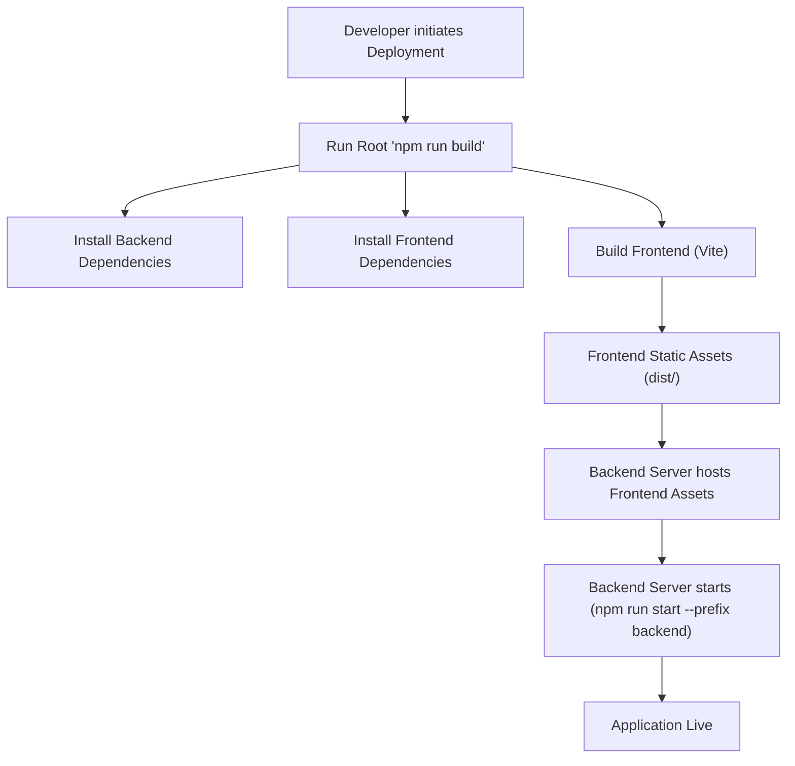
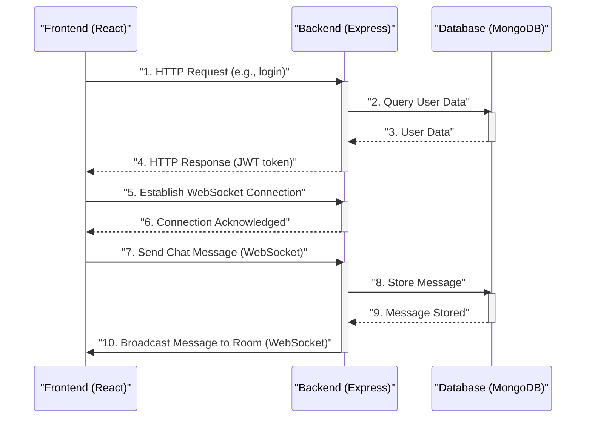

 # Development and Deployment

This document provides a comprehensive guide for developers looking to set up the local development environment, understand the build processes, and consider deployment strategies for the application. It outlines the key scripts, configurations, and dependencies that drive both the frontend and backend components.

## Getting Started

To begin development, ensure you have Node.js and npm installed. The project is structured as a monorepo, with distinct `backend` and `frontend` directories, each managing its own dependencies and scripts.

### Project Structure Overview

The root `package.json` orchestrates the build and start processes for the entire application, simplifying the setup for both development and deployment.

```json
// package.json
{
  "name": "chatapp",
  "version": "1.0.0",
  "main": "index.js",
  "scripts": {
    "build" : "npm install --prefix backend && npm install --prefix frontend && npm run build --prefix frontend",
    "start" : "npm run start --prefix backend"
  },
  "keywords": [],
  "author": "",
  "license": "ISC",
  "description": ""
}
```

This root `package.json` acts as a central control point.
- The `build` script ensures that dependencies for both `backend` and `frontend` are installed, and then triggers the frontend build process.
- The `start` script initiates the backend server, assuming the frontend has already been built or is being served separately during development.

[View on GitHub](https://github.com/shinymack/Chat-App-MERN/blob/main/package.json)

### Backend Development Setup

The backend is built with Node.js, Express, and MongoDB, utilizing `nodemon` for automatic restarts during development.

**Dependencies:**
Key backend dependencies include `express`, `mongoose` (for MongoDB), `socket.io` (for real-time communication), `jsonwebtoken` and `bcryptjs` (for authentication), and `dotenv` for environment variable management. Cloudinary is also integrated for file uploads.

**Development Scripts:**
To start the backend in development mode, navigate to the `backend` directory and run the `dev` script.

```json
// backend/package.json
{
  "name": "backend",
  "version": "1.0.0",
  "main": "src/index.js",
  "scripts": {
    "dev": "nodemon src/index.js",
    "start": "node src/index.js"
  },
  "author": "",
  "type": "module",
  "license": "ISC",
  "description": "",
  "dependencies": {
    "bcryptjs": "^2.4.3",
    "cloudinary": "^2.5.1",
    "cookie-parser": "^1.4.7",
    "dotenv": "^16.4.7",
    "express": "^4.21.2",
    "express-session": "^1.18.1",
    "jsonwebtoken": "^9.0.2",
    "mongoose": "^8.9.5",
    "passport": "^0.7.0",
    "passport-google-oauth20": "^2.0.0",
    "socket.io": "^4.8.1"
  },
  "devDependencies": {
    "nodemon": "^3.1.9"
  }
}
```
The `dev` script leverages `nodemon`, which monitors for changes in `src/index.js` and its imported modules, automatically restarting the server to reflect changes. The `start` script is for production environments, running the application directly with Node.js.

[View on GitHub](https://github.com/shinymack/Chat-App-MERN/blob/main/backend/package.json)

### Frontend Development Setup

The frontend is a React application powered by Vite for a fast development experience.

**Dependencies:**
Frontend dependencies include `react`, `react-dom`, `axios` (for HTTP requests), `react-router-dom` (for routing), `socket.io-client` (for real-time communication with the backend), and `zustand` for state management. `tailwindcss` and `daisyui` are used for styling.

**Development Scripts:**
To start the frontend development server, navigate to the `frontend` directory and use the `dev` script.

```json
// frontend/package.json
{
  "name": "frontend",
  "private": true,
  "version": "0.0.0",
  "type": "module",
  "scripts": {
    "dev": "vite",
    "build": "vite build",
    "lint": "eslint .",
    "preview": "vite preview",
    "mobile": "vite --host"
  },
  "dependencies": {
    "axios": "^1.7.9",
    "cors": "^2.8.5",
    "lucide-react": "^0.471.1",
    "react": "^18.3.1",
    "react-dom": "^18.3.1",
    "react-hot-toast": "^2.5.1",
    "react-icons": "^5.5.0",
    "react-router-dom": "^7.1.1",
    "socket.io-client": "^4.8.1",
    "zustand": "^5.0.3"
  },
  "devDependencies": {
    "@eslint/js": "^9.17.0",
    "@types/react": "^18.3.18",
    "@types/react-dom": "^18.3.5",
    "@vitejs/plugin-react": "^4.3.4",
    "autoprefixer": "^10.4.20",
    "daisyui": "^4.12.23",
    "eslint": "^9.17.0",
    "eslint-plugin-react": "^7.37.2",
    "eslint-plugin-react-hooks": "^5.0.0",
    "eslint-plugin-react-refresh": "^0.4.16",
    "globals": "^15.14.0",
    "postcss": "^8.5.0",
    "tailwindcss": "^3.4.17",
    "vite": "^6.3.5"
  }
}
```
- `dev`: Starts the Vite development server.
- `build`: Compiles the React application for production.
- `mobile`: Starts the Vite development server with `--host`, allowing access from other devices on the same network, useful for mobile testing.

[View on GitHub](https://github.com/shinymack/Chat-App-MERN/blob/main/frontend/package.json)

### Frontend Configuration (Vite)

The `vite.config.js` file configures Vite to use the React plugin. This is a minimal configuration, leveraging Vite's sensible defaults.

```javascript
// frontend/vite.config.js
import { defineConfig } from 'vite'
import react from '@vitejs/plugin-react'

// https://vitejs.dev/config/
export default defineConfig({
  plugins: [react()],
})
```
This configuration ensures that Vite correctly processes React components and sets up a hot-reloading development environment.

[View on GitHub](https://github.com/shinymack/Chat-App-MERN/blob/main/frontend/vite.config.js)

## Development Workflow

A typical development workflow involves running both the frontend and backend simultaneously.

### Running the Application Locally

1.  **Install Root Dependencies:**
    ```bash
    npm install
    ```
    This will install dependencies for both frontend and backend using the root `package.json` `postinstall` hook (if present) or you might need to run `npm install --prefix backend` and `npm install --prefix frontend` manually if there's no root `postinstall` script. The current setup implies separate `npm install` calls within the `build` script.

2.  **Start Backend:**
    Navigate to the `backend` directory:
    ```bash
    cd backend
    npm run dev
    ```
    This will start the Node.js server with `nodemon`, typically on `http://localhost:5000` (or as configured in `.env`).

3.  **Start Frontend:**
    Open a new terminal, navigate to the `frontend` directory:
    ```bash
    cd frontend
    npm run dev
    ```
    This will start the Vite development server, usually on `http://localhost:5173`.

### Environment Variables

Both the frontend and backend rely on environment variables (e.g., for database connection strings, API keys, port numbers). Ensure `.env` files are properly configured in both the `backend` and `frontend` root directories (if needed for frontend, usually `VITE_` prefixed variables).

## Deployment Considerations

For deployment, the application follows a standard MERN stack deployment pattern.

### Build Process for Production

The root `package.json` includes a `build` script designed for production builds:

```bash
npm run build
```
This command:
1.  Installs backend dependencies (`npm install --prefix backend`).
2.  Installs frontend dependencies (`npm install --prefix frontend`).
3.  Builds the frontend for production (`npm run build --prefix frontend`), creating optimized static assets in `frontend/dist`.

### Production Server

After the build process, the backend server can serve the static frontend assets. The root `start` script is configured to run the backend in production mode:

```bash
npm run start
```
This command executes `node src/index.js` from the `backend` directory. The backend should be configured to serve the `frontend/dist` directory for static files and handle API requests.

### Deployment Flow





## Key Integration Points

### Client-Server Communication

The frontend and backend communicate primarily via RESTful API calls using `axios` and real-time WebSocket connections using `socket.io-client` and `socket.io`.





This sequence highlights:
-   **Authentication:** Initial HTTP requests handle user login/registration, with JWT tokens managed by the backend.
-   **Real-time Chat:** Once authenticated, a WebSocket connection is established for real-time messaging, ensuring immediate message delivery and updates across connected clients.

### Environment Management

It is crucial to manage environment variables effectively. For development, `.env` files are used. For production, these variables should be configured directly on the hosting platform (e.g., Heroku config vars, Vercel environment variables, Docker secrets) to ensure sensitive information is not committed to version control. The backend's `dotenv` package handles loading these variables.

### Build Tooling

Vite serves as the primary build tool for the frontend, providing an optimized and fast development experience. It handles transpilation, bundling, and asset optimization. PostCSS, Tailwind CSS, and DaisyUI are integrated into the frontend build pipeline for efficient styling. ESLint is configured for code quality and consistency.