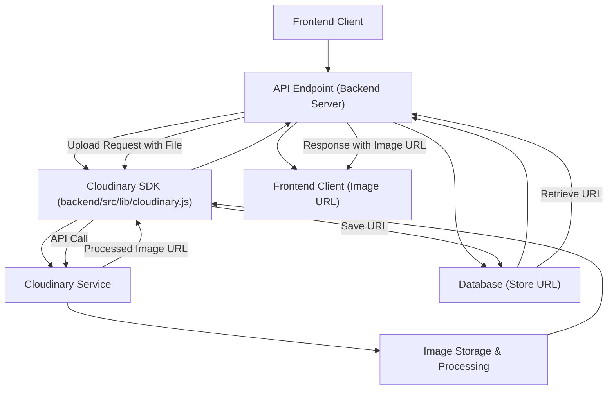
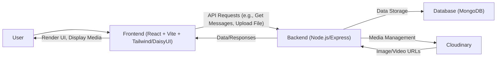

 # Development and Deployment

This section provides a comprehensive overview of the configurations, build processes, and utility functions that are crucial for developing and deploying the application. It covers both frontend and backend aspects, detailing how various tools and libraries are integrated to ensure a smooth development workflow and robust production environment. From UI styling with Tailwind CSS and DaisyUI to media management with Cloudinary and essential frontend utilities, understanding these components is key to effective development and maintenance.

## Frontend Development Configuration

The frontend of this application is built with React, leveraging Vite for a fast and efficient development experience. Configuration files like `vite.config.js` and `tailwind.config.js` are central to defining how the frontend project is built, styled, and optimized.

### Vite Configuration

Vite serves as the build tool for the React application, offering features like hot module replacement (HMR) and optimized build outputs. The `vite.config.js` file is straightforward, primarily enabling the React plugin to handle JSX and other React-specific syntax. This minimal configuration ensures that the development server runs efficiently and the production build is optimized.

```javascript
// frontend/vite.config.js
import { defineConfig } from 'vite'
import react from '@vitejs/plugin-react'

// https://vitejs.dev/config/
export default defineConfig({
  plugins: [react()],
})
```
[View on GitHub](https://github.com/shinymack/Chat-App-MERN/blob/main/frontend/vite.config.js)

This configuration enables Vite to correctly process React components, providing a seamless development experience with rapid compilation and live reloads. It's the foundational setup for building the user interface.

### Tailwind CSS and DaisyUI Styling

For styling, the application uses Tailwind CSS, a utility-first CSS framework, augmented by DaisyUI, a component library that provides pre-built, themeable components on top of Tailwind. The `tailwind.config.js` file is where Tailwind is configured, including content paths, custom themes, and the integration of DaisyUI.

The `content` array specifies the files where Tailwind should look for utility classes to generate the final CSS. This tree-shaking mechanism ensures that only the necessary CSS is bundled, reducing file size.

The `theme.extend.fontFamily` section demonstrates how custom fonts, such as 'Chivo', can be integrated and used throughout the application, enhancing the overall aesthetic.

Crucially, the `plugins: [daisyui]` line activates DaisyUI, making its extensive collection of components and themes available. The `daisyui` object within the configuration lists all the available themes. This allows developers to easily switch between different visual styles for the entire application, which is particularly useful for rapid prototyping or offering user-selectable themes.

```javascript
// frontend/tailwind.config.js
import daisyui from "daisyui"


/** @type {import('tailwindcss').Config} */
export default {
  content: [
    "./index.html",
    "./src/**/*.{js,ts,jsx,tsx}",
  ],
  theme: {
    extend: {
      fontFamily : {
        chivo : ['Chivo', 'sans-serif'],
      }
    },
  },
  plugins: [daisyui],
  daisyui : {
 themes: [
      "light",
      "dark",
      "cupcake",
      "bumblebee",
      "emerald",
      "corporate",
      "synthwave",
      "retro",
      "cyberpunk",
      "valentine",
      "halloween",
      "garden",
      "forest",
      "aqua",
      "lofi",
      "pastel",
      "fantasy",
      "wireframe",
      "black",
      "luxury",
      "dracula",
      "cmyk",
      "autumn",
      "business",
      "acid",
      "lemonade",
      "night",
      "coffee",
      "winter",
      "dim",
      "nord",
      "sunset",
    ],
  }
}
```
[View on GitHub](https://github.com/shinymack/Chat-App-MERN/blob/main/frontend/tailwind.config.js)

This extensive list of themes provides immense flexibility, allowing the application's appearance to be easily customized without extensive CSS modifications. It simplifies the process of creating a visually appealing and brand-consistent user interface.

## Utility Functions

Utility functions are small, reusable pieces of code that perform specific tasks, helping to keep the codebase clean, modular, and maintainable. In the frontend, these functions often handle common formatting or data manipulation tasks.

### Message Time Formatting

The `frontend/src/lib/utils.js` file contains various utility functions. A notable example is `formatMessageTime`, which takes a date object and formats it into a human-readable string, including the year, month, day, hour, and minute, with AM/PM indication. This is particularly useful for displaying timestamps in a chat application, ensuring consistency and readability across messages.

```javascript
// frontend/src/lib/utils.js
export function formatMessageTime(date) {
    return new Date(date).toLocaleTimeString("en-US", {
        year: "numeric",
        month: "short",
        day:"2-digit",
        hour: "2-digit",
        minute: "2-digit",
        hour12: true,
    });
}
```
[View on GitHub](https://github.com/shinymack/Chat-App-MERN/blob/main/frontend/src/lib/utils.js)

This function abstracts away the complexities of `toLocaleTimeString`, providing a simple interface for consistent date and time formatting, which is crucial for a smooth user experience in applications dealing with chronological data like messages.

## Cloudinary Integration

On the backend, media management is handled through Cloudinary, a cloud-based service that provides an end-to-end solution for all image and video needs. This includes uploading, storing, manipulating, and delivering media assets.

The `backend/src/lib/cloudinary.js` file is responsible for initializing and configuring the Cloudinary SDK. It imports the `v2` version of the Cloudinary SDK and `dotenv` to load environment variables.

The `cloudinary.config` call sets up the Cloudinary instance with credentials retrieved from environment variables: `CLOUDINARY_CLOUD_NAME`, `CLOUDINARY_API_KEY`, and `CLOUDINARY_API_SECRET`. This approach keeps sensitive information out of the codebase, which is a standard security practice. Once configured, the `cloudinary` instance is exported, making it available for use throughout the backend to perform media-related operations such as uploading images for user profiles or chat attachments.

```javascript
// backend/src/lib/cloudinary.js
import {v2 as cloudinary} from "cloudinary"

import { config } from 'dotenv'

config();

cloudinary.config(
    {cloud_name: process.env.CLOUDINARY_CLOUD_NAME,
    api_key: process.env.CLOUDINARY_API_KEY,
    api_secret: process.env.CLOUDINARY_API_SECRET,}
);

export default cloudinary;
```
[View on GitHub](https://github.com/shinymack/Chat-App-MERN/blob/main/backend/src/lib/cloudinary.js)

This setup ensures that the application can securely interact with Cloudinary's services, offloading the heavy lifting of media processing and storage to a specialized third-party, thereby improving application performance and scalability.

### Cloudinary Workflow
The following diagram illustrates a typical workflow for uploading an image to Cloudinary via the backend.





This diagram shows how a user's upload request from the frontend travels to the backend, which then uses the configured Cloudinary SDK to send the image to the Cloudinary service for storage and processing. Cloudinary returns a public URL, which the backend then saves in the database and sends back to the frontend for display.

## Key Integration Points

The files discussed (`vite.config.js`, `tailwind.config.js`, `utils.js`, `cloudinary.js`) collectively form a robust development and deployment environment.

*   **Frontend Productivity**: `vite.config.js` and `tailwind.config.js` streamline frontend development by providing a fast build process and a highly customizable styling framework. The integration of DaisyUI drastically speeds up UI development by offering ready-to-use, themed components, reducing the need for custom CSS.
*   **Code Reusability and Maintainability**: `utils.js` exemplifies the importance of modularity. By centralizing common functions like `formatMessageTime`, the codebase remains dry (Don't Repeat Yourself), easier to test, and more maintainable. These small, focused functions ensure consistent behavior across the application.
*   **Scalable Media Management**: `cloudinary.js` is critical for handling media assets. By delegating image and video management to Cloudinary, the application benefits from its powerful features (resizing, optimization, delivery) without burdening the backend server. This approach enhances performance and reduces operational overhead, ensuring the application can scale efficiently to handle growing media content.
*   **Environment Variable Best Practices**: The use of `dotenv` for Cloudinary configuration (`process.env.CLOUDINARY_CLOUD_NAME`, etc.) is a prime example of secure development practices. This keeps sensitive API keys and secrets out of version control, making the application more secure and easier to deploy across different environments (development, staging, production) with varying configurations.

### Overall System Flow

This diagram illustrates how the frontend, backend, and external services interact to provide a complete application experience.





This flow depicts the user interacting with the React frontend, which communicates with the Node.js backend for data and operations. The backend, in turn, interacts with MongoDB for persistent storage and Cloudinary for media asset management, ensuring a dynamic and feature-rich application. This architecture ensures a clear separation of concerns, making the system robust and scalable.