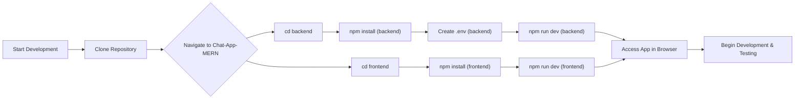
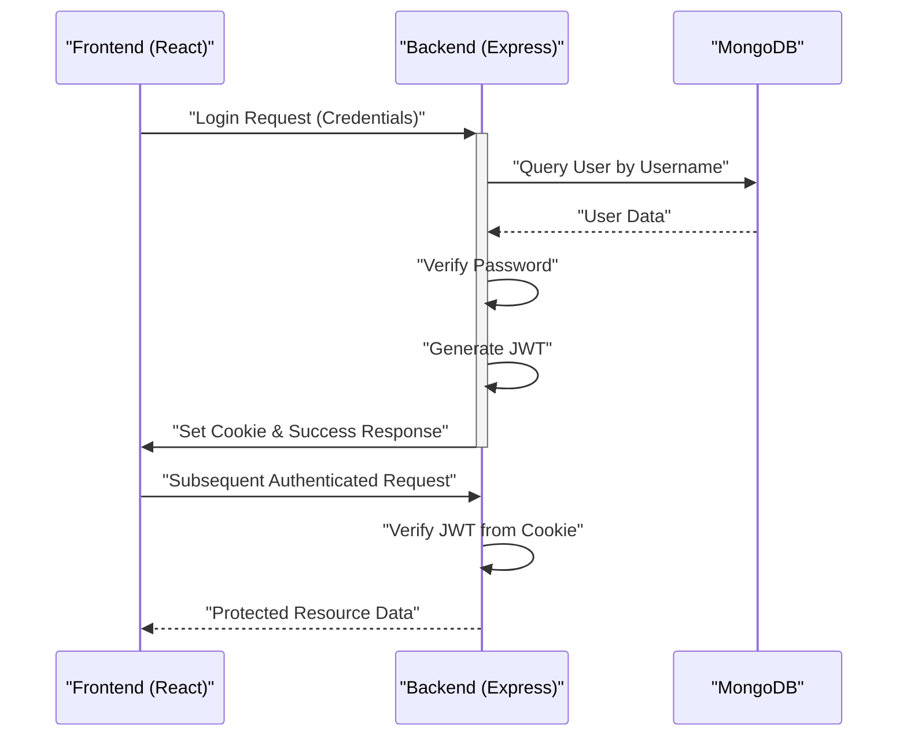
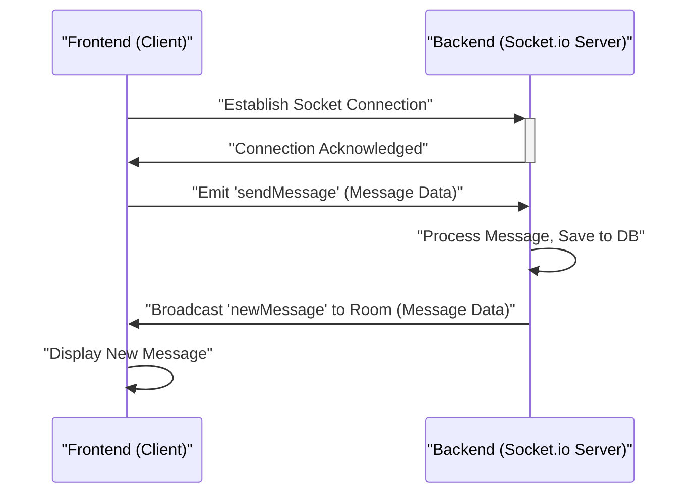

 # Development and Deployment

This section provides comprehensive guidelines for setting up your development environment for the MERN Chatapp, running the application locally, and considerations for its eventual deployment. The MERN Chatapp is a real-time messaging application built using MongoDB, Express.js, React, and Node.js, demonstrating full-stack capabilities with real-time communication via Socket.io.

## Development Environment Setup

To get the MERN Chatapp running on your local machine, ensure you have the following prerequisites installed:

*   **Node.js**: Version 18 or higher (includes npm).
*   **MongoDB**: A running instance, either local or cloud-based (e.g., MongoDB Atlas).
*   **Git**: For cloning the repository.

### Getting Started

1.  **Clone the Repository**:
    Begin by cloning the project repository from GitHub:

    ```bash
    git clone https://github.com/shinymack/Chat-App-MERN.git
    cd Chat-App-MERN
    ```
    [View on GitHub](https://github.com/shinymack/Chat-App-MERN)

2.  **Install Dependencies for Backend and Frontend**:
    The project is structured into `backend` and `frontend` directories, each with its own `package.json` file. You need to install dependencies for both.

### Backend Setup

The `backend` directory contains the Express.js server, responsible for API endpoints, database interactions, user authentication, and real-time communication via Socket.io.

*   **Key Dependencies**:
    *   `express`: Web framework for Node.js.
    *   `mongoose`: ODM for MongoDB.
    *   `socket.io`: Real-time bidirectional event-based communication.
    *   `bcryptjs`: For password hashing.
    *   `jsonwebtoken`: For authentication (JWTs).
    *   `cloudinary`: For cloud-based image/file storage.
    *   `dotenv`: To load environment variables from a `.env` file.
    *   `cookie-parser`: To parse incoming cookie headers.
    *   `nodemon`: (devDependencies) For automatic server restarts during development.

*   **`backend/package.json` Scripts**:
    The `scripts` section defines commands for running the backend:

    ```json
    // backend/package.json
    {
      "name": "backend",
      // ...
      "scripts": {
        "dev": "nodemon src/index.js",
        "start": "node src/index.js"
      },
      // ...
      "dependencies": {
        "bcryptjs": "^2.4.3",
        "cloudinary": "^2.5.1",
        "cookie-parser": "^1.4.7",
        "dotenv": "^16.4.7",
        "express": "^4.21.2",
        "jsonwebtoken": "^9.0.2",
        "mongoose": "^8.9.5",
        "passport": "^0.7.0",
        "passport-google-oauth20": "^2.0.0",
        "socket.io": "^4.8.1"
      },
      "devDependencies": {
        "nodemon": "^3.1.9"
      }
    }
    ```
    - `npm run dev`: Starts the server in development mode using `nodemon`, which watches for file changes and restarts the server automatically.
    - `npm start`: Starts the server in production mode.

*   **Installation and Running**:
    Navigate to the `backend` directory, install dependencies, and start the development server:

    ```bash
    cd backend
    npm install
    npm run dev
    ```
    The backend server will typically run on `http://localhost:5000`.

### Frontend Setup

The `frontend` directory contains the React application, which serves as the user interface for the chat app. It interacts with the backend API to send and receive data.

*   **Key Dependencies**:
    *   `react`, `react-dom`: Core React libraries.
    *   `axios`: Promise-based HTTP client for API requests.
    *   `socket.io-client`: Client-side library for Socket.io to establish real-time connections.
    *   `react-router-dom`: For client-side routing.
    *   `zustand`: A small, fast and scalable bearbones state-management solution.
    *   `tailwindcss`, `daisyui`: For styling and UI components.

*   **`frontend/package.json` Scripts**:
    The `scripts` section for the frontend manages development, building, and previewing:

    ```json
    // frontend/package.json
    {
      "name": "frontend",
      // ...
      "scripts": {
        "dev": "vite",
        "build": "vite build",
        "lint": "eslint .",
        "preview": "vite preview",
        "mobile": "vite --host"
      },
      // ...
      "dependencies": {
        "axios": "^1.7.9",
        "cors": "^2.8.5",
        "lucide-react": "^0.471.1",
        "react": "^18.3.1",
        "react-dom": "^18.3.1",
        "react-hot-toast": "^2.5.1",
        "react-icons": "^5.5.0",
        "react-router-dom": "^7.1.1",
        "socket.io-client": "^4.8.1",
        "zustand": "^5.0.3"
      },
      "devDependencies": {
        "autoprefixer": "^10.4.20",
        "daisyui": "^4.12.23",
        "postcss": "^8.5.0",
        "tailwindcss": "^3.4.17",
        "vite": "^6.3.5"
      }
    }
    ```
    - `npm run dev`: Starts the development server using Vite, providing hot module replacement and other developer-friendly features.
    - `npm run build`: Compiles the React application for production deployment.
    - `npm run preview`: Serves the production build locally for testing.
    - `npm run mobile`: Runs the Vite development server accessible on local network for mobile testing.

*   **`frontend/vite.config.js`**:
    This file configures Vite, the build tool used for the frontend. It primarily sets up the React plugin.

    ```javascript
    // frontend/vite.config.js
    import { defineConfig } from 'vite'
    import react from '@vitejs/plugin-react'

    // https://vite.dev/config/
    export default defineConfig({
      plugins: [react()],
    })
    ```
    [View on GitHub](https://github.com/shinymack/Chat-App-MERN/blob/main/frontend/vite.config.js)
    This minimal configuration enables React Fast Refresh and optimizes the build process.

*   **Installation and Running**:
    Navigate to the `frontend` directory, install dependencies, and start the development server:

    ```bash
    cd frontend
    npm install
    npm run dev
    ```
    The frontend application will typically run on `http://localhost:5173`.

### Environment Variables

Both the backend and frontend rely on environment variables for configuration (e.g., database URIs, JWT secrets, Cloudinary credentials). Create a `.env` file in the `backend` directory and populate it with necessary values. A `.env.example` file is often provided in repositories to guide this setup.

```ini
# .env file in backend/
MONGO_DB_URI="mongodb+srv://..."
JWT_SECRET="your_jwt_secret_key"
CLOUDINARY_CLOUD_NAME="your_cloud_name"
CLOUDINARY_API_KEY="your_api_key"
CLOUDINARY_API_SECRET="your_api_secret"
PORT=5000
NODE_ENV=development
CLIENT_URL="http://localhost:5173" # For CORS and redirects
```
[View example .env setup](https://github.com/shinymack/Chat-App-MERN/blob/main/.env.example)

## Development Workflow

The following diagram illustrates the typical development workflow for setting up and running the MERN Chatapp.





## Key Integration Points

The MERN Chatapp leverages several key integration points for its functionality, particularly around user authentication and real-time messaging.

### User Authentication Flow

When a user logs in, the frontend sends credentials to the backend. The backend authenticates, generates a JWT, and sets an HTTP-only cookie. Subsequent requests use this cookie for authorization.





### Real-time Messaging with Socket.io

Socket.io is crucial for the real-time chat functionality. The frontend establishes a WebSocket connection with the backend, allowing instant message exchange without constant polling.





## Deployment Considerations

Deploying a MERN stack application involves separate considerations for the frontend and backend.

### Backend Deployment

*   **Environment Variables**: Ensure all production environment variables are configured securely on your hosting provider (e.g., `MONGO_DB_URI`, `JWT_SECRET`, `CLOUDINARY_API_SECRET`). Do NOT commit `.env` files to version control.
*   **Build Process**: The backend typically doesn't have a "build" step in the same way a frontend does, but ensure all `devDependencies` are removed and only `dependencies` are installed in production.
*   **Hosting**: Platforms like Render, Heroku, or AWS EC2/Lightsail are suitable for hosting the Node.js backend.
*   **Process Manager**: Use a process manager like PM2 to keep the Node.js server running continuously and manage restarts.

```bash
# Example for production build and start
cd backend
npm install --production
npm start
```
[View backend `src/index.js` which is the entry point](https://github.com/shinymack/Chat-App-MERN/blob/main/backend/src/index.js)

### Frontend Deployment

*   **Build Process**: Generate a production-ready build of your React application using `npm run build`. This creates optimized static assets.

    ```bash
    cd frontend
    npm run build
    ```
    This command will output static files into a `dist` directory (or similar, depending on Vite config).

*   **Hosting**: The static files generated by the build process can be hosted on platforms like Netlify, Vercel, or GitHub Pages. These services are optimized for serving static content efficiently.
*   **Environment Variables**: Frontend environment variables (e.g., API endpoint URL) are often injected at build time. For Vite, variables prefixed with `VITE_` are exposed to the client-side.

### Database Deployment

*   **MongoDB Atlas**: For production, it's highly recommended to use a cloud-hosted MongoDB service like MongoDB Atlas. It provides scalability, reliability, and managed backups without needing to manage your own database server.

By following these guidelines, you can effectively develop, test, and deploy the MERN Chatapp, ensuring a robust and scalable application.