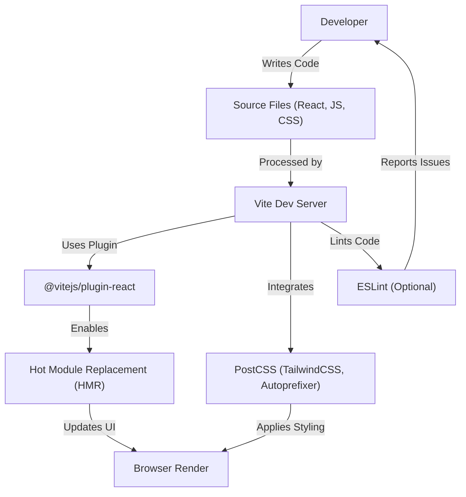
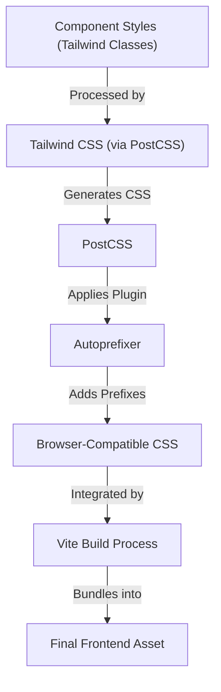

 # Development and Configuration

This document provides a comprehensive overview of the development environment setup, crucial build processes, and configuration files for the frontend of the application. Understanding these configurations is vital for developers to maintain consistency, optimize performance, and ensure a smooth development workflow.

The frontend leverages modern tools like Vite for bundling, React for UI, ESLint for code quality, and Tailwind CSS with DaisyUI for styling. Each configuration file plays a specific role in defining how the application is built, styled, and validated.

## Frontend Build and Development Environment

The frontend application is powered by Vite, a next-generation frontend tooling that provides a fast and optimized development experience. It pre-bundles dependencies using esbuild, resulting in significantly faster cold start times and instant hot module replacement (HMR).

### Vite Configuration

The primary configuration for the frontend build process resides in `frontend/vite.config.js`. This file defines how Vite should bundle and serve the application, integrating plugins as needed.

```javascript
// frontend/vite.config.js
import { defineConfig } from 'vite'
import react from '@vitejs/plugin-react'

// https://vitejs.dev/config/
export default defineConfig({
  plugins: [react()],
})
```
This snippet demonstrates the minimal setup for a React application with Vite, activating the official `@vitejs/plugin-react` plugin. This plugin enables Fast Refresh for React components, ensures proper JSX transformation, and optimizes the build for production.

[View on GitHub](https://github.com/shinymack/Chat-App-MERN/blob/main/frontend/vite.config.js)

### Frontend Development Workflow

The following diagram illustrates the typical workflow for frontend development, highlighting how Vite integrates various tools to deliver a seamless experience.





## Styling and UI Framework

The application utilizes Tailwind CSS for utility-first styling, enhanced by PostCSS for processing and DaisyUI for pre-built, themeable components. This combination offers flexibility, rapid development, and a consistent design system.

### Tailwind CSS Configuration

`frontend/tailwind.config.js` is the central place to configure Tailwind CSS. It defines content paths for purging unused styles, extends the default theme, and integrates plugins like DaisyUI.

```javascript
// frontend/tailwind.config.js
import daisyui from "daisyui"

/** @type {import('tailwindcss').Config} */
export default {
  content: [
    "./index.html",
    "./src/**/*.{js,ts,jsx,tsx}",
  ],
  theme: {
    extend: {
      fontFamily : {
        chivo : ['Chivo', 'sans-serif'],
      }
    },
  },
  plugins: [daisyui],
  daisyui : {
    themes: [
      "light", "dark", "cupcake", "bumblebee", "emerald", "corporate",
      "synthwave", "retro", "cyberpunk", "valentine", "halloween", "garden",
      "forest", "aqua", "lofi", "pastel", "fantasy", "wireframe", "black",
      "luxury", "dracula", "cmyk", "autumn", "business", "acid", "lemonade",
      "night", "coffee", "winter", "dim", "nord", "sunset",
    ],
  }
}
```
This configuration specifies that Tailwind should scan `index.html` and all `.js`, `.ts`, `.jsx`, and `.tsx` files within the `src` directory for class names to include in the final CSS bundle. It also extends the default theme with a custom `chivo` font family and imports the `daisyui` plugin, explicitly listing a wide array of themes available for use.

[View on GitHub](https://github.com/shinymack/Chat-App-MERN/blob/main/frontend/tailwind.config.js)

### PostCSS Configuration

PostCSS acts as a tool for transforming CSS with JavaScript plugins. In this setup, `frontend/postcss.config.js` is used to integrate Tailwind CSS and Autoprefixer.

```javascript
// frontend/postcss.config.js
export default {
  plugins: {
    tailwindcss: {},
    autoprefixer: {},
  },
}
```
This simple configuration tells PostCSS to first process CSS with `tailwindcss` (which generates the utility classes based on the `tailwind.config.js`) and then with `autoprefixer` (which adds vendor prefixes to CSS rules for browser compatibility). This ensures that the generated CSS is optimized and compatible across different browsers.

[View on GitHub](https://github.com/shinymack/Chat-App-MERN/blob/main/frontend/postcss.config.js)

### Styling Pipeline

The styling pipeline shows how different tools contribute to the final CSS output.





## Code Quality and Linting

Maintaining high code quality and consistency is crucial for collaborative development. ESLint is configured to enforce coding standards, identify potential errors, and ensure best practices for React applications.

### ESLint Configuration

The `frontend/eslint.config.js` file defines the rules and plugins ESLint uses to analyze the JavaScript and JSX code.

```javascript
// frontend/eslint.config.js
import js from '@eslint/js'
import globals from 'globals'
import react from 'eslint-plugin-react'
import reactHooks from 'eslint-plugin-react-hooks'
import reactRefresh from 'eslint-plugin-react-refresh'

export default [
  { ignores: ['dist'] },
  {
    files: ['**/*.{js,jsx}'],
    languageOptions: {
      ecmaVersion: 2020,
      globals: globals.browser,
      parserOptions: {
        ecmaVersion: 'latest',
        ecmaFeatures: { jsx: true },
        sourceType: 'module',
      },
    },
    settings: { react: { version: '18.3' } },
    plugins: {
      react,
      'react-hooks': reactHooks,
      'react-refresh': reactRefresh,
    },
    rules: {
      ...js.configs.recommended.rules,
      ...react.configs.recommended.rules,
      ...react.configs['jsx-runtime'].rules,
      ...reactHooks.configs.recommended.rules,
      'react/jsx-no-target-blank': 'off',
      'react-refresh/only-export-components': [
        'warn',
        { allowConstantExport: true },
      ],
      "react/prop-types" : "off",
    },
  },
]
```
This configuration is set up for modern JavaScript and React development. It ignores the `dist` folder, targets `.js` and `.jsx` files, and enables browser globals. It pulls in recommended rules from ESLint itself, `eslint-plugin-react`, `eslint-plugin-react-hooks`, and specifically the `jsx-runtime` configuration for React 17+. Additionally, it disables `react/jsx-no-target-blank` and `react/prop-types` for flexibility in a modern React application that often uses TypeScript or other forms of prop validation, while `react-refresh/only-export-components` is set to warn with `allowConstantExport: true` to better integrate with Vite's Fast Refresh capabilities.

[View on GitHub](https://github.com/shinymack/Chat-App-MERN/blob/main/frontend/eslint.config.js)

## Key Integration Points

The frontend configuration demonstrates a robust and modern development setup. Key integration points include:

*   **Vite as the Build Tool:** Vite acts as the central orchestrator, leveraging its speed for both development and production builds. It seamlessly integrates React Fast Refresh and the PostCSS pipeline.
*   **Modular Styling with Tailwind CSS and DaisyUI:** By combining Tailwind's utility-first approach with DaisyUI's component library, developers can rapidly build UIs that are both custom and consistent. The PostCSS setup ensures efficient processing and browser compatibility.
*   **Enforced Code Quality with ESLint:** The comprehensive ESLint configuration ensures that all JavaScript and JSX code adheres to predefined standards, reducing bugs and improving maintainability. Its integration with `eslint-plugin-react-refresh` helps prevent common issues that might disrupt Fast Refresh during development.

These configurations together form a cohesive environment that prioritizes developer experience, performance, and code quality for the frontend application.