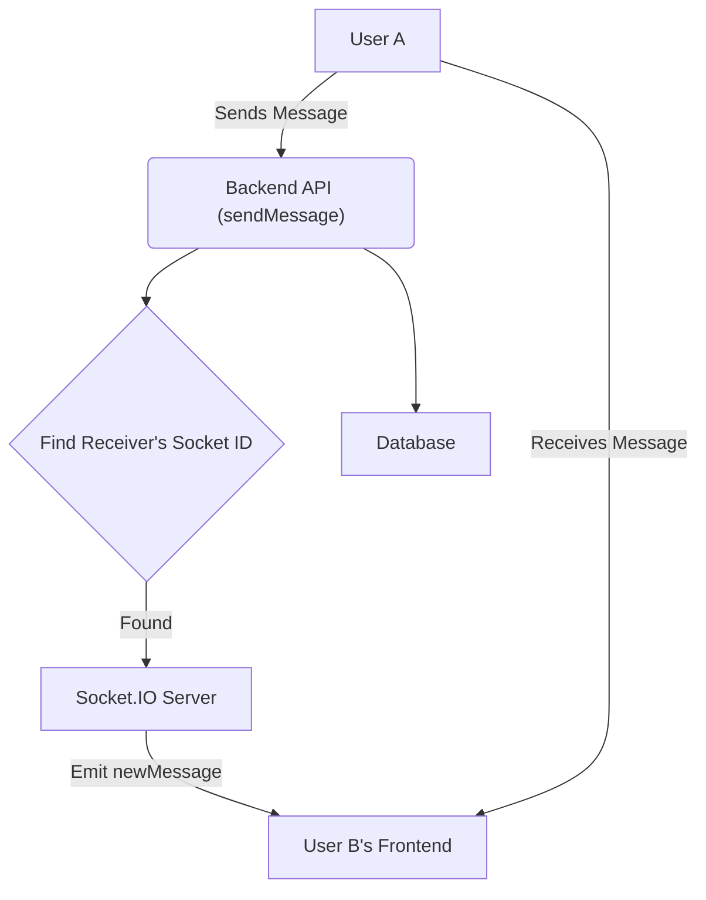

# Real-time Communication

This section details the real-time messaging capabilities of the Chat App MERN, focusing on how messages are sent, received, and displayed instantly between users.

## Backend Socket.IO Setup

The backend utilizes Socket.IO to manage real-time connections and message broadcasting. The `socket.js` file sets up the Socket.IO server and handles user connections and disconnections. It maintains a map (`userSocketMap`) to store the mapping between user IDs and their corresponding socket IDs, enabling direct communication with specific users.

```javascript
// backend/src/lib/socket.js
import { Server } from "socket.io";
import http from "http";
import express from "express";

const app = express();

const server = http.createServer(app);

const io = new Server(server, {
    cors: {
        origin: ["http://localhost:5173"]
    }
});

export function getReceiverSocketId(userId) {
    return userSocketMap[userId];
}

const userSocketMap = {}; // {userId : socketId}

io.on("connection", (socket) => {
    console.log("A user connected", socket.id);

    const userId = socket.handshake.query.userId;
    if(userId) userSocketMap[userId] = socket.id;

    io.emit("getOnlineUsers", Object.keys(userSocketMap));

    socket.on("disconnect", ()=>{
        console.log("A user disconnected", socket.id);
        delete userSocketMap[userId];
        io.emit("getOnlineUsers", Object.keys(userSocketMap));
    });
});

export { io, app, server };
```

## Sending and Receiving Messages

The `sendMessage` controller in `message.controller.js` is responsible for handling new messages. Upon receiving a message, it saves it to the database and then uses the `getReceiverSocketId` function to find the recipient's socket ID. If the recipient is online, the new message is emitted to their socket using the `newMessage` event.

```javascript
// backend/src/controllers/message.controller.js
import Message from "../models/message.model.js";
import cloudinary from "../lib/cloudinary.js";
import { getReceiverSocketId, io } from "../lib/socket.js";

export const sendMessage = async (req, res) => {
    try {
        const { text, image } = req.body;
        const { id: receiverId } = req.params;
        const senderId = req.user._id;

        let imageUrl;
        if (image) {
            const uploadResponse = await cloudinary.uploader.upload(image);
            imageUrl = uploadResponse.secure_url;
        }
        const newMessage = new Message({
            senderId,
            receiverId,
            text,
            image: imageUrl,
        });

        await newMessage.save();

        const receiverSocketId = getReceiverSocketId(receiverId);

        if(receiverSocketId) {
            io.to(receiverSocketId).emit("newMessage", newMessage);
        }

        res.status(201).json(newMessage);

    } catch (error) {
        console.log("Error in sendMessage controller:  ", error);
        res.status(500).json({ error: "Internal Server Error" });
    }
};
```

On the frontend, the `ChatContainer.jsx` component subscribes to the `newMessage` event using `subscribeToMessages`. When a new message is received, it's added to the local state, causing the chat interface to update instantly without requiring a page refresh.

```tsx
// frontend/src/components/ChatContainer.jsx
useEffect(() => {
    getMessages(selectedUser._id);
    subscribeToMessages();

    return () => unsubscribeFromMessages();
}, [selectedUser._id, getMessages, subscribeToMessages, unsubscribeFromMessages]);

// ... inside the return statement
{messages.map((message) => (
    <div
        key={message._id}
        className={`chat ${message.senderId == authUser._id ? "chat-end": "chat-start"} `}
        ref={messageEndRef}
    >
        {/* ... message content ... */}
    </div>
))}
```

## Frontend API Interaction

The `axiosInstance` from `frontend/src/lib/axios.js` is used to make API requests to the backend. For fetching messages, it targets the `/messages/:id` endpoint.

```javascript
// frontend/src/lib/axios.js
import axios from "axios";

export const axiosInstance = axios.create({
    baseURL: import.meta.env.MODE == "development" ? "http://localhost:5001/api": "/api",
    withCredentials: true,
});
```

## Architecture Overview

The real-time communication flow can be visualized as follows:





## Key Takeaways

*   **Socket.IO for Real-time**: Socket.IO is the core technology enabling instant message delivery.
*   **Server-Side Broadcasting**: The backend actively pushes new messages to connected clients.
*   **Client-Side Event Handling**: Frontend components listen for incoming messages to update the UI dynamically.
*   **User Mapping**: A mechanism to map user IDs to their active socket connections is crucial for targeted communication.