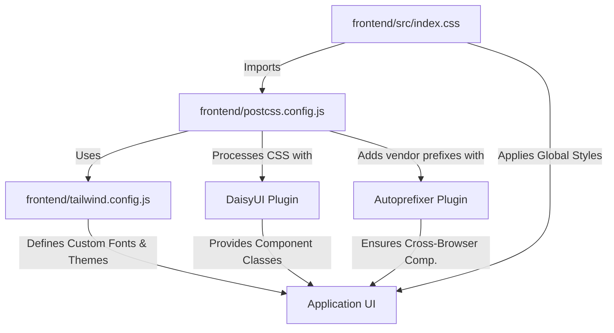

 # Styling and Configuration

This section details the styling framework, linting rules, and various project-specific configurations that govern the frontend application's appearance, code quality, and build process. Understanding these configurations is crucial for maintaining a consistent look and feel, ensuring code integrity, and streamlining development workflows.

## Styling with Tailwind CSS and DaisyUI

The frontend utilizes [Tailwind CSS](https://tailwindcss.com/) for utility-first styling, complemented by [DaisyUI](https://daisyui.com/), a Tailwind CSS component library. This combination allows for rapid UI development with highly customizable components.

### Tailwind CSS Configuration (`frontend/tailwind.config.js`)

The `tailwind.config.js` file is the central place to customize Tailwind's default settings, including colors, fonts, and plugins. Here, we define the content paths for Tailwind to scan, extend the default theme with custom fonts, and integrate DaisyUI.

```javascript
// frontend/tailwind.config.js
import daisyui from "daisyui";

/** @type {import('tailwindcss').Config} */
export default {
  content: [
    "./index.html",
    "./src/**/*.{js,ts,jsx,tsx}",
  ],
  theme: {
    extend: {
      fontFamily : {
        chivo : ['Chivo', 'sans-serif'],
      }
    },
  },
  plugins: [daisyui],
  daisyui : {
    themes: [
      "light", "dark", "cupcake", "bumblebee", "emerald", "corporate",
      // ... many more themes
    ],
  }
};
```
[View on GitHub](https://github.com/shinymack/Chat-App-MERN/blob/main/frontend/tailwind.config.js)

The `content` array specifies which files Tailwind should scan for class names to generate the smallest possible CSS bundle. The `extend.fontFamily.chivo` entry customizes the available fonts, making `'Chivo'` accessible via the `font-chivo` utility class. The `plugins` array integrates `daisyui`, enabling its component classes and themes.

### PostCSS Configuration (`frontend/postcss.config.js`)

[PostCSS](https://postcss.org/) is a tool for transforming CSS with JavaScript plugins. In this project, it's used to process CSS with `tailwindcss` and `autoprefixer`. Tailwind CSS itself is a PostCSS plugin, and `autoprefixer` automatically adds vendor prefixes to CSS rules, ensuring broad browser compatibility.

```javascript
// frontend/postcss.config.js
export default {
  plugins: {
    tailwindcss: {},
    autoprefixer: {},
  },
};
```
[View on GitHub](https://github.com/shinymack/Chat-App-MERN/blob/main/frontend/postcss.config.js)

This simple configuration tells PostCSS to apply the `tailwindcss` plugin first, followed by `autoprefixer`.

### Global Stylesheet (`frontend/src/index.css`)

The `index.css` file is the entry point for all global styles and Tailwind CSS directives. It imports the custom font and applies Tailwind's base, components, and utilities layers.

```css
/* frontend/src/index.css */
@import url('https://fonts.googleapis.com/css2?family=Chivo:ital,wght@0,100..900;1,100..900&display=swap');
@tailwind base;
@tailwind components;
@tailwind utilities;

@layer base {
    body {
        @apply font-chivo;
    }
}
```
[View on GitHub](https://github.com/shinymack/Chat-App-MERN/blob/main/frontend/src/index.css)

The `@import` rule fetches the 'Chivo' font from Google Fonts. The `@tailwind` directives inject Tailwind's generated styles. The `@layer base` block is used to inject custom base styles; here, it applies the `font-chivo` class to the `body` element globally, setting 'Chivo' as the default font for the application.

#### Styling Workflow

The styling process integrates these files to deliver a cohesive visual experience:





This diagram illustrates how `index.css` acts as the entry point, directing styles through `postcss.config.js` which in turn leverages `tailwind.config.js` and integrated plugins like DaisyUI and Autoprefixer to produce the final styled application UI.

## Linting with ESLint

[ESLint](https://eslint.org/) is used to statically analyze the code to find problematic patterns or code that doesn’t adhere to certain style guidelines. This ensures code quality, consistency, and helps catch errors early in the development cycle.

### ESLint Configuration (`frontend/eslint.config.js`)

The `eslint.config.js` file defines the rules and plugins for linting the JavaScript and JSX files in the frontend. It uses a modern flat configuration format.

```javascript
// frontend/eslint.config.js
import js from '@eslint/js';
import globals from 'globals';
import react from 'eslint-plugin-react';
import reactHooks from 'eslint-plugin-react-hooks';
import reactRefresh from 'eslint-plugin-react-refresh';

export default [
  { ignores: ['dist'] },
  {
    files: ['**/*.{js,jsx}'],
    languageOptions: {
      ecmaVersion: 2020,
      globals: globals.browser,
      parserOptions: {
        ecmaVersion: 'latest',
        ecmaFeatures: { jsx: true },
        sourceType: 'module',
      },
    },
    settings: { react: { version: '18.3' } },
    plugins: {
      react,
      'react-hooks': reactHooks,
      'react-refresh': reactRefresh,
    },
    rules: {
      ...js.configs.recommended.rules,
      ...react.configs.recommended.rules,
      ...react.configs['jsx-runtime'].rules,
      ...reactHooks.configs.recommended.rules,
      'react/jsx-no-target-blank': 'off',
      'react-refresh/only-export-components': [
        'warn',
        { allowConstantExport: true },
      ],
      "react/prop-types" : "off",
    },
  },
];
```
[View on GitHub](https://github.com/shinymack/Chat-App-MERN/blob/main/frontend/eslint.config.js)

Key aspects of this configuration include:
*   `ignores: ['dist']`: Prevents ESLint from checking the compiled `dist` directory.
*   `files: ['**/*.{js,jsx}']`: Specifies that these rules apply to all `.js` and `.jsx` files.
*   `languageOptions`: Configures ECMAScript version (2020) and global variables (`globals.browser` for browser environments), enabling JSX parsing.
*   `settings: { react: { version: '18.3' } }`: Informs `eslint-plugin-react` about the React version.
*   `plugins`: Integrates plugins for standard JavaScript (`@eslint/js`), React (`eslint-plugin-react`), React Hooks (`eslint-plugin-react-hooks`), and React Refresh (`eslint-plugin-react-refresh`).
*   `rules`: Extends recommended rule sets from the installed plugins and customizes specific rules:
    *   `react/jsx-no-target-blank: 'off'`: Disables the rule that enforces `rel="noopener noreferrer"` on `target="_blank"` links.
    *   `react-refresh/only-export-components: 'warn'`: Warns about components that are not directly exported, which can interfere with React Fast Refresh, but allows constant exports.
    *   `react/prop-types: "off"`: Disables PropTypes validation, often preferred when using TypeScript or when prop validation is managed otherwise.

## Key Integration Points

### Consistent Styling

The tight integration between `tailwind.config.js`, `postcss.config.js`, and `index.css` ensures a streamlined styling workflow. Developers can leverage Tailwind's utility classes and DaisyUI's components with confidence, knowing that custom fonts and browser compatibility are handled automatically. The `font-chivo` class, defined in `tailwind.config.js` and applied globally in `index.css`, exemplifies how custom design tokens are propagated throughout the application.

### Code Quality and Maintainability

ESLint plays a critical role in enforcing code standards across the frontend. By integrating `eslint-plugin-react` and `eslint-plugin-react-hooks`, the project ensures that React best practices are followed. The `react-refresh/only-export-components` rule is particularly important for maintaining a smooth development experience with Fast Refresh, helping to catch issues that might prevent hot module reloading from working correctly. Disabling `react/prop-types` indicates a preference for other means of type checking, such as TypeScript (if it were used) or implicit understanding in a smaller project, reducing boilerplate.

The combination of robust styling configurations and strict linting rules ultimately contributes to a highly maintainable, performant, and visually consistent frontend application.