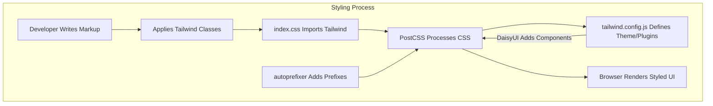
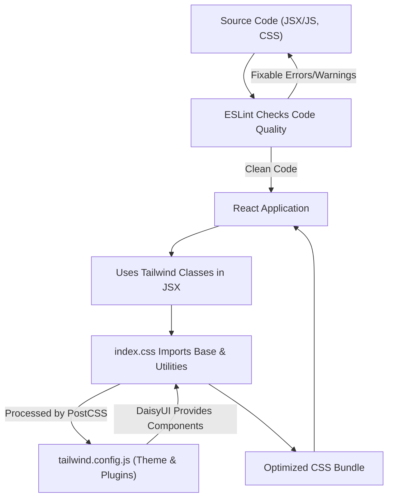

 # Styling and Configuration

This document outlines the styling and configuration practices within the project, focusing on the frontend setup. We leverage modern tools like Tailwind CSS for utility-first styling, PostCSS for asset processing, and ESLint for maintaining code quality and consistency.

## Styling with Tailwind CSS and DaisyUI

The frontend's styling foundation is built upon Tailwind CSS, a utility-first CSS framework. This approach accelerates UI development by providing low-level utility classes directly in the markup, rather than writing custom CSS for every component. To enhance development speed and provide pre-designed components, the project integrates DaisyUI, a Tailwind CSS component library.

### Tailwind CSS Configuration

The `frontend/tailwind.config.js` file is the central point for customizing Tailwind CSS. It defines custom themes, extends default utilities, and registers plugins.

```javascript
// frontend/tailwind.config.js
import daisyui from "daisyui"

/** @type {import('tailwindcss').Config} */
export default {
  content: [
    "./index.html",
    "./src/**/*.{js,ts,jsx,tsx}",
  ],
  theme: {
    extend: {
      fontFamily : {
        chivo : ['Chivo', 'sans-serif'],
      }
    },
  },
  plugins: [daisyui],
  daisyui : {
    themes: [
      "light", "dark", "cupcake", "bumblebee", "emerald", "corporate", "synthwave",
      "retro", "cyberpunk", "valentine", "halloween", "garden", "forest", "aqua",
      "lofi", "pastel", "fantasy", "wireframe", "black", "luxury", "dracula",
      "cmyk", "autumn", "business", "acid", "lemonade", "night", "coffee", "winter",
      "dim", "nord", "sunset",
    ],
  }
}
```
[View on GitHub](https://github.com/shinymack/Chat-App-MERN/blob/main/frontend/tailwind.config.js)

**Key Configuration Points:**

*   **`content`**: Specifies the files Tailwind CSS should scan for utility classes to generate the final CSS. This ensures that only used styles are bundled, optimizing file size.
*   **`theme.extend`**: Allows extending Tailwind's default theme. Here, a custom font family named `chivo` is added, mapping to the 'Chivo' Google Font.
*   **`plugins`**: Integrates additional Tailwind plugins. `daisyui` is added here, making its components and theme functionalities available.
*   **`daisyui.themes`**: Configures the available themes from DaisyUI. This array lists all the themes that can be dynamically applied to the application, offering a wide range of aesthetic options.

### PostCSS Configuration

PostCSS is a tool for transforming CSS with JavaScript plugins. In this project, `frontend/postcss.config.js` is configured to use `tailwindcss` and `autoprefixer`.

```javascript
// frontend/postcss.config.js
export default {
  plugins: {
    tailwindcss: {},
    autoprefixer: {},
  },
}
```
[View on GitHub](https://github.com/shinymack/Chat-App-MERN/blob/main/frontend/postcss.config.js)

*   **`tailwindcss`**: This plugin processes the `@tailwind` directives in the CSS, generating the necessary utility classes based on the `tailwind.config.js` file.
*   **`autoprefixer`**: Automatically adds vendor prefixes to CSS rules, ensuring cross-browser compatibility.

### Global Stylesheet

The `frontend/src/index.css` file serves as the main entry point for global styles and Tailwind CSS directives.

```css
/* frontend/src/index.css */
@import url('https://fonts.googleapis.com/css2?family=Chivo:ital,wght@0,100..900;1,100..900&display=swap');
@tailwind base;
@tailwind components;
@tailwind utilities;


@layer base {
    body {
        @apply font-chivo;
    }
}
```
[View on GitHub](https://github.com/shinymack/Chat-App-MERN/blob/main/frontend/src/index.css)

*   **`@import url(...)`**: Imports the 'Chivo' font from Google Fonts, making it available for use in the application.
*   **`@tailwind base;`**: Injects Tailwind's base styles, which include a sensible set of default styles and resets.
*   **`@tailwind components;`**: Injects Tailwind's component styles, including those from DaisyUI.
*   **`@tailwind utilities;`**: Injects Tailwind's utility classes.
*   **`@layer base { ... }`**: Defines custom base styles. Here, the `font-chivo` utility is applied to the `body` element, setting 'Chivo' as the default font for the entire application.

### Styling Workflow





## Linting with ESLint

ESLint is used to statically analyze the code to find problems and enforce coding standards. The `frontend/eslint.config.js` file configures ESLint for the React frontend.

```javascript
// frontend/eslint.config.js
import js from '@eslint/js'
import globals from 'globals'
import react from 'eslint-plugin-react'
import reactHooks from 'eslint-plugin-react-hooks'
import reactRefresh from 'eslint-plugin-react-refresh'

export default [
  { ignores: ['dist'] },
  {
    files: ['**/*.{js,jsx}'],
    languageOptions: {
      ecmaVersion: 2020,
      globals: globals.browser,
      parserOptions: {
        ecmaVersion: 'latest',
        ecmaFeatures: { jsx: true },
        sourceType: 'module',
      },
    },
    settings: { react: { version: '18.3' } },
    plugins: {
      react,
      'react-hooks': reactHooks,
      'react-refresh': reactRefresh,
    },
    rules: {
      ...js.configs.recommended.rules,
      ...react.configs.recommended.rules,
      ...react.configs['jsx-runtime'].rules,
      ...reactHooks.configs.recommended.rules,
      'react/jsx-no-target-blank': 'off',
      'react-refresh/only-export-components': [
        'warn',
        { allowConstantExport: true },
      ],
      "react/prop-types" : "off",

    },
  },
]
```
[View on GitHub](https://github.com/shinymack/Chat-App-MERN/blob/main/frontend/eslint.config.js)

**Configuration Breakdown:**

*   **`ignores: ['dist']`**: Excludes the build output directory from linting.
*   **`files: ['**/*.{js,jsx}']`**: Specifies that these rules apply to all `.js` and `.jsx` files.
*   **`languageOptions`**: Configures JavaScript language options:
    *   `ecmaVersion`: Sets the ECMAScript version.
    *   `globals`: Defines global variables available in the environment (e.g., `browser` globals like `window`, `document`).
    *   `parserOptions`: Configures the parser, enabling JSX and module syntax.
*   **`settings`**: Provides shared settings to plugins, like the React version.
*   **`plugins`**: Registers ESLint plugins for React, React Hooks, and React Refresh.
*   **`rules`**: Defines specific linting rules:
    *   It extends recommended rule sets from `@eslint/js`, `eslint-plugin-react`, and `eslint-plugin-react-hooks`.
    *   `'react/jsx-no-target-blank': 'off'`: Disables the rule that warns about `target="_blank"` without `rel="noreferrer noopener"`. This might be disabled for specific project requirements.
    *   `'react-refresh/only-export-components'`: Warns if components are not exported directly, which can interfere with React Fast Refresh. It allows constant exports.
    *   `"react/prop-types" : "off"`: Disables the `prop-types` validation, often used when TypeScript or other type checking solutions are in place.

## Key Integration Points

The integration of these configuration files creates a cohesive development environment for the frontend.

*   **Development Speed**: Tailwind CSS and DaisyUI significantly reduce the time spent on styling, allowing developers to build UIs rapidly with consistent design.
*   **Code Quality**: ESLint ensures that the codebase adheres to predefined standards, catching potential issues early and promoting maintainable code.
*   **Build Process**: PostCSS acts as a critical step in the build pipeline, transforming source CSS into production-ready stylesheets with necessary vendor prefixes and Tailwind utilities.
*   **Theming**: The DaisyUI theme configuration in `tailwind.config.js` provides extensive theming capabilities, making it easy to switch between various visual styles to match branding or user preferences. This is particularly useful for offering a dark mode or different branding schemes.

### Configuration and Styling Flow


