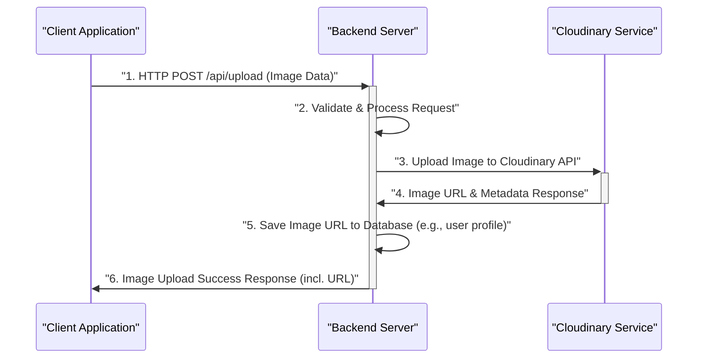
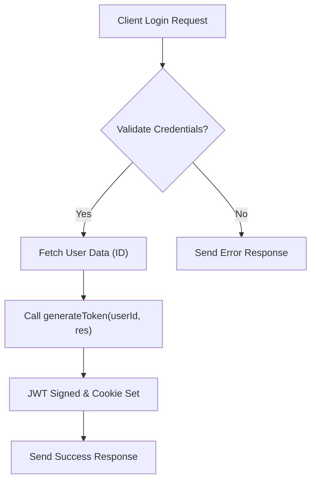

 # Third-Party Integrations and Utilities

This document outlines the usage of third-party integrations and essential utility functions within the application's backend and frontend. Leveraging external services like Cloudinary for media management and robust utility functions for tasks such as token generation, data formatting, and managing constants, significantly enhances the application's functionality, scalability, and maintainability. These components are critical for delivering a seamless user experience and ensuring secure, efficient operations.

## Backend Integrations

The backend integrates with external services to handle specific functionalities, ensuring that core application logic remains focused while offloading specialized tasks to dedicated providers.

### Cloudinary for Media Management

Cloudinary is a cloud-based image and video management service. It provides a comprehensive solution for uploading, storing, manipulating, optimizing, and delivering media assets. In this application, Cloudinary is primarily used for handling user-uploaded images, such as profile pictures or content attachments, ensuring efficient storage and delivery.

The configuration for Cloudinary is handled in `backend/src/lib/cloudinary.js`, where the necessary credentials are loaded from environment variables to secure access to the Cloudinary account.

```javascript
// backend/src/lib/cloudinary.js
import {v2 as cloudinary} from "cloudinary"
import { config } from 'dotenv'

config(); // Load environment variables

cloudinary.config(
    {
        cloud_name: process.env.CLOUDINARY_CLOUD_NAME,
        api_key: process.env.CLOUDINARY_API_KEY,
        api_secret: process.env.CLOUDINARY_API_SECRET,
    }
);

export default cloudinary;
```
This snippet demonstrates the initialization of the Cloudinary SDK. It uses `dotenv` to load environment variables, `CLOUDINARY_CLOUD_NAME`, `CLOUDINARY_API_KEY`, and `CLOUDINARY_API_SECRET`, which are crucial for authenticating and interacting with the Cloudinary service. Once configured, the `cloudinary` object is exported, making it available throughout the backend for upload and management operations.

[View on GitHub](https://github.com/shinymack/Chat-App-MERN/blob/main/backend/src/lib/cloudinary.js)

#### Cloudinary Image Upload Flow

The following sequence diagram illustrates the typical process of how an image is uploaded through the application to Cloudinary.





This diagram shows the client initiating an upload, the backend handling the request and interacting with Cloudinary using the configured SDK, and finally storing the resulting image URL before responding to the client. This offloads heavy image processing and storage to Cloudinary, ensuring optimal performance and scalability for media assets.

### Backend Utility Functions

The `backend/src/lib/utils.js` file contains common utility functions that support core backend operations, especially related to security and authentication.

#### JWT Token Generation

The `generateToken` function is responsible for creating a JSON Web Token (JWT) for user authentication and setting it as an `httpOnly` cookie. This mechanism is crucial for maintaining user sessions securely across the application.

```javascript
// backend/src/lib/utils.js
import jwt from 'jsonwebtoken';

export const generateToken = (userId, res) => {
    const token = jwt.sign({userId}, process.env.JWT_SECRET,
        {expiresIn: "7d"});

    res.cookie("jwt", token, {
        maxAge: 7 * 24 * 60 * 60 * 1000,
        httpOnly: true,
        sameSite: "strict",
        secure: process.env.NODE_ENV !== "development",
    });
    return token;
};
```
The `generateToken` function takes a `userId` and the `response` object. It uses `jsonwebtoken` to sign a new token with the user's ID and a secret key from environment variables (`JWT_SECRET`), setting an expiration of 7 days. Critically, it then sets this token as an `httpOnly` cookie. The `httpOnly: true` flag prevents client-side JavaScript from accessing the cookie, mitigating XSS attacks. `sameSite: "strict"` helps prevent CSRF attacks, and `secure: true` ensures the cookie is only sent over HTTPS in production environments.

[View on GitHub](https://github.com/shinymack/Chat-App-MERN/blob/main/backend/src/lib/utils.js)

#### User Authentication Flow with JWT

This flowchart illustrates the high-level steps involved in user authentication, highlighting where the `generateToken` function is utilized.





This diagram emphasizes the conditional nature of token generation: it only occurs upon successful credential validation. The `generateToken` utility is a central part of establishing a secure session post-login.

## Frontend Utilities and Constants

The frontend utilizes various utility functions and constants to manage UI logic, data presentation, and configuration. These files contribute to a more organized and maintainable client-side codebase.

### Application Constants

The `frontend/src/constants/index.js` file centralizes various application-wide constants, such as a list of available themes. This approach ensures consistency and simplifies updates across the application.

```javascript
// frontend/src/constants/index.js
export const THEMES = [
    "light",
    "dark",
    "cupcake",
    "bumblebee",
    "emerald",
    "corporate",
    "synthwave",
    "retro",
    "cyberpunk",
    "valentine",
    "halloween",
    "garden",
    "forest",
    "aqua",
    "lofi",
    "pastel",
    "fantasy",
    "wireframe",
    "black",
    "luxury",
    "dracula",
    "cmyk",
    "autumn",
    "business",
    "acid",
    "lemonade",
    "night",
    "coffee",
    "winter",
    "dim",
    "nord",
    "sunset",
  ];
```
This `THEMES` array provides a comprehensive list of design themes available to the user, likely for dynamic theme switching. Centralizing this list makes it easy to add, remove, or modify themes without searching through multiple component files.

[View on GitHub](https://github.com/shinymack/Chat-App-MERN/blob/main/frontend/src/constants/index.js)

### Frontend Utility Functions

The `frontend/src/lib/utils.js` file contains helper functions specific to the client-side, such as formatting dates and times for display.

#### Message Time Formatting

The `formatMessageTime` function is a utility designed to format `Date` objects into a user-friendly string representation, commonly used for displaying timestamps on messages or other timeline events.

```javascript
// frontend/src/lib/utils.js
export function formatMessageTime(date) {
    return new Date(date).toLocaleTimeString("en-US", {
        year: "numeric",
        month: "short",
        day:"2-digit",
        hour: "2-digit",
        minute: "2-digit",
        hour12: true,
    });
}
```
This function takes a `date` (which can be a `Date` object or a string parseable by `new Date()`) and formats it using `toLocaleTimeString` with specific options for English (en-US) locale. It includes the year, abbreviated month, two-digit day, two-digit hour and minute, and an AM/PM indicator, providing a clear and consistent format for message timestamps.

[View on GitHub](https://github.com/shinymack/Chat-App-MERN/blob/main/frontend/src/lib/utils.js)

## Key Integration Points

The seamless integration of third-party services and the strategic use of utility functions are cornerstone aspects of this application's architecture.

*   **Cloudinary Integration:** The decision to use Cloudinary streamlines media handling, offloading storage, optimization, and delivery to a specialized service. This ensures high availability and performance for visual content without burdening the application's backend server. Future enhancements might involve integrating advanced Cloudinary features like automatic image transformation, video processing, or secure media delivery. Best practice dictates that API keys and secrets for Cloudinary (and similar services) should *always* be managed via environment variables and never hardcoded, as demonstrated.

*   **Secure Authentication with JWTs:** The `generateToken` utility function is central to the application's authentication strategy. By generating `httpOnly` and `secure` cookies, the application significantly enhances security against common web vulnerabilities like Cross-Site Scripting (XSS) and Cross-Site Request Forgery (CSRF). This approach keeps authentication concerns encapsulated within a dedicated utility, promoting reusability and maintainability across authentication-related endpoints.

*   **Centralized Constants:** Placing constants like `THEMES` in a dedicated file simplifies UI configuration and ensures consistency. This pattern is invaluable for scalable applications, allowing for easy updates and preventing 'magic strings' scattered throughout the codebase. It makes the application more adaptable to new features or branding changes.

*   **Frontend Data Formatting:** Utility functions like `formatMessageTime` abstract away complex data formatting logic from individual components. This leads to cleaner, more readable component code and ensures a consistent user experience regarding data presentation. This separation of concerns is a fundamental principle for building robust frontend applications.

In summary, these integrations and utilities are carefully selected and implemented to create an efficient, secure, and user-friendly application. They exemplify best practices in modular development, security, and external service leverage.