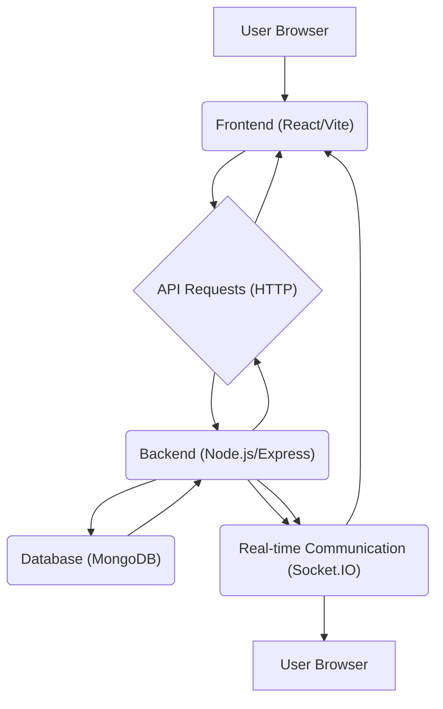

# Deployment and Dependencies

This document outlines the deployment considerations and dependencies for the Chat App. It covers the setup process, essential libraries, and important configuration details for both the backend and frontend.

## Backend Dependencies

The backend of the chat application is built using Node.js and Express. It relies on several npm packages to provide core functionalities like user authentication, real-time communication, and data persistence.

The primary dependencies include:

*   **express**: A robust web application framework for Node.js.
*   **mongoose**: An Object Data Modeling (ODM) library for MongoDB and Node.js.
*   **socket.io**: Enables real-time, bidirectional, and event-based communication.
*   **bcryptjs**: For secure password hashing.
*   **jsonwebtoken**: For creating and verifying JSON Web Tokens for authentication.
*   **dotenv**: To load environment variables from a `.env` file.
*   **cloudinary**: For image uploading and management.
*   **cookie-parser**: Middleware to parse cookies.
*   **express-session**: Middleware for handling user sessions.
*   **passport** and **passport-google-oauth20**: For authentication strategies.

The `backend/package-lock.json` file details the specific versions of these dependencies and their sub-dependencies.

```json
{
  "name": "backend",
  "version": "1.0.0",
  "lockfileVersion": 3,
  "requires": true,
  "packages": {
    "": {
      "name": "backend",
      "version": "1.0.0",
      "license": "ISC",
      "dependencies": {
        "bcryptjs": "^2.4.3",
        "cloudinary": "^2.5.1",
        "cookie-parser": "^1.4.7",
        "dotenv": "^16.4.7",
        "express": "^4.21.2",
        "express-session": "^1.18.1",
        "jsonwebtoken": "^9.0.2",
        "mongoose": "^8.9.5",
        "passport": "^0.7.0",
        "passport-google-oauth20": "^2.0.0",
        "socket.io": "^4.8.1"
      },
      "devDependencies": {
        "nodemon": "^3.1.9"
      }
    }
    // ... other dependencies
  }
}
```

To install these dependencies, navigate to the `backend` directory and run:

```bash
npm install
```

The `nodemon` package is included as a development dependency for automatic server restarts during development.

## Frontend Dependencies

The frontend is built using Vite and React. It handles the user interface and client-side logic for interacting with the backend API.

Key frontend dependencies from `frontend/package-lock.json` include:

*   **react**: The core library for building user interfaces.
*   **react-dom**: For rendering React components in the browser.
*   **axios**: A promise-based HTTP client for making API requests.
*   **socket.io-client**: The client-side library for connecting to the Socket.IO server.
*   **vite**: A build tool that significantly improves the frontend development experience.
*   **@vitejs/plugin-react**: Vite plugin for React support.

```json
{
  "name": "frontend",
  "version": "0.0.0",
  "type": "module",
  "dependencies": {
    "axios": "^1.7.2",
    "react": "^18.3.1",
    "react-dom": "^18.3.1",
    "socket.io-client": "^4.7.5"
  },
  "devDependencies": {
    "@types/react": "^18.3.3",
    "@types/react-dom": "^18.3.0",
    "@vitejs/plugin-react": "^4.3.1",
    "eslint": "^9.7.0",
    "eslint-plugin-react": "^7.34.3",
    "eslint-plugin-react-hooks": "^4.6.2",
    "eslint-plugin-react-refresh": "^0.4.7",
    "vite": "^5.3.1"
  }
  // ... other dependencies
}
```

To install these dependencies, navigate to the `frontend` directory and run:

```bash
npm install
```

The `vite.config.js` file contains the build configuration for the frontend.

## Project Setup and Execution

The root `package.json` file orchestrates the build and start processes for the entire application.

The `scripts` section in the root `package.json` defines the commands for setup and execution:

```json
{
  "name": "chatapp",
  "version": "1.0.0",
  "main": "index.js",
  "scripts": {
    "build" : "npm install --prefix backend && npm install --prefix frontend && npm run build --prefix frontend",
    "start" : "npm run start --prefix backend"
  },
  "keywords": [],
  "author": "",
  "license": "ISC",
  "description": ""
}
```

*   **`npm run build`**: This command first installs dependencies for both the backend and frontend, and then proceeds to build the frontend application.
*   **`npm run start`**: This command starts the backend server.

## Deployment Considerations

When deploying the chat application, consider the following:

*   **Environment Variables**: Ensure all necessary environment variables (e.g., database connection strings, JWT secrets, Cloudinary credentials) are correctly configured in the deployment environment. The backend utilizes `dotenv` to manage these.
*   **Database**: A MongoDB database instance is required for the backend to function.
*   **Scalability**: For real-time applications with a high number of concurrent users, consider scaling strategies for the backend server and potentially using a more robust WebSocket solution or a managed Socket.IO cluster.
*   **CORS**: The backend is configured to handle Cross-Origin Resource Sharing (CORS). Ensure that the frontend's origin is correctly allowed in the production environment if it differs from the development environment.
*   **Build Process**: The `npm run build` script in the root `package.json` handles the installation of dependencies and the frontend build. The output of the frontend build should be served statically by the backend or a dedicated web server.

## Architecture Overview

The application follows a standard client-server architecture:





The frontend communicates with the backend via RESTful API calls for data retrieval and manipulation. Real-time features are handled through WebSocket connections established by Socket.IO clients and servers.