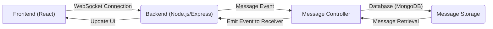
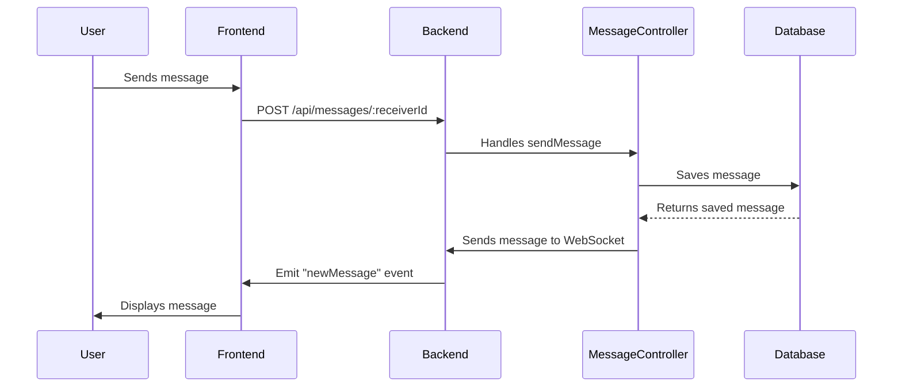

# Real-time Communication

This section details the implementation of real-time messaging functionality within the Chat-App-MERN application, leveraging WebSockets for efficient and instantaneous communication between users.

## Features

*   **Instant Messaging:** Users can send and receive text and image messages in real-time.
*   **Online Status:** The application indicates which users are currently online.
*   **Bi-directional Communication:** Messages can be exchanged between any two users.
*   **Message Persistence:** Messages are stored in a database for later retrieval.

## Architecture

The real-time communication architecture is based on WebSockets, facilitated by the `socket.io` library. The backend manages WebSocket connections and message routing, while the frontend handles user interaction and display updates.





## Backend Implementation

### `backend/src/lib/socket.js`

This file initializes the WebSocket server using `socket.io` and manages user connections and disconnections.

```javascript title="backend/src/lib/socket.js" showLineNumbers
import { Server } from "socket.io";
import http from "http";
import express from "express";

const app = express();
const server = http.createServer(app);

const io = new Server(server, {
    cors: {
        origin: ["http://localhost:5173"]
    }
})

export function getReceiverSocketId(userId) {
    return userSocketMap[userId];
}

const userSocketMap = {}; //{userId : socketId}

io.on("connection", (socket) => {
    console.log("A user connected", socket.id);

    const userId = socket.handshake.query.userId;
    if(userId) userSocketMap[userId] = socket.id;

    io.emit("getOnlineUsers", Object.keys(userSocketMap));

    socket.on("disconnect", ()=>{
        console.log("A user disconnected", socket.id);
        delete userSocketMap[userId]; 
        io.emit("getOnlineUsers", Object.keys(userSocketMap));
    })
})

export { io, app, server };
```

[View on GitHub](https://github.com/shinymack/Chat-App-MERN/blob/main/backend/src/lib/socket.js)

*   **`Server` Initialization:** Creates a new `socket.io` server instance, attaching it to the HTTP server.
*   **CORS Configuration:** Configures Cross-Origin Resource Sharing (CORS) to allow connections from the frontend application.
*   **`userSocketMap`:** A dictionary that stores the mapping between user IDs and their corresponding socket IDs.  This is essential for directing messages to the correct recipient.
*   **`connection` Event:**  Handles new WebSocket connections. It extracts the user ID from the socket handshake query and stores the socket ID in `userSocketMap`. It also emits an event to all connected clients with the list of online users.
*   **`disconnect` Event:** Handles WebSocket disconnections. It removes the user's socket ID from `userSocketMap` and emits an event to update the online users list.

### `backend/src/controllers/message.controller.js`

This file contains the logic for handling message-related operations, including sending, receiving, and storing messages.

```javascript title="backend/src/controllers/message.controller.js" showLineNumbers
import User from "../models/user.model.js";
import Message from "../models/message.model.js";
import cloudinary from "../lib/cloudinary.js";
import { getReceiverSocketId, io } from "../lib/socket.js";


export const getUsersForSidebar = async (req, res) => {
    try {
        const loggedInUserId = req.user._id;
        const filteredUsers = await User.find({
            _id: { $ne: loggedInUserId }}).select("-password");  
        res.status(200).json(filteredUsers);
    }
    catch (error) {
        console.log("Error in getUsersForSidebar: ", error);
        res.status(500).json({ error: "Internal Server Error" });
    }
};

export const getMessages = async (req, res) => {
    try {
        const {id : userToChatId } = req.params;
        const myId = req.user._id;

        const messages = await Message.find({
            $or: [
                {senderId: myId, receiverId:userToChatId},
                {senderId: userToChatId, receiverId: myId}
            ]
        });
        res.status(200).json(messages);
    } catch (error) {
        console.log("Error in getMessages controller:  ", error);
        res.status(500).json({ error: "Internal Server Error" });
    }
};

export const sendMessage = async (req, res) => {
    try {
        const { text, image } = req.body;
        const { id: receiverId } = req.params;
        const senderId = req.user._id;

        let imageUrl;
        if (image) {
            const uploadResponse = await cloudinary.uploader.upload(image);

            imageUrl = uploadResponse.secure_url;
        }
        const newMessage = new Message({
            senderId,
            receiverId,
            text,
            image: imageUrl,
        });

        await newMessage.save();

        const receiverSocketId = getReceiverSocketId(receiverId);

        if(receiverSocketId) {
            io.to(receiverSocketId).emit("newMessage", newMessage);
        }


        res.status(201).json(newMessage);   
        
    } catch (error) {
        console.log("Error in sendMessage controller:  ", error);
        res.status(500).json({ error: "Internal Server Error" });
    }
};
```

[View on GitHub](https://github.com/shinymack/Chat-App-MERN/blob/main/backend/src/controllers/message.controller.js)

*   **`getUsersForSidebar`:** Retrieves a list of users to display in the sidebar, excluding the logged-in user.
*   **`getMessages`:** Retrieves messages between the logged-in user and the specified user.
*   **`sendMessage`:** Handles sending a new message. It extracts the message content, sender, and receiver information from the request, saves the message to the database, and emits a `newMessage` event to the recipient using WebSockets. The image is uploaded to Cloudinary.

```javascript title="Emitting the New Message"
        const receiverSocketId = getReceiverSocketId(receiverId);

        if(receiverSocketId) {
            io.to(receiverSocketId).emit("newMessage", newMessage);
        }
```

This snippet shows how the backend emits the `newMessage` event to the specific user who should receive the message.  `getReceiverSocketId` retrieves the socket ID of the recipient, and `io.to(receiverSocketId).emit` sends the event to that socket.

## Frontend Implementation

### `frontend/src/components/ChatContainer.jsx`

This component manages the display of messages and handles user interactions within the chat interface.

```javascript title="frontend/src/components/ChatContainer.jsx" showLineNumbers
import { useEffect } from "react";
import { useChatStore } from "../store/useChatStore";
import ChatHeader from "./ChatHeader";
import MessageInput from "./MessageInput";
import MessageSkeleton from "./skeletons/MessageSkeleton";
import { useAuthStore } from "../store/useAuthStore";
import { formatMessageTime } from "../lib/utils";
import { useRef } from "react";

const ChatContainer = () => {
    const { messages, getMessages, isMessagesLoading, selectedUser, subscribeToMessages, unsubscribeFromMessages } =
        useChatStore();
    const { authUser } = useAuthStore();
    const messageEndRef = useRef(null);


    useEffect(() => {
        getMessages(selectedUser._id);
        subscribeToMessages();

        return () => unsubscribeFromMessages();
    }, [selectedUser._id, getMessages, subscribeToMessages, unsubscribeFromMessages]);
    
    useEffect(() => {
        if(messageEndRef.current && messages){
            messageEndRef.current.scrollIntoView({behaviour : "smooth"})
        }
    }, [messages])

    if (isMessagesLoading)
        return (
            <div className="flex-1 flex flex-col overflow-auto">
                <ChatHeader />
                <MessageSkeleton />
                <MessageInput />
            </div>
        );
    return (
        <div className="flex-1 flex flex-col overflow-auto">
            <ChatHeader />
            <div className="flex-1 overflow-y-auto p-4 space-y-4">
                {messages.map((message) => (
                    <div
                        key={message._id}
                        className={`chat ${message.senderId == authUser._id ? "chat-end": "chat-start"} `}
                        ref={messageEndRef}
                    >
                        <div className="chat-image avatar">
                            <div className="size-9 rounded-full border">
                                
                            </div>
                        </div>
                        <div className="chat-header mb-1">
                            <time className="text-xs opacity-50 ml-1">{formatMessageTime(message.createdAt)}</time>
                        </div>
                        <div className="chat-bubble flex flex-col">
                            {message.image && (
                                
                            )}
                            {message.text && <p>{message.text}</p>}
                        </div>
                    </div>
                ))}
            </div>
            <MessageInput />
        </div>
    );
};

export default ChatContainer;
```

[View on GitHub](https://github.com/shinymack/Chat-App-MERN/blob/main/frontend/src/components/ChatContainer.jsx)

*   **`useChatStore`:** This hook provides access to the chat-related state and actions, including messages, loading status, selected user, and subscription/unsubscription functions.
*   **`useEffect` Hook:** This hook is used to fetch messages and subscribe to new message events when the selected user changes. It also unsubscribes from the message events when the component unmounts.
*   **`subscribeToMessages` and `unsubscribeFromMessages`:**  These functions (defined in `useChatStore`) handle the WebSocket event subscription and unsubscription for receiving new messages.
*	**`messageEndRef`:** This useRef hook is used to keep the chat scrolled to the bottom when new messages are received.

```javascript title="Subscribing to New Messages"
    useEffect(() => {
        getMessages(selectedUser._id);
        subscribeToMessages();

        return () => unsubscribeFromMessages();
    }, [selectedUser._id, getMessages, subscribeToMessages, unsubscribeFromMessages]);
```

This `useEffect` hook demonstrates how the component subscribes to and unsubscribes from the WebSocket events for new messages. The `subscribeToMessages` function likely sets up a WebSocket listener for the `newMessage` event, and the `unsubscribeFromMessages` function removes the listener when the component unmounts or the selected user changes.

## WebSocket Flow





## Key Integration Points

*   **WebSocket Initialization:** The `socket.js` file on the backend initializes the WebSocket server and handles connection events. It's crucial to ensure that the server is properly configured to allow connections from the frontend and that user authentication is handled securely.
*   **Message Handling:** The `message.controller.js` file on the backend manages the sending, receiving, and storage of messages. It's important to validate message data, handle errors gracefully, and ensure that messages are delivered to the correct recipients.
*   **Frontend Integration:** The `ChatContainer.jsx` component on the frontend integrates with the WebSocket server to receive new messages and update the UI in real-time. It's important to handle WebSocket events properly, update the state efficiently, and provide a smooth user experience.
*	**Error Handling:** Robust error handling is important throughout the entire process. Catching and logging errors on both the client and server can significantly aid in debugging and maintaining application stability. Displaying user-friendly error messages in the UI can also improve user experience.

## Best Practices

*   **Use a state management library (e.g., Zustand, Redux Toolkit) for complex state management.**
*   **Implement proper error handling and logging.**
*   **Optimize WebSocket connections for performance.**
*   **Secure WebSocket communication with encryption.**
*   **Implement message persistence for reliability.**
```