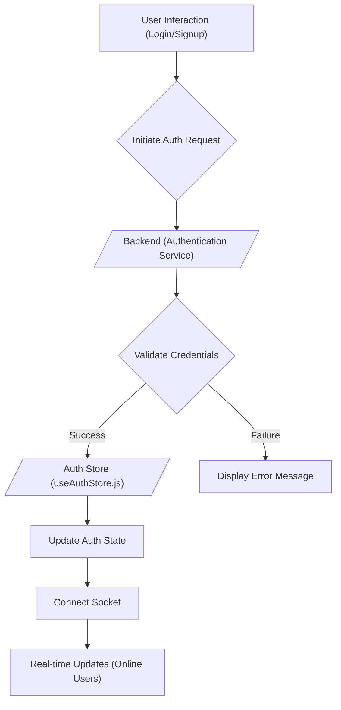

# State Management

This document details the state management solution employed in the frontend of the Chat-App-MERN project. We leverage Zustand, a small, fast, and scalable bearbones state-management solution, offering a straightforward approach to managing application state within our React components.  We utilize Zustand stores to manage authentication, chat data, and theme preferences.

## Zustand: A Bearbones State Management Solution

Zustand was selected for its simplicity and ease of integration. It offers a more lightweight alternative to Redux, reducing boilerplate and complexity while providing a centralized and predictable state container. Zustand stores are defined using hooks, making it intuitive to consume and update state within React components.

### Key Features

*   **Centralized State:**  Zustand stores act as a single source of truth for application state.
*   **Simple API:**  Easy-to-use hooks for accessing and updating state.
*   **Minimal Boilerplate:** Reduces the amount of code required compared to Redux or Context API.
*   **Scalable:** Suitable for both small and large applications.
*   **React Friendly:** Seamless integration with React components.

## Auth Store (`frontend/src/store/useAuthStore.js`)

The `useAuthStore` is responsible for managing the authentication state of the application. This includes user authentication status, user data, and signup/login/logout actions. It also handles socket connection for real-time communication.

```javascript title="frontend/src/store/useAuthStore.js"
import { create } from "zustand";
import { axiosInstance } from "../lib/axios";
import toast from "react-hot-toast";
import { io } from "socket.io-client";

const BASE_URL = import.meta.env.MODE == "development" ? "http://localhost:5001": "/";

export const useAuthStore = create((set, get) => ({
    authUser: null,
    isSigningUp: false,
    isLoggingIn: false,
    isUpdatingProfile: false,
    isCheckingAuth: true,
    onlineUsers: [],
    socket: null,

    checkAuth: async () => { ... },
    signup: async (data) => { ... },
    logout: async () => { ... },
    login: async (data) => { ... },
    updateProfile: async (data) => { ... },
    connectSocket: () => { ... },
    disconnectSocket : () => { ... }
}));
```

[View on GitHub](https://github.com/shinymack/Chat-App-MERN/blob/main/frontend/src/store/useAuthStore.js)

**Explanation:**

*   `authUser`: Stores the currently authenticated user's data.
*   `isSigningUp`, `isLoggingIn`, `isUpdatingProfile`, `isCheckingAuth`: Boolean flags indicating the loading state of various authentication operations.
*   `checkAuth()`: Checks if the user is already authenticated by making a request to the backend.
*   `signup()`, `login()`, `logout()`:  Functions to handle user signup, login, and logout.
*   `connectSocket()`: Establishes a WebSocket connection with the server using Socket.IO, used for real-time updates, passing the userId for identification.
*   `disconnectSocket()`: Disconnects the WebSocket connection.
*   `onlineUsers`: An array containing the IDs of online users.
*    `socket`: The Socket.IO client instance.

### Authentication Flow





## Chat Store (`frontend/src/store/useChatStore.js`)

The `useChatStore` manages the state related to chat functionalities, including messages, user lists, friend requests, and selected user.

```javascript title="frontend/src/store/useChatStore.js"
import toast from "react-hot-toast";
import { create } from "zustand";
import { axiosInstance } from "../lib/axios";
import { useAuthStore } from "./useAuthStore";

export const useChatStore = create((set, get) => ({
    messages:[],
    users: [],
    pendingRequests: [],
    sentRequests: [],
    selectedUser: null,
    isUsersLoading: false,
    isMessagesLoading: false,
    isFriendBoxOpen: false,

    toggleFriendsBox: () => set(state => ({ isFriendsBoxOpen: !state.isFriendsBoxOpen })),
    getFriends: async () => { ... },
    getPendingRequests: async () => { ... },
    getSentRequests: async () => { ... },
    sendFriendRequest: async (identifier) => { ... },
    acceptFriendRequest: async (senderId) => { ... },
    rejectFriendRequest: async (senderId) => { ... },
    removeFriend: async (friendId) => { ... },
    getMessages: async (userId) => { ... },
    sendMessage: async (messageData) => { ... },
    subscribeToMessages: () => { ... },
    unsubscribeFromMessages: () => { ... },    
    setSelectedUser: (selectedUser) => set({selectedUser})
}))
```

[View on GitHub](https://github.com/shinymack/Chat-App-MERN/blob/main/frontend/src/store/useChatStore.js)

**Explanation:**

*   `messages`: An array storing the current chat messages between the logged-in user and the selected user.
*   `users`: An array containing the list of friends.
*   `pendingRequests`: An array of pending friend requests.
*   `sentRequests`: An array of sent friend requests.
*   `selectedUser`: The user currently selected for chatting.
*   `isUsersLoading`, `isMessagesLoading`: Boolean flags to indicate loading states.
*   `getFriends()`, `getPendingRequests()`, `getSentRequests()`: Functions to fetch data from the backend.
*   `sendFriendRequest()`, `acceptFriendRequest()`, `rejectFriendRequest()`, `removeFriend()`:  Functions to manage friend requests.
*   `getMessages()`: Fetches messages for a specific user.
*   `sendMessage()`: Sends a new message to the selected user.
*   `subscribeToMessages()`: Listens for new messages via WebSocket and updates the `messages` state.
*   `unsubscribeFromMessages()`: Removes the message listener from the WebSocket.
*  `toggleFriendsBox()`: Toggles the friend list box's visibility
*   `setSelectedUser()`: Sets the currently selected user.

### Message Subscription

```javascript title="frontend/src/store/useChatStore.js"
    subscribeToMessages: () => {
        const { selectedUser } = get();
        if(!selectedUser) return;
        
        const socket = useAuthStore.getState().socket;
        socket.on("newMessage", (newMessage) => {
            if(newMessage.senderId !== selectedUser._id) return
            set({
                messages: [...get().messages, newMessage]
            })
        })
    },
```

[View on GitHub](https://github.com/shinymack/Chat-App-MERN/blob/main/frontend/src/store/useChatStore.js)

**Explanation:**

This snippet showcases how real-time message updates are handled using Socket.IO.  When a new message is received via the WebSocket, this function checks if the message is from the currently selected user. If so, it updates the `messages` state to include the new message, triggering a re-render of the chat interface.

### Sending a Message
```javascript title="frontend/src/store/useChatStore.js"
 sendMessage: async (messageData) => {
    const {selectedUser, messages} = get();
    try {
        const res = await axiosInstance.post(`/messages/send/${selectedUser._id}`, messageData);
        set({messages : [...messages, res.data]});
    } catch (error){
        toast.error(error.response.data.message);
    }

},
```

[View on GitHub](https://github.com/shinymack/Chat-App-MERN/blob/main/frontend/src/store/useChatStore.js)

**Explanation:**

This asynchronous function sends a message to the currently selected user. It makes a POST request to the backend, including the message content in the request body. Upon a successful response, the new message is appended to the local `messages` array in the store, updating the UI with the newly sent message.

## Theme Store (`frontend/src/store/useThemeStore.js`)

The `useThemeStore` is responsible for managing the application's theme (light or dark).  It persists the selected theme in local storage for persistence across sessions.

```javascript title="frontend/src/store/useThemeStore.js"
import { create } from "zustand";

export const useThemeStore = create((set) => ({
    theme: localStorage.getItem("chat-theme") || "dark",
    setTheme: (theme) => {
        localStorage.setItem("chat-theme", theme);
        set({theme});
    }
}))
```

[View on GitHub](https://github.com/shinymack/Chat-App-MERN/blob/main/frontend/src/store/useThemeStore.js)

**Explanation:**

*   `theme`: Stores the current theme ("light" or "dark").
*   `setTheme()`: Updates the theme in the store and persists it to `localStorage`.

### Theme Persistence

```javascript title="frontend/src/store/useThemeStore.js"
setTheme: (theme) => {
    localStorage.setItem("chat-theme", theme);
    set({theme});
}
```

[View on GitHub](https://github.com/shinymack/Chat-App-MERN/blob/main/frontend/src/store/useThemeStore.js)

**Explanation:**

This snippet demonstrates how the chosen theme is saved in the browser's local storage. This ensures that the user's theme preference is remembered even after they close the browser or refresh the page.

## Key Integration Points

*   **Authentication and Socket Connection:**  The `useAuthStore` handles both authentication and WebSocket connection. Upon successful login or signup, the `connectSocket()` function is called to establish a WebSocket connection, enabling real-time communication.
*   **Message Handling:** The `useChatStore` manages message retrieval, sending, and real-time updates. The `subscribeToMessages()` function listens for new messages via WebSocket, updating the message list in real-time.
*   **Friend Request Management:** The `useChatStore` provides functions to send, accept, reject, and remove friend requests, updating the user's friend list accordingly.
*   **Theme Management:** The `useThemeStore` allows users to switch between light and dark themes, persisting the selected theme in local storage.

## Best Practices

*   **Centralized State Management:**  Use Zustand stores to manage application state in a centralized and predictable manner.
*   **Asynchronous Actions:** Use `async/await` for asynchronous operations within Zustand actions to handle API calls and other asynchronous tasks.
*   **Selectors:** Consider using selectors to derive computed values from the store state, improving performance and reducing redundant calculations.
*   **Local Storage Persistence:** Persist relevant state in local storage to maintain user preferences and data across sessions.
*   **Socket.IO Integration:**  Use Socket.IO for real-time communication, such as message updates and online user status.
```