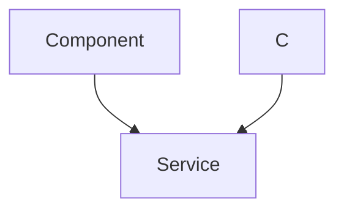
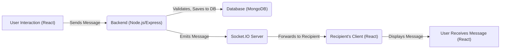

# Real-time Communication

This document details the implementation of real-time messaging functionality within the Chat-App-MERN application, utilizing WebSockets for instantaneous communication.

## Features

-   **Instant Messaging:** Users can send and receive text and image messages in real-time.
-   **Online Status:**  The application indicates which users are currently online.
-   **User-Specific Messaging:** Messages are routed directly between sender and receiver.

## Technical Stack

| Technology    | Purpose                                     |
| :------------ | :------------------------------------------ |
| Socket.IO     | Real-time, bidirectional communication      |
| Node.js       | Backend runtime environment                 |
| Express.js    | Web application framework for Node.js       |
| MongoDB       | Database for storing messages and user data |
| React         | Frontend framework                           |
| Cloudinary    | Cloud image storage and delivery           |

## Implementation Details

The real-time communication is primarily handled by Socket.IO on the backend, facilitating message exchange between connected clients. The `backend/src/lib/socket.js` file is central to this functionality.

```javascript title="backend/src/lib/socket.js"
import { Server } from "socket.io";
import http from "http";
import express from "express";

const app = express();
const server = http.createServer(app);

const io = new Server(server, {
    cors: {
        origin: ["http://localhost:5173"]
    }
})

export function getReceiverSocketId(userId) {
    return userSocketMap[userId];
}

const userSocketMap = {}; //{userId : socketId}

io.on("connection", (socket) => {
    console.log("A user connected", socket.id);

    const userId = socket.handshake.query.userId;
    if(userId) userSocketMap[userId] = socket.id;

    io.emit("getOnlineUsers", Object.keys(userSocketMap));

    socket.on("disconnect", ()=>{
        console.log("A user disconnected", socket.id);
        delete userSocketMap[userId];
        io.emit("getOnlineUsers", Object.keys(userSocketMap));
    })
})

export { io, app, server };
```

[View on GitHub](https://github.com/shinymack/Chat-App-MERN/blob/main/backend/src/lib/socket.js)

This snippet initializes the Socket.IO server, configures CORS for the frontend origin, and manages user connections and disconnections. The `userSocketMap` object stores the mapping between user IDs and their corresponding socket IDs, enabling direct message routing.  The `getReceiverSocketId` function retrieves a socket ID for a given userId.

### Message Handling

The `backend/src/controllers/message.controller.js` file contains the logic for sending, receiving, and retrieving messages.

```javascript title="backend/src/controllers/message.controller.js"
import User from "../models/user.model.js";
import Message from "../models/message.model.js";
import cloudinary from "../lib/cloudinary.js";
import { getReceiverSocketId, io } from "../lib/socket.js";

export const sendMessage = async (req, res) => {
    try {
        const { text, image } = req.body;
        const { id: receiverId } = req.params;
        const senderId = req.user._id;

        let imageUrl;
        if (image) {
            const uploadResponse = await cloudinary.uploader.upload(image);

            imageUrl = uploadResponse.secure_url;
        }
        const newMessage = new Message({
            senderId,
            receiverId,
            text,
            image: imageUrl,
        });

        await newMessage.save();

        const receiverSocketId = getReceiverSocketId(receiverId);

        if(receiverSocketId) {
            io.to(receiverSocketId).emit("newMessage", newMessage);
        }

        res.status(201).json(newMessage);
    } catch (error) {
        console.log("Error in sendMessage controller:  ", error);
        res.status(500).json({ error: "Internal Server Error" });
    }
};
```

[View on GitHub](https://github.com/shinymack/Chat-App-MERN/blob/main/backend/src/controllers/message.controller.js)

The `sendMessage` function handles the process of creating and sending messages. It retrieves the message content and receiver ID from the request, uploads the image to Cloudinary if present, and saves the message to the database using the `Message` model. It then retrieves the receiver's socket ID and emits a "newMessage" event to the receiver, enabling real-time delivery.

### Message Model

The `backend/src/models/message.model.js` defines the structure of a message document in MongoDB.

```javascript title="backend/src/models/message.model.js"
import express from "express";
import mongoose from "mongoose";

const messageSchema = new mongoose.Schema(
    {
     senderId: {
        type: mongoose.Schema.Types.ObjectId,
        ref: "User",
        required: true,
     },
     receiverId: {
        type: mongoose.Schema.Types.ObjectId,
        ref: "User",
        required: true,
     },
     text: {
        type: String,
     },
     image: {
        type: String,
     },
    },
    {timestamps: true}
);

export default mongoose.model("Message", messageSchema);
```

[View on GitHub](https://github.com/shinymack/Chat-App-MERN/blob/main/backend/src/models/message.model.js)

The `messageSchema` includes fields for the sender ID, receiver ID, text content, and image URL. It also includes timestamps for creation and update times.

### Retrieving Messages

```javascript title="backend/src/controllers/message.controller.js"
export const getMessages = async (req, res) => {
    try {
        const {id : userToChatId } = req.params;
        const myId = req.user._id;

        const messages = await Message.find({
            $or: [
                {senderId: myId, receiverId:userToChatId},
                {senderId: userToChatId, receiverId: myId}
            ]
        });
        res.status(200).json(messages);
    } catch (error) {
        console.log("Error in getMessages controller:  ", error);
        res.status(500).json({ error: "Internal Server Error" });
    }
};
```

[View on GitHub](https://github.com/shinymack/Chat-App-MERN/blob/main/backend/src/controllers/message.controller.js)

This function, `getMessages`, retrieves messages between two users. It uses the `$or` operator to find messages where either the sender is the current user and the receiver is the target user, or vice versa.

### Getting Users for Sidebar

```javascript title="backend/src/controllers/message.controller.js"
export const getUsersForSidebar = async (req, res) => {
    try {
        const loggedInUserId = req.user._id;
        const filteredUsers = await User.find({
            _id: { $ne: loggedInUserId }}).select("-password");  
        res.status(200).json(filteredUsers);
    }
    catch (error) {
        console.log("Error in getUsersForSidebar: ", error);
        res.status(500).json({ error: "Internal Server Error" });
    }
};
```

[View on GitHub](https://github.com/shinymack/Chat-App-MERN/blob/main/backend/src/controllers/message.controller.js)

This function retrieves all users except the logged-in user to display in the sidebar for starting new chats. It uses `select("-password")` to exclude the password field from the results.

## Sequence Diagram





## Key Integration Points

-   **Socket.IO Integration:** The Socket.IO library is used for real-time communication between the client and server. The server listens for new connections and manages the mapping of user IDs to socket IDs. When a new message is sent, the server emits the message to the recipient's socket, ensuring that the message is delivered in real time.
-   **Message Persistence:** Messages are stored in a MongoDB database using the `Message` model. This ensures that messages are persistent and can be retrieved later.
-   **User Authentication:** The application uses middleware to authenticate users before allowing them to access the messaging functionality. This ensures that only authenticated users can send and receive messages.

## Best Practices

-   **Error Handling:**  Implement robust error handling to catch and log any errors that occur during the message sending or receiving process.
-   **Scalability:** Consider using a message queue or other scaling solutions to handle a large volume of messages.
-   **Security:**  Implement appropriate security measures to protect against unauthorized access to messages. This may include encryption and access controls.





```javascript title="backend/src/lib/socket.js"
io.on("connection", (socket) => {
    const userId = socket.handshake.query.userId; // Access userId from query parameters
    if (userId) {
        userSocketMap[userId] = socket.id; // Map userId to socketId
        console.log(`User ${userId} connected with socket ID: ${socket.id}`);
    }
});
```
[View on GitHub](https://github.com/shinymack/Chat-App-MERN/blob/main/backend/src/lib/socket.js)
This snippet demonstrates how the backend extracts the userId from the socket connection's query parameters and maps it to the socket.id. This mapping is critical for directing messages to the correct recipient.
```javascript title="Example of sending a message using Socket.IO in React"
import io from 'socket.io-client';

const socket = io('http://localhost:4000', {
  query: {
    userId: currentUserId, // Pass the user ID during connection
  },
});

socket.emit('sendMessage', {
  senderId: currentUserId,
  receiverId: selectedUserId,
  text: messageText,
});
```
This is a conceptual example of how to incorporate Socket.IO into the React application. The important part to notice here is how the user ID is sent during the connection phase in the query parameters.