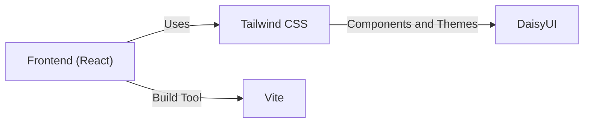
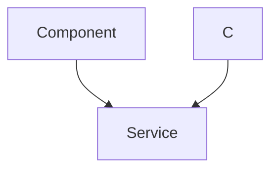

# Utilities and Configuration

This section details the utility functions and configuration files used in the Chat-App-MERN project. It provides insights into how these components contribute to the overall functionality and maintainability of the application.

## Backend Utilities

The backend utilizes utility functions primarily for handling JSON Web Tokens (JWT) for authentication and authorization.

### `backend/src/lib/utils.js`

This file contains the `generateToken` function, which is responsible for creating and setting JWTs.

```javascript
// File: backend/src/lib/utils.js
import jwt from 'jsonwebtoken';

export const generateToken = (userId, res) => {
    const token = jwt.sign({userId}, process.env.JWT_SECRET, 
        {expiresIn: "7d"});

    res.cookie("jwt", token, {
        maxAge: 7 * 24 * 60 * 60 * 1000, 
        httpOnly: true,
        sameSite: "strict",
        secure: process.env.NODE_ENV !== "development",
    });
    return token;
};
```

**Explanation:**

1.  **Import `jsonwebtoken`:** Imports the `jsonwebtoken` library for JWT operations.
2.  **`generateToken(userId, res)`:** This function takes the `userId` and the response object `res` as input.
3.  **`jwt.sign()`:**  Creates a JWT containing the `userId` as the payload.  It uses `process.env.JWT_SECRET` for signing and sets an expiration time of 7 days.  It's crucial to ensure that `JWT_SECRET` is set in your environment variables.
4.  **`res.cookie()`:** Sets the JWT as an HTTP-only cookie named "jwt" in the response. The cookie is configured with:
    *   `maxAge`: 7 days.
    *   `httpOnly`:  Makes the cookie inaccessible to client-side JavaScript, mitigating XSS attacks.
    *   `sameSite`: Set to "strict" for better CSRF protection.
    *   `secure`:  Ensures the cookie is only sent over HTTPS in non-development environments.

[View on GitHub](https://github.com/shinymack/Chat-App-MERN/blob/main/backend/src/lib/utils.js)

## Frontend Utilities

The frontend uses utility functions for tasks such as formatting dates and times.

### `frontend/src/lib/utils.js`

This file includes `formatMessageTime`, which converts a date object into a human-readable time format.

```javascript
// File: frontend/src/lib/utils.js
export function formatMessageTime(date) {
    return new Date(date).toLocaleTimeString("en-US", {
        year: "numeric",
        month: "short",
        day:"2-digit",
        hour: "2-digit",
        minute: "2-digit",
        hour12: true,
    });
}
```

**Explanation:**

1.  **`formatMessageTime(date)`:**  Takes a `date` object as input.
2.  **`new Date(date)`:** Creates a new `Date` object from the input.
3.  **`toLocaleTimeString()`:** Formats the date into a string according to the "en-US" locale, including the year, month, day, hour, and minute.  `hour12: true` specifies a 12-hour time format.

[View on GitHub](https://github.com/shinymack/Chat-App-MERN/blob/main/frontend/src/lib/utils.js)

## Frontend Configuration

The frontend configuration primarily involves setting up Tailwind CSS with DaisyUI and configuring the Vite build tool.

### `frontend/tailwind.config.js`

This file configures Tailwind CSS and DaisyUI for styling the frontend components.

```javascript
// File: frontend/tailwind.config.js
import daisyui from "daisyui"

/** @type {import('tailwindcss').Config} */
export default {
  content: [
    "./index.html",
    "./src/**/*.{js,ts,jsx,tsx}",
  ],
  theme: {
    extend: {
      fontFamily : {
        chivo : ['Chivo', 'sans-serif'],
      }
    },
  },
  plugins: [daisyui],
  daisyui : {
 themes: [
      "light",
      "dark",
      "cupcake",
      "bumblebee",
      "emerald",
      "corporate",
      "synthwave",
      "retro",
      "cyberpunk",
      "valentine",
      "halloween",
      "garden",
      "forest",
      "aqua",
      "lofi",
      "pastel",
      "fantasy",
      "wireframe",
      "black",
      "luxury",
      "dracula",
      "cmyk",
      "autumn",
      "business",
      "acid",
      "lemonade",
      "night",
      "coffee",
      "winter",
      "dim",
      "nord",
      "sunset",
    ],
  }
}
```

**Explanation:**

1.  **`content`:** Specifies the files to be scanned for Tailwind CSS classes.
2.  **`theme.extend`:** Extends the default Tailwind CSS theme. Here, it defines a custom font family "chivo".
3.  **`plugins`:**  Includes the DaisyUI plugin for pre-built components and themes.
4.  **`daisyui.themes`:** Configures the DaisyUI themes available in the application.  This provides a variety of visual styles that can be easily applied.

[View on GitHub](https://github.com/shinymack/Chat-App-MERN/blob/main/frontend/tailwind.config.js)

### `frontend/vite.config.js`

This file configures the Vite build tool for the React frontend.

```javascript
// File: frontend/vite.config.js
import { defineConfig } from 'vite'
import react from '@vitejs/plugin-react'

// https://vite.dev/config/
export default defineConfig({
  plugins: [react()],
})
```

**Explanation:**

1.  **`defineConfig`:**  Defines the Vite configuration.
2.  **`plugins`:** Uses the `@vitejs/plugin-react` plugin to enable React support.

[View on GitHub](https://github.com/shinymack/Chat-App-MERN/blob/main/frontend/vite.config.js)





## Environment Variables

The backend relies on environment variables for sensitive information like the JWT secret.

**Important:** Never hardcode sensitive information in your code. Always use environment variables.

Example `.env` file (backend):

```plaintext
JWT_SECRET=your-super-secret-key
NODE_ENV=development
```

**Explanation:**

*   `JWT_SECRET`: The secret key used to sign JWTs.  This should be a strong, randomly generated string.
*   `NODE_ENV`:  Indicates the environment (development, production, etc.). This is used to configure environment-specific behavior, such as cookie security settings.

## Key Integration Points

*   **Authentication Flow:**  The `generateToken` function in the backend is a crucial part of the authentication process.  After a user successfully logs in, this function is called to create a JWT and set it as a cookie.  The frontend then uses this cookie to authenticate subsequent requests.

*   **Date Formatting:** The `formatMessageTime` function in the frontend ensures that all timestamps are displayed in a consistent and user-friendly format. This improves the overall user experience.

*   **Styling:** Tailwind CSS, configured through `tailwind.config.js`, provides a utility-first approach to styling the frontend. DaisyUI adds pre-built components and themes, further accelerating the development process.

*   **Build Process:** Vite, configured through `vite.config.js`, is a fast and efficient build tool that optimizes the frontend code for production.





## Best Practices

*   **Secure JWTs:** Always use strong, randomly generated secrets for signing JWTs. Store these secrets securely and never commit them to your codebase.
*   **Use Environment Variables:**  Avoid hardcoding sensitive information in your code.  Use environment variables to configure your application based on the environment.
*   **Keep Dependencies Up-to-Date:** Regularly update your dependencies to benefit from bug fixes, security patches, and performance improvements.
*   **Consistent Formatting:**  Use a code formatter like Prettier to ensure consistent code formatting throughout your project. This improves readability and maintainability.
```