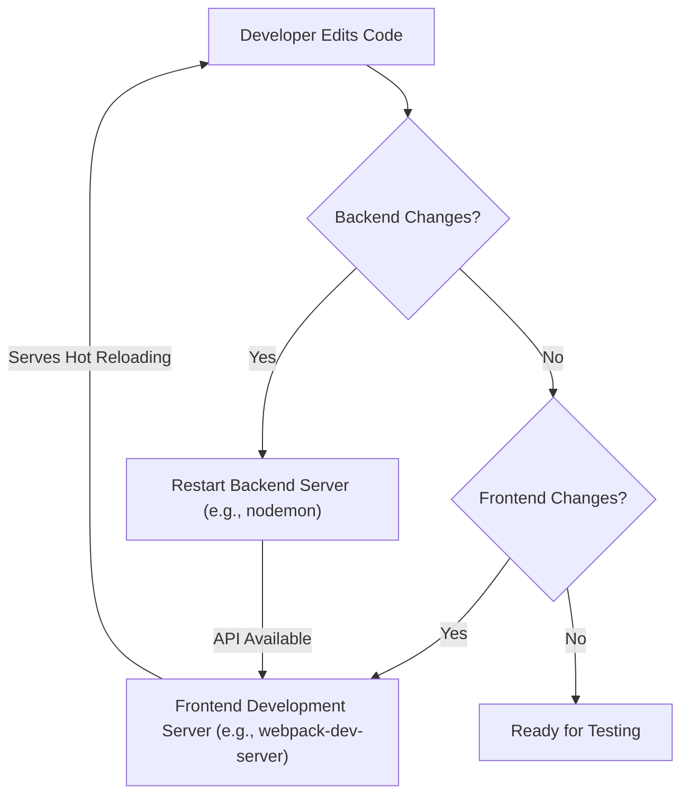

 
---
title: "System Overview"
description: "A high-level introduction to the Chat-App-MERN project, its purpose, and core technologies."
sidebar_position: 1
---

# System Overview

Welcome to the documentation for the Chat-App-MERN project! This document serves as a foundational guide, providing a high-level introduction to the application, its core purpose, and the technologies that power it. Built on the robust MERN (MongoDB, Express.js, React, Node.js) stack, this project exemplifies a modern full-stack web application designed for real-time communication.

The primary goal of this system is to provide a platform for users to engage in instant messaging, facilitating dynamic interactions through a responsive user interface and a scalable backend. This section will walk you through the architectural design, key components, and how the various parts of the MERN stack integrate to deliver a seamless chat experience.

## Project Purpose

The Chat-App-MERN is developed as a comprehensive example of a real-time messaging application. Its core purpose revolves around:

*   **Real-time Communication:** Enabling instant message exchange between users, typically involving WebSocket technologies for persistent, low-latency connections.
*   **User Authentication and Authorization:** Securing user accounts and ensuring that only authorized users can access specific chat functionalities and data.
*   **Scalable Architecture:** Designed with the MERN stack's inherent capabilities for handling concurrent users and growing data volumes.
*   **Modern Web Development Practices:** Showcasing best practices in full-stack development, including component-based UI with React, RESTful APIs with Express/Node, and NoSQL data management with MongoDB.

The project takes inspiration from tutorials, aiming to provide a practical learning and development reference for MERN stack enthusiasts.

## Core Technologies

The application leverages the power of the MERN stack, a popular choice for building dynamic web applications. Each component plays a critical role:

*   **MongoDB:** A NoSQL database that stores all application data, including user profiles, messages, and chat room information. Its document-oriented nature allows for flexible schema design, well-suited for evolving application needs.
*   **Express.js:** A minimal and flexible Node.js web application framework that provides a robust set of features for web and mobile applications. It handles routing, middleware, and API endpoints for the backend.
*   **React:** A JavaScript library for building user interfaces. It enables the creation of complex UIs from small, isolated pieces of code called "components," leading to highly interactive and responsive frontends.
*   **Node.js:** A JavaScript runtime built on Chrome's V8 JavaScript engine. It allows for server-side execution of JavaScript, making it possible to use a single language across the entire application stack.

Beyond the core MERN components, real-time functionality is typically achieved using libraries like **Socket.IO** (on both frontend and backend), which provides WebSocket-based communication.

## System Architecture

The Chat-App-MERN follows a standard client-server architecture, typical of most web applications, with distinct frontend and backend components communicating over network protocols.

### Architectural Overview


```mermaid
graph TD
    A["Client (Browser)"] -->| "HTTP/HTTPS (Initial Load, API Calls)" | B["Load Balancer/CDN (Optional)"]
    B --> C["Frontend (React App)"]
    C -->| "HTTP/HTTPS (API Requests)" | D["Backend (Node.js/Express.js)"]
    D -->| "Read/Write Operations" | E["Database (MongoDB)"]
    C <-->| "WebSocket (Real-time Messaging)" | D
```


This diagram illustrates the primary data flow and interaction points:

*   **Client (Browser):** The user's web browser, which requests the React application.
*   **Frontend (React App):** The user interface built with React, responsible for rendering components, managing state, and interacting with the backend.
*   **Backend (Node.js/Express.js):** The server-side application that exposes RESTful APIs, handles business logic, authenticates users, and manages real-time communication via WebSockets.
*   **Database (MongoDB):** The persistent storage for all application data.

## Project Structure and Dependencies

The project is typically structured into separate `frontend` and `backend` directories, each with its own set of dependencies managed by `npm`.

### Core Project Files

The `package.json` file in the root directory acts as a manifest for the entire project, defining scripts for building and starting the application.

```json
{
  "name": "chatapp",
  "version": "1.0.0",
  "main": "index.js",
  "scripts": {
    "build": "npm install --prefix backend && npm install --prefix frontend && npm run build --prefix frontend",
    "start": "npm run start --prefix backend"
  },
  "keywords": [],
  "author": "",
  "license": "ISC",
  "description": ""
}
```
<small>[View on GitHub - package.json](https://github.com/shinymack/Chat-App-MERN/blob/main/package.json)</small>

*   The `build` script automates the installation of dependencies for both `backend` and `frontend`, and then builds the React application.
*   The `start` script initiates the backend server, making the API available.

The `package-lock.json` ensures consistent dependency installations across different environments.

```json
{
  "name": "chatapp",
  "version": "1.0.0",
  "lockfileVersion": 3,
  "requires": true,
  "packages": {
    "": {
      "name": "chatapp",
      "version": "1.0.0",
      "license": "ISC"
    }
  }
}
```
<small>[View on GitHub - package-lock.json](https://github.com/shinymack/Chat-App-MERN/blob/main/package-lock.json)</small>

This file precisely records the versions of all dependencies, preventing potential issues with differing dependency trees.

## Build and Run Process

The development and deployment workflow for the Chat-App-MERN is streamlined through NPM scripts defined in the root `package.json`.

### Building the Application

The `build` script is crucial for preparing the application for production or local development:

```bash
npm install --prefix backend && npm install --prefix frontend && npm run build --prefix frontend
```
<small>[View on GitHub - package.json (build script)](https://github.com/shinymack/Chat-App-MERN/blob/main/package.json#L7)</small>

This command performs three key actions:
1.  `npm install --prefix backend`: Installs all necessary Node.js packages for the backend server.
2.  `npm install --prefix frontend`: Installs all necessary React packages for the frontend application.
3.  `npm run build --prefix frontend`: Executes the build process for the React application, typically compiling JSX, TypeScript (if used), and Sass/CSS into static HTML, CSS, and JavaScript files that can be served.

### Starting the Application

Once built, the application can be started using the `start` script:

```bash
npm run start --prefix backend
```
<small>[View on GitHub - package.json (start script)](https://github.com/shinymack/Chat-App-MERN/blob/main/package.json#L8)</small>

This command specifically starts the Node.js Express server. In a production environment, this server would often be configured to serve the static frontend assets as well, or the frontend assets would be served by a separate web server (like Nginx) or CDN.

### Conceptual Development Workflow





This workflow illustrates how a developer might typically interact with the MERN stack during active development, using tools like `nodemon` for automatic backend restarts and a development server for the frontend to enable hot-reloading.

## Key Integration Points

The efficiency and responsiveness of the Chat-App-MERN hinge on seamless integration between its components.

*   **API Endpoints (Frontend ↔ Backend):**
    The React frontend communicates with the Express.js backend primarily through RESTful API calls. These endpoints handle user authentication (login, registration), fetching chat history, user profiles, and other static data requests. For example, a user attempting to log in would send credentials to `/api/auth/login` on the backend.
*   **WebSockets (Frontend ↔ Backend for Real-time):**
    For real-time features like sending and receiving messages instantly, a WebSocket connection (often managed by Socket.IO) is established. Once authenticated, the frontend opens a persistent WebSocket connection to the backend. Messages sent by one user are broadcast through the backend's WebSocket server to all relevant connected clients in real-time.
*   **Database Interactions (Backend ↔ MongoDB):**
    The Express.js backend acts as the sole intermediary for all data persistence. It performs CRUD (Create, Read, Update, Delete) operations on the MongoDB database based on requests received from the frontend. This separation ensures data integrity and security, as the frontend never directly accesses the database.
*   **Environment Variables:**
    Both frontend and backend applications utilize environment variables (e.g., `.env` files) to manage configurations like database connection strings, API keys, and server ports. This is critical for security and flexibility across different deployment environments.

By adhering to these well-defined integration points, the Chat-App-MERN maintains a clear separation of concerns, enabling independent development and scaling of each layer while ensuring cohesive operation.

---

Next: [Backend Architecture](./2_backend-architecture.mdx)
```