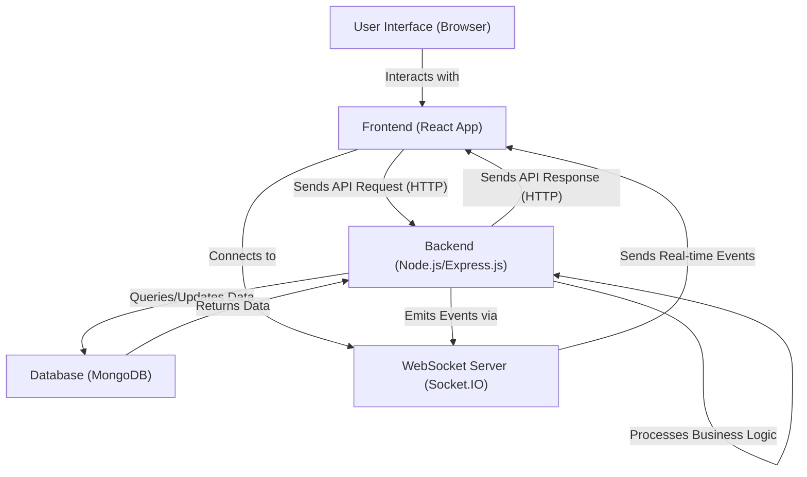

# System Overview

This document provides a high-level introduction to the MERN Chat Application, outlining its purpose, core functionalities, and the foundational technologies employed. It serves as an entry point for understanding the system's architecture before delving into more specific components.

## Purpose and Vision

The MERN Chat Application is designed to provide a real-time communication platform, leveraging the robust capabilities of the MERN stack (MongoDB, Express.js, React, Node.js). Its primary goal is to demonstrate a full-stack application capable of handling user authentication, managing persistent chat rooms, and facilitating instant message exchange.

While the provided `README.md` is minimal, the typical vision for such an application includes:
*   **Real-time Messaging:** Instantaneous delivery of messages between users.
*   **User Authentication:** Secure user registration and login mechanisms.
*   **Chat Rooms/Conversations:** Ability to create or join distinct communication channels.
*   **Scalability (potential):** Designed with considerations for handling a growing number of users and messages.

The project credits a tutorial, indicating its educational and demonstrative nature.
[View main `README.md` on GitHub](https://github.com/shinymack/Chat-App-MERN/blob/main/README.md)

## Core Functionalities

Based on typical MERN chat applications and the initial structure, the core functionalities would include:

*   **User Management:**
    *   User registration and login.
    *   Session management to maintain user state.
*   **Messaging:**
    *   Sending and receiving text messages in real-time.
    *   Displaying chat history.
*   **Chat Room/Conversation Management:**
    *   Creating new chat rooms or initiating direct messages.
    *   Listing available chat rooms/conversations.

## Technology Stack

The MERN Chat Application is built upon the popular MERN stack, offering a JavaScript-centric, full-stack development experience.

| Layer       | Technology  | Purpose                                   |
| :---------- | :---------- | :---------------------------------------- |
| **Frontend**| React       | User interface and interaction.           |
| **Backend** | Node.js     | Server-side logic and API.                |
|             | Express.js  | Web application framework for Node.js.    |
| **Database**| MongoDB     | NoSQL database for storing user data, messages, etc. |
| **Build Tool**| Vite       | Frontend build tool for fast development. |

The frontend explicitly leverages `React + Vite` as detailed in its `frontend/README.md`:

```md
# React + Vite

This template provides a minimal setup to get React working in Vite with HMR and some ESLint rules.

Currently, two official plugins are available:

- [@vitejs/plugin-react](https://github.com/vitejs/vite-plugin-react/blob/main/packages/vite-plugin-react/README.md) uses [Babel](https://babeljs.io/) for Fast Refresh
- [@vitejs/plugin-react-swc](https://github.com/vitejs/vite-plugin-react-swc) uses [SWC](https://swc.rs/) for Fast Refresh
```
[View `frontend/README.md` on GitHub](https://github.com/shinymack/Chat-App-MERN/blob/main/frontend/README.md)

## High-Level System Architecture

The MERN Chat Application follows a client-server architecture, typical for web applications. The frontend (client) communicates with the backend (server) to manage data and facilitate real-time interactions, with MongoDB serving as the persistent data store.


```mermaid
graph TD
    A["Client (React App)"] -->|"HTTP/WebSocket Requests"| B["Server (Node.js/Express.js)"];
    B -->|"CRUD Operations"| C["Database (MongoDB)"];
    A --.->|"Real-time Updates via WebSockets"| B;
```


*   **Client (React App):** The user-facing part, running in a web browser. It handles rendering the UI, user input, and making requests to the backend.
*   **Server (Node.js/Express.js):** The application's core logic. It manages API endpoints, handles business logic, authenticates users, and interacts with the database. For real-time functionality, it would typically utilize a WebSocket library (like Socket.IO) built on Node.js.
*   **Database (MongoDB):** Stores all application data, including user profiles, chat messages, and chat room information.

## Project Structure Overview

The project is structured as a monorepo or a multi-package repository, commonly dividing the frontend and backend into separate directories. This separation allows for independent development, deployment, and management of each component.

The top-level `package.json` coordinates the build and start scripts for both parts of the application.

```json title="package.json"
{
  "name": "chatapp",
  "version": "1.0.0",
  "main": "index.js",
  "scripts": {
    "build" : "npm install --prefix backend && npm install --prefix frontend && npm run build --prefix frontend",
    "start" : "npm run start --prefix backend"
  },
  "keywords": [],
  "author": "",
  "license": "ISC",
  "description": ""
}
```
[View `package.json` on GitHub](https://github.com/shinymack/Chat-App-MERN/blob/main/package.json)

The `scripts` section is particularly informative:
*   `"build"`: This script first installs dependencies for both `backend` and `frontend` directories, and then runs the `build` script specifically for the `frontend`. This indicates that the frontend is a separate distributable artifact.
    ```bash
    npm install --prefix backend && npm install --prefix frontend && npm run build --prefix frontend
    ```
*   `"start"`: This script directly invokes the `start` script within the `backend` directory. This suggests the backend is the primary entry point for running the server.
    ```bash
    npm run start --prefix backend
    ```

The `package-lock.json` at the root level manages the top-level dependencies, which in this case are minimal as most project-specific dependencies reside within the `backend` and `frontend` sub-directories.

```json title="package-lock.json"
{
  "name": "chatapp",
  "version": "1.0.0",
  "lockfileVersion": 3,
  "requires": true,
  "packages": {
    "": {
      "name": "chatapp",
      "version": "1.0.0",
      "license": "ISC"
    }
  }
}
```
[View `package-lock.json` on GitHub](https://github.com/shinymack/Chat-App-MERN/blob/main/package-lock.json)

## Key Integration Points

Understanding the interaction flow between the client and server is crucial. This MERN application primarily integrates via RESTful API calls for data management and likely WebSockets for real-time communication.





*   **HTTP/REST API:** The primary mechanism for the frontend to request and submit data to the backend (e.g., user authentication, fetching chat history, creating rooms).
*   **WebSockets:** Essential for real-time features like instant message delivery, user presence updates, and typing indicators. The frontend establishes a persistent WebSocket connection with the server to receive updates without constant polling.
*   **Database Interaction:** The backend is solely responsible for interacting with MongoDB, abstracting database operations from the frontend.

This separation of concerns ensures a maintainable and scalable architecture, where frontend and backend teams can work relatively independently, communicating through well-defined APIs.

Next: [Backend Architecture and API](./2_backend-architecture-and-api.mdx)