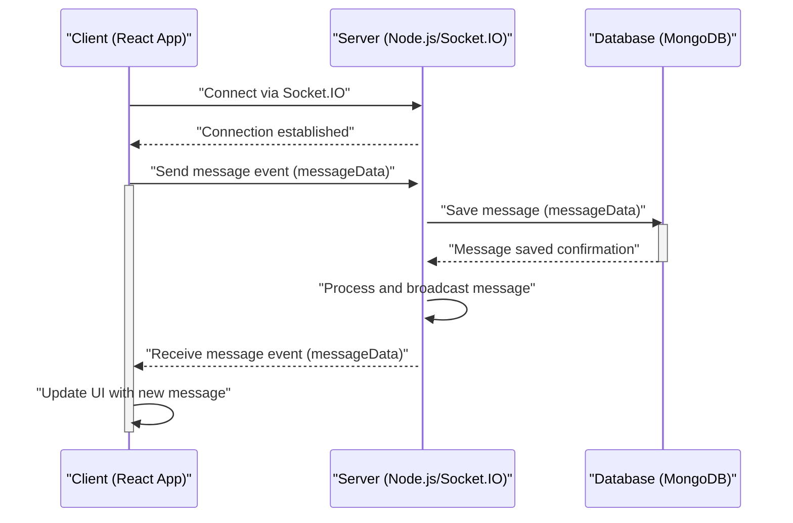

 # System Overview

The Chat-App-MERN project is a full-stack, real-time chat application built using the MERN (MongoDB, Express.js, React, Node.js) stack. It provides users with a platform to communicate instantly, featuring user authentication, direct messaging, and group chat capabilities. This document serves as a high-level overview, introducing the project's purpose, core technologies, and overall architecture.

At its core, the application aims to demonstrate a modern, scalable approach to building interactive web applications, leveraging a robust backend for data management and real-time communication, and a dynamic frontend for a rich user experience.

## Project Purpose and Features

The primary purpose of the Chat-App-MERN is to provide a comprehensive example of a real-time messaging platform. It incorporates several key features essential for a modern chat application:

*   **User Authentication**: Secure user registration and login, including social login (Google OAuth).
*   **Direct Messaging**: One-on-one private conversations between users.
*   **Group Chats**: Ability to create and participate in multi-user group conversations.
*   **Real-time Communication**: Instant message delivery and updates using WebSockets.
*   **Profile Management**: Users can manage their profiles, including avatars.
*   **Responsive Design**: A user-friendly interface accessible across various devices.

The project structure is organized into distinct frontend and backend components, managed by a root `package.json` for streamlined build and deployment processes.

## Core Technologies and Stack

The Chat-App-MERN project leverages a powerful combination of technologies, forming a classic MERN stack with additional supporting libraries for enhanced functionality and development experience.

### Backend Technologies (Node.js & Express.js)

The backend is built with Node.js and the Express.js framework, providing a robust API layer and handling real-time communication. Key technologies include:

*   **Node.js**: JavaScript runtime environment.
*   **Express.js**: Fast, unopinionated, minimalist web framework for Node.js.
*   **MongoDB**: NoSQL database for storing user data, messages, and chat information.
*   **Mongoose**: ODM (Object Data Modeling) library for MongoDB and Node.js.
*   **Socket.IO**: Library for real-time, bidirectional, event-based communication.
*   **JWT (JSON Web Tokens)**: For secure user authentication and authorization.
*   **Bcrypt.js**: For hashing passwords securely.
*   **Cloudinary**: Cloud-based image and video management service for user avatars.
*   **Cookie-parser**: Middleware for parsing cookie headers.
*   **Dotenv**: Loads environment variables from a `.env` file.
*   **Passport.js & Passport-Google-OAuth20**: For handling authentication strategies, including Google OAuth.

Here's a snippet from the `backend/package.json` showing some of the core dependencies:

```json
{
  "name": "backend",
  "version": "1.0.0",
  "main": "src/index.js",
  "scripts": {
    "dev": "nodemon src/index.js",
    "start": "node src/index.js"
  },
  "dependencies": {
    "bcryptjs": "^2.4.3",
    "cloudinary": "^2.5.1",
    "cookie-parser": "^1.4.7",
    "dotenv": "^16.4.7",
    "express": "^4.21.2",
    "express-session": "^1.18.1",
    "jsonwebtoken": "^9.0.2",
    "mongoose": "^8.9.5",
    "passport": "^0.7.0",
    "passport-google-oauth20": "^2.0.0",
    "socket.io": "^4.8.1"
  },
  "devDependencies": {
    "nodemon": "^3.1.9"
  }
}
```

[View backend/package.json on GitHub](https://github.com/shinymack/Chat-App-MERN/blob/main/backend/package.json)

### Frontend Technologies (React & Vite)

The frontend is a Single Page Application (SPA) built with React, leveraging Vite for a fast development experience. It focuses on delivering a responsive and interactive user interface. Key technologies include:

*   **React**: A JavaScript library for building user interfaces.
*   **Vite**: A fast build tool that provides a lightning-fast development experience.
*   **Axios**: Promise-based HTTP client for making API requests to the backend.
*   **React Router DOM**: Declarative routing for React.
*   **Socket.IO Client**: Client-side library for real-time communication with the backend.
*   **Zustand**: A small, fast, and scalable bearbones state-management solution for React.
*   **TailwindCSS**: A utility-first CSS framework for rapidly building custom designs.
*   **DaisyUI**: A Tailwind CSS component library.
*   **React Hot Toast**: A customizable and lightweight notification library.
*   **Lucide React & React Icons**: Icon libraries for UI elements.

Below is a snippet from the `frontend/package.json` illustrating the primary frontend dependencies:

```json
{
  "name": "frontend",
  "private": true,
  "version": "0.0.0",
  "type": "module",
  "scripts": {
    "dev": "vite",
    "build": "vite build",
    "lint": "eslint .",
    "preview": "vite preview",
    "mobile": "vite --host"
  },
  "dependencies": {
    "axios": "^1.7.9",
    "cors": "^2.8.5",
    "lucide-react": "^0.471.1",
    "react": "^18.3.1",
    "react-dom": "^18.3.1",
    "react-hot-toast": "^2.5.1",
    "react-icons": "^5.5.0",
    "react-router-dom": "^7.1.1",
    "socket.io-client": "^4.8.1",
    "zustand": "^5.0.3"
  },
  "devDependencies": {
    "@vitejs/plugin-react": "^4.3.4",
    "autoprefixer": "^10.4.20",
    "daisyui": "^4.12.23",
    "postcss": "^8.5.0",
    "tailwindcss": "^3.4.17",
    "vite": "^6.3.5"
  }
}
```

[View frontend/package.json on GitHub](https://github.com/shinymack/Chat-App-MERN/blob/main/frontend/package.json)

### Project Orchestration

The root `package.json` file simplifies the build and start processes for the entire monorepo-style project.

```json
{
  "name": "chatapp",
  "version": "1.0.0",
  "main": "index.js",
  "scripts": {
    "build" : "npm install --prefix backend && npm install --prefix frontend && npm run build --prefix frontend",
    "start" : "npm run start --prefix backend"
  },
  "keywords": [],
  "author": "",
  "license": "ISC",
  "description": ""
}
```

[View package.json on GitHub](https://github.com/shinymack/Chat-App-MERN/blob/main/package.json)

The `build` script ensures all dependencies for both frontend and backend are installed, and then triggers the frontend's build process. The `start` script initiates the backend server.

## High-Level Architecture

The Chat-App-MERN follows a client-server architecture, where the React frontend acts as the client and the Node.js/Express backend serves as the API and WebSocket server. MongoDB is used as the persistent data store.


```mermaid
graph TD
    User["User Interface (Browser)"] -->|HTTP/S Requests| Frontend["Frontend (React.js)"];
    Frontend -->|API Calls (Axios)| Backend["Backend (Node.js/Express.js)"];
    Frontend -- "Real-time Events (Socket.IO)" --> Backend;
    Backend -->|Data Access (Mongoose)| MongoDB["Database (MongoDB)"];
    Backend -->|File Uploads| Cloudinary["Cloud Storage (Cloudinary)"];
    User -- "Authenticates via" --> GoogleOAuth["Google OAuth"];
    GoogleOAuth --> Backend;
```


**Explanation:**
*   **User Interface (User)**: The end-user interacts with the application through their web browser.
*   **Frontend (React.js)**: The client-side application built with React handles rendering, user interaction, and state management (Zustand). It communicates with the backend via HTTP requests for data and real-time events through WebSockets.
*   **Backend (Node.js/Express.js)**: The server-side application built with Node.js and Express.js manages API endpoints, authentication, business logic, and real-time communication. It serves as the bridge between the frontend and the database.
*   **Database (MongoDB)**: The NoSQL database stores all application data, including user profiles, chat messages, and chat room information. Mongoose facilitates interaction with MongoDB.
*   **Cloud Storage (Cloudinary)**: Utilized for storing media files, primarily user avatars, reducing the load on the main server.
*   **Google OAuth**: An external service for simplified user authentication, integrated via Passport.js.

## Real-time Communication Flow

A critical aspect of a chat application is real-time messaging. Socket.IO is the chosen technology for this, enabling instant message delivery without requiring the client to constantly poll the server for updates.





**Explanation:**
1.  **Client Connects**: The React frontend establishes a persistent WebSocket connection with the Node.js backend using Socket.IO-client.
2.  **Send Message**: When a user sends a message, the client emits a `sendMessage` event with the message data to the server.
3.  **Server Processes & Saves**: The server receives the event, saves the message to MongoDB, and then processes it for broadcasting.
4.  **Broadcast**: The server broadcasts the `receiveMessage` event with the new message data to all relevant connected clients (e.g., all participants in a chat room or the recipient of a direct message).
5.  **Client Updates UI**: Clients receiving the `receiveMessage` event update their UI to display the new message instantly.

## Key Integration Points

*   **Authentication Flow**: Users log in via a REST API endpoint. Upon successful authentication, a JSON Web Token (JWT) is issued and stored securely (e.g., in HTTP-only cookies). This JWT is then used for subsequent authenticated API requests. Google OAuth integrates with Passport.js on the backend to provide an alternative login mechanism.
*   **API & Real-time Sync**: The application uses a hybrid approach. Initial data fetches (e.g., loading chat history, user lists) are typically handled via REST API calls (Axios). Real-time updates (e.g., new messages, online status) are managed via Socket.IO.
*   **State Management (Zustand)**: On the frontend, Zustand is used to manage global application state, such as user information, chat data, and socket connection status, ensuring data consistency across components.
*   **Cloudinary Integration**: User avatar uploads are directed to Cloudinary. The backend receives the image, uploads it to Cloudinary, and stores the resulting secure URL in MongoDB. This offloads static asset serving from the main application server.

This overview provides a foundational understanding of the Chat-App-MERN project. The following sections will delve into specific architectural details of the backend and frontend components.

Next: [Backend Architecture and APIs](./2_backend-architecture-and-apis.mdx)