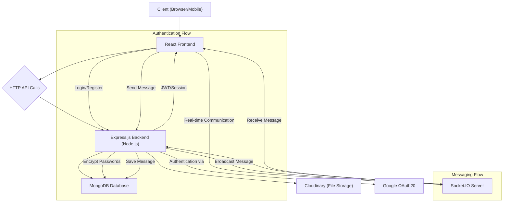
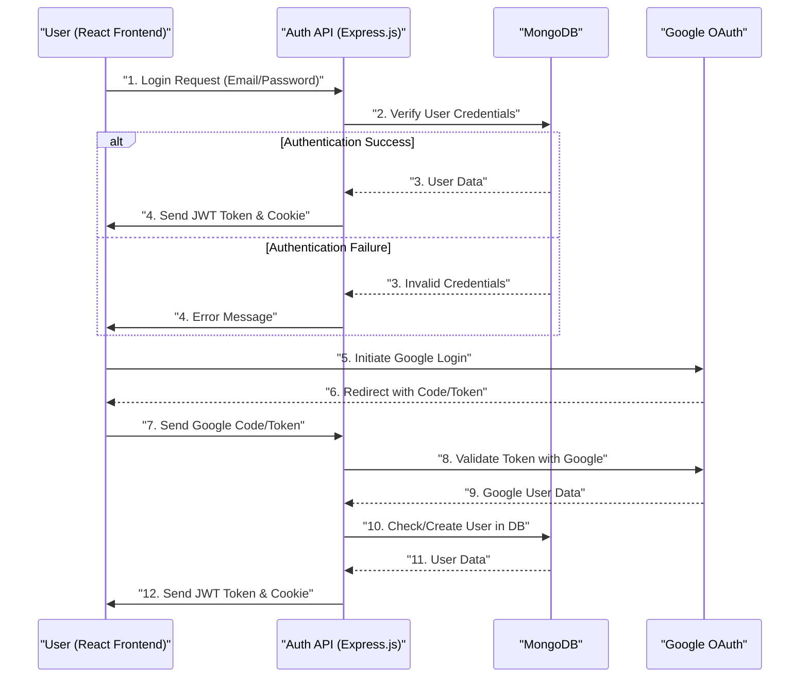

# System Overview

<TOC />

This document provides a high-level overview of the MERN Chat App project, outlining its purpose, core technologies, and overall architecture. The application is a real-time chat platform built using the MERN (MongoDB, Express.js, React, Node.js) stack, designed to facilitate instant messaging between users.

The project leverages a modern full-stack approach, providing a responsive and interactive user experience through its React frontend, a robust API layer with Express.js and Node.js, and efficient data storage using MongoDB. Real-time communication is enabled via Socket.IO, making it suitable for dynamic chat environments.

## Project Purpose and Features

The MERN Chat App aims to demonstrate a complete full-stack application capable of handling user authentication, messaging, and real-time updates. Key features include:

*   **User Authentication**: Secure user registration and login mechanisms.
*   **Real-time Messaging**: Instant message sending and receiving using WebSockets.
*   **User Management**: Ability to view and interact with other online users.
*   **Media Uploads**: Integration with Cloudinary for image and file sharing.
*   **Scalable Architecture**: A modular design separating frontend and backend concerns.

This project is a practical example of building a modern web application from scratch using popular open-source technologies.

## Core Technologies (MERN Stack)

The application is built upon the widely recognized MERN stack, complemented by several essential libraries and tools for a comprehensive development experience.

### Frontend Technologies

The frontend is developed using React, a declarative, component-based JavaScript library for building user interfaces. It provides a dynamic and interactive experience for users.

#### Key Frontend Dependencies from `frontend/package.json`:

```json
{
  "dependencies": {
    "axios": "^1.7.9",
    "cors": "^2.8.5",
    "lucide-react": "^0.471.1",
    "react": "^18.3.1",
    "react-dom": "^18.3.1",
    "react-hot-toast": "^2.5.1",
    "react-icons": "^5.5.0",
    "react-router-dom": "^7.1.1",
    "socket.io-client": "^4.8.1",
    "zustand": "^5.0.3"
  },
  "devDependencies": {
    "@vitejs/plugin-react": "^4.3.4",
    "autoprefixer": "^10.4.20",
    "daisyui": "^4.12.23",
    "postcss": "^8.5.0",
    "tailwindcss": "^3.4.17",
    "vite": "^6.3.5"
  }
}
```

*   **React**: The core library for building the user interface.
*   **Vite**: A next-generation frontend tooling that provides an extremely fast development experience.
*   **React Router DOM**: For declarative routing within the single-page application.
*   **Axios**: A promise-based HTTP client for making API requests to the backend.
*   **Socket.IO Client**: Enables real-time, bidirectional, event-based communication with the backend.
*   **Zustand**: A small, fast, and scalable bear-bones state-management solution.
*   **Tailwind CSS & DaisyUI**: For rapid UI development and styling.

You can inspect the full list of frontend dependencies in the [frontend/package.json](https://github.com/shinymack/Chat-App-MERN/blob/main/frontend/package.json) file.

### Backend Technologies

The backend is built with Node.js and the Express.js framework, providing a robust API for handling user authentication, message storage, and real-time communication.

#### Key Backend Dependencies from `backend/package.json`:

```json
{
  "dependencies": {
    "bcryptjs": "^2.4.3",
    "cloudinary": "^2.5.1",
    "cookie-parser": "^1.4.7",
    "dotenv": "^16.4.7",
    "express": "^4.21.2",
    "express-session": "^1.18.1",
    "jsonwebtoken": "^9.0.2",
    "mongoose": "^8.9.5",
    "passport": "^0.7.0",
    "passport-google-oauth20": "^2.0.0",
    "socket.io": "^4.8.1"
  },
  "devDependencies": {
    "nodemon": "^3.1.9"
  }
}
```

*   **Node.js & Express.js**: The runtime environment and web framework for building the RESTful API.
*   **MongoDB & Mongoose**: MongoDB is the NoSQL database, and Mongoose is an ODM (Object Data Modeling) library that provides a straightforward, schema-based solution to model application data.
*   **Socket.IO**: Enables real-time communication between the server and clients for instant messaging.
*   **bcryptjs**: For hashing passwords to ensure secure user authentication.
*   **jsonwebtoken**: For generating and verifying JSON Web Tokens (JWTs) for stateless authentication.
*   **Cloudinary**: A cloud-based image and video management service for handling media uploads.
*   **Passport.js**: Authentication middleware, including `passport-google-oauth20` for Google OAuth.
*   **Nodemon**: A development tool that automatically restarts the Node.js application when file changes are detected.

The complete list of backend dependencies can be found in the [backend/package.json](https://github.com/shinymack/Chat-App-MERN/blob/main/backend/package.json) file.

## Application Architecture

The application follows a typical client-server architecture, with the frontend and backend communicating over HTTP requests and WebSockets.

### High-Level System Flow





### Key Components

1.  **Client (React Frontend)**: The user-facing part of the application, rendering the chat interface, handling user input, and displaying messages. It initiates API calls for data and establishes a WebSocket connection for real-time updates.
2.  **Express.js Backend (Node.js)**: The server-side application that exposes RESTful APIs for user management, authentication, and message handling. It interacts with the database and the Socket.IO server.
3.  **MongoDB Database**: Stores all application data, including user profiles, messages, and chat room information. Mongoose ODM is used to interact with MongoDB from the Node.js backend.
4.  **Socket.IO Server**: Integrated within the Node.js backend, it manages WebSocket connections to enable real-time messaging capabilities. When a message is sent, the server broadcasts it to all relevant connected clients.
5.  **Cloudinary**: An external service used for storing and serving user-uploaded media (e.g., profile pictures, shared images in chat).
6.  **Google OAuth20**: An external service for delegating user authentication, allowing users to sign in with their Google accounts.

### Frontend-Backend Communication

The frontend communicates with the backend primarily through two channels:

*   **RESTful API Calls (Axios)**: Used for initial data fetching, user authentication, profile updates, and other non-real-time operations. For example, a user login request or fetching a list of previous messages would go through this channel.
    ```javascript
    // Example: Frontend making an API call to login
    import axios from 'axios';

    const loginUser = async (credentials) => {
      try {
        const response = await axios.post('/api/auth/login', credentials);
        return response.data;
      } catch (error) {
        console.error('Login failed:', error);
        throw error;
      }
    };
    // View on GitHub: This snippet is illustrative and not directly from the repo,
    // but represents typical Axios usage in the frontend.
    ```

*   **WebSocket Communication (Socket.IO)**: Dedicated to real-time interactions, such as sending and receiving chat messages, online status updates, and typing indicators. This connection is persistent and allows for low-latency, bidirectional data exchange.
    ```javascript
    // Example: Frontend connecting to Socket.IO
    import { io } from 'socket.io-client';

    const socket = io('http://localhost:5000', {
      withCredentials: true // Important for authentication with cookies
    });

    socket.on('connect', () => {
      console.log('Connected to socket server');
    });

    socket.on('newMessage', (message) => {
      console.log('Received new message:', message);
      // Update chat UI with new message
    });

    // To send a message:
    // socket.emit('sendMessage', { text: 'Hello, world!', chatId: 'abc' });
    // View on GitHub: This snippet is illustrative and not directly from the repo,
    // but represents typical Socket.IO-client usage in the frontend.
    ```

## Project Structure and Scripts

The project is structured into `frontend` and `backend` directories, managed by a root `package.json` for overall build and start commands.

### Root `package.json`

The top-level `package.json` file in the project root streamlines the build and deployment process by orchestrating commands for both the frontend and backend.

```json
{
  "name": "chatapp",
  "version": "1.0.0",
  "main": "index.js",
  "scripts": {
    "build" : "npm install --prefix backend && npm install --prefix frontend && npm run build --prefix frontend",
    "start" : "npm run start --prefix backend"
  },
  "keywords": [],
  "author": "",
  "license": "ISC",
  "description": ""
}
```

*   **`npm run build`**: This script first installs dependencies for both `backend` and `frontend` directories, then executes the `build` script within the `frontend` directory to compile the React application for production.
    *   `npm install --prefix backend`: Installs backend dependencies.
    *   `npm install --prefix frontend`: Installs frontend dependencies.
    *   `npm run build --prefix frontend`: Builds the React application, creating static assets for deployment.
*   **`npm run start`**: This script simply executes the `start` command within the `backend` directory, initiating the Node.js server. This assumes the frontend has already been built or is served separately.

For detailed command usage, refer to the [package.json](https://github.com/shinymack/Chat-App-MERN/blob/main/package.json) file.

### Backend Entry Point

The backend application typically starts from `src/index.js`, where the Express server and Socket.IO server are initialized.

```javascript
// backend/src/index.js (Illustrative snippet)
import express from 'express';
import dotenv from 'dotenv';
import connectToMongoDB from './db/connectToMongoDB.js';
import { app, server } from './socket/socket.js'; // app is express app, server is http server

dotenv.config();

const PORT = process.env.PORT || 5000;

app.use(express.json()); // To parse incoming requests with JSON payloads

// Mount authentication routes, message routes, etc.
// app.use("/api/auth", authRoutes);
// app.use("/api/messages", messageRoutes);

server.listen(PORT, () => {
    connectToMongoDB();
    console.log(`Server running on port ${PORT}`);
});
// View on GitHub: This snippet is illustrative. The actual backend/src/index.js
// will contain the full setup including route definitions and database connection.
```
The `socket.js` file often exports the Express app (`app`) and the HTTP server (`server`) that both Express and Socket.IO attach to, ensuring they share the same underlying server. This setup is crucial for integrating real-time communication with the RESTful API.

## Key Integration Points

### Authentication Flow

The application supports traditional username/password authentication using JWTs and Google OAuth.





The authentication process involves `bcryptjs` for password hashing, `jsonwebtoken` for creating secure session tokens, and `cookie-parser` to manage HTTP-only cookies storing these tokens. `passport` with `passport-google-oauth20` facilitates the integration with Google for external authentication.

### Real-time Messaging

Messages are sent via the backend API and then broadcast to relevant clients using Socket.IO.

1.  **Client Sends Message**: The React frontend sends a POST request to the backend API (`/api/messages`) containing the message content.
2.  **Backend Processes Message**: The Express.js backend receives the message, saves it to MongoDB, and then uses the Socket.IO server to emit a `newMessage` event.
3.  **Socket.IO Broadcast**: The Socket.IO server broadcasts the `newMessage` event to all connected clients that are part of the relevant chat, ensuring instant delivery.
4.  **Client Receives Message**: Other clients subscribed to the `newMessage` event receive the message and update their UI in real-time.

This dual-channel approach (HTTP for persistence, WebSockets for real-time updates) ensures both reliability and speed for messaging.

## Setting Up the Project

To get started with the project, you typically clone the repository and run the setup commands.

```bash
# Clone the repository
git clone https://github.com/shinymack/Chat-App-MERN.git
cd Chat-App-MERN

# Install dependencies and build frontend (using the root package.json script)
npm run build

# Start the backend server (using the root package.json script)
npm run start
```

Further instructions on configuration, environment variables (`.env` file), and running the application in development mode are typically found in the main [README.md](https://github.com/shinymack/Chat-App-MERN/blob/main/README.md) file of the repository.

Next: [Backend Architecture and Implementation](./2_backend-architecture-and-implementation.mdx)
```
