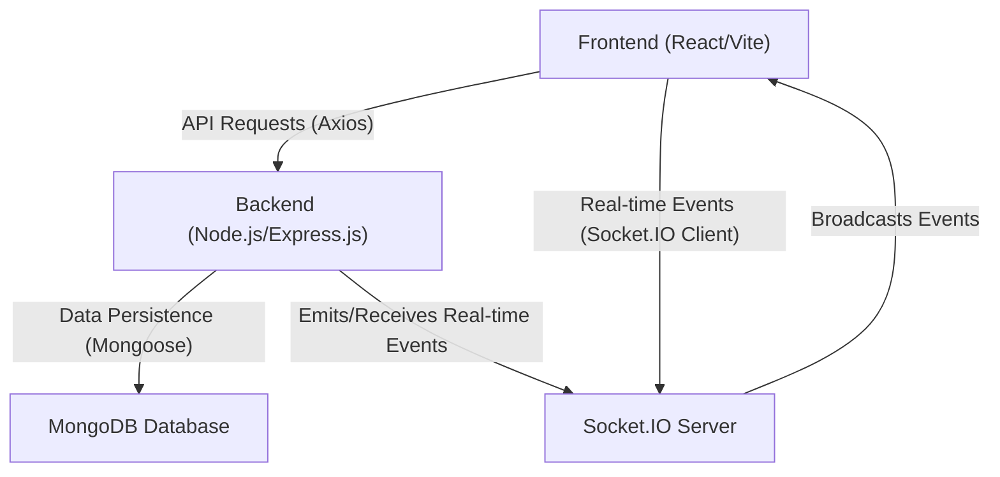
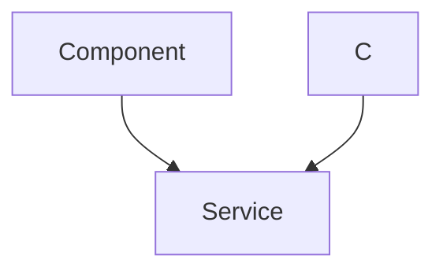

 # System Overview

The Chat-App-MERN project is a real-time chat application built using the MERN stack (MongoDB, Express.js, React, Node.js) with Socket.IO for live communication. This document provides a high-level overview of the system's architecture, its core components, and the technologies employed to deliver a responsive and interactive user experience.

The primary goal of this application is to facilitate instant messaging between users, incorporating features typical of modern chat platforms, such as user authentication, message exchange, and dynamic UI updates.

## Core Technologies

The project leverages a robust set of modern web technologies, split between its frontend and backend components.

### Frontend Stack

The user interface is built with React, offering a dynamic and component-based structure. Key libraries and frameworks used on the frontend include:

*   **React**: A declarative, efficient, and flexible JavaScript library for building user interfaces.
*   **Vite**: A fast development build tool that significantly improves development experience for frontend projects.
*   **Tailwind CSS & DaisyUI**: For styling, providing a utility-first CSS framework and a component library built on top of Tailwind, respectively, ensuring a consistent and modern design.
*   **Axios**: A promise-based HTTP client for making API requests to the backend.
*   **React Router DOM**: For handling client-side routing and navigation within the application.
*   **Socket.IO Client**: Enables real-time, bidirectional, event-based communication between the browser and the server.
*   **Zustand**: A small, fast, and scalable bear-necessities state-management solution for React, used here to manage global application state.
*   **React Hot Toast**: A lightweight and customizable toast notification library for user feedback.
*   **Lucide React & React Icons**: Icon libraries for enhanced UI/UX.

### Backend Stack

The server-side logic and API are powered by Node.js and Express.js, interacting with a MongoDB database. While the backend's `package.json` is not directly provided in the `package.json` for the root, we infer its existence from the project description (MERN) and the root `package.json`'s `build` and `start` scripts.

*   **Node.js & Express.js**: The runtime environment and web application framework for building the RESTful API.
*   **MongoDB**: A NoSQL database used for storing user data, messages, and chat room information.
*   **Socket.IO**: Enables real-time server-side communication, complementing the client-side Socket.IO.

## Project Structure and Initialization

The project is structured with separate directories for the frontend and (inferred) backend, allowing for independent development and deployment of each component. The root `package.json` acts as an orchestrator for building and starting both parts of the application.

Let's examine the root `package.json` to understand how the project is set up:

```json showLineNumbers
{
  "name": "chatapp",
  "version": "1.0.0",
  "main": "index.js",
  "scripts": {
    "build" : "npm install --prefix backend && npm install --prefix frontend && npm run build --prefix frontend",
    "start" : "npm run start --prefix backend"
  },
  "keywords": [],
  "author": "",
  "license": "ISC",
  "description": ""
}
```
[View on GitHub](https://github.com/shinymack/Chat-App-MERN/blob/main/package.json)

*   **`"build"` script**: This command first installs dependencies for the `backend` and `frontend` directories using `npm install --prefix <directory>`, and then runs the `build` script specifically for the `frontend` to create its production-ready assets.
*   **`"start"` script**: This command initiates the backend server, which then typically serves the frontend assets after they have been built.

## Frontend Dependencies

The `frontend/package.json` provides a comprehensive list of client-side dependencies, highlighting the tools used for building the user interface and handling real-time interactions.

```json showLineNumbers
{
  "name": "frontend",
  "private": true,
  "version": "0.0.0",
  "type": "module",
  "scripts": {
    "dev": "vite",
    "build": "vite build",
    "lint": "eslint .",
    "preview": "vite preview",
    "mobile": "vite --host"
  },
  "dependencies": {
    "axios": "^1.7.9",
    "cors": "^2.8.5",
    "lucide-react": "^0.471.1",
    "react": "^18.3.1",
    "react-dom": "^18.3.1",
    "react-hot-toast": "^2.5.1",
    "react-icons": "^5.5.0",
    "react-router-dom": "^7.1.1",
    "socket.io-client": "^4.8.1",
    "zustand": "^5.0.3"
  },
  "devDependencies": {
    "@eslint/js": "^9.17.0",
    "@types/react": "^18.3.18",
    "@types/react-dom": "^18.3.5",
    "@vitejs/plugin-react": "^4.3.4",
    "autoprefixer": "^10.4.20",
    "daisyui": "^4.12.23",
    "eslint": "^9.17.0",
    "eslint-plugin-react": "^7.37.2",
    "eslint-plugin-react-hooks": "^5.0.0",
    "eslint-plugin-react-refresh": "^0.4.16",
    "globals": "^15.14.0",
    "postcss": "^8.5.0",
    "tailwindcss": "^3.4.17",
    "vite": "^6.3.5"
  }
}
```
[View on GitHub](https://github.com/shinymack/Chat-App-MERN/blob/main/frontend/package.json)

### Key Frontend Dependencies Spotlight

*   **`socket.io-client`**: This is crucial for the real-time functionality of the chat application. It establishes and manages a persistent connection with the backend Socket.IO server, allowing for instant message delivery and updates.

    ```javascript
    // Example: Initializing Socket.IO client in a React component or context
    import { io } from "socket.io-client";

    const socket = io("http://localhost:5000", {
      // additional options if needed
    });

    socket.on("connect", () => {
      console.log("Connected to Socket.IO server:", socket.id);
    });

    socket.on("disconnect", () => {
      console.log("Disconnected from Socket.IO server");
    });

    // Emitting and listening for events
    socket.emit("sendMessage", { text: "Hello", roomId: "abc" });
    socket.on("receiveMessage", (message) => {
      console.log("New message:", message);
    });
    ```
    This snippet illustrates how `socket.io-client` would be used to connect to the server and handle real-time events.

*   **`zustand`**: For state management, `zustand` provides a lean and efficient way to create global stores. In a chat application, this would typically manage user authentication status, chat messages, active conversations, and other application-wide states.

    ```javascript
    // Example: A basic Zustand store for authentication
    import { create } from 'zustand';

    const useAuthStore = create((set) => ({
      authUser: null,
      setAuthUser: (user) => set({ authUser: user }),
      logout: () => set({ authUser: null }),
    }));

    export default useAuthStore;
    ```
    [View on GitHub](https://github.com/shinymack/Chat-App-MERN/tree/main/frontend/src/store) (Assumed path for store)
    This store could hold the currently logged-in user's information and provide methods to update it.

*   **`axios`**: This library is used for making standard HTTP requests, such as user login, registration, fetching user profiles, or non-real-time data.

    ```javascript
    // Example: User login request using axios
    import axios from 'axios';

    const loginUser = async (credentials) => {
      try {
        const response = await axios.post("/api/auth/login", credentials);
        return response.data;
      } catch (error) {
        console.error("Login failed:", error.response.data.message);
        throw error;
      }
    };
    ```
    [View on GitHub](https://github.com/shinymack/Chat-App-MERN/tree/main/frontend/src/utils/api) (Assumed path for API utilities)
    Axios simplifies handling API calls and their responses.

## System Architecture Diagram

This diagram illustrates the high-level interaction between the frontend, backend, and database in the Chat-App-MERN project.





## Real-time Communication Flow

The real-time communication is a cornerstone of any chat application. This sequence diagram outlines a typical message exchange flow.





## Key Integration Points

The successful functioning of the Chat-App-MERN relies on seamless integration between its various components:

*   **Frontend-Backend API Communication**: RESTful API endpoints handle user authentication (login, registration), user profile management, and fetching initial chat data. Axios is the primary tool for these interactions.
*   **Real-time Communication (Socket.IO)**: Socket.IO forms the backbone of the real-time chat functionality. The frontend client establishes a persistent connection to the Socket.IO server, enabling instant message delivery, typing indicators, and online status updates without constant polling.
*   **State Management (Zustand)**: The frontend uses Zustand to manage global application state, including authenticated user details, current chat room data, and incoming messages, ensuring that all components have access to up-to-date information. Socket.IO events often trigger state updates in Zustand.
*   **Database Interactions**: The backend interacts with MongoDB for all data persistence. This includes storing user credentials, chat messages, conversation history, and user relationships.
*   **Build and Start Scripts**: The root `package.json`'s `build` and `start` scripts are crucial for orchestrating the deployment and execution of both frontend and backend components, ensuring they are correctly installed and launched.

Next: [Backend Architecture](./2_backend-architecture.mdx)