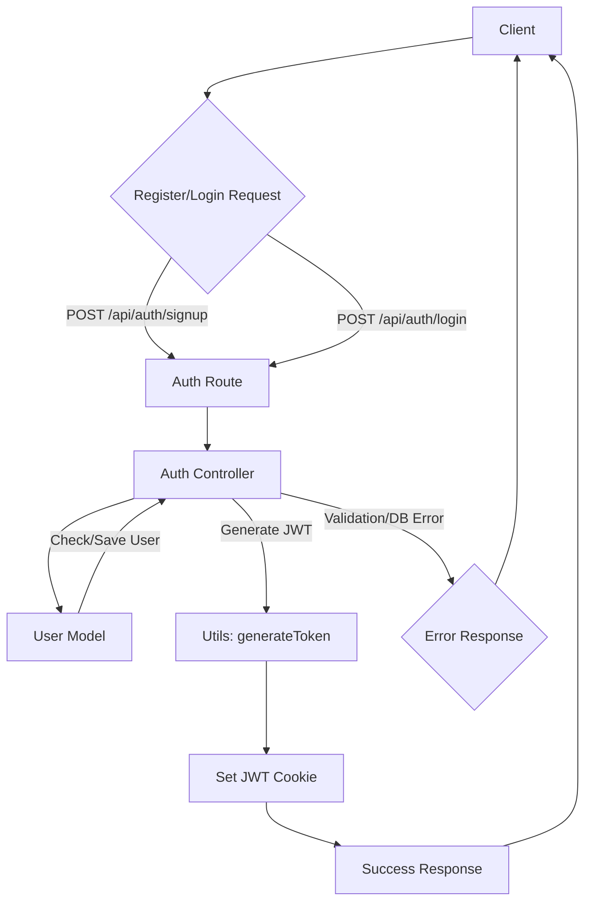
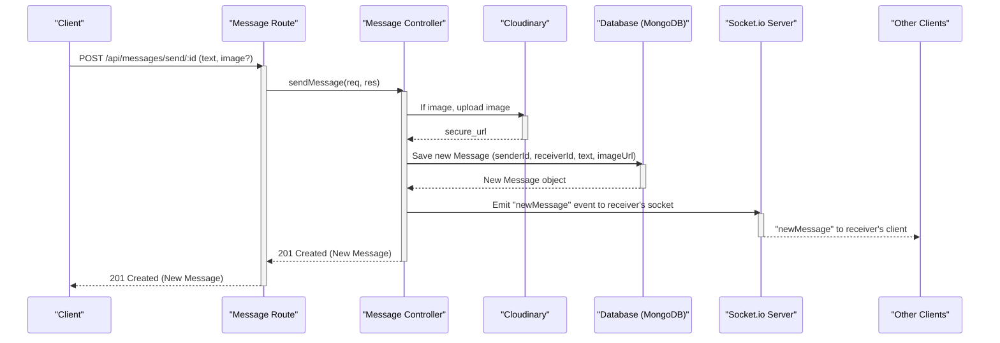

 # API Endpoints and Controllers

This section provides comprehensive documentation for the RESTful API endpoints and their corresponding controller implementations within the backend. It covers user authentication, profile management, and real-time messaging functionalities, detailing the request handling, data processing, and responses.

## Authentication Endpoints

The authentication module manages user registration, login, logout, session verification, and profile updates. It integrates with JWT for token-based authentication and Passport.js for Google OAuth.

**Relevant Files:**
*   `backend/src/routes/auth.route.js`
*   `backend/src/controllers/auth.controller.js`

### User Authentication Flow

The following diagram illustrates the typical authentication flow for user registration and login.





### Endpoints Details

Here’s a breakdown of the key authentication endpoints:

*   **`POST /api/auth/signup`**
    *   **Description:** Registers a new user with a unique username, email, and password. Performs validation checks for all fields, hashes the password, and generates a JWT token upon successful creation.
    *   **Controller:** `signup` in `auth.controller.js`
    *   **Snippet:**
        ```javascript
        // backend/src/controllers/auth.controller.js
        export const signup = async (req, res) => {
            const {username, email, password} = req.body;
            try {
                if(!username || !email || !password) {
                    return res.status(400).json({message: "Please fill in all fields."});
                }
                // ... validation checks ...
                const hashedPassword = await bcrypt.hash(password, salt);

                const newUser = new User({ username, email, password: hashedPassword, authProvider: 'email' });
                if(newUser){
                    generateToken(newUser._id, res); // Generate JWT and set as cookie
                    await newUser.save();
                    res.status(201).json({ _id: newUser._id, username: newUser.username, email: newUser.email, profilePic: newUser.profilePic });
                } else {
                    res.status(400).json({message: "Invalid user data."});
                }
            } catch (error) {
                console.log("Error in signup controller", error.message);
                res.status(500).json({message: "Something went wrong."});
            }
        };
        ```
        [View on GitHub](https://github.com/shinymack/Chat-App-MERN/blob/main/backend/src/controllers/auth.controller.js#L7-L54)

*   **`POST /api/auth/login`**
    *   **Description:** Authenticates an existing user. Compares the provided password with the stored hashed password and generates a JWT token if credentials are valid.
    *   **Controller:** `login` in `auth.controller.js`
    *   **Snippet:**
        ```javascript
        // backend/src/controllers/auth.controller.js
        export const login = async (req, res) => {
            const {email, password} = req.body;
            try {
                const user = await User.findOne({email});
                if(!user) {
                    return res.status(400).json({message: "Invalid credentials."});
                }
                // Handle Google Auth vs. Email/Password Auth
                if(user.authProvider === 'google' && !user.password){
                    return res.status(400).json({ message: "Please sign in with Google." });
                }
                const isPasswordCorrect = await bcrypt.compare(password, user.password);
                if(!isPasswordCorrect) {
                    return res.status(400).json({message: "Invalid credentials."});
                }
                generateToken(user._id, res); // Generate JWT and set as cookie
                res.status(200).json({ _id: user._id, username: user.username, email: user.email, profilePic: user.profilePic });
            } catch (error) {
                console.log("Error in login controller", error.message);
                res.status(500).json({message: "Something went wrong."});
            }
        };
        ```
        [View on GitHub](https://github.com/shinymack/Chat-App-MERN/blob/main/backend/src/controllers/auth.controller.js#L56-L86)

*   **`POST /api/auth/logout`**
    *   **Description:** Logs out the current user by clearing the JWT cookie.
    *   **Controller:** `logout` in `auth.controller.js`

*   **`PUT /api/auth/update-profile`**
    *   **Description:** Allows an authenticated user to update their profile information, such as `profilePic` and `username`. Handles Cloudinary uploads for images and checks for username availability. Requires `protectRoute` middleware.
    *   **Controller:** `updateProfile` in `auth.controller.js`
    *   **Snippet:**
        ```javascript
        // backend/src/controllers/auth.controller.js
        export const updateProfile = async (req, res) => {
            try {
                const { profilePic, username } = req.body;
                const userId = req.user._id;
                let userToUpdate = await User.findById(userId);

                // ... username validation and uniqueness checks ...

                if (profilePic) {
                    const uploadResponse = await cloudinary.uploader.upload(profilePic);
                    fieldsToUpdate.profilePic = uploadResponse.secure_url;
                }

                if (Object.keys(fieldsToUpdate).length === 0) {
                    return res.status(400).json({ message: "No changes provided to update." });
                }

                const updatedUser = await User.findByIdAndUpdate(userId, { $set: fieldsToUpdate }, { new: true });
                generateToken(updatedUser._id, res); // Refresh JWT cookie
                res.status(200).json(updatedUser);
            } catch (error) {
                console.error("Error in updateProfile controller", error.message);
                res.status(500).json({ message: "Internal Server Error while updating profile." });
            }
        };
        ```
        [View on GitHub](https://github.com/shinymack/Chat-App-MERN/blob/main/backend/src/controllers/auth.controller.js#L182-L244)

*   **`GET /api/auth/username/check/:username`**
    *   **Description:** Checks if a given username is available or already taken.
    *   **Controller:** `checkUsernameAvailability` in `auth.controller.js`

*   **`GET /api/auth/check`**
    *   **Description:** Verifies the current user's authentication status and returns user details if authenticated. Protected by `protectRoute`.
    *   **Controller:** `checkAuth` in `auth.controller.js`

*   **`GET /api/auth/google` & `GET /api/auth/google/callback`**
    *   **Description:** Initiates and handles the Google OAuth authentication flow using Passport.js. Upon successful authentication, a JWT token is generated, and the user is redirected to the frontend.
    *   **Controller:** `googleAuthCallback` in `auth.controller.js`

### Authentication Middleware (`protectRoute`)

The `protectRoute` middleware is crucial for securing endpoints. It verifies the JWT token from the incoming request's cookies, extracts the user ID, and attaches the `User` object to `req.user` for subsequent controller logic.

```javascript
// backend/src/middleware/auth.middleware.js
import jwt from 'jsonwebtoken';
import User from '../models/user.model.js';

export const protectRoute = async (req, res, next) => {
    try {
        const token = req.cookies.jwt;
        if (!token) {
            return res.status(401).json({ error: "Unauthorized - No Token Provided" });
        }

        const decoded = jwt.verify(token, process.env.JWT_SECRET);
        if (!decoded) {
            return res.status(401).json({ error: "Unauthorized - Invalid Token" });
        }

        const user = await User.findById(decoded.userId).select("-password");
        if (!user) {
            return res.status(404).json({ error: "User not found" });
        }

        req.user = user; // Attach user to request object
        next(); // Proceed to the next middleware/controller
    } catch (error) {
        console.log("Error in protectRoute middleware: ", error.message);
        res.status(500).json({ error: "Internal Server Error" });
    }
};
```
[View on GitHub](https://github.com/shinymack/Chat-App-MERN/blob/main/backend/src/middleware/auth.middleware.js#L1-L28)

## Messaging Endpoints

The messaging module handles fetching users for the sidebar, retrieving message history between two users, and sending new messages (with optional image uploads). It integrates with Cloudinary for image storage and Socket.io for real-time message delivery.

**Relevant Files:**
*   `backend/src/routes/message.route.js`
*   `backend/src/controllers/message.controller.js`

### Messaging Flow

This diagram illustrates the flow for sending a message, including image upload and real-time notification.





### Endpoints Details

*   **`GET /api/messages/users`**
    *   **Description:** Retrieves a list of all users excluding the currently logged-in user, typically for populating a chat sidebar. Protected by `protectRoute`.
    *   **Controller:** `getUsersForSidebar` in `message.controller.js`

*   **`GET /api/messages/:id`**
    *   **Description:** Fetches all messages exchanged between the logged-in user and a specific `userToChatId`. Protected by `protectRoute`.
    *   **Controller:** `getMessages` in `message.controller.js`
    *   **Snippet:**
        ```javascript
        // backend/src/controllers/message.controller.js
        export const getMessages = async (req, res) => {
            try {
                const {id : userToChatId } = req.params;
                const myId = req.user._id;

                const messages = await Message.find({
                    $or: [
                        {senderId: myId, receiverId:userToChatId},
                        {senderId: userToChatId, receiverId: myId}
                    ]
                }); // Retrieves messages where current user is sender OR receiver
                res.status(200).json(messages);
            } catch (error) {
                console.log("Error in getMessages controller:  ", error);
                res.status(500).json({ error: "Internal Server Error" });
            }
        };
        ```
        [View on GitHub](https://github.com/shinymack/Chat-App-MERN/blob/main/backend/src/controllers/message.controller.js#L26-L45)

*   **`POST /api/messages/send/:id`**
    *   **Description:** Sends a new message to a specified receiver (`:id`). Supports sending text and/or images. If an image is provided, it's uploaded to Cloudinary. After saving, it emits a `newMessage` event via Socket.io for real-time updates. Protected by `protectRoute`.
    *   **Controller:** `sendMessage` in `message.controller.js`
    *   **Snippet:**
        ```javascript
        // backend/src/controllers/message.controller.js
        export const sendMessage = async (req, res) => {
            try {
                const { text, image } = req.body;
                const { id: receiverId } = req.params;
                const senderId = req.user._id;

                let imageUrl;
                if (image) { // Upload image to Cloudinary if present
                    const uploadResponse = await cloudinary.uploader.upload(image);
                    imageUrl = uploadResponse.secure_url;
                }
                const newMessage = new Message({ senderId, receiverId, text, image: imageUrl });
                await newMessage.save();

                const receiverSocketId = getReceiverSocketId(receiverId);
                if(receiverSocketId) { // Emit real-time message via Socket.io
                    io.to(receiverSocketId).emit("newMessage", newMessage);
                }
                res.status(201).json(newMessage);
            } catch (error) {
                console.log("Error in sendMessage controller:  ", error);
                res.status(500).json({ error: "Internal Server Error" });
            }
        };
        ```
        [View on GitHub](https://github.com/shinymack/Chat-App-MERN/blob/main/backend/src/controllers/message.controller.js#L47-L77)

## Key Integration Points

*   **JWT Authentication**: All sensitive API endpoints are protected using a JWT-based authentication system. The `generateToken` utility function ensures consistent token creation and cookie management, while `protectRoute` middleware enforces token validation.
*   **Google OAuth**: Passport.js is used for streamlined integration with Google, allowing users to sign in without traditional email/password registration. The `googleAuthCallback` controller handles the post-authentication process, including JWT generation.
*   **Cloudinary Integration**: For profile pictures and message images, Cloudinary is used for cloud-based storage and optimization. This offloads static asset management from the backend server.
*   **Socket.io for Real-time Messaging**: The `sendMessage` controller leverages Socket.io to instantly notify the receiver of a new message, providing a seamless real-time chat experience without needing to poll the API.
*   **Centralized Error Handling**: Controllers consistently use `try-catch` blocks to gracefully handle errors, logging them internally and returning appropriate HTTP status codes and messages to the client.

Next: [Data Models and Schema](./2.2_data-models-and-schema.mdx)