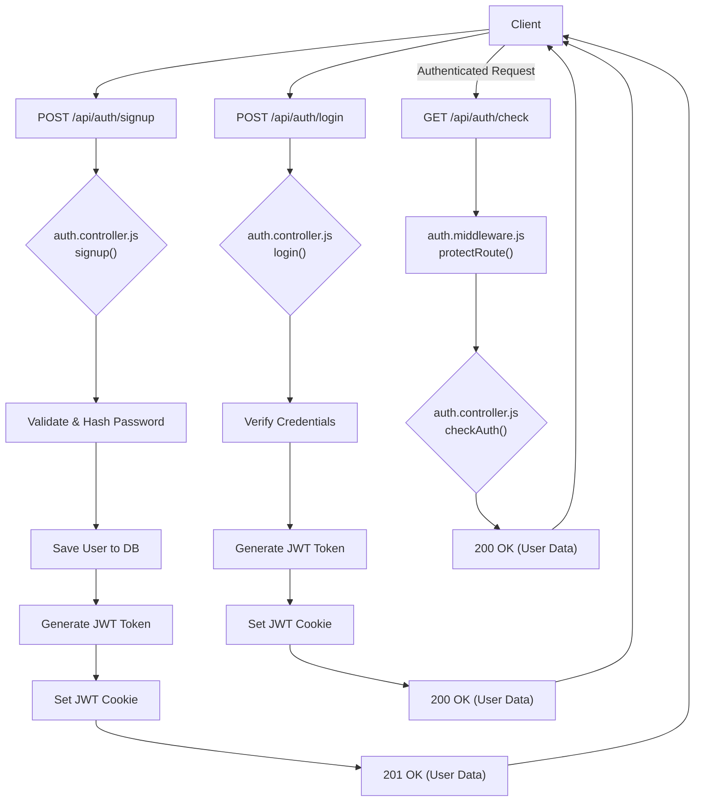
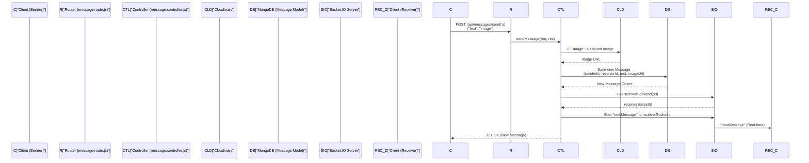

# API Endpoints and Controllers

This section provides a comprehensive overview of the backend API endpoints and their corresponding controller logic. It details how requests are processed, validated, and how data interacts with the system, focusing on user authentication and messaging functionalities.

## Authentication Endpoints and Controllers

The `auth` module handles all user authentication flows, including registration, login, logout, session checking, Google OAuth integration, and profile management.

### File Structure

The authentication logic is primarily organized within two files:
*   **Routes:** `backend/src/routes/auth.route.js` handles API path definitions and links them to controller functions.
*   **Controllers:** `backend/src/controllers/auth.controller.js` contains the core business logic for each authentication operation.

### `auth.route.js` - Defined API Paths

The `auth.route.js` file defines the following API endpoints:

| Method | Endpoint                          | Description                                         | Protection     |
| :----- | :-------------------------------- | :-------------------------------------------------- | :------------- |
| `POST` | `/api/auth/signup`                | Registers a new user.                               | None           |
| `POST` | `/api/auth/login`                 | Authenticates an existing user.                     | None           |
| `POST` | `/api/auth/logout`                | Clears the authentication cookie.                   | None           |
| `PUT`  | `/api/auth/update-profile`        | Updates a user's profile information (e.g., username, profile picture). | `protectRoute` |
| `GET`  | `/api/auth/username/check/:username` | Checks the availability of a given username.        | `protectRoute` |
| `GET`  | `/api/auth/check`                 | Verifies the current user's session status.         | `protectRoute` |
| `GET`  | `/api/auth/google`                | Initiates Google OAuth login flow.                  | None           |
| `GET`  | `/api/auth/google/callback`       | Callback URL for Google OAuth successful authentication. | None           |

[View on GitHub](https://github.com/shinymack/Chat-App-MERN/blob/main/backend/src/routes/auth.route.js)

### `auth.controller.js` - Authentication Logic

This file encapsulates all the functions that handle the business logic for authentication.

#### User Registration (`signup`)

The `signup` controller manages new user registration. It performs input validation for `username`, `email`, and `password`, checks for existing users, hashes the password, creates a new user, and generates a JWT token upon successful registration.

```javascript
export const signup = async (req, res) => {
    const {username, email, password} = req.body;
    try {
        // ... input validation and existing user checks
        const salt = await bcrypt.genSalt(10);
        const hashedPassword = await bcrypt.hash(password, salt);

        const newUser = new User({
            username,
            email,
            password: hashedPassword,
            authProvider: 'email'
        });
        if(newUser){
            generateToken(newUser._id, res); // Generates JWT and sets as cookie
            await newUser.save();

            res.status(201).json({
                _id: newUser._id,
                username: newUser.username,
                email: newUser.email,   
                profilePic: newUser.profilePic,
                authProvider: newUser.authProvider
            });
        } // ... error handling
    } catch (error) {
        // ... error logging
    }
};
```
This snippet from `backend/src/controllers/auth.controller.js` (lines 9-47) demonstrates the core `signup` logic, including password hashing and token generation.
[View on GitHub](https://github.com/shinymack/Chat-App-MERN/blob/main/backend/src/controllers/auth.controller.js#L9-L47)

#### User Login (`login`)

The `login` controller authenticates existing users. It validates credentials, specifically comparing the provided password with the stored hashed password, and generates a new JWT token if authentication is successful. It also handles specific checks for Google-authenticated users.

#### User Logout (`logout`)

The `logout` controller simply clears the `jwt` cookie from the client, effectively ending the user's session.

#### User Profile Update (`updateProfile`)

This controller allows authenticated users to update their `username` and `profilePic`. It includes logic for username uniqueness checks (excluding the current user) and integrates with Cloudinary for image uploads. A new JWT token is issued to reflect potential changes in user data.

```javascript
export const updateProfile = async (req, res) => {
    try {
        const { profilePic, username } = req.body;
        const userId = req.user._id;
        let userToUpdate = await User.findById(userId);

        if (!userToUpdate) {
            return res.status(404).json({ message: "User not found." });
        }
        const fieldsToUpdate = {};
        let newUsername = username ? username.trim() : null;

        // Handle username update logic
        if (newUsername && newUsername !== userToUpdate.username) {
            // ... username validation and uniqueness check
            fieldsToUpdate.username = newUsername;
        }

        // Handle profile picture update logic
        if (profilePic) {
            const uploadResponse = await cloudinary.uploader.upload(profilePic);
            fieldsToUpdate.profilePic = uploadResponse.secure_url;
        }

        if (Object.keys(fieldsToUpdate).length === 0) {
            return res.status(400).json({ message: "No changes provided to update." });
        }

        const updatedUser = await User.findByIdAndUpdate(userId, { $set: fieldsToUpdate }, { new: true });
        generateToken(updatedUser._id, res); // Refresh token
        res.status(200).json(updatedUser);

    } catch (error) {
        // ... error handling
    }
};
```
This snippet from `backend/src/controllers/auth.controller.js` (lines 191-236) illustrates the `updateProfile` functionality, demonstrating conditional updates for username and profile picture, along with Cloudinary integration.
[View on GitHub](https://github.com/shinymack/Chat-App-MERN/blob/main/backend/src/controllers/auth.controller.js#L191-L236)

#### Check Authentication (`checkAuth`)

This endpoint verifies if a user is currently authenticated by validating their JWT token and returns the user's details if valid.

#### Google OAuth Callbacks (`googleAuthCallback`)

After Google successfully authenticates a user, this controller is invoked. It generates a JWT token for the user and redirects them to the frontend application.

#### Username Availability Check (`checkUsernameAvailability`)

This controller checks if a provided username is available for use, considering existing usernames and the current user's own username.

```javascript
export const checkUsernameAvailability = async (req, res) => {
    try {
        const { username } = req.params;
        const currentUserId = req.user._id; 

        if (!username || username.trim().length < 3 || username.trim().length > 20) {
            return res.status(400).json({ available: false, message: "Username validation failed." });
        }
    
        if (req.user.username === username) {
            return res.status(200).json({ available: true, message: "This is your current username." });
        }

        const existingUser = await User.findOne({ username: username });

        if (existingUser) {
            return res.status(200).json({ available: false, message: "Username is already taken." });
        }

        res.status(200).json({ available: true, message: "Username is available." });

    } catch (error) {
        console.error("Error in checkUsernameAvailability:", error.message);
        res.status(500).json({ available: false, message: "Error checking username availability." });
    }
};
```
This snippet from `backend/src/controllers/auth.controller.js` (lines 151-186) shows how the system validates and checks username uniqueness, providing real-time feedback to the user.
[View on GitHub](https://github.com/shinymack/Chat-App-MERN/blob/main/backend/src/controllers/auth.controller.js#L151-L186)

### Authentication Flow
The following diagram illustrates a simplified authentication flow, highlighting key interactions between the client, authentication routes, and controllers.





## Messaging Endpoints and Controllers

The `message` module manages all chat-related functionalities, including retrieving users for the sidebar, fetching message history, and sending new messages (with image support).

### File Structure

Messaging logic is handled by:
*   **Routes:** `backend/src/routes/message.route.js` defines API paths for messaging.
*   **Controllers:** `backend/src/controllers/message.controller.js` contains the logic for message operations.

### `message.route.js` - Defined API Paths

The `message.route.js` file defines the following API endpoints:

| Method | Endpoint                    | Description                                         | Protection     |
| :----- | :-------------------------- | :-------------------------------------------------- | :------------- |
| `GET`  | `/api/messages/users`       | Retrieves a list of all users, excluding the current authenticated user, for the chat sidebar. | `protectRoute` |
| `GET`  | `/api/messages/:id`         | Fetches messages exchanged between the authenticated user and a specific user (`:id`). | `protectRoute` |
| `POST` | `/api/messages/send/:id`    | Sends a new message (text and/or image) to a specified receiver (`:id`). | `protectRoute` |

[View on GitHub](https://github.com/shinymack/Chat-App-MERN/blob/main/backend/src/routes/message.route.js)

### `message.controller.js` - Messaging Logic

This file contains the functions that implement the business logic for message handling.

#### Get Users for Sidebar (`getUsersForSidebar`)

This controller fetches a list of all registered users, excluding the currently logged-in user, to populate the chat sidebar. User passwords are explicitly excluded from the returned data.

```javascript
export const getUsersForSidebar = async (req, res) => {
    try {
        const loggedInUserId = req.user._id;
        // Find all users except the logged-in one, and exclude their password
        const filteredUsers = await User.find({
            _id: { $ne: loggedInUserId }}).select("-password");  
        res.status(200).json(filteredUsers);
    }
    catch (error) {
        console.log("Error in getUsersForSidebar: ", error);
        res.status(500).json({ error: "Internal Server Error" });
    }
};
```
This snippet from `backend/src/controllers/message.controller.js` (lines 9-20) shows how the system efficiently retrieves other chat participants while ensuring sensitive data like passwords are not exposed.
[View on GitHub](https://github.com/shinymack/Chat-App-MERN/blob/main/backend/src/controllers/message.controller.js#L9-L20)

#### Get Messages (`getMessages`)

This controller retrieves all messages exchanged between the authenticated user and another specified user. It queries the `Message` model for messages where either user is the sender or receiver.

#### Send Message (`sendMessage`)

The `sendMessage` controller handles the creation and persistence of new messages. It supports both text and image messages (using Cloudinary for image uploads). Upon saving the message to the database, it utilizes Socket.IO to emit the new message in real-time to the recipient if they are online.

```javascript
export const sendMessage = async (req, res) => {
    try {
        const { text, image } = req.body;
        const { id: receiverId } = req.params;
        const senderId = req.user._id;

        let imageUrl;
        if (image) {
            const uploadResponse = await cloudinary.uploader.upload(image);
            imageUrl = uploadResponse.secure_url;
        }
        const newMessage = new Message({
            senderId,
            receiverId,
            text,
            image: imageUrl,
        });

        await newMessage.save();

        const receiverSocketId = getReceiverSocketId(receiverId);
        if(receiverSocketId) {
            io.to(receiverSocketId).emit("newMessage", newMessage);
        }

        res.status(201).json(newMessage);   
        
    } catch (error) {
        console.log("Error in sendMessage controller:  ", error);
        res.status(500).json({ error: "Internal Server Error" });
    }
};
```
This snippet from `backend/src/controllers/message.controller.js` (lines 42-70) demonstrates the `sendMessage` process, including Cloudinary integration for image uploads and real-time message delivery via Socket.IO.
[View on GitHub](https://github.com/shinymack/Chat-App-MERN/blob/main/backend/src/controllers/message.controller.js#L42-L70)

### Messaging Flow
The following sequence diagram illustrates the process of sending a message, including real-time communication.





## Key Integration Points

*   **`protectRoute` Middleware**: Both `auth` and `message` routes heavily utilize the `protectRoute` middleware to ensure that sensitive endpoints are only accessible by authenticated users. This middleware validates the JWT token present in the request cookie.
*   **JWT Token Management**: The `generateToken` utility is central to authentication, ensuring secure, short-lived session management via HTTP-only cookies.
*   **Cloudinary Integration**: For features like `updateProfile` and `sendMessage`, Cloudinary is used for efficient and scalable image storage and delivery.
*   **Socket.IO for Real-time Messaging**: The `sendMessage` controller leverages `socket.io` to instantly push new messages to the recipient, ensuring a fluid real-time chat experience without needing to poll the server.

Next: [Data Models and Schema](./2.2_data-models-and-schema.mdx)