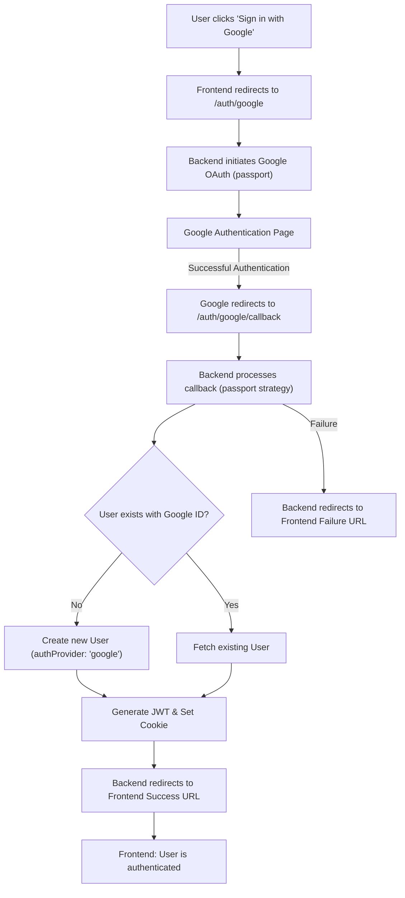
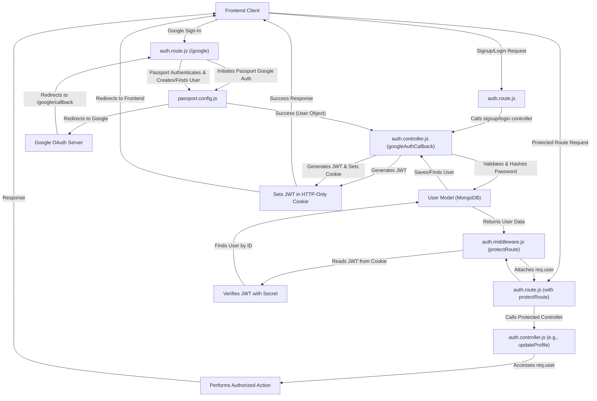

# Authentication and User Management

This section details the core authentication and user management functionalities within the application. It outlines how users register, log in, maintain sessions, and manage their profiles, incorporating both email/password and Google OAuth strategies. The system leverages JWT for session management and `bcrypt` for secure password hashing.

## User Registration and Login

The application provides a robust system for user registration and login, handling essential validations, password security, and session establishment.

### Registration Process

New users can register by providing a username, email, and password. The system performs several checks to ensure data integrity and uniqueness.

-   **Input Validation**: Ensures all required fields are present and that the username and password meet length requirements.
-   **Uniqueness Checks**: Prevents registration if the email or username already exists.
-   **Password Hashing**: Passwords are securely hashed using `bcrypt` with a salt round of 10 before being stored in the database.
-   **Token Generation**: Upon successful registration, a JSON Web Token (JWT) is generated and set as an HTTP-only cookie, establishing the user's session.

```javascript filename="backend/src/controllers/auth.controller.js" {10-38}
export const signup = async (req, res) => {
    // console.log(req.body); //debugging
    const {username, email, password} = req.body;
    try {
        if(!username || !email || !password) {
            return res.status(400).json({message: "Please fill in all fields."});
        }
        if (username.length < 3) {
            return res.status(400).json({ message: "Username must be at least 3 characters." });
        }
        if (username.length > 20) {
            return res.status(400).json({ message: "Username cannot be more than 20 characters." });
        }
        if (password.length < 6) {
            return res.status(400).json({message: "Password must be at least 6 characters."});
        }
        const user = await User.findOne({email});
        if (user) return res.status(400).json({message: "Email already exists."});
        
        const existingUserByUsername = await User.findOne({ username });
        if (existingUserByUsername) {
            return res.status(400).json({ message: "Username already exists. Please choose another." });
        }

        const salt = await bcrypt.genSalt(10);
        const hashedPassword = await bcrypt.hash(password, salt);

        const newUser = new User({
            username,
            email,
            password: hashedPassword,
            authProvider: 'email'
        });
        if(newUser){
            //generate jwt token here
            generateToken(newUser._id, res);
            await newUser.save();

            res.status(201).json({
                _id: newUser._id,
                username: newUser.username,
                email: newUser.email,   
                profilePic: newUser.profilePic,
                authProvider: newUser.authProvider
            });
        } else {
            res.status(400).json({message: "Invalid user data."});
        }
    } catch (error) {
        console.log("Error in signup controller", error.message)
        res.status(500).json({message: "Something went wrong."});
    }
};
```
[View on GitHub](https://github.com/shinymack/Chat-App-MERN/blob/main/backend/src/controllers/auth.controller.js#L6-L53)

### Login Process

Users authenticate by providing their email and password. The system verifies these credentials against stored user data.

-   **Credential Verification**: Checks if a user with the provided email exists and if the provided password matches the stored hashed password using `bcrypt.compare`.
-   **Google Auth Check**: If a user tries to log in with email/password but originally registered via Google, they are prompted to use Google Sign-In.
-   **Token Generation**: On successful authentication, a new JWT is generated and set, renewing the user's session.

```javascript filename="backend/src/controllers/auth.controller.js" {58-79}
export const login = async (req, res) => {
    const {email, password} = req.body;
    try {
        const user = await User.findOne({email});

        if(!user) {
            return res.status(400).json({message: "Invalid credentials."});
        }

        if(user.authProvider === 'google' && !user.password){
            return res.status(400).json({ message: "Please sign in with Google." });
        }

        const isPasswordCorrect = await bcrypt.compare(password, user.password);
        if(!isPasswordCorrect) {
            return res.status(400).json({message: "Invalid credentials."});
        }

        generateToken(user._id, res);
        res.status(200).json({
            _id: user._id,
            username: user.username,
            email: user.email,
            profilePic: user.profilePic,
            authProvider: user.authProvider,
        });
    } catch (error) {
        console.log("Error in login controller", error.message);
        res.status(500).json({message: "Something went wrong."});
    }
};
```
[View on GitHub](https://github.com/shinymack/Chat-App-MERN/blob/main/backend/src/controllers/auth.controller.js#L56-L81)

### Logout

Logging out invalidates the current session by clearing the JWT cookie.

```javascript filename="backend/src/controllers/auth.controller.js" {84-90}
export const logout = (req, res) => {
    try {
        res.cookie("jwt", "", {maxAge: 0});
        res.status(200).json({message: "Logged out successfully."})
    } catch(error) {
        console.log("Error in logout controller", error.message);
        res.status(500).json({message:"Internal Server Error"}); 
    }
};
```
[View on GitHub](https://github.com/shinymack/Chat-App-MERN/blob/main/backend/src/controllers/auth.controller.js#L83-L91)

## Google OAuth Integration

The application integrates with Google for third-party authentication, providing a seamless sign-in experience.

### Google Strategy Configuration

`passport.config.js` sets up the Google OAuth 2.0 strategy. It handles the authentication flow, including checking for existing users, creating new user entries for first-time sign-ins, and linking Google accounts.

-   **ClientID/ClientSecret**: Uses environment variables for secure credential management.
-   **Callback URL**: Directs Google's response back to a specific endpoint in the application.
-   **User Serialization/Deserialization**: `passport` serializes the user ID into the session and deserializes it to retrieve the full user object for subsequent requests.

```javascript filename="backend/src/lib/passport.config.js" {9-60}
export const configurePassport = () => {
    passport.use(new GoogleStrategy({
        clientID: process.env.GOOGLE_CLIENT_ID,
        clientSecret: process.env.GOOGLE_CLIENT_SECRET,
        callbackURL: process.env.GOOGLE_CALLBACK_URL,
        scope: ['profile', 'email'] 
    },
    async (accessToken, refreshToken, profile, done) => {
        try {
            // console.log("Google Profile:", profile); // 

            let user = await User.findOne({ googleId: profile.id });

            if (user) {
                return done(null, user);
            } else {
                let username = profile.displayName.replace(/\s+/g, '').toLowerCase() || `user${Date.now()}`;

                const existingUserByUsername = await User.findOne({ username });
                if (existingUserByUsername) {
                    username = `${username}${Date.now().toString().slice(-4)}`; // Make it more unique
                }
                if (username.length > 20) username = username.substring(0,20);


                const newUser = new User({
                    googleId: profile.id,
                    email: profile.emails && profile.emails[0] ? profile.emails[0].value : null, // Take the first email
                    username: username,
                    // profilePic: profile.photos && profile.photos[0] ? profile.photos[0].value : '', // Optional: Use Google profile pic
                    authProvider: 'google',
                });

                if (!newUser.email) {
                    return done(new Error("Email not provided by Google. Cannot create account."), null);
                }

                const existingUserByEmail = await User.findOne({ email: newUser.email });
                if (existingUserByEmail && existingUserByEmail.authProvider !== 'google') {
                    return done(null, false, { message: `An account with email ${newUser.email} already exists. Please sign in using your original method.` });
                }


                await newUser.save();
                return done(null, newUser);
            }
        } catch (error) {
            return done(error, null);
        }
    }));

    // Serialize user to store in session (just the user ID)
    passport.serializeUser((user, done) => {
        done(null, user.id); // user.id is the _id from MongoDB
    });

    // Deserialize user from session (fetch user from DB using the ID)
    passport.deserializeUser(async (id, done) => {
        try {
            const user = await User.findById(id);
            done(null, user); // This user object is attached to req.user
        } catch (error) {
            done(error, null);
        }
    });
};
```
[View on GitHub](https://github.com/shinymack/Chat-App-MERN/blob/main/backend/src/lib/passport.config.js#L9-L76)

### Google Auth Flow
The `auth.route.js` defines the endpoints for initiating and completing the Google OAuth flow.

```javascript filename="backend/src/routes/auth.route.js" {25-36}
router.get(
    '/google',
    passport.authenticate('google', { scope: ['profile', 'email'] })
);
router.get(
    '/google/callback',
    passport.authenticate('google', {
        // successRedirect: 'http://localhost:5173/', 
        failureRedirect: 'http://localhost:5173/login', 
        failureMessage: true // Allows passing failure messages
    }),
    googleAuthCallback 
);
```
[View on GitHub](https://github.com/shinymack/Chat-App-MERN/blob/main/backend/src/routes/auth.route.js#L25-L36)





## Session Management and Protection

The application uses JWTs for session management, secured by an authentication middleware.

### `protectRoute` Middleware

This middleware ensures that only authenticated users can access protected routes. It extracts the JWT from the request cookies, verifies it, and attaches the authenticated user object to `req.user`.

-   **Token Extraction**: Retrieves the JWT from the `jwt` cookie.
-   **Token Verification**: Uses `jwt.verify` to decode the token with a secret key.
-   **User Lookup**: Finds the user in the database based on the `userId` from the decoded token.
-   **Authorization**: If valid, the user object is attached to `req.user`, allowing subsequent controllers to access user data. If invalid or missing, it returns `401 Unauthorized`.

```javascript filename="backend/src/middleware/auth.middleware.js" {4-27}
import jwt from "jsonwebtoken"
import User from "../models/user.model.js"

export const protectRoute = async (req, res, next) => {
    try {
        const token = req.cookies.jwt;
        if(!token){
            return res.status(401).json({message: "Unauthorized - No Token Provided"});
        }

        const decoded = jwt.verify(token, process.env.JWT_SECRET)

        if(!decoded) {
            return res.status(401).json({message: "Unauthorized - Invalid Token"});
        }
        const user = await User.findById(decoded.userId).select("-password");

        if(!user) {
            return res.status(404).json({message: "User not found"});
        }
        req.user = user;

        next();
    } catch (error) {
        console.log("Error in protectRoute middleware", error.message);
        res.status(500).json({message: "Internal Server Error"});

    }

};
```
[View on GitHub](https://github.com/shinymack/Chat-App-MERN/blob/main/backend/src/middleware/auth.middleware.js#L4-L28)

## User Profile Management

Authenticated users can manage aspects of their profile, such as updating their username and profile picture.

### Check Username Availability

This endpoint allows users to check if a desired username is available before attempting to update their profile. It considers the current user's username as available even if it matches the input.

-   **Validation**: Enforces length constraints for usernames.
-   **Self-Check**: Allows users to keep their existing username.
-   **Uniqueness**: Queries the database to ensure the username is not taken by another user.

```javascript filename="backend/src/controllers/auth.controller.js" {151-186}
export const checkUsernameAvailability = async (req, res) => {
    try {
        const { username } = req.params;
        const currentUserId = req.user._id; 

        if (!username || username.trim().length < 3) {
            return res.status(400).json({ available: false, message: "Username must be at least 3 characters." });
        }
        if (username.trim().length > 20) {
            return res.status(400).json({ available: false, message: "Username cannot be more than 20 characters." });
        }
    
        // const usernameRegex = /^[a-zA-Z0-9_]+$/;
        // if (!usernameRegex.test(username)) {
        //     return res.status(400).json({ available: false, message: "Username contains invalid characters." });
        // }


        // Check if the username is the current user's existing username
        if (req.user.username === username) {
            return res.status(200).json({ available: true, message: "This is your current username." });
        }

        const existingUser = await User.findOne({ username: username });

        if (existingUser) {
            return res.status(200).json({ available: false, message: "Username is already taken." });
        }

        res.status(200).json({ available: true, message: "Username is available." });

    } catch (error) {
        console.error("Error in checkUsernameAvailability:", error.message);
        res.status(500).json({ available: false, message: "Error checking username availability." });
    }
};
```
[View on GitHub](https://github.com/shinymack/Chat-App-MERN/blob/main/backend/src/controllers/auth.controller.js#L151-L187)

### Update Profile

This controller handles updates to a user's `profilePic` and `username`. It includes comprehensive validation and ensures uniqueness for the new username.

-   **Username Update**: Validates the new username for length and uniqueness (excluding the current user).
-   **Profile Picture Upload**: If a new profile picture is provided (expected as a base64 string), it is uploaded to Cloudinary.
-   **Database Update**: Updates the user document in MongoDB with the new `username` and/or `profilePic` URL.
-   **Token Refresh**: A new JWT is generated and set to refresh the cookie, ensuring any changes reflected in the token (if applicable) are updated.

```javascript filename="backend/src/controllers/auth.controller.js" {205-263}
export const updateProfile = async (req, res) => {
    try {
        const { profilePic, username } = req.body; // Expect username now
        const userId = req.user._id;
        let userToUpdate = await User.findById(userId);

        if (!userToUpdate) {
            return res.status(404).json({ message: "User not found." });
        }

        const fieldsToUpdate = {};
        let newUsername = username ? username.trim() : null;
        let usernameChanged = false;

        // Handle username update
        if (newUsername && newUsername !== userToUpdate.username) {
            // Validate new username (length, characters - could reuse parts of checkUsernameAvailability logic or rely on schema)
            if (newUsername.length < 3 || newUsername.length > 20) {
                return res.status(400).json({ message: "Username must be between 3 and 20 characters." });
            }
            // const usernameRegex = /^[a-zA-Z0-9_]+$/; // Example regex
            // if (!usernameRegex.test(newUsername)) {
            //     return res.status(400).json({ message: "Username contains invalid characters." });
            // }

            const existingUserWithNewUsername = await User.findOne({ username: newUsername, _id: { $ne: userId } });
            if (existingUserWithNewUsername) {
                return res.status(400).json({ message: "This username is already taken by someone else." });
            }
            fieldsToUpdate.username = newUsername;
            usernameChanged = true;
        }

        // Handle profile picture update
        if (profilePic) {
            // Assuming profilePic is a base64 string or similar that Cloudinary handles
            const uploadResponse = await cloudinary.uploader.upload(profilePic);
            fieldsToUpdate.profilePic = uploadResponse.secure_url;
        }

        if (Object.keys(fieldsToUpdate).length === 0) {
            return res.status(400).json({ message: "No changes provided to update." });
        }

        const updatedUser = await User.findByIdAndUpdate(userId, { $set: fieldsToUpdate }, { new: true });

        if (!updatedUser) {
            // Should not happen if userToUpdate was found initially unless deleted concurrently
            return res.status(404).json({ message: "Failed to update user."});
        }

        // If username changed OR if you always want to refresh the token on profile update
        // It's good practice to issue a new token if sensitive/display info in it changes
        // For simplicity here, we'll assume generateToken will be called to refresh cookie with potentially new info
        generateToken(updatedUser._id, res); // This will set a new cookie with the same name, overriding the old one.

        res.status(200).json(updatedUser);

    } catch (error) {
        console.error("Error in updateProfile controller", error.message);
        if (error.code === 11000 && error.keyValue && error.keyValue.username) { // Duplicate key error from DB
            return res.status(400).json({ message: "This username is already taken." });
        }
        res.status(500).json({ message: "Internal Server Error while updating profile." });
    }
};
```
[View on GitHub](https://github.com/shinymack/Chat-App-MERN/blob/main/backend/src/controllers/auth.controller.js#L205-L265)

## Key Integration Points

-   **`auth.controller.js`**: Centralizes all core authentication logic, including signup, login, logout, profile updates, and username availability checks. It interacts directly with the `User` model and utilizes `bcrypt` for password security.
-   **`auth.route.js`**: Defines the API endpoints for authentication. It maps HTTP requests to the respective controller functions and integrates the `protectRoute` middleware for secure access. It also sets up `passport` for Google OAuth.
-   **`passport.config.js`**: Configures the Google OAuth strategy for `passport.js`, handling the logic for new Google sign-ups, existing Google users, and managing user data based on Google profile information.
-   **`auth.middleware.js`**: Provides the `protectRoute` middleware, crucial for securing API endpoints by verifying JWTs and authenticating users on each protected request. This middleware ensures that `req.user` is populated with the authenticated user's data for subsequent controller actions.

These components collectively form a robust and secure authentication system, supporting both local email/password authentication and external Google OAuth, with proper session management and user profile capabilities.





Next: [Messaging and Friend Interactions](./2.2_messaging-and-friend-interactions.mdx)