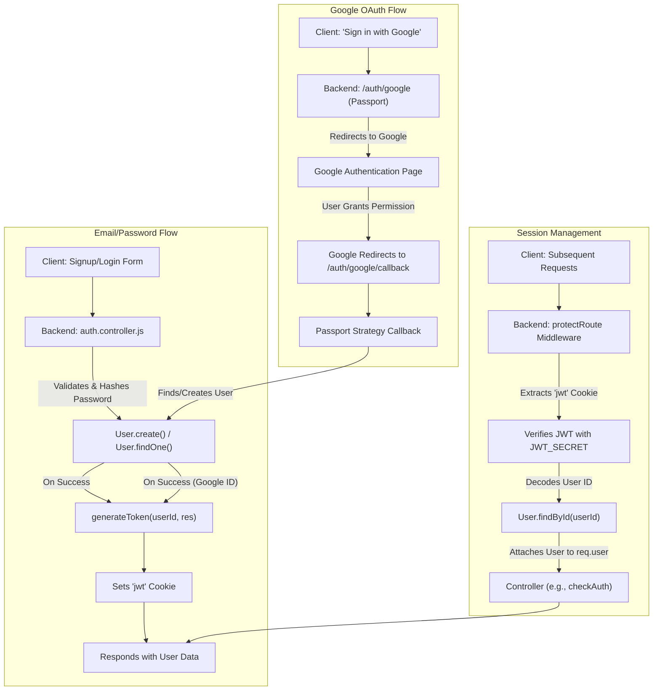
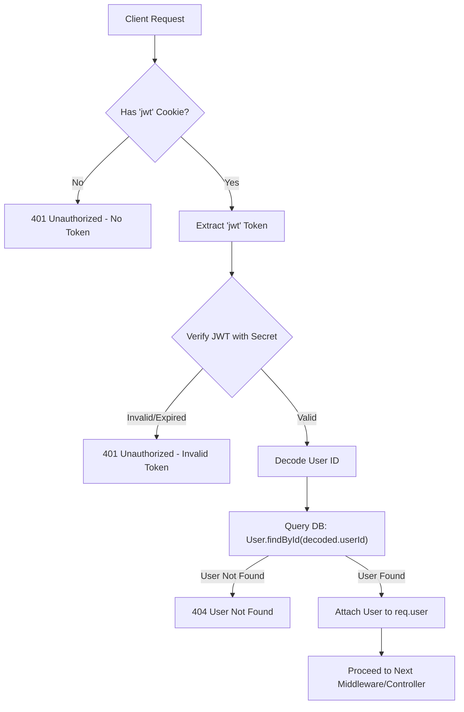

# Authentication and User Management

This section details the authentication and user management mechanisms within the application, encompassing user registration, login, session management, social login integration, and profile updates. Robust authentication is critical for securing user data and ensuring personalized experiences.

## Core Concepts

The system employs a token-based authentication system using JSON Web Tokens (JWT) for secure session management, alongside Passport.js for integrating Google OAuth. User data is persisted in a MongoDB database via Mongoose schemas.

*   **Authentication**: Verifying a user's identity (e.g., login with email/password, Google OAuth).
*   **Authorization**: Determining what actions an authenticated user is permitted to perform.
*   **Profile Management**: Allowing users to view and update their personal information like username and profile picture.

## User Data Model

The `User` model defines the structure for storing user information in the database. It accommodates both email/password-based users and users authenticated via Google, ensuring unique identifiers and necessary profile details.

```javascript
// backend/src/models/user.model.js
import mongoose from "mongoose"

const  userSchema = new mongoose.Schema(
    {
        email: {
            type: String,
            required: true,
            unique: true
        },
        username: {
            type: String,
            required: [true, "Username is required"],
            unique: true,
            trim: true,
            minlength: [3, "Username must be at least 3 characters long"],
            maxlength: [20, "Username cannot be more than 20 characters long"]
        },
        password: {
            type: String,
            minlength: 6,
        },
        profilePic: {
            type: String,
            default: "",
        },
        friends: [{
            type: mongoose.Schema.Types.ObjectId,
            ref: "User",
            default: []
        }],
        friendRequests: [{
            type: mongoose.Schema.Types.ObjectId,
            ref: "User",
            default: []
        }],
        sentRequests: [{
            type: mongoose.Schema.Types.ObjectId,
            ref: "User",
            default: []
        }],
        authProvider: {
            type: String,
            enum: ['email', 'google'],
            default: 'email'
        },
        googleId: {
            type: String,
            unique: true,
            sparse: true
        },
    },
    {
        timestamps: true
    }
);

userSchema.pre('save', async function(next) {
    if (this.authProvider === 'google' && !this.isModified('password')) {
        this.password = undefined;
    }
    if (this.authProvider === 'email' && !this.password && this.isNew) {
        return next(new Error('Password is required for email signup.'));
    }
    next();
});

const User = mongoose.model("User", userSchema);

export default User;
```
The `userSchema` includes fields for `email`, `username`, `password` (hashed), `profilePic`, `authProvider` (email or google), and `googleId`. The `pre('save')` hook handles logic specific to Google-authenticated users, ensuring they don't require a local password.
[View on GitHub](https://github.com/shinymack/Chat-App-MERN/blob/main/backend/src/models/user.model.js)

## Authentication Controllers

The `auth.controller.js` file handles all routes related to user authentication, including signup, login, logout, user session checking, and profile updates.

[View on GitHub](https://github.com/shinymack/Chat-App-MERN/blob/main/backend/src/controllers/auth.controller.js)

### User Registration (`signup`)

The `signup` controller handles new user registrations. It validates input fields, checks for existing users by email or username, hashes the password using `bcryptjs`, creates a new `User` document, and generates a JWT token for the session.

```javascript
// backend/src/controllers/auth.controller.js
export const signup = async (req, res) => {
    const {username, email, password} = req.body;
    try {
        // ... input validation and existing user checks ...

        const salt = await bcrypt.genSalt(10);
        const hashedPassword = await bcrypt.hash(password, salt);

        const newUser = new User({
            username,
            email,
            password: hashedPassword,
            authProvider: 'email'
        });
        if(newUser){
            generateToken(newUser._id, res); // Generates JWT and sets as cookie
            await newUser.save();

            res.status(201).json({
                _id: newUser._id,
                username: newUser.username,
                email: newUser.email,
                profilePic: newUser.profilePic,
                authProvider: newUser.authProvider
            });
        } else {
            res.status(400).json({message: "Invalid user data."});
        }
    } catch (error) {
        console.log("Error in signup controller", error.message)
        res.status(500).json({message: "Something went wrong."});
    }
};
```
This snippet demonstrates the core logic for user signup: validation, password hashing, user creation, and token generation.

### User Login (`login`)

The `login` controller verifies user credentials against the database. It finds the user by email, checks if they are a Google-authenticated user without a local password, compares the provided password with the stored hashed password, and issues a JWT upon successful authentication.

```javascript
// backend/src/controllers/auth.controller.js
export const login = async (req, res) => {
    const {email, password} = req.body;
    try {
        const user = await User.findOne({email});

        if(!user) {
            return res.status(400).json({message: "Invalid credentials."});
        }

        if(user.authProvider === 'google' && !user.password){
            return res.status(400).json({ message: "Please sign in with Google." });
        }

        const isPasswordCorrect = await bcrypt.compare(password, user.password);
        if(!isPasswordCorrect) {
            return res.status(400).json({message: "Invalid credentials."});
        }

        generateToken(user._id, res); // Generates JWT and sets as cookie
        res.status(200).json({
            _id: user._id,
            username: user.username,
            email: user.email,
            profilePic: user.profilePic,
            authProvider: user.authProvider,
        });
    } catch (error) {
        console.log("Error in login controller", error.message);
        res.status(500).json({message: "Something went wrong."});
    }
};
```
The `login` function handles credential verification and token issuance. It also prevents traditional login for users who originally signed up via Google and have no local password.

### Google OAuth Callback (`googleAuthCallback`)

This endpoint is the target for Google's OAuth redirect after a user authorizes the application. It receives the authenticated user information from Passport.js, generates a JWT, and redirects the user to the frontend application.

```javascript
// backend/src/controllers/auth.controller.js
export const googleAuthCallback = async (req, res) => {
    const frontendUrl = process.env.FRONTEND_URL || 'http://localhost:5173';

    try {
        if (!req.user) {
            return res.redirect(`${frontendUrl}/login?error=google_auth_failed`);
        }

        generateToken(req.user._id, res); // Generates JWT for the Google-authenticated user

        res.redirect(frontendUrl); // Redirect to frontend on success

    } catch (error) {
        console.error("Error in googleAuthCallback: ", error.message);
        res.redirect(`${frontendUrl}/login?error=google_auth_processing_error`);
    }
};
```
This callback ensures that a JWT is generated for Google users, maintaining a consistent authentication mechanism across the application.

### Profile Management (`updateProfile`, `checkUsernameAvailability`)

Users can update their profile information, such as their username and profile picture. The `updateProfile` controller handles these changes, including image uploads to Cloudinary and validation for username uniqueness. The `checkUsernameAvailability` controller provides real-time feedback on username uniqueness.

```javascript
// backend/src/controllers/auth.controller.js
export const updateProfile = async (req, res) => {
    try {
        const { profilePic, username } = req.body;
        const userId = req.user._id;
        let userToUpdate = await User.findById(userId);

        // ... username validation and uniqueness checks ...

        if (profilePic) {
            const uploadResponse = await cloudinary.uploader.upload(profilePic);
            fieldsToUpdate.profilePic = uploadResponse.secure_url;
        }

        // ... update logic ...

        generateToken(updatedUser._id, res); // Refresh token if profile data changes
        res.status(200).json(updatedUser);

    } catch (error) {
        console.error("Error in updateProfile controller", error.message);
        res.status(500).json({ message: "Internal Server Error while updating profile." });
    }
};
```
The `updateProfile` function allows users to modify their data. It integrates with Cloudinary for profile picture storage and includes logic to prevent duplicate usernames.

```javascript
// backend/src/controllers/auth.controller.js
export const checkUsernameAvailability = async (req, res) => {
    try {
        const { username } = req.params;
        const currentUserId = req.user._id;

        // ... validation and check against current username ...

        const existingUser = await User.findOne({ username: username });

        if (existingUser) {
            return res.status(200).json({ available: false, message: "Username is already taken." });
        }

        res.status(200).json({ available: true, message: "Username is available." });

    } catch (error) {
        console.error("Error in checkUsernameAvailability:", error.message);
        res.status(500).json({ available: false, message: "Error checking username availability." });
    }
};
```
The `checkUsernameAvailability` function checks if a requested username is already in use, excluding the current user's own username if it matches.

### User Logout (`logout`)

The `logout` controller simply clears the JWT cookie, effectively ending the user's session.

```javascript
// backend/src/controllers/auth.controller.js
export const logout = (req, res) => {
    try {
        res.cookie("jwt", "", {maxAge: 0}); // Clears the JWT cookie
        res.status(200).json({message: "Logged out successfully."})
    } catch(error) {
        console.log("Error in logout controller", error.message);
        res.status(500).json({message:"Internal Server Error"});
    }
};
```
This is a straightforward function to terminate a user's session by expiring their JWT cookie.

### Check Authentication Status (`checkAuth`)

This controller allows the frontend to verify if a user is currently authenticated by providing their session details, accessible via `req.user` after the `protectRoute` middleware has run.

```javascript
// backend/src/controllers/auth.controller.js
export const checkAuth = (req, res) => {
    try {
        res.status(200).json({
            _id: req.user._id,
            username: req.user.username,
            email: req.user.email,
            profilePic: req.user.profilePic,
            authProvider: req.user.authProvider,
            createdAt: req.user.createdAt
        });
    } catch (error) {
        console.log("Error in checkAuth controller", error.message);
        res.status(500).json({message: "Internal Server Error"});
    }
};
```
The `checkAuth` function returns the authenticated user's details, useful for frontend session management.

## Authentication Flow





## Passport Configuration

The `passport.config.js` file sets up Google OAuth 2.0 strategy using Passport.js. It defines how users are authenticated via Google and how their information is serialized/deserialized for session management.

[View on GitHub](https://github.com/shinymack/Chat-App-MERN/blob/main/backend/src/lib/passport.config.js)

```javascript
// backend/src/lib/passport.config.js
import passport from 'passport';
import { Strategy as GoogleStrategy } from 'passport-google-oauth20';
import User from '../models/user.model.js';
import dotenv from 'dotenv';

dotenv.config();

export const configurePassport = () => {
    passport.use(new GoogleStrategy({
        clientID: process.env.GOOGLE_CLIENT_ID,
        clientSecret: process.env.GOOGLE_CLIENT_SECRET,
        callbackURL: process.env.GOOGLE_CALLBACK_URL,
        scope: ['profile', 'email']
    },
    async (accessToken, refreshToken, profile, done) => {
        try {
            let user = await User.findOne({ googleId: profile.id });
            if (user) {
                return done(null, user);
            } else {
                // ... logic to create new user with Google profile data ...
                const newUser = new User({
                    googleId: profile.id,
                    email: profile.emails && profile.emails[0] ? profile.emails[0].value : null,
                    username: username,
                    authProvider: 'google',
                });
                await newUser.save();
                return done(null, newUser);
            }
        } catch (error) {
            return done(error, null);
        }
    }));

    passport.serializeUser((user, done) => {
        done(null, user.id);
    });

    passport.deserializeUser(async (id, done) => {
        try {
            const user = await User.findById(id);
            done(null, user);
        } catch (error) {
            done(error, null);
        }
    });
};
```
This configuration initializes the Google OAuth strategy, handling user lookup and creation based on Google profile data, and defines how user sessions are managed with `serializeUser` and `deserializeUser`.

## Authentication Middleware

The `auth.middleware.js` file contains middleware functions responsible for protecting routes by verifying JWTs and attaching authenticated user data to the request object.

[View on GitHub](https://github.com/shinymack/Chat-App-MERN/blob/main/backend/src/middleware/auth.middleware.js)

### Route Protection (`protectRoute`)

The `protectRoute` middleware extracts the JWT from the request cookies, verifies its authenticity, decodes the user ID, fetches the user from the database, and attaches the user object to `req.user`. This ensures that only authenticated requests can access protected resources.

```javascript
// backend/src/middleware/auth.middleware.js
import jwt from "jsonwebtoken"
import User from "../models/user.model.js"

export const protectRoute = async (req, res, next) => {
    try {
        const token = req.cookies.jwt; // Get token from cookie
        if(!token){
            return res.status(401).json({message: "Unauthorized - No Token Provided"});
        }

        const decoded = jwt.verify(token, process.env.JWT_SECRET) // Verify token

        if(!decoded) {
            return res.status(401).json({message: "Unauthorized - Invalid Token"});
        }
        const user = await User.findById(decoded.userId).select("-password"); // Find user by ID

        if(!user) {
            return res.status(404).json({message: "User not found"});
        }
        req.user = user; // Attach user to request

        next(); // Proceed to next middleware/controller
    } catch (error) {
        console.log("Error in protectRoute middleware", error.message);
        res.status(500).json({message: "Internal Server Error"});

    }

};
```
This snippet shows the `protectRoute` middleware, essential for securing API endpoints by validating the JWT and populating `req.user`.

### `protectRoute` Middleware Flow





## Key Integration Points

*   **Token Generation**: The `generateToken` utility (not provided in the content but referenced) is crucial for creating and setting JWTs as HTTP-only cookies upon user signup, login, and Google OAuth callback, ensuring secure session management.
*   **Secure Password Handling**: `bcryptjs` is used for hashing and comparing passwords, protecting user credentials.
*   **Cloudinary Integration**: For profile picture uploads, Cloudinary is integrated in the `updateProfile` controller, allowing for efficient media storage and delivery.
*   **Passport.js for Social Login**: Passport.js simplifies integrating Google OAuth, abstracting the complexities of the OAuth 2.0 flow and user profile management for social logins.
*   **Middleware for Authorization**: The `protectRoute` middleware is a fundamental component, ensuring that sensitive routes are only accessible by authenticated users, reinforcing the application's security posture.

Next: [Messaging and Friend Management](./2.2_messaging-and-friend-management.mdx)