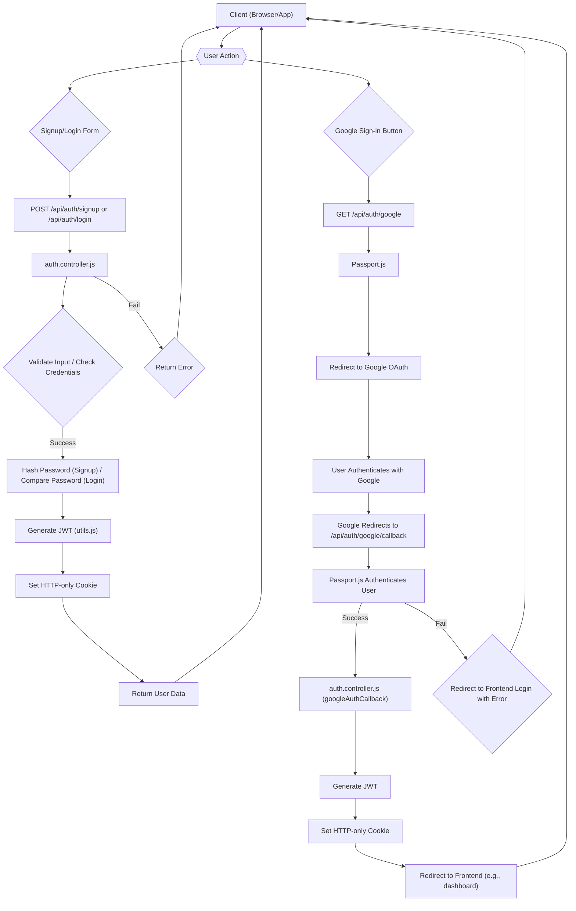
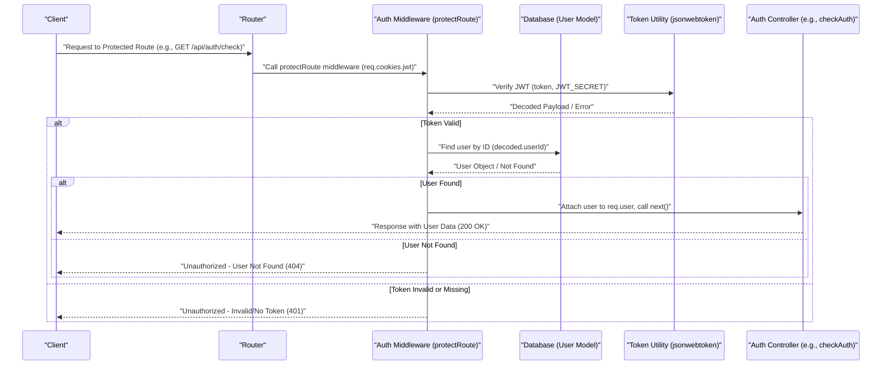

# Authentication and User Management

<TOC />

Authentication and user management are foundational to any application, ensuring that users can securely register, log in, maintain sessions, and manage their profiles. This section delves into the backend implementation of these critical features, detailing how user data is handled, sessions are managed using JWTs, and profile updates are processed.

The core components involved are:
*   **`backend/src/controllers/auth.controller.js`**: Contains the business logic for user authentication (signup, login, logout, Google OAuth), session management, profile updates, and utility functions like username availability checks.
*   **`backend/src/routes/auth.route.js`**: Defines the API endpoints for all authentication-related operations, linking them to their respective controller functions and applying middleware where necessary.
*   **`backend/src/models/user.model.js`**: Defines the Mongoose schema for the `User` model, including fields for user credentials, profile information, authentication provider, and friend relationships.
*   **`backend/src/middleware/auth.middleware.js`**: Implements the `protectRoute` middleware, responsible for verifying JWTs and authenticating users before granting access to protected routes.

## User Registration and Authentication

The authentication system supports both traditional email/password registration and Google OAuth for streamlined access. User passwords are securely hashed using `bcryptjs` before storage, and JSON Web Tokens (JWTs) are used for session management.

### User Registration (`signup`)

The `signup` controller handles new user registrations. It validates user input for username, email, and password, checks for existing users, hashes passwords, and then creates a new user record. Upon successful registration, a JWT is generated and set as an HTTP-only cookie.

```javascript
// backend/src/controllers/auth.controller.js
export const signup = async (req, res) => {
    const {username, email, password} = req.body;
    try {
        if(!username || !email || !password) {
            return res.status(400).json({message: "Please fill in all fields."});
        }
        if (password.length < 6) {
            return res.status(400).json({message: "Password must be at least 6 characters."});
        }
        const user = await User.findOne({email});
        if (user) return res.status(400).json({message: "Email already exists."});
        
        const existingUserByUsername = await User.findOne({ username });
        if (existingUserByUsername) {
            return res.status(400).json({ message: "Username already exists. Please choose another." });
        }

        const salt = await bcrypt.genSalt(10);
        const hashedPassword = await bcrypt.hash(password, salt);

        const newUser = new User({
            username,
            email,
            password: hashedPassword,
            authProvider: 'email'
        });
        if(newUser){
            generateToken(newUser._id, res); // Generate and set JWT
            await newUser.save();

            res.status(201).json({
                _id: newUser._id,
                username: newUser.username,
                email: newUser.email,   
                profilePic: newUser.profilePic,
                authProvider: newUser.authProvider
            });
        } else {
            res.status(400).json({message: "Invalid user data."});
        }
    } catch (error) {
        console.log("Error in signup controller", error.message)
        res.status(500).json({message: "Something went wrong."});
    }
};
```
[View on GitHub](https://github.com/shinymack/Chat-App-MERN/blob/main/backend/src/controllers/auth.controller.js#L7-L55)

### User Login (`login`)

The `login` controller authenticates users by verifying their email and password. It checks if the user exists, compares the provided password with the stored hash using `bcrypt.compare`, and if successful, generates a new JWT. Special handling is included for users who originally signed up via Google to prevent password-based login.

```javascript
// backend/src/controllers/auth.controller.js
export const login = async (req, res) => {
    const {email, password} = req.body;
    try {
        const user = await User.findOne({email});

        if(!user) {
            return res.status(400).json({message: "Invalid credentials."});
        }

        if(user.authProvider === 'google' && !user.password){
            return res.status(400).json({ message: "Please sign in with Google." });
        }

        const isPasswordCorrect = await bcrypt.compare(password, user.password);
        if(!isPasswordCorrect) {
            return res.status(400).json({message: "Invalid credentials."});
        }

        generateToken(user._id, res); // Generate and set JWT
        res.status(200).json({
            _id: user._id,
            username: user.username,
            email: user.email,
            profilePic: user.profilePic,
            authProvider: user.authProvider,
        });
    } catch (error) {
        console.log("Error in login controller", error.message);
        res.status(500).json({message: "Something went wrong."});
    }
};
```
[View on GitHub](https://github.com/shinymack/Chat-App-MERN/blob/main/backend/src/controllers/auth.controller.js#L57-L86)

### Google OAuth Flow

The application integrates Google OAuth for alternative authentication. This involves using `passport.js` with the `passport-google-oauth20` strategy.
*   **`/auth/google`**: Initiates the Google authentication flow, redirecting the user to Google's login page.
*   **`/auth/google/callback`**: Google redirects back to this endpoint after user authentication. `passport.authenticate` handles user verification, creation (if new), or retrieval. The `googleAuthCallback` controller then generates a JWT and redirects the user to the frontend.

```javascript
// backend/src/routes/auth.route.js
router.get(
    '/google',
    passport.authenticate('google', { scope: ['profile', 'email'] })
);
router.get(
    '/google/callback',
    passport.authenticate('google', {
        failureRedirect: 'http://localhost:5173/login', 
        failureMessage: true 
    }),
    googleAuthCallback 
);
```
[View on GitHub](https://github.com/shinymack/Chat-App-MERN/blob/main/backend/src/routes/auth.route.js#L26-L35)

```javascript
// backend/src/controllers/auth.controller.js
export const googleAuthCallback = async (req, res) => {
 const frontendUrl = process.env.FRONTEND_URL || 'http://localhost:5173';

    try {
        if (!req.user) {
            return res.redirect(`${frontendUrl}/login?error=google_auth_failed`);
        }

        generateToken(req.user._id, res); // Generate and set JWT

        res.redirect(frontendUrl); // Redirect to frontend

    } catch (error) {
        console.error("Error in googleAuthCallback: ", error.message);
        res.redirect(`${frontendUrl}/login?error=google_auth_processing_error`);
    }
};
```
[View on GitHub](https://github.com/shinymack/Chat-App-MERN/blob/main/backend/src/controllers/auth.controller.js#L119-L135)

### Authentication Flow Diagram

The following diagram illustrates the high-level authentication flow for both traditional and Google sign-ins.





## Session Management and Protected Routes

After a successful login, a JWT is issued and stored in an HTTP-only cookie. This token is then used to authenticate subsequent requests to protected resources.

### Logout (`logout`)

The `logout` controller simply clears the `jwt` cookie by setting its `maxAge` to 0, effectively ending the user's session.

```javascript
// backend/src/controllers/auth.controller.js
export const logout = (req, res) => {
    try {
        res.cookie("jwt", "", {maxAge: 0});
        res.status(200).json({message: "Logged out successfully."})
    } catch(error) {
        console.log("Error in logout controller", error.message);
        res.status(500).json({message:"Internal Server Error"}); 
    }
};
```
[View on GitHub](https://github.com/shinymack/Chat-App-MERN/blob/main/backend/src/controllers/auth.controller.js#L88-L96)

### Protected Route Middleware (`protectRoute`)

The `protectRoute` middleware ensures that only authenticated users can access specific routes. It extracts the JWT from the request cookies, verifies it using `jsonwebtoken`, and then retrieves the corresponding user from the database. If the token is valid, the user object is attached to `req.user`, allowing downstream controllers to access authenticated user data.

```javascript
// backend/src/middleware/auth.middleware.js
import jwt from "jsonwebtoken"
import User from "../models/user.model.js"

export const protectRoute = async (req, res, next) => {
    try {
        const token = req.cookies.jwt;
        if(!token){
            return res.status(401).json({message: "Unauthorized - No Token Provided"});
        }

        const decoded = jwt.verify(token, process.env.JWT_SECRET)

        if(!decoded) {
            return res.status(401).json({message: "Unauthorized - Invalid Token"});
        }
        const user = await User.findById(decoded.userId).select("-password");

        if(!user) {
            return res.status(404).json({message: "User not found"});
        }
        req.user = user; // Attach user to request

        next(); // Proceed to next middleware/controller
    } catch (error) {
        console.log("Error in protectRoute middleware", error.message);
        res.status(500).json({message: "Internal Server Error"});

    }

};
```
[View on GitHub](https://github.com/shinymack/Chat-App-MERN/blob/main/backend/src/middleware/auth.middleware.js#L4-L31)

### Check Authentication Status (`checkAuth`)

This endpoint allows the frontend to verify if a user is currently authenticated and retrieve their profile information. It is protected by the `protectRoute` middleware.

```javascript
// backend/src/controllers/auth.controller.js
export const checkAuth = (req, res) => {
    try {
        res.status(200).json({
            _id: req.user._id,
            username: req.user.username,
            email: req.user.email,
            profilePic: req.user.profilePic,
            authProvider: req.user.authProvider,
            createdAt: req.user.createdAt
        });
    } catch (error) {
        console.log("Error in checkAuth controller", error.message);
        res.status(500).json({message: "Internal Server Error"});
    }
};
```
[View on GitHub](https://github.com/shinymack/Chat-App-MERN/blob/main/backend/src/controllers/auth.controller.js#L99-L115)

### Protected Route Flow Diagram

This sequence diagram illustrates how `protectRoute` middleware intercepts a request and validates the user's JWT.





## User Profile Management

Users can manage aspects of their profile, specifically their username and profile picture.

### Check Username Availability (`checkUsernameAvailability`)

Before a user updates their username or during signup, this controller provides an endpoint to check if a desired username is available. It considers current username and ensures uniqueness across other users.

```javascript
// backend/src/controllers/auth.controller.js
export const checkUsernameAvailability = async (req, res) => {
    try {
        const { username } = req.params;
        const currentUserId = req.user._id; 

        if (!username || username.trim().length < 3) {
            return res.status(400).json({ available: false, message: "Username must be at least 3 characters." });
        }
        if (username.trim().length > 20) {
            return res.status(400).json({ available: false, message: "Username cannot be more than 20 characters." });
        }
    
        if (req.user.username === username) {
            return res.status(200).json({ available: true, message: "This is your current username." });
        }

        const existingUser = await User.findOne({ username: username });

        if (existingUser) {
            return res.status(200).json({ available: false, message: "Username is already taken." });
        }

        res.status(200).json({ available: true, message: "Username is available." });

    } catch (error) {
        console.error("Error in checkUsernameAvailability:", error.message);
        res.status(500).json({ available: false, message: "Error checking username availability." });
    }
};
```
[View on GitHub](https://github.com/shinymack/Chat-App-MERN/blob/main/backend/src/controllers/auth.controller.js#L137-L177)

### Update Profile (`updateProfile`)

The `updateProfile` controller allows authenticated users to change their username and/or update their profile picture. Profile pictures are uploaded to Cloudinary, and the secure URL is stored in the user's record. If the username is changed, it's validated for uniqueness, and a new JWT is issued to reflect the updated user information.

```javascript
// backend/src/controllers/auth.controller.js
export const updateProfile = async (req, res) => {
    try {
        const { profilePic, username } = req.body; 
        const userId = req.user._id;
        let userToUpdate = await User.findById(userId);

        if (!userToUpdate) {
            return res.status(404).json({ message: "User not found." });
        }

        const fieldsToUpdate = {};
        let newUsername = username ? username.trim() : null;

        // Handle username update
        if (newUsername && newUsername !== userToUpdate.username) {
            if (newUsername.length < 3 || newUsername.length > 20) {
                return res.status(400).json({ message: "Username must be between 3 and 20 characters." });
            }
            const existingUserWithNewUsername = await User.findOne({ username: newUsername, _id: { $ne: userId } });
            if (existingUserWithNewUsername) {
                return res.status(400).json({ message: "This username is already taken by someone else." });
            }
            fieldsToUpdate.username = newUsername;
        }

        // Handle profile picture update
        if (profilePic) {
            const uploadResponse = await cloudinary.uploader.upload(profilePic);
            fieldsToUpdate.profilePic = uploadResponse.secure_url;
        }

        if (Object.keys(fieldsToUpdate).length === 0) {
            return res.status(400).json({ message: "No changes provided to update." });
        }

        const updatedUser = await User.findByIdAndUpdate(userId, { $set: fieldsToUpdate }, { new: true });

        if (!updatedUser) {
            return res.status(404).json({ message: "Failed to update user."});
        }

        generateToken(updatedUser._id, res); // Refresh JWT with new user info

        res.status(200).json(updatedUser);

    } catch (error) {
        console.error("Error in updateProfile controller", error.message);
        if (error.code === 11000 && error.keyValue && error.keyValue.username) { 
            return res.status(400).json({ message: "This username is already taken." });
        }
        res.status(500).json({ message: "Internal Server Error while updating profile." });
    }
};
```
[View on GitHub](https://github.com/shinymack/Chat-App-MERN/blob/main/backend/src/controllers/auth.controller.js#L182-L248)

## User Model (`user.model.js`)

The `User` Mongoose schema defines the structure for user documents in the database. It includes fields for `email`, `username`, `password`, `profilePic`, `friends`, `friendRequests`, `sentRequests`, `authProvider`, and `googleId`. The `authProvider` field is crucial for distinguishing between email-based and Google-authenticated users. A `pre-save` hook handles setting `password` to `undefined` for Google users if they haven't explicitly set a password.

```javascript
// backend/src/models/user.model.js
import mongoose from "mongoose"

const  userSchema = new mongoose.Schema(
    {
        email: { 
            type: String,
            required: true,
            unique: true
        },
        username: {
            type: String,
            required: [true, "Username is required"],
            unique: true,
            trim: true,
            minlength: [3, "Username must be at least 3 characters long"],
            maxlength: [20, "Username cannot be more than 20 characters long"]
        }
        ,
        password: {
            type: String,
            minlength: 6,
        },
        profilePic: {
            type: String,
            default: "",
        },
        friends: [{
            type: mongoose.Schema.Types.ObjectId,
            ref: "User",
            default: [] 
        }],
        friendRequests: [{ 
            type: mongoose.Schema.Types.ObjectId,
            ref: "User",
            default: []
        }],
        sentRequests: [{ 
            type: mongoose.Schema.Types.ObjectId,
            ref: "User",
            default: []
        }],
        authProvider: {
            type: String,
            enum: ['email', 'google'],
            default: 'email'
        },
        googleId: {
            type: String,
            unique: true,
            sparse: true
        },
    },
    { 
        timestamps: true
    } 
);

userSchema.pre('save', async function(next) {
    if (this.authProvider === 'google' && !this.isModified('password')) {
        this.password = undefined;
    }
    if (this.authProvider === 'email' && !this.password && this.isNew) {
        return next(new Error('Password is required for email signup.'));
    }
    next();
});

const User = mongoose.model("User", userSchema);

export default User;
```
[View on GitHub](https://github.com/shinymack/Chat-App-MERN/blob/main/backend/src/models/user.model.js#L4-L67)

## Key Integration Points

*   **JWT-based Session Management**: All authentication relies on JWTs issued upon successful login/signup and stored in HTTP-only cookies. This provides a stateless authentication mechanism.
*   **Middleware for Protection**: The `protectRoute` middleware is strategically placed on routes that require user authentication, centralizing access control logic.
*   **Google OAuth Strategy**: `passport.js` is used to abstract the complexities of Google OAuth, allowing for seamless integration.
*   **Password Hashing**: `bcryptjs` ensures that user passwords are never stored in plain text, greatly enhancing security.
*   **Cloudinary Integration**: For profile picture management, `cloudinary` is used to handle image uploads, providing scalability and content delivery.
*   **User Schema Design**: The `User` model accounts for different authentication providers (`email`, `google`) and includes fields for managing friend relationships, laying the groundwork for social features.
*   **Frontend-Backend Communication**: The backend endpoints return user data, success messages, or specific error messages, enabling the frontend to provide appropriate feedback and manage client-side state.

This robust authentication and user management system forms the secure foundation for the entire application, handling diverse login methods and protecting user data effectively.

Next: [Friend and Message Management](./2.2_friend-and-message-management.mdx)