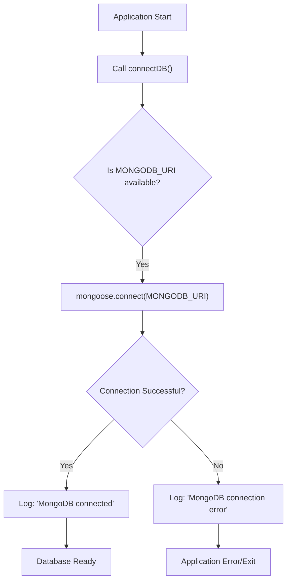

 # Data Models and Schema

This section details the Mongoose schemas used for representing `User` and `Message` entities within the database, along with how the application connects to MongoDB. Understanding these data models is crucial for comprehending how user information and communication records are structured and managed.

## Database Connection

The `connectDB` function in `backend/src/lib/db.js` is responsible for establishing a connection to the MongoDB database using Mongoose. It leverages the `MONGODB_URI` environment variable for connection details.

```javascript
// backend/src/lib/db.js
import mongoose from "mongoose";

export const connectDB = async () => {
  try {
    const conn = await mongoose.connect(process.env.MONGODB_URI);
    console.log(`MongoDB connected:  ${conn.connection.host}`);
  } catch (error) {
    console.log("MongoDB connection error: ", error);
  }
};
```

This ensures that the application has a persistent and reliable connection to the database before handling any requests that involve data interaction.

[View on GitHub](https://github.com/shinymack/Chat-App-MERN/blob/main/backend/src/lib/db.js)

### DB Connection Flow

The following diagram illustrates the simple flow of establishing a database connection:





## User Model

The `User` model, defined in `backend/src/models/user.model.js`, represents a user within the system. It stores essential user information such as authentication details, profile data, and relationships with other users (friends, friend requests).

```javascript
// backend/src/models/user.model.js
import mongoose from "mongoose";

const userSchema = new mongoose.Schema(
  {
    email: {
      type: String,
      required: true,
      unique: true,
    },
    username: {
      type: String,
      required: [true, "Username is required"],
      unique: true,
      trim: true,
      minlength: [3, "Username must be at least 3 characters long"],
      maxlength: [20, "Username cannot be more than 20 characters long"],
    },
    password: {
      type: String,
      minlength: 6,
    },
    profilePic: {
      type: String,
      default: "",
    },
    friends: [
      {
        type: mongoose.Schema.Types.ObjectId,
        ref: "User",
        default: [],
      },
    ],
    friendRequests: [
      {
        type: mongoose.Schema.Types.ObjectId,
        ref: "User",
        default: [],
      },
    ],
    sentRequests: [
      {
        type: mongoose.Schema.Types.ObjectId,
        ref: "User",
        default: [],
      },
    ],
    authProvider: {
      type: String,
      enum: ["email", "google"],
      default: "email",
    },
    googleId: {
      type: String,
      unique: true,
      sparse: true,
    },
  },
  {
    timestamps: true,
  }
);

userSchema.pre("save", async function (next) {
  if (this.authProvider === "google" && !this.isModified("password")) {
    this.password = undefined;
  }
  if (this.authProvider === "email" && !this.password && this.isNew) {
    return next(new Error("Password is required for email signup."));
  }
  next();
});

const User = mongoose.model("User", userSchema);

export default User;
```

[View on GitHub](https://github.com/shinymack/Chat-App-MERN/blob/main/backend/src/models/user.model.js)

### User Schema Fields

*   **`email`**: User's email address. Must be unique and is required for account creation.
*   **`username`**: Unique identifier for the user within the application. It has specific length constraints (3-20 characters) and is trimmed.
*   **`password`**: Hashed password for email-based authentication. Minimum length of 6 characters. This field is set to `undefined` if `authProvider` is 'google' and the password isn't being explicitly modified.
*   **`profilePic`**: URL to the user's profile picture. Defaults to an empty string.
*   **`friends`**: An array of `ObjectId`s referencing other `User` documents, representing the user's friends.
*   **`friendRequests`**: An array of `ObjectId`s referencing `User` documents who have sent this user a friend request (incoming requests).
*   **`sentRequests`**: An array of `ObjectId`s referencing `User` documents to whom this user has sent a friend request (outgoing requests).
*   **`authProvider`**: Indicates the authentication method used, either `'email'` or `'google'`. Defaults to `'email'`.
*   **`googleId`**: Unique identifier provided by Google for users authenticated via Google OAuth. It's sparse, meaning it can be null for non-Google authenticated users, but unique if present.
*   **`timestamps`**: Mongoose option that automatically adds `createdAt` and `updatedAt` fields to the document.

### Pre-save Hook

A `pre('save')` hook is implemented to handle logic before a `User` document is saved:

```javascript
// backend/src/models/user.model.js (Excerpt)
userSchema.pre('save', async function(next) {
    if (this.authProvider === 'google' && !this.isModified('password')) {
        this.password = undefined; // No password for Google auth
    }
    if (this.authProvider === 'email' && !this.password && this.isNew) {
        return next(new Error('Password is required for email signup.')); // Enforce password for new email users
    }
    next();
});
```

This hook ensures:
*   If a user authenticates via Google and their password field isn't explicitly being modified, the `password` field is set to `undefined`, as it's not relevant for Google authentication.
*   For new users signing up with `email` as `authProvider`, a password *must* be provided. If not, an error is thrown.

## Message Model

The `Message` model, defined in `backend/src/models/message.model.js`, represents a single message exchanged between two users.

```javascript
// backend/src/models/message.model.js
import mongoose from "mongoose";

const messageSchema = new mongoose.Schema(
  {
    senderId: {
      type: mongoose.Schema.Types.ObjectId,
      ref: "User",
      required: true,
    },
    receiverId: {
      type: mongoose.Schema.Types.ObjectId,
      ref: "User",
      required: true,
    },
    text: {
      type: String,
    },
    image: {
      type: String,
    },
  },
  { timestamps: true }
);

export default mongoose.model("Message", messageSchema);
```

[View on GitHub](https://github.com/shinymack/Chat-App-MERN/blob/main/backend/src/models/message.model.js)

### Message Schema Fields

*   **`senderId`**: An `ObjectId` referencing the `User` who sent the message. This field is required.
*   **`receiverId`**: An `ObjectId` referencing the `User` who is the intended recipient of the message. This field is required.
*   **`text`**: The actual content of the message as a string.
*   **`image`**: A URL pointing to an image attached to the message. This field is optional.
*   **`timestamps`**: Mongoose option that automatically adds `createdAt` and `updatedAt` fields.

## Data Model Relationship

The `User` and `Message` models are interconnected, forming the core of the application's data structure.


```mermaid
graph LR
    User["User Model"] -->| "senderId" | Message["Message Model"];
    User["User Model"] -->| "receiverId" | Message["Message Model"];
    User["User Model"] -- "friends" --> User;
    User["User Model"] -- "friendRequests" --> User;
    User["User Model"] -- "sentRequests" --> User;
```


This diagram illustrates:
*   A `User` can be a `senderId` of a `Message`.
*   A `User` can be a `receiverId` of a `Message`.
*   The `User` model has self-referencing relationships for `friends`, `friendRequests`, and `sentRequests`, indicating that these fields store references to other `User` documents.

## Key Integration Points

The data models are central to the backend's functionality:

*   **Authentication**: The `User` model is critical for user registration, login, and managing user profiles. The `authProvider` and `googleId` fields enable flexible authentication strategies.
*   **Messaging**: The `Message` model directly supports the core chat functionality, linking messages to their senders and receivers.
*   **Social Features**: The `friends`, `friendRequests`, and `sentRequests` arrays in the `User` model are fundamental for implementing social networking features like adding friends and managing friend requests.
*   **Data Consistency**: Mongoose's schema validation, unique constraints (`email`, `username`), and required fields ensure data integrity. The `pre('save')` hook on the `User` schema further enforces business logic related to passwords and authentication providers.
*   **Relationship Management**: The `ref: "User"` in both models (and within `User` for self-references) allows for easy population of related documents using Mongoose, simplifying data retrieval for complex queries (e.g., getting a user's friends or all messages in a conversation).

Next: [Authentication and Authorization](./2.3_authentication-and-authorization.mdx)