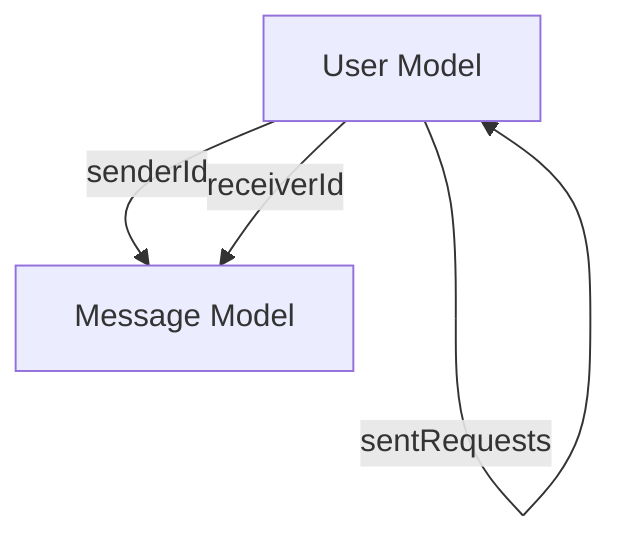
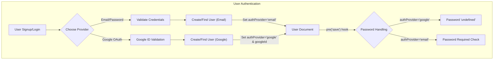

 
---
title: "Data Models and Schema"
description: "Outlines the data structures and schemas used for users and messages within the application."
sidebar_position: 22
---

# Data Models and Schema

This document details the core data structures and schemas for users and messages within the application. These models define how user profiles are stored, including authentication details and social connections, and how individual messages are structured, linking senders and receivers. Understanding these schemas is fundamental to grasping the application's data flow and relational integrity.

The primary models covered are `User` and `Message`, both leveraging Mongoose for schema definition and interaction with MongoDB.

## User Model

The `User` model (`backend/src/models/user.model.js`) represents an individual user within the system. It encompasses essential profile information, authentication credentials, and mechanisms for managing friendships.

### User Schema Definition

The schema defines various fields to store user-specific data, including unique identifiers, authentication methods, and social connections.

```javascript showLineNumbers
// backend/src/models/user.model.js
import mongoose from "mongoose"

const  userSchema = new mongoose.Schema(
    {
        email: { 
            type: String,
            required: true,
            unique: true
        },
        username: {
            type: String,
            required: [true, "Username is required"],
            unique: true,
            trim: true,
            minlength: [3, "Username must be at least 3 characters long"],
            maxlength: [20, "Username cannot be more than 20 characters long"]
        }
        ,
        password: {
            type: String,
            minlength: 6,
        },
        profilePic: {
            type: String,
            default: "",
        },
        friends: [{
            type: mongoose.Schema.Types.ObjectId,
            ref: "User",
            default: [] 
        }],
        friendRequests: [{ // Incoming friend requests
            type: mongoose.Schema.Types.ObjectId,
            ref: "User",
            default: []
        }],
        sentRequests: [{ // Outgoing friend requests
            type: mongoose.Schema.Types.ObjectId,
            ref: "User",
            default: []
        }],
        authProvider: {
            type: String,
            enum: ['email', 'google'],
            default: 'email'
        },
        googleId: {
            type: String,
            unique: true,
            sparse: true
        },
    },
    { 
        timestamps: true
    } 
);
```

[View User Schema on GitHub](https://github.com/shinymack/Chat-App-MERN/blob/main/backend/src/models/user.model.js)

### User Fields Breakdown

| Field            | Type                          | Description                                                                 | Constraints                                     |
| :--------------- | :---------------------------- | :-------------------------------------------------------------------------- | :---------------------------------------------- |
| `email`          | `String`                      | User's email address. Used for authentication.                              | Required, Unique                                |
| `username`       | `String`                      | User's chosen display name.                                                 | Required, Unique, Trimmed, 3-20 chars           |
| `password`       | `String`                      | Hashed password for 'email' authProvider.                                   | Minimum 6 characters                            |
| `profilePic`     | `String`                      | URL to the user's profile picture.                                          | Default: empty string                           |
| `friends`        | `Array<ObjectId>` (ref: User) | List of Object IDs of other users who are friends.                          | Default: empty array                            |
| `friendRequests` | `Array<ObjectId>` (ref: User) | List of Object IDs of users who have sent a friend request to this user.    | Default: empty array                            |
| `sentRequests`   | `Array<ObjectId>` (ref: User) | List of Object IDs of users to whom this user has sent a friend request.    | Default: empty array                            |
| `authProvider`   | `String`                      | Indicates the authentication method used (e.g., 'email', 'google').       | Enum: ['email', 'google'], Default: 'email'     |
| `googleId`       | `String`                      | Unique ID provided by Google for 'google' authProvider.                     | Unique (sparse, allows nulls for 'email' users) |
| `timestamps`     | `Boolean`                     | Mongoose automatically manages `createdAt` and `updatedAt` fields.          | `true`                                          |

### Pre-Save Hook for Authentication

A `pre('save')` middleware is implemented to handle specific logic before a user document is saved, particularly concerning password management for different authentication providers.

```javascript showLineNumbers
// backend/src/models/user.model.js (lines 62-71)
userSchema.pre('save', async function(next) {
    if (this.authProvider === 'google' && !this.isModified('password')) {
        this.password = undefined;
    }
    if (this.authProvider === 'email' && !this.password && this.isNew) {
        return next(new Error('Password is required for email signup.'));
    }
    next();
});
```
[View Pre-Save Hook on GitHub](https://github.com/shinymack/Chat-App-MERN/blob/main/backend/src/models/user.model.js#L62-L71)

This hook ensures:
*   For Google authenticated users, the `password` field is explicitly set to `undefined` if it hasn't been modified, preventing accidental saving of null or empty values.
*   For email authenticated users, a password is required during new user creation.

## Message Model

The `Message` model (`backend/src/models/message.model.js`) is responsible for storing individual chat messages exchanged between users. It establishes clear references to the sender and receiver users.

### Message Schema Definition

The schema defines the content of a message, including references to its sender and receiver, and optional text or image content.

```javascript showLineNumbers
// backend/src/models/message.model.js
import express from "express";
import mongoose from "mongoose";

const messageSchema = new mongoose.Schema(
    {
     senderId: {
        type: mongoose.Schema.Types.ObjectId,
        ref: "User",
        required: true,
     },
     receiverId: {
        type: mongoose.Schema.Types.ObjectId,
        ref: "User",
        required: true,
     },
     text: {
        type: String,
     },
     image: {
        type: String,
     },
    },
    {timestamps: true}
);

export default mongoose.model("Message", messageSchema);
```
[View Message Schema on GitHub](https://github.com/shinymack/Chat-App-MERN/blob/main/backend/src/models/message.model.js)

### Message Fields Breakdown

| Field        | Type                          | Description                                         | Constraints    |
| :----------- | :---------------------------- | :-------------------------------------------------- | :------------- |
| `senderId`   | `ObjectId` (ref: User)        | The ID of the user who sent the message.            | Required       |
| `receiverId` | `ObjectId` (ref: User)        | The ID of the user who is the intended recipient.   | Required       |
| `text`       | `String`                      | The textual content of the message.                 | Optional       |
| `image`      | `String`                      | URL to an image attached to the message.            | Optional       |
| `timestamps` | `Boolean`                     | Mongoose automatically manages `createdAt` and `updatedAt` fields. | `true`         |

## Data Model Relationships

The `User` and `Message` models are interconnected to enable the core chat functionality. Messages are always linked to specific users as both senders and receivers, and users can manage relationships with other users.





## User Authentication Flow

The `User` model also underpins the authentication process, differentiating between email-based and Google-based sign-ups and logins. The `authProvider` field and `googleId` field are key to managing these divergent authentication paths.





## Key Integration Points

*   **Relational Integrity**: `senderId` and `receiverId` in the `Message` model strictly reference `User` documents, ensuring that every message is tied to valid users. Similarly, `friends`, `friendRequests`, and `sentRequests` in the `User` model maintain references to other `User` documents.
*   **Authentication Strategy**: The `authProvider` field in the `User` schema is crucial for determining how a user authenticates. This design allows the application to support multiple authentication methods gracefully, ensuring that password handling logic is applied conditionally (e.g., no password for Google-authenticated users).
*   **Scalability of Social Features**: The arrays for `friends`, `friendRequests`, and `sentRequests` allow for direct management of user relationships within the `User` document, simplifying queries for social interactions. While these arrays grow, Mongoose and MongoDB are efficient in handling these types of sub-documents and references.
*   **Timestamping**: Both models leverage Mongoose's `timestamps: true` option, which automatically adds `createdAt` and `updatedAt` fields. This is invaluable for tracking the lifecycle of users and messages, supporting features like message ordering, activity feeds, and data retention policies.

Next: [Backend Services and Utilities](./2.3_backend-services-and-utilities.mdx)
```