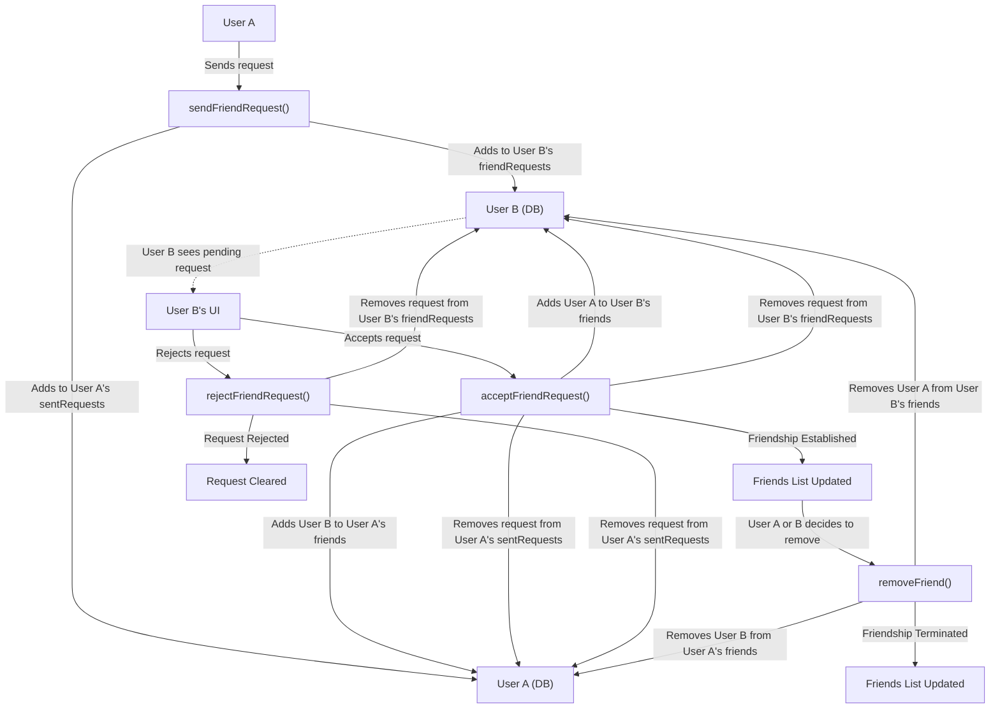
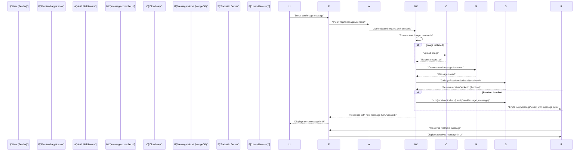

# Friend and Message Management
<TOC />

This section details the backend implementation for managing user friendships and facilitating real-time message communication within the application. It covers the core logic for sending, accepting, rejecting, and removing friend requests, as well as handling direct messages, including text and image content, with real-time delivery via WebSockets.

## Friend Management Logic

Friend relationships are managed through a set of API endpoints that interact with the `User` model, updating various arrays like `friends`, `friendRequests`, and `sentRequests`. All friend management operations are protected routes, ensuring only authenticated users can perform these actions.

The primary controller for friend management is located at `backend/src/controllers/friend.controller.js`.

### Sending a Friend Request

Users can send friend requests to other users by providing a username or email. The system checks for existing friendships, pending requests, or requests already sent to prevent duplicates.

```javascript showLineNumbers
// backend/src/controllers/friend.controller.js
export const sendFriendRequest = async (req, res) => {
    try {
        const { identifier } = req.body; // Expecting { identifier: "some_username_or_email" }
        const senderId = req.user._id;

        if (!identifier) {
            return res.status(400).json({ message: "Username or email is required." });
        }

        // Find receiver by username OR email
        const receiver = await User.findOne({
            $or: [{ username: identifier }, { email: identifier }]
        });

        if (!receiver) {
            return res.status(404).json({ message: "User not found." });
        }
        
        const receiverId = receiver._id;

        if (senderId.toString() === receiverId.toString()) {
            return res.status(400).json({ message: "You cannot send a friend request to yourself." });
        }

        const sender = await User.findById(senderId);

        if (sender.friends.includes(receiverId)) {
            return res.status(400).json({ message: "You are already friends with this user." });
        }
        if (sender.sentRequests.includes(receiverId)) {
            return res.status(400).json({ message: "Friend request already sent." });
        }
        if (sender.friendRequests.includes(receiverId)) {
            return res.status(400).json({ message: "This user has already sent you a friend request." });
        }

        sender.sentRequests.push(receiverId);
        receiver.friendRequests.push(senderId);

        await sender.save();
        await receiver.save();

        res.status(200).json({ message: "Friend request sent successfully." });

    } catch (error) {
        console.error("Error in sendFriendRequest: ", error.message);
        res.status(500).json({ message: "Internal server error", error: error.message });
    }
};
```
[View on GitHub](https://github.com/shinymack/Chat-App-MERN/blob/main/backend/src/controllers/friend.controller.js#L11-L67)

### Accepting a Friend Request

When a user accepts a friend request, both users' `friends` lists are updated, and the corresponding entries are removed from their `friendRequests` and `sentRequests` arrays.

```javascript showLineNumbers
// backend/src/controllers/friend.controller.js
export const acceptFriendRequest = async (req, res) => {
    try {
        const { senderId } = req.params; // ID of the user who sent the request
        const receiverId = req.user._id; // Current user accepting the request

        const sender = await User.findById(senderId);
        const receiver = await User.findById(receiverId);

        if (!sender || !receiver) {
            return res.status(404).json({ message: "User not found." });
        }

        if (!receiver.friendRequests.includes(senderId)) {
            return res.status(400).json({ message: "Friend request not found or already handled." });
        }

        // Add to friends list for both users
        receiver.friends.push(senderId);
        sender.friends.push(receiverId);

        // Remove from requests lists
        receiver.friendRequests = receiver.friendRequests.filter(id => id.toString() !== senderId.toString());
        sender.sentRequests = sender.sentRequests.filter(id => id.toString() !== receiverId.toString());

        await receiver.save();
        await sender.save();

        res.status(200).json({ message: "Friend request accepted." });

    } catch (error) {
        console.error("Error in acceptFriendRequest: ", error.message);
        res.status(500).json({ message: "Internal server error", error: error.message });
    }
};
```
[View on GitHub](https://github.com/shinymack/Chat-App-MERN/blob/main/backend/src/controllers/friend.controller.js#L70-L113)

### Rejecting a Friend Request

If a user rejects a request, the request is simply removed from both the receiver's `friendRequests` and the sender's `sentRequests` arrays.

### Removing a Friend

Users can remove existing friends. This involves filtering the `friends` array for both users to remove each other's IDs.

### Retrieving Friends and Requests

Endpoints are provided to fetch the current user's list of friends, pending incoming friend requests, and outgoing sent friend requests. These endpoints use Mongoose's `populate` method to retrieve detailed user information for the related IDs.

```javascript showLineNumbers
// backend/src/controllers/friend.controller.js
export const getFriends = async (req, res) => {
    try {
        const userId = req.user._id;
        const user = await User.findById(userId).populate({
            path: "friends",
            select: "username email profilePic _id" 
        });

        if (!user) {
            return res.status(404).json({ message: "User not found." });
        }

        res.status(200).json(user.friends);

    } catch (error) {
        console.error("Error in getFriends: ", error.message);
        res.status(500).json({ message: "Internal server error", error: error.message });
    }
};
```
[View on GitHub](https://github.com/shinymack/Chat-App-MERN/blob/main/backend/src/controllers/friend.controller.js#L182-L200)

### Friend Request Lifecycle

The following diagram illustrates the typical flow of a friend request:





## Message Management Logic

The `message.controller.js` handles all operations related to sending and retrieving direct messages between users. It integrates with Cloudinary for image uploads and Socket.io for real-time message delivery.

### Getting Users for Sidebar

The `getUsersForSidebar` function retrieves a list of all users in the system, excluding the currently logged-in user. This is typically used to populate a chat sidebar where a user can select another user to initiate a conversation.

```javascript showLineNumbers
// backend/src/controllers/message.controller.js
export const getUsersForSidebar = async (req, res) => {
    try {
        const loggedInUserId = req.user._id;
        const filteredUsers = await User.find({
            _id: { $ne: loggedInUserId }}).select("-password");  
        res.status(200).json(filteredUsers);
    }
    catch (error) {
        console.log("Error in getUsersForSidebar: ", error);
        res.status(500).json({ error: "Internal Server Error" });
    }
};
```
[View on GitHub](https://github.com/shinymack/Chat-App-MERN/blob/main/backend/src/controllers/message.controller.js#L8-L19)

### Retrieving Messages

Messages between two users are fetched by querying the `Message` collection for documents where the `senderId` and `receiverId` match the current user and the target chat user in either direction.

```javascript showLineNumbers
// backend/src/controllers/message.controller.js
export const getMessages = async (req, res) => {
    try {
        const {id : userToChatId } = req.params;
        const myId = req.user._id;

        const messages = await Message.find({
            $or: [
                {senderId: myId, receiverId:userToChatId},
                {senderId: userToChatId, receiverId: myId}
            ]
        });
        res.status(200).json(messages);
    } catch (error) {
        console.log("Error in getMessages controller:  ", error);
        res.status(500).json({ error: "Internal Server Error" });
    }
};
```
[View on GitHub](https://github.com/shinymack/Chat-App-MERN/blob/main/backend/src/controllers/message.controller.js#L21-L36)

### Sending Messages

The `sendMessage` function handles both text and image messages.
*   If an `image` is provided in the request body, it's uploaded to Cloudinary, and the secure URL is stored.
*   A new `Message` document is created and saved to the database.
*   Crucially, it integrates with `Socket.io` to emit a `newMessage` event to the receiver in real-time if they are currently online.

```javascript showLineNumbers
// backend/src/controllers/message.controller.js
export const sendMessage = async (req, res) => {
    try {
        const { text, image } = req.body;
        const { id: receiverId } = req.params;
        const senderId = req.user._id;

        let imageUrl;
        if (image) {
            const uploadResponse = await cloudinary.uploader.upload(image);
            imageUrl = uploadResponse.secure_url;
        }
        const newMessage = new Message({
            senderId,
            receiverId,
            text,
            image: imageUrl,
        });

        await newMessage.save();

        const receiverSocketId = getReceiverSocketId(receiverId);

        if(receiverSocketId) {
            io.to(receiverSocketId).emit("newMessage", newMessage);
        }

        res.status(201).json(newMessage);   
        
    } catch (error) {
        console.log("Error in sendMessage controller:  ", error);
        res.status(500).json({ error: "Internal Server Error" });
    }
};
```
[View on GitHub](https://github.com/shinymack/Chat-App-MERN/blob/main/backend/src/controllers/message.controller.js#L38-L69)

### Message Sending Flow with Real-time Updates





## Routing

The backend utilizes `express.Router` to define clear API endpoints for both friend and message management. All routes are protected using an authentication middleware, ensuring that only authenticated users can access them.

### Friend Routes (`backend/src/routes/friend.route.js`)

These routes handle all friend-related operations:

*   `POST /api/friends/request/send/`: Send a friend request.
*   `POST /api/friends/request/accept/:senderId`: Accept a friend request.
*   `POST /api/friends/request/reject/:senderId`: Reject a friend request.
*   `DELETE /api/friends/remove/:friendId`: Remove an existing friend.
*   `GET /api/friends/list`: Get the current user's friends list.
*   `GET /api/friends/requests/pending`: Get incoming friend requests.
*   `GET /api/friends/requests/sent`: Get outgoing friend requests.

```javascript showLineNumbers
// backend/src/routes/friend.route.js
import express from "express";
import {
    sendFriendRequest,
    acceptFriendRequest,
    rejectFriendRequest,
    removeFriend,
    getFriends,
    getPendingRequests,
    getSentRequests
} from "../controllers/friend.controller.js";
import { protectRoute } from "../middleware/auth.middleware.js";

const router = express.Router();

router.use(protectRoute);

router.post("/request/send/", sendFriendRequest);
router.post("/request/accept/:senderId", acceptFriendRequest);
router.post("/request/reject/:senderId", rejectFriendRequest);
router.delete("/remove/:friendId", removeFriend);
router.get("/list", getFriends);
router.get("/requests/pending", getPendingRequests);
router.get("/requests/sent", getSentRequests);

export default router;
```
[View on GitHub](https://github.com/shinymack/Chat-App-MERN/blob/main/backend/src/routes/friend.route.js)

### Message Routes (`backend/src/routes/message.route.js`)

These routes manage message interactions:

*   `GET /api/messages/users`: Get a list of users for chat sidebar.
*   `GET /api/messages/:id`: Get messages between the current user and a specific user.
*   `POST /api/messages/send/:id`: Send a message to a specific user.

```javascript showLineNumbers
// backend/src/routes/message.route.js
import express from "express"
import { protectRoute } from "../middleware/auth.middleware.js";
import { getUsersForSidebar, getMessages, sendMessage } from "../controllers/message.controller.js";
const router = express.Router();

router.get("/users", protectRoute, getUsersForSidebar);
router.get("/:id", protectRoute, getMessages);
router.post("/send/:id", protectRoute, sendMessage);

export default router;
```
[View on GitHub](https://github.com/shinymack/Chat-App-MERN/blob/main/backend/src/routes/message.route.js)

## Key Integration Points

*   **User Model**: Both friend and message management heavily rely on the `User` model, specifically for identifying users and managing their relationships (friends, requests) and user profiles (for displaying in chat sidebars).
*   **Authentication Middleware**: The `protectRoute` middleware is crucial, ensuring that all sensitive friend and message operations are only accessible to authenticated users, preventing unauthorized access and maintaining data integrity.
*   **Real-time Communication (Socket.io)**: The integration of Socket.io for message delivery (`io.to(receiverSocketId).emit("newMessage", newMessage)`) is a cornerstone of the application's real-time chat functionality, providing an instant messaging experience.
*   **Cloudinary Integration**: For rich messaging, Cloudinary handles image uploads, offloading storage and optimization concerns from the main application server and providing secure URLs for image content.
*   **Database Interactions**: Mongoose, with its powerful querying capabilities (e.g., `$or` operator for finding users by username or email, `populate` for fetching related user data), underpins all data manipulation for friend relationships and message persistence.

Next: [Backend Utilities and Services](./2.3_backend-utilities-and-services.mdx)