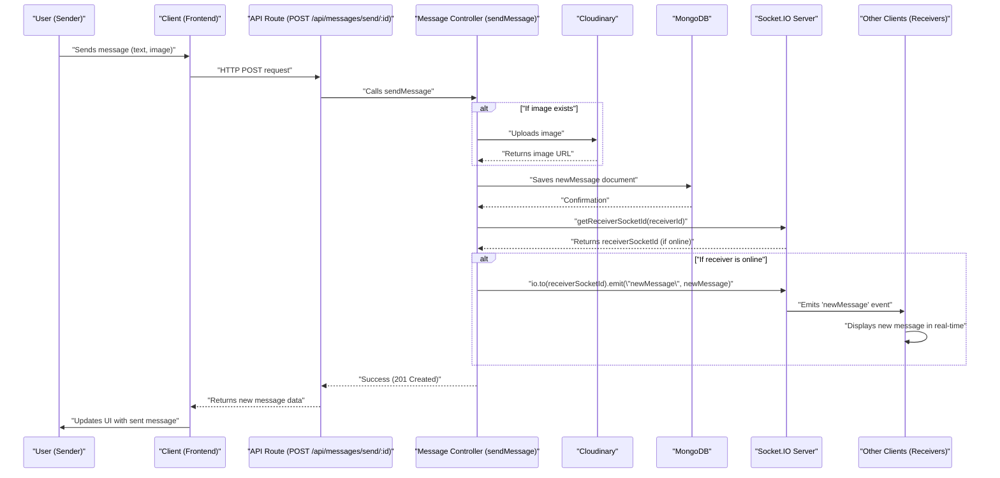

 
---
title: "Messaging and Friend Interactions"
description: "Explains the implementation of real-time messaging, friend requests, and friend list management."
sidebar_position: 22
---

# Messaging and Friend Interactions

This section details the core mechanisms behind real-time messaging and the management of friend interactions within the application. It covers how users can send and receive messages, view their chat history, and manage their connections with other users. The implementation leverages MongoDB for message storage, Express.js for API routing, and Socket.IO for real-time communication.

## Core Features and Components

The messaging system is built around several key functionalities:

*   **Real-time Messaging**: Users can send text and image messages that are delivered instantly to the receiver.
*   **Chat History**: Past conversations are persistently stored and can be retrieved when a user opens a chat.
*   **User Listing**: Displays a list of available users for initiating new conversations.
*   **Online Status**: Leverages WebSockets to track and broadcast the online status of users.
*   **Image Uploads**: Integrated with Cloudinary for secure storage and delivery of image attachments.

### Messaging Workflow

The process of sending and receiving messages involves several components working in tandem:





## Relevant Files and Their Responsibilities

The messaging and friend interaction features are primarily managed by a set of files responsible for routing, controller logic, data modeling, and real-time communication.

### `backend/src/models/message.model.js`

This Mongoose schema defines the structure for message documents stored in MongoDB. Each message records its sender, receiver, text content, and an optional image URL.

```javascript
// backend/src/models/message.model.js
import mongoose from "mongoose";

const messageSchema = new mongoose.Schema(
    {
     senderId: {
        type: mongoose.Schema.Types.ObjectId,
        ref: "User",
        required: true,
     },
     receiverId: {
        type: mongoose.Schema.Types.ObjectId,
        ref: "User",
        required: true,
     },
     text: {
        type: String,
     },
     image: {
        type: String,
     },
    },
    {timestamps: true} // Adds createdAt and updatedAt fields
);

export default mongoose.model("Message", messageSchema);
```
[View on GitHub](https://github.com/shinymack/Chat-App-MERN/blob/main/backend/src/models/message.model.js)

The `timestamps: true` option is crucial for automatically tracking when messages are created and updated, simplifying chronological display of conversations.

### `backend/src/routes/message.route.js`

This file defines the API endpoints related to messaging and user retrieval. It uses Express.js's router to manage different HTTP methods and paths. The `protectRoute` middleware ensures that only authenticated users can access these endpoints.

```javascript
// backend/src/routes/message.route.js
import express from "express"
import { protectRoute } from "../middleware/auth.middleware.js";
import { getUsersForSidebar, getMessages, sendMessage } from "../controllers/message.controller.js";
const router = express.Router();

router.get("/users", protectRoute, getUsersForSidebar); // Get all users for sidebar
router.get("/:id", protectRoute, getMessages);          // Get messages for a specific chat
router.post("/send/:id", protectRoute, sendMessage);    // Send a new message

export default router;
```
[View on GitHub](https://github.com/shinymack/Chat-App-MERN/blob/main/backend/src/routes/message.route.js)

### `backend/src/controllers/message.controller.js`

This controller contains the logic for handling message-related requests. It interacts with the `Message` and `User` models, as well as the `cloudinary` service for image uploads and `socket.io` for real-time notifications.

#### `getUsersForSidebar`

Retrieves a list of all users excluding the currently logged-in user. This is used to populate the sidebar, allowing users to initiate new chats or view existing ones.

```javascript
// backend/src/controllers/message.controller.js
export const getUsersForSidebar = async (req, res) => {
    try {
        const loggedInUserId = req.user._id;
        // Find all users except the logged-in user and exclude their password
        const filteredUsers = await User.find({
            _id: { $ne: loggedInUserId }}).select("-password");  
        res.status(200).json(filteredUsers);
    }
    catch (error) {
        console.log("Error in getUsersForSidebar: ", error);
        res.status(500).json({ error: "Internal Server Error" });
    }
};
```
[View on GitHub](https://github.com/shinymack/Chat-App-MERN/blob/main/backend/src/controllers/message.controller.js#L9-L20)

#### `getMessages`

Fetches all messages exchanged between the logged-in user and a specific `userToChatId`. It uses the `$or` operator in MongoDB to find messages where the logged-in user is either the sender or the receiver.

```javascript
// backend/src/controllers/message.controller.js
export const getMessages = async (req, res) => {
    try {
        const {id : userToChatId } = req.params; // ID of the other user in the chat
        const myId = req.user._id; // ID of the logged-in user

        const messages = await Message.find({
            $or: [ // Messages where (I sent to them) OR (They sent to me)
                {senderId: myId, receiverId:userToChatId},
                {senderId: userToChatId, receiverId: myId}
            ]
        });
        res.status(200).json(messages);
    } catch (error) {
        console.log("Error in getMessages controller:  ", error);
        res.status(500).json({ error: "Internal Server Error" });
    }
};
```
[View on GitHub](https://github.com/shinymack/Chat-App-MERN/blob/main/backend/src/controllers/message.controller.js#L22-L37)

#### `sendMessage`

Handles the creation and sending of a new message. It can process both text and image messages. If an image is provided, it's uploaded to Cloudinary. After saving the message to the database, it uses Socket.IO to emit a real-time `newMessage` event to the receiver if they are currently online.

```javascript
// backend/src/controllers/message.controller.js
export const sendMessage = async (req, res) => {
    try {
        const { text, image } = req.body;
        const { id: receiverId } = req.params;
        const senderId = req.user._id;

        let imageUrl;
        if (image) { // If an image is provided in the request body
            const uploadResponse = await cloudinary.uploader.upload(image);
            imageUrl = uploadResponse.secure_url; // Get the secure URL from Cloudinary
        }
        
        const newMessage = new Message({ // Create a new message instance
            senderId,
            receiverId,
            text,
            image: imageUrl,
        });

        await newMessage.save(); // Save message to MongoDB

        const receiverSocketId = getReceiverSocketId(receiverId); // Get receiver's socket ID
        if(receiverSocketId) {
            io.to(receiverSocketId).emit("newMessage", newMessage); // Emit real-time message
        }

        res.status(201).json(newMessage); // Respond with the created message
        
    } catch (error) {
        console.log("Error in sendMessage controller:  ", error);
        res.status(500).json({ error: "Internal Server Error" });
    }
};
```
[View on GitHub](https://github.com/shinymack/Chat-App-MERN/blob/main/backend/src/controllers/message.controller.js#L39-L73)

### `backend/src/lib/socket.js`

This file initializes and manages the Socket.IO server, which is crucial for real-time communication. It handles user connections, disconnections, and maintains a map of online users.

```javascript
// backend/src/lib/socket.js
import { Server } from "socket.io";
import http from "http";
import express from "express";

const app = express();
const server = http.createServer(app);

const io = new Server(server, {
    cors: {
        origin: ["http://localhost:5173"] // Allow connections from the frontend
    }
})

// Stores userId:socketId mappings for online users
const userSocketMap = {}; 

export function getReceiverSocketId(userId) {
    return userSocketMap[userId];
}

io.on("connection", (socket) => {
    console.log("A user connected", socket.id);

    const userId = socket.handshake.query.userId; // Get user ID from handshake
    if(userId) userSocketMap[userId] = socket.id; // Map user ID to their socket ID

    // Emit updated list of online users to all connected clients
    io.emit("getOnlineUsers", Object.keys(userSocketMap));

    socket.on("disconnect", ()=>{
        console.log("A user disconnected", socket.id);
        delete userSocketMap[userId]; // Remove user from map on disconnect
        io.emit("getOnlineUsers", Object.keys(userSocketMap)); // Update online users list
    })
})

export { io, app, server };
```
[View on GitHub](https://github.com/shinymack/Chat-App-MERN/blob/main/backend/src/lib/socket.js)

The `userSocketMap` is a critical component for targeting specific users with real-time events. When a user logs in, their `userId` is associated with their unique `socket.id`. This mapping allows the `sendMessage` controller to efficiently deliver messages only to the intended receiver.

## Key Integration Points

### Real-time Online Status

The Socket.IO server (`backend/src/lib/socket.js`) is central to managing user presence. When a user connects, their `userId` is mapped to their `socket.id`, and all connected clients receive an updated list of online users. This allows the frontend to display real-time online indicators.


```mermaid
graph TD
    subgraph "Client A"
        CA["User A Login"]
        CSA["Connect Socket A (query=userId=A)"]
    end
    subgraph "Client B"
        CB["User B Login"]
        CSB["Connect Socket B (query=userId=B)"]
    end
    subgraph "Server"
        S_IO["Socket.IO Server"]
        S_MAP["userSocketMap {userId: socketId}"]
    end

    CA --> CSA: "Initiates WebSocket"
    CSA --> S_IO: "Handshake & Connection"
    S_IO --> S_MAP: "Add A:socketA"
    S_IO --> CSA: "Emit 'getOnlineUsers' (A)"
    S_IO --> CSB: "Emit 'getOnlineUsers' (A)"

    CB --> CSB: "Initiates WebSocket"
    CSB --> S_IO: "Handshake & Connection"
    S_IO --> S_MAP: "Add B:socketB"
    S_IO --> CSA: "Emit 'getOnlineUsers' (A, B)"
    S_IO --> CSB: "Emit 'getOnlineUsers' (A, B)"

    CSA -.-> S_IO: "Disconnect"
    S_IO --> S_MAP: "Delete A"
    S_IO --> CSB: "Emit 'getOnlineUsers' (B)"
```


### Image Uploads with Cloudinary

The `sendMessage` controller seamlessly integrates with Cloudinary for handling image attachments. Instead of storing images directly on the server, they are uploaded to Cloudinary, which provides a secure URL. This URL is then stored in the `Message` document, reducing server load and leveraging a robust content delivery network.

### Authentication Middleware

All messaging and user retrieval routes are protected by the `protectRoute` middleware. This ensures that only authenticated users can access messaging functionalities, maintaining security and data integrity. The `req.user._id` populated by this middleware is used consistently across controllers to identify the currently logged-in user.

### Scalability Considerations

The use of Socket.IO for real-time communication provides a scalable solution for instant message delivery. The `userSocketMap` allows for direct targeting of online users, minimizing unnecessary broadcasts. For further scalability in high-traffic scenarios, Socket.IO can be configured with a Redis adapter to synchronize states across multiple server instances.

Next: [Backend Utilities and Services](./2.3_backend-utilities-and-services.mdx)
```