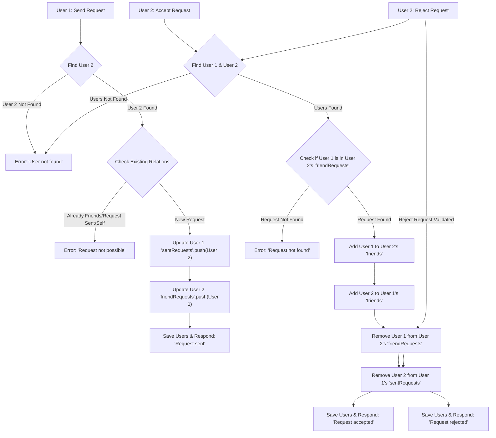

 # Messaging and Friend Management

This section details the backend implementation for user messaging capabilities and the comprehensive friend management system, encompassing friend requests, acceptance, rejection, and removal. These core features enable users to connect and communicate within the application.

## Core Components and Responsibilities

The messaging and friend management functionalities are primarily handled by two main controller files, supported by a dedicated message model and a Socket.IO integration for real-time updates.

*   **`backend/src/controllers/friend.controller.js`**: Manages all friend-related operations including sending, accepting, rejecting, and removing friend requests, as well as fetching a user's friends and pending requests.
*   **`backend/src/controllers/message.controller.js`**: Handles sending and retrieving messages, including image uploads via Cloudinary.
*   **`backend/src/models/message.model.js`**: Defines the Mongoose schema for messages, linking them to sender and receiver users.
*   **`backend/src/lib/socket.js`**: Provides the real-time communication layer using Socket.IO for instant message delivery and online user status.

## Friend Management Logic

The `friend.controller.js` file orchestrates the entire friend management system, allowing users to interact with each other's social profiles.

### Sending a Friend Request

Users can send friend requests using an identifier (username or email). The system prevents duplicate requests, self-requests, and requesting users who are already friends or have already sent a request. Upon successful dispatch, the sender's `sentRequests` array and the receiver's `friendRequests` array are updated.

```javascript filename="backend/src/controllers/friend.controller.js" lines={13-20}
// Send a friend request
export const sendFriendRequest = async (req, res) => {
    try {
        const { identifier } = req.body; // Expecting { identifier: "some_username_or_email" }
        const senderId = req.user._id;

        if (!identifier) {
            return res.status(400).json({ message: "Username or email is required." });
        }

        // Find receiver by username OR email
        const receiver = await User.findOne({
            $or: [{ username: identifier }, { email: identifier }]
        });
        // ... rest of the logic
```
[View on GitHub](https://github.com/shinymack/Chat-App-MERN/blob/main/backend/src/controllers/friend.controller.js#L13-L20)

### Accepting a Friend Request

When a user accepts a friend request, both users are added to each other's `friends` list. Crucially, the request is then removed from the `friendRequests` list of the receiver and the `sentRequests` list of the sender. This ensures data consistency and cleans up pending requests.

```javascript filename="backend/src/controllers/friend.controller.js" lines={63-70}
// Accept a friend request
export const acceptFriendRequest = async (req, res) => {
    try {
        const { senderId } = req.params; // ID of the user who sent the request
        const receiverId = req.user._id; // Current user accepting the request

        // ... user lookup and validation

        // Add to friends list for both users
        receiver.friends.push(senderId);
        sender.friends.push(receiverId);

        // Remove from requests lists
        receiver.friendRequests = receiver.friendRequests.filter(id => id.toString() !== senderId.toString());
        sender.sentRequests = sender.sentRequests.filter(id => id.toString() !== receiverId.toString());
        // ... save users
```
[View on GitHub](https://github.com/shinymack/Chat-App-MERN/blob/main/backend/src/controllers/friend.controller.js#L63-L70)

### Rejecting and Removing Friends

Similar logic applies to rejecting requests and removing existing friends. Both operations involve filtering out the relevant user ID from the respective `friendRequests`, `sentRequests`, or `friends` arrays on both sides of the relationship, maintaining an accurate representation of social connections.

### Friend Management Flow

Here's a simplified view of the friend request lifecycle:





## Messaging System

The messaging system enables users to exchange text and image messages, with real-time delivery via WebSockets.

### Message Model

The `Message` model defines the structure for storing messages, including `senderId`, `receiverId`, `text` content, and an optional `image` URL. Timestamps are automatically managed by Mongoose.

```javascript filename="backend/src/models/message.model.js"
import express from "express";
import mongoose from "mongoose";

const messageSchema = new mongoose.Schema(
    {
     senderId: {
        type: mongoose.Schema.Types.ObjectId,
        ref: "User",
        required: true,
     },
     receiverId: {
        type: mongoose.Schema.Types.ObjectId,
        ref: "User",
        required: true,
     },
     text: {
        type: String,
     },
     image: {
        type: String,
     },
    },
    {timestamps: true}
);

export default mongoose.model("Message", messageSchema);
```
[View on GitHub](https://github.com/shinymack/Chat-App-MERN/blob/main/backend/src/models/message.model.js)

### Sending Messages

The `sendMessage` controller handles the logic for message creation. It supports both text and image messages, integrating with Cloudinary for image uploads. After saving the message to the database, it utilizes Socket.IO to emit the new message in real-time to the receiver if they are online.

```javascript filename="backend/src/controllers/message.controller.js" lines={29-48}
export const sendMessage = async (req, res) => {
    try {
        const { text, image } = req.body;
        const { id: receiverId } = req.params;
        const senderId = req.user._id;

        let imageUrl;
        if (image) {
            const uploadResponse = await cloudinary.uploader.upload(image);
            imageUrl = uploadResponse.secure_url;
        }
        const newMessage = new Message({
            senderId,
            receiverId,
            text,
            image: imageUrl,
        });

        await newMessage.save();

        const receiverSocketId = getReceiverSocketId(receiverId);

        if(receiverSocketId) {
            io.to(receiverSocketId).emit("newMessage", newMessage);
        }

        res.status(201).json(newMessage);   
        
    } catch (error) {
        console.log("Error in sendMessage controller:  ", error);
        res.status(500).json({ error: "Internal Server Error" });
    }
};
```
[View on GitHub](https://github.com/shinymack/Chat-App-MERN/blob/main/backend/src/controllers/message.controller.js#L29-L48)

### Retrieving Messages

Messages between two users are fetched by querying the `Message` collection for entries where either `(senderId = myId AND receiverId = userToChatId)` or `(senderId = userToChatId AND receiverId = myId)`. This ensures all messages in a conversation are retrieved regardless of who sent them.

```javascript filename="backend/src/controllers/message.controller.js" lines={17-27}
export const getMessages = async (req, res) => {
    try {
        const {id : userToChatId } = req.params;
        const myId = req.user._id;

        const messages = await Message.find({
            $or: [
                {senderId: myId, receiverId:userToChatId},
                {senderId: userToChatId, receiverId: myId}
            ]
        });
        res.status(200).json(messages);
    } catch (error) {
        console.log("Error in getMessages controller:  ", error);
        res.status(500).json({ error: "Internal Server Error" });
    }
};
```
[View on GitHub](https://github.com/shinymack/Chat-App-MERN/blob/main/backend/src/controllers/message.controller.js#L17-L27)

### Socket.IO for Real-time Messaging

The `backend/src/lib/socket.js` file initializes a Socket.IO server, enabling real-time features. It manages online users using a `userSocketMap` and provides a `getReceiverSocketId` function to find the socket ID of a specific user. This is crucial for sending targeted real-time updates like new messages.

```javascript filename="backend/src/lib/socket.js" lines={13-28}
export function getReceiverSocketId(userId) {
    return userSocketMap[userId];
}

// used to store online users
const userSocketMap = {}; //{userId : socketId}

io.on("connection", (socket) => {
    console.log("A user connected", socket.id);

    const userId = socket.handshake.query.userId;
    if(userId) userSocketMap[userId] = socket.id;

    io.emit("getOnlineUsers", Object.keys(userSocketMap));

    socket.on("disconnect", ()=>{
        console.log("A user disconnected", socket.id);
        delete userSocketMap[userId]; 
        io.emit("getOnlineUsers", Object.keys(userSocketMap));
    })
})
```
[View on GitHub](https://github.com/shinymack/Chat-App-MERN/blob/main/backend/src/lib/socket.js#L13-L28)

## Key Integration Points

*   **User Model Integration**: The `User` model is central to both friend management (storing `friends`, `sentRequests`, `friendRequests` arrays of `ObjectId`s) and messaging (references `senderId`, `receiverId`). `populate` is extensively used in controllers to retrieve full user profiles from just their IDs.
*   **Authentication Middleware**: User IDs (`req.user._id`) are consistently extracted from authenticated requests, ensuring that actions are performed on behalf of the correct user and access controls are maintained.
*   **Cloudinary Integration**: For messages containing images, Cloudinary is seamlessly integrated to handle secure image uploads and retrieval, reducing server load and managing media assets efficiently.
*   **Real-time Communication**: The `sendMessage` controller directly interacts with the `socket.js` utility to dispatch `newMessage` events, ensuring that conversations are updated instantly for active users without requiring manual refreshes.
*   **Error Handling**: Each controller implements robust `try-catch` blocks to gracefully handle potential errors (e.g., user not found, database issues) and return appropriate HTTP status codes and messages.

This cohesive design allows for a responsive and feature-rich user experience in both connecting with friends and engaging in real-time conversations.

Next: [Backend Utilities and Services](./2.3_backend-utilities-and-services.mdx)