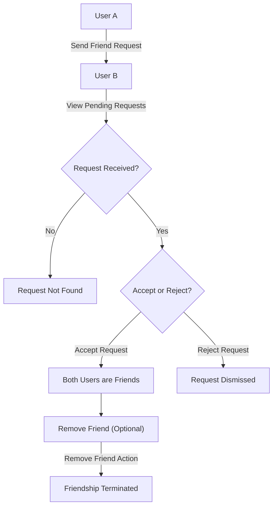
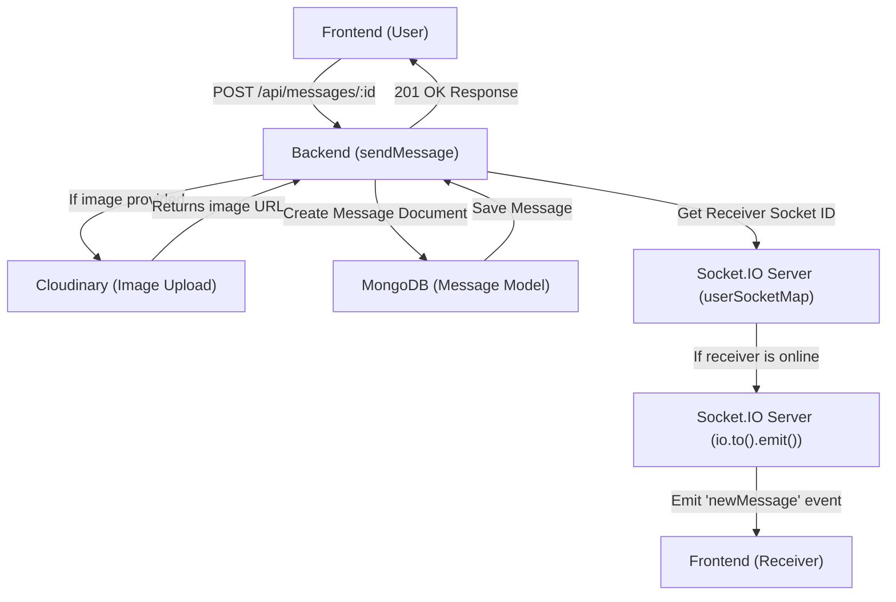

# Messaging and Friend Management

This section details the robust set of functionalities enabling users to communicate and manage their social connections within the application. It covers everything from sending and receiving direct messages to handling friend requests and managing friend lists.

The core components involved in these operations are:
*   **Friend Management Controller**: `backend/src/controllers/friend.controller.js`
*   **Message Controller**: `backend/src/controllers/message.controller.js`
*   **Message Model**: `backend/src/models/message.model.js`
*   **Socket.IO Configuration**: `backend/src/lib/socket.js`

These files work in conjunction to provide a seamless user experience for interaction and communication.

## Friend Management

The `friend.controller.js` file houses the logic for all friend-related operations. This includes initiating, confirming, denying, and terminating friend relationships, as well as retrieving various lists related to a user's social network.

### Friend Request Flow

The process of managing friend requests is carefully designed to handle various states:
1.  **Sending a Request**: A user can send a friend request to another user by their username or email. The system checks for existing friendships, pending requests, and self-requests to prevent invalid operations.
2.  **Accepting a Request**: If a user receives a friend request, they can accept it, leading to both users being added to each other's friend lists and the request being removed from their respective pending/sent lists.
3.  **Rejecting a Request**: A user can also reject a request, which simply removes the request from both parties' records without establishing a friendship.

### Key Friend Management Endpoints

The following are the primary operations for managing friends:

*   **`sendFriendRequest`**:
    *   **Purpose**: Allows a user to send a friend request to another user.
    *   **Input**: `identifier` (username or email of the target user) in the request body.
    *   **Logic**:
        *   Validates the `identifier`.
        *   Finds the receiver user by username or email.
        *   Checks if the sender is trying to friend themselves.
        *   Verifies if users are already friends, if a request has already been sent, or if the target user has already sent a request to the sender.
        *   Adds the `receiverId` to the `sender`'s `sentRequests` array and the `senderId` to the `receiver`'s `friendRequests` array.
        *   Saves both user documents.
    *   [View `sendFriendRequest` on GitHub](https://github.com/shinymack/Chat-App-MERN/blob/main/backend/src/controllers/friend.controller.js#L11-L69)

```javascript
// backend/src/controllers/friend.controller.js
export const sendFriendRequest = async (req, res) => {
    try {
        const { identifier } = req.body;
        const senderId = req.user._id;

        // ... validation and checks ...

        sender.sentRequests.push(receiverId);
        receiver.friendRequests.push(senderId);

        await sender.save();
        await receiver.save();

        res.status(200).json({ message: "Friend request sent successfully." });

    } catch (error) {
        console.error("Error in sendFriendRequest: ", error.message);
        res.status(500).json({ message: "Internal server error", error: error.message });
    }
};
```

*   **`acceptFriendRequest`**:
    *   **Purpose**: Enables a user to accept a pending friend request.
    *   **Input**: `senderId` (ID of the user who sent the request) in request parameters.
    *   **Logic**:
        *   Finds both sender and receiver users.
        *   Confirms the request exists in the receiver's `friendRequests`.
        *   Adds both users to each other's `friends` list.
        *   Removes the request from `receiver.friendRequests` and `sender.sentRequests`.
        *   Saves both user documents.
    *   [View `acceptFriendRequest` on GitHub](https://github.com/shinymack/Chat-App-MERN/blob/main/backend/src/controllers/friend.controller.js#L72-L113)

```javascript
// backend/src/controllers/friend.controller.js
export const acceptFriendRequest = async (req, res) => {
    try {
        const { senderId } = req.params;
        const receiverId = req.user._id;

        // ... user retrieval and validation ...

        receiver.friends.push(senderId);
        sender.friends.push(receiverId);

        receiver.friendRequests = receiver.friendRequests.filter(id => id.toString() !== senderId.toString());
        sender.sentRequests = sender.sentRequests.filter(id => id.toString() !== receiverId.toString());

        await receiver.save();
        await sender.save();

        res.status(200).json({ message: "Friend request accepted." });

    } catch (error) {
        console.error("Error in acceptFriendRequest: ", error.message);
        res.status(500).json({ message: "Internal server error", error: error.message });
    }
};
```

*   **`rejectFriendRequest`**:
    *   **Purpose**: Allows a user to decline a pending friend request.
    *   **Input**: `senderId` in request parameters.
    *   **Logic**:
        *   Finds both sender and receiver users.
        *   Removes the request from `receiver.friendRequests` and `sender.sentRequests`.
        *   Saves both user documents.
    *   [View `rejectFriendRequest` on GitHub](https://github.com/shinymack/Chat-App-MERN/blob/main/backend/src/controllers/friend.controller.js#L116-L154)

*   **`removeFriend`**:
    *   **Purpose**: Enables a user to remove an existing friend from their list.
    *   **Input**: `friendId` in request parameters.
    *   **Logic**:
        *   Finds both users.
        *   Verifies that they are indeed friends.
        *   Removes each user from the other's `friends` list.
        *   Saves both user documents.
    *   [View `removeFriend` on GitHub](https://github.com/shinymack/Chat-App-MERN/blob/main/backend/src/controllers/friend.controller.js#L157-L192)

*   **`getFriends`**:
    *   **Purpose**: Retrieves a list of friends for the current user.
    *   **Logic**: Finds the current user and populates their `friends` array with relevant user details (username, email, profilePic, _id).
    *   [View `getFriends` on GitHub](https://github.com/shinymack/Chat-App-MERN/blob/main/backend/src/controllers/friend.controller.js#L195-L215)

*   **`getPendingRequests`**:
    *   **Purpose**: Retrieves friend requests sent *to* the current user.
    *   **Logic**: Finds the current user and populates their `friendRequests` array.
    *   [View `getPendingRequests` on GitHub](https://github.com/shinymack/Chat-App-MERN/blob/main/backend/src/controllers/friend.controller.js#L218-L238)

*   **`getSentRequests`**:
    *   **Purpose**: Retrieves friend requests sent *by* the current user.
    *   **Logic**: Finds the current user and populates their `sentRequests` array.
    *   [View `getSentRequests` on GitHub](https://github.com/shinymack/Chat-App-MERN/blob/main/backend/src/controllers/friend.controller.js#L241-L261)

### Friend Management Flow

This diagram illustrates the typical lifecycle of a friend request.





## Messaging System

The application features a real-time messaging system, allowing users to send text and image messages. The core logic for messaging resides in `message.controller.js`, with message data defined by `message.model.js` and real-time capabilities powered by `socket.js`.

### Message Data Model

The `Message` model defines the structure of a message stored in the database.
It is a Mongoose schema located at `backend/src/models/message.model.js`.

```javascript
// backend/src/models/message.model.js
import mongoose from "mongoose";

const messageSchema = new mongoose.Schema(
    {
     senderId: {
        type: mongoose.Schema.Types.ObjectId,
        ref: "User",
        required: true,
     },
     receiverId: {
        type: mongoose.Schema.Types.ObjectId,
        ref: "User",
        required: true,
     },
     text: {
        type: String,
     },
     image: {
        type: String,
     },
    },
    {timestamps: true} // Automatically adds createdAt and updatedAt fields
);

export default mongoose.model("Message", messageSchema);
```
*   **`senderId`**: The ID of the user who sent the message. References the `User` model.
*   **`receiverId`**: The ID of the user intended to receive the message. References the `User` model.
*   **`text`**: The textual content of the message (optional, as messages can be images only).
*   **`image`**: The URL of an uploaded image, if the message includes one.
*   **`timestamps`**: Automatically manages `createdAt` and `updatedAt` fields for each message.

### Messaging Endpoints and Logic

The `message.controller.js` manages message-related operations:

*   **`getUsersForSidebar`**:
    *   **Purpose**: Retrieves a list of all users excluding the currently logged-in user, typically used to populate a chat sidebar.
    *   **Logic**: Queries the `User` collection, excluding the `loggedInUserId` and selecting all fields except `password`.
    *   [View `getUsersForSidebar` on GitHub](https://github.com/shinymack/Chat-App-MERN/blob/main/backend/src/controllers/message.controller.js#L7-L18)

*   **`getMessages`**:
    *   **Purpose**: Fetches all messages between the current user and a specified chat partner.
    *   **Input**: `id` (the ID of the other user in the chat) in request parameters.
    *   **Logic**: Queries the `Message` collection for messages where `(senderId = myId AND receiverId = userToChatId)` OR `(senderId = userToChatId AND receiverId = myId)`.
    *   [View `getMessages` on GitHub](https://github.com/shinymack/Chat-App-MERN/blob/main/backend/src/controllers/message.controller.js#L21-L36)

*   **`sendMessage`**:
    *   **Purpose**: Sends a new message (text or image) from the current user to another user.
    *   **Input**: `text`, `image` in the request body, `id` (receiver ID) in request parameters.
    *   **Logic**:
        *   If an `image` is provided, it's uploaded to Cloudinary, and the secure URL is stored.
        *   A new `Message` document is created and saved.
        *   **Real-time Notification**: It uses Socket.IO to instantly notify the receiver if they are online.
            *   `getReceiverSocketId(receiverId)`: Retrieves the Socket.IO ID for the `receiverId` from the `userSocketMap`.
            *   `io.to(receiverSocketId).emit("newMessage", newMessage)`: Emits a "newMessage" event to the specific receiver's socket, sending the `newMessage` data.
    *   [View `sendMessage` on GitHub](https://github.com/shinymack/Chat-App-MERN/blob/main/backend/src/controllers/message.controller.js#L39-L69)

```javascript
// backend/src/controllers/message.controller.js
export const sendMessage = async (req, res) => {
    try {
        const { text, image } = req.body;
        const { id: receiverId } = req.params;
        const senderId = req.user._id;

        let imageUrl;
        if (image) {
            const uploadResponse = await cloudinary.uploader.upload(image);
            imageUrl = uploadResponse.secure_url;
        }
        const newMessage = new Message({
            senderId,
            receiverId,
            text,
            image: imageUrl,
        });

        await newMessage.save();

        const receiverSocketId = getReceiverSocketId(receiverId);
        if(receiverSocketId) {
            io.to(receiverSocketId).emit("newMessage", newMessage); // Real-time delivery
        }

        res.status(201).json(newMessage);

    } catch (error) {
        console.log("Error in sendMessage controller:  ", error);
        res.status(500).json({ error: "Internal Server Error" });
    }
};
```

### Real-time Communication with Socket.IO

The `backend/src/lib/socket.js` file sets up the WebSocket server using Socket.IO, enabling real-time functionalities like:
*   **Online User Status**: Keeps track of connected users and emits updates when users connect or disconnect.
*   **Instant Message Delivery**: Allows messages to be delivered instantly to online recipients without requiring a page refresh.

```javascript
// backend/src/lib/socket.js
import { Server } from "socket.io";
import http from "http";
import express from "express";

const app = express();
const server = http.createServer(app);

const io = new Server(server, {
    cors: {
        origin: ["http://localhost:5173"] // Frontend URL
    }
})

export function getReceiverSocketId(userId) {
    return userSocketMap[userId];
}

const userSocketMap = {}; //{userId : socketId}

io.on("connection", (socket) => {
    console.log("A user connected", socket.id);

    const userId = socket.handshake.query.userId;
    if(userId) userSocketMap[userId] = socket.id;

    io.emit("getOnlineUsers", Object.keys(userSocketMap)); // Notify all clients of online users

    socket.on("disconnect", ()=>{
        console.log("A user disconnected", socket.id);
        delete userSocketMap[userId];
        io.emit("getOnlineUsers", Object.keys(userSocketMap)); // Update online status
    })
})

export { io, app, server };
```

*   **`userSocketMap`**: A simple object that maps `userId` to `socketId`, allowing messages to be sent to specific users.
*   **`io.on("connection", ...)`**: Handles new client connections. When a user connects, their `userId` is extracted from the handshake query and stored in `userSocketMap`.
*   **`io.emit("getOnlineUsers", ...)`**: Broadcasts the list of currently online users to all connected clients.
*   **`socket.on("disconnect", ...)`**: Handles client disconnections. Removes the user from `userSocketMap` and updates the online user list.

### Messaging Data Flow

This diagram illustrates the flow of sending a message, including image upload and real-time notification.





## Key Integration Points

*   **User Model Interdependency**: Both friend management and messaging heavily rely on the `User` model, specifically referencing `_id` fields for `senderId`, `receiverId`, `friendRequests`, `sentRequests`, and `friends` arrays. This ensures data consistency and referential integrity across the system.
*   **Real-time Communication**: The `socket.js` module is a critical integration point for messaging. Without it, messages would only update on page refresh, significantly degrading the user experience. The `sendMessage` controller explicitly calls `getReceiverSocketId` and uses `io.to().emit()` for instant message delivery.
*   **Cloudinary Integration**: For image messaging, `cloudinary.js` is integrated directly into the `sendMessage` controller to handle secure storage and delivery of image assets, offloading media management from the primary server.
*   **Authentication Middleware**: All friend and message controllers implicitly rely on authentication middleware (not shown in snippets but evident from `req.user._id`) to identify the currently logged-in user, ensuring secure and authorized operations.

Next: [Utilities and External Services](./2.3_utilities-and-external-services.mdx)