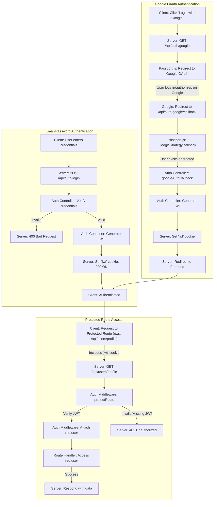

 
---
title: "Authentication and Authorization"
description: "Explains the authentication mechanisms, including Passport.js configuration and middleware."
---

# Authentication and Authorization

This section details the authentication and authorization mechanisms implemented in the backend. The system supports both traditional email/password authentication and Google OAuth 2.0. JSON Web Tokens (JWTs) are used for session management, providing a stateless way to verify user identity after initial authentication. Passport.js is integrated to handle Google OAuth, simplifying the authentication flow with external providers.

## Core Authentication Flows

The core authentication logic resides within the `auth.controller.js`, managing user registration, login, logout, and profile updates. It also includes utility functions like checking username availability and handling Google OAuth callbacks.

### User Registration (Signup)

The `signup` controller handles the creation of new user accounts. It performs essential input validation, hashes passwords using `bcryptjs`, and assigns a JWT upon successful registration.

- **Input Validation**: Ensures `username`, `email`, and `password` meet specified criteria (e.g., length constraints).
- **Uniqueness Checks**: Verifies that the provided email and username are not already in use.
- **Password Hashing**: Uses `bcryptjs` to securely hash passwords before storing them in the database.
- **Token Generation**: A JWT is generated and set as an HTTP-only cookie, authenticating the user immediately after signup.

<p align="center">
    <a href="https://github.com/shinymack/Chat-App-MERN/blob/main/backend/src/controllers/auth.controller.js#L9-L49">View signup controller on GitHub</a>
</p>

```javascript
export const signup = async (req, res) => {
    const {username, email, password} = req.body;
    try {
        if(!username || !email || !password) {
            return res.status(400).json({message: "Please fill in all fields."});
        }
        // ... (validation logic) ...
        const user = await User.findOne({email});
        if (user) return res.status(400).json({message: "Email already exists."});
        
        const existingUserByUsername = await User.findOne({ username });
        if (existingUserByUsername) {
            return res.status(400).json({ message: "Username already exists. Please choose another." });
        }

        const salt = await bcrypt.genSalt(10);
        const hashedPassword = await bcrypt.hash(password, salt);

        const newUser = new User({
            username,
            email,
            password: hashedPassword,
            authProvider: 'email'
        });
        if(newUser){
            generateToken(newUser._id, res); // Generates JWT
            await newUser.save();

            res.status(201).json({
                _id: newUser._id,
                username: newUser.username,
                email: newUser.email,   
                profilePic: newUser.profilePic,
                authProvider: newUser.authProvider
            });
        } else {
            res.status(400).json({message: "Invalid user data."});
        }
    } catch (error) {
        console.log("Error in signup controller", error.message)
        res.status(500).json({message: "Something went wrong."});
    }
};
```

### User Login

The `login` controller verifies user credentials and issues a JWT if authentication is successful.

- **Credential Verification**: Compares the provided password with the hashed password stored in the database using `bcrypt.compare`.
- **Provider Check**: Differentiates between email/password users and Google OAuth users, prompting the correct login method if necessary.
- **Token Generation**: Similar to signup, a JWT is generated and sent as an HTTP-only cookie.

<p align="center">
    <a href="https://github.com/shinymack/Chat-App-MERN/blob/main/backend/src/controllers/auth.controller.js#L51-L81">View login controller on GitHub</a>
</p>

```javascript
export const login = async (req, res) => {
    const {email, password} = req.body;
    try {
        const user = await User.findOne({email});

        if(!user) {
            return res.status(400).json({message: "Invalid credentials."});
        }

        if(user.authProvider === 'google' && !user.password){
            return res.status(400).json({ message: "Please sign in with Google." });
        }

        const isPasswordCorrect = await bcrypt.compare(password, user.password);
        if(!isPasswordCorrect) {
            return res.status(400).json({message: "Invalid credentials."});
        }

        generateToken(user._id, res);
        res.status(200).json({
            _id: user._id,
            username: user.username,
            email: user.email,
            profilePic: user.profilePic,
            authProvider: user.authProvider,
        });
    } catch (error) {
        console.log("Error in login controller", error.message);
        res.status(500).json({message: "Something went wrong."});
    }
};
```

### User Logout

The `logout` controller simply clears the JWT cookie, effectively logging out the user by invalidating their session.

<p align="center">
    <a href="https://github.com/shinymack/Chat-App-MERN/blob/main/backend/src/controllers/auth.controller.js#L83-L90">View logout controller on GitHub</a>
</p>

```javascript
export const logout = (req, res) => {
    try {
        res.cookie("jwt", "", {maxAge: 0}); // Clears the JWT cookie
        res.status(200).json({message: "Logged out successfully."})
    } catch(error) {
        console.log("Error in logout controller", error.message);
        res.status(500).json({message:"Internal Server Error"}); 
    }
};
```

### Profile Update

The `updateProfile` controller allows authenticated users to modify their profile details, such as their profile picture and username.

- **Cloudinary Integration**: Utilizes Cloudinary for managing and storing user profile images.
- **Username Uniqueness**: Ensures that a new username, if provided, is unique and not already taken by another user.
- **Token Refresh**: A new JWT is issued after a successful profile update to reflect any changes that might be included in the token payload or to refresh its expiration.

<p align="center">
    <a href="https://github.com/shinymack/Chat-App-MERN/blob/main/backend/src/controllers/auth.controller.js#L173-L227">View updateProfile controller on GitHub</a>
</p>

```javascript
export const updateProfile = async (req, res) => {
    try {
        const { profilePic, username } = req.body;
        const userId = req.user._id;
        let userToUpdate = await User.findById(userId);

        if (!userToUpdate) {
            return res.status(404).json({ message: "User not found." });
        }

        const fieldsToUpdate = {};
        let newUsername = username ? username.trim() : null;
        
        if (newUsername && newUsername !== userToUpdate.username) {
            // ... (username validation and uniqueness check) ...
            fieldsToUpdate.username = newUsername;
        }

        if (profilePic) {
            const uploadResponse = await cloudinary.uploader.upload(profilePic);
            fieldsToUpdate.profilePic = uploadResponse.secure_url;
        }

        if (Object.keys(fieldsToUpdate).length === 0) {
            return res.status(400).json({ message: "No changes provided to update." });
        }

        const updatedUser = await User.findByIdAndUpdate(userId, { $set: fieldsToUpdate }, { new: true });
        generateToken(updatedUser._id, res); // Refresh token
        res.status(200).json(updatedUser);

    } catch (error) {
        console.error("Error in updateProfile controller", error.message);
        res.status(500).json({ message: "Internal Server Error while updating profile." });
    }
};
```

## Passport.js Configuration for Google OAuth

`passport.config.js` sets up Passport.js strategies, specifically for Google OAuth. Passport.js handles the complex OAuth handshake process, allowing the application to securely authenticate users via their Google accounts.

- **GoogleStrategy**: Configured with `clientID`, `clientSecret`, and `callbackURL` from environment variables.
- **Callback Logic**: After Google authenticates the user, the `verify` callback function:
    - Checks if a user with the `googleId` already exists. If so, it returns the existing user.
    - If not, it creates a new user, ensuring email and username uniqueness. It also handles cases where an email already exists from a non-Google provider.
- **Serialization/Deserialization**: Passport.js uses `serializeUser` to store a minimal user identifier (MongoDB `_id`) in the session and `deserializeUser` to retrieve the full user object from the database using that ID. This user object is then attached to `req.user`.

<p align="center">
    <a href="https://github.com/shinymack/Chat-App-MERN/blob/main/backend/src/lib/passport.config.js#L1-L71">View Passport.js config on GitHub</a>
</p>

```javascript
import passport from 'passport';
import { Strategy as GoogleStrategy } from 'passport-google-oauth20';
import User from '../models/user.model.js'; 
import dotenv from 'dotenv';

dotenv.config(); 

export const configurePassport = () => {
    passport.use(new GoogleStrategy({
        clientID: process.env.GOOGLE_CLIENT_ID,
        clientSecret: process.env.GOOGLE_CLIENT_SECRET,
        callbackURL: process.env.GOOGLE_CALLBACK_URL,
        scope: ['profile', 'email'] 
    },
    async (accessToken, refreshToken, profile, done) => {
        try {
            let user = await User.findOne({ googleId: profile.id });
            if (user) {
                return done(null, user);
            } else {
                let username = profile.displayName.replace(/\s+/g, '').toLowerCase() || `user${Date.now()}`;
                const existingUserByUsername = await User.findOne({ username });
                if (existingUserByUsername) {
                    username = `${username}${Date.now().toString().slice(-4)}`;
                }
                const newUser = new User({
                    googleId: profile.id,
                    email: profile.emails && profile.emails[0] ? profile.emails[0].value : null,
                    username: username,
                    authProvider: 'google',
                });
                // ... (email existence check and save logic) ...
                await newUser.save();
                return done(null, newUser);
            }
        } catch (error) {
            return done(error, null);
        }
    }));

    passport.serializeUser((user, done) => {
        done(null, user.id);
    });

    passport.deserializeUser(async (id, done) => {
        try {
            const user = await User.findById(id);
            done(null, user);
        } catch (error) {
            done(error, null);
        }
    });
};
```

### Google OAuth Callback

The `googleAuthCallback` controller in `auth.controller.js` is the final step for Google OAuth. After Passport.js successfully authenticates the user, this controller generates a JWT for the user and redirects them to the frontend.

<p align="center">
    <a href="https://github.com/shinymack/Chat-App-MERN/blob/main/backend/src/controllers/auth.controller.js#L125-L140">View googleAuthCallback on GitHub</a>
</p>

```javascript
export const googleAuthCallback = async (req, res) => {
 const frontendUrl = process.env.FRONTEND_URL || 'http://localhost:5173';

    try {
        if (!req.user) {
            return res.redirect(`${frontendUrl}/login?error=google_auth_failed`);
        }

        generateToken(req.user._id, res); // Generates JWT for Google authenticated user

        res.redirect(frontendUrl);

    } catch (error) {
        console.error("Error in googleAuthCallback: ", error.message);
        res.redirect(`${frontendUrl}/login?error=google_auth_processing_error`);
    }
};
```

## Authorization Middleware

The `auth.middleware.js` file contains the `protectRoute` middleware, which is crucial for securing endpoints that require an authenticated user.

- **JWT Verification**: It extracts the JWT from the request's cookies.
- **Token Validation**: Uses `jsonwebtoken.verify` to validate the token against the `JWT_SECRET`.
- **User Retrieval**: If valid, it decodes the `userId` from the token and fetches the corresponding user from the database.
- **Request Augmentation**: Attaches the authenticated user object (`req.user`) to the request, making user information accessible to subsequent route handlers.
- **Error Handling**: Returns `401 Unauthorized` for missing or invalid tokens and `404 Not Found` if the user associated with the token does not exist.

<p align="center">
    <a href="https://github.com/shinymack/Chat-App-MERN/blob/main/backend/src/middleware/auth.middleware.js#L1-L26">View protectRoute middleware on GitHub</a>
</p>

```javascript
import jwt from "jsonwebtoken"
import User from "../models/user.model.js"

export const protectRoute = async (req, res, next) => {
    try {
        const token = req.cookies.jwt;
        if(!token){
            return res.status(401).json({message: "Unauthorized - No Token Provided"});
        }

        const decoded = jwt.verify(token, process.env.JWT_SECRET)

        if(!decoded) {
            return res.status(401).json({message: "Unauthorized - Invalid Token"});
        }
        const user = await User.findById(decoded.userId).select("-password");

        if(!user) {
            return res.status(404).json({message: "User not found"});
        }
        req.user = user; // Attach user to request

        next(); // Proceed to next middleware/route handler
    } catch (error) {
        console.log("Error in protectRoute middleware", error.message);
        res.status(500).json({message: "Internal Server Error"});

    }
};
```

## Authentication Routes

All authentication-related endpoints are defined in `auth.route.js`. This file aggregates the controllers and applies middleware where necessary.

- **`/signup`**: User registration.
- **`/login`**: User login.
- **`/logout`**: User logout.
- **`/update-profile`**: Profile update (protected).
- **`/username/check/:username`**: Check username availability (protected).
- **`/check`**: Check current authentication status (protected).
- **`/google`**: Initiates Google OAuth flow.
- **`/google/callback`**: Google OAuth callback endpoint.

<p align="center">
    <a href="https://github.com/shinymack/Chat-App-MERN/blob/main/backend/src/routes/auth.route.js#L1-L36">View auth.route.js on GitHub</a>
</p>

```javascript
import express from "express"
import passport from 'passport';
import { login, logout, signup, updateProfile, checkAuth, googleAuthCallback, checkUsernameAvailability} from  "../controllers/auth.controller.js"
import { protectRoute } from "../middleware/auth.middleware.js"
const router = express.Router();

router.post("/signup", signup);
router.post("/login", login);
router.post("/logout", logout);
router.put("/update-profile", protectRoute ,updateProfile) // Protected route
router.get("/username/check/:username", protectRoute, checkUsernameAvailability); // Protected route
router.get("/check", protectRoute, checkAuth) // Protected route

router.get(
    '/google',
    passport.authenticate('google', { scope: ['profile', 'email'] })
);
router.get(
    '/google/callback',
    passport.authenticate('google', {
        failureRedirect: 'http://localhost:5173/login', 
        failureMessage: true
    }),
    googleAuthCallback 
);
export default router;
```

## Authentication Process Flow

The diagram below illustrates the typical user authentication flow, encompassing both email/password and Google OAuth methods.





## Key Integration Points

- **Token Management**: JWTs are central to managing user sessions. They are generated upon `signup` and `login`, and cleared on `logout`. Critically, they are refreshed (`generateToken`) after `updateProfile` and during `googleAuthCallback` to ensure updated user data or to extend session validity. The `generateToken` utility (from `backend/src/lib/utils.js`, though not detailed in snippets) is responsible for creating these JWTs and setting them as HTTP-only cookies, which enhances security against XSS attacks.

- **Middleware Application**: The `protectRoute` middleware is strategically applied to all endpoints that require an authenticated user, such as `update-profile`, `check`, and `username/check`. This ensures that unauthorized requests are rejected early in the request lifecycle, maintaining API security.

- **Passport.js Session Management**: While JWTs handle API authentication, Passport.js uses its own session mechanism during the OAuth flow (`serializeUser`, `deserializeUser`). This is crucial for maintaining state during the multi-step OAuth redirection process. Once the OAuth flow is complete, our application's JWT takes over for subsequent API calls.

- **Error Handling**: Robust error handling is implemented across all authentication controllers and middleware. Specific HTTP status codes and messages are returned for validation failures (400), unauthorized access (401), user not found (404), and internal server errors (500).

- **Environment Variables**: Sensitive information like `JWT_SECRET`, `GOOGLE_CLIENT_ID`, `GOOGLE_CLIENT_SECRET`, and `GOOGLE_CALLBACK_URL` are managed via environment variables, adhering to best practices for security and deployability.

Next: [Utility Services and Libraries](./2.4_utility-services-and-libraries.mdx)
```