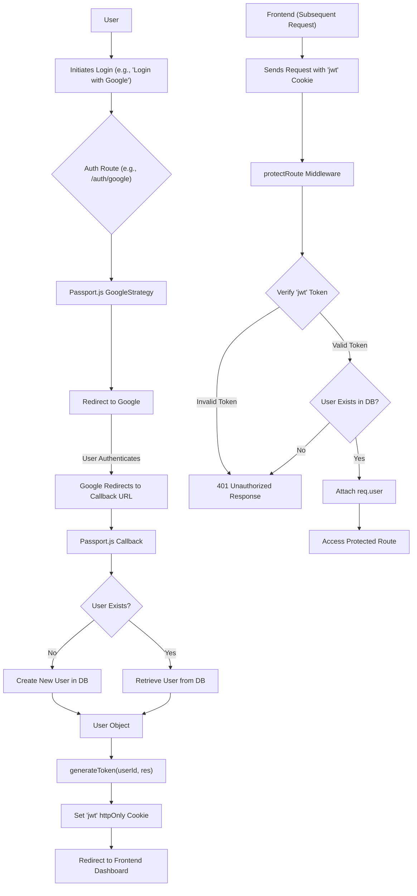
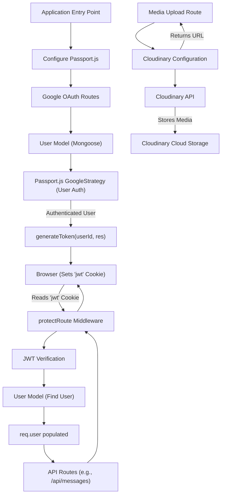

# Backend Services and Utilities

This section details the core backend utilities and service integrations that empower the application, focusing on authentication, external media management, and token handling. We delve into how user sessions are managed through Google OAuth, how route protection is enforced with JWTs, and how Cloudinary is configured for media storage.

## Authentication Mechanisms

The backend employs a robust authentication strategy primarily leveraging Google OAuth 2.0 and JSON Web Tokens (JWTs) for session management.

### Google OAuth 2.0 Integration

The application integrates with Google for user authentication, providing a streamlined and secure login experience. This is managed through Passport.js, a popular authentication middleware for Node.js.

The `passport.config.js` file initializes Passport.js with the GoogleStrategy. It handles the complete OAuth flow, from redirecting the user to Google for consent to processing the callback and creating or retrieving user accounts.

When a user successfully authenticates via Google, the system checks if an existing user with the provided `googleId` exists. If not, a new user account is created, populating fields like `email`, `username`, and `authProvider`. Special attention is given to generating unique usernames and handling cases where an email already exists from a different authentication provider.

```javascript
// backend/src/lib/passport.config.js
import passport from 'passport';
import { Strategy as GoogleStrategy } from 'passport-google-oauth20';
import User from '../models/user.model.js';
import dotenv from 'dotenv';

dotenv.config();

export const configurePassport = () => {
    passport.use(new GoogleStrategy({
        clientID: process.env.GOOGLE_CLIENT_ID,
        clientSecret: process.env.GOOGLE_CLIENT_SECRET,
        callbackURL: process.env.GOOGLE_CALLBACK_URL,
        scope: ['profile', 'email']
    },
    async (accessToken, refreshToken, profile, done) => {
        try {
            let user = await User.findOne({ googleId: profile.id });
            if (user) {
                return done(null, user);
            } else {
                // ... (username generation and email checks)
                const newUser = new User({
                    googleId: profile.id,
                    email: profile.emails && profile.emails[0] ? profile.emails[0].value : null,
                    username: username,
                    authProvider: 'google',
                });
                await newUser.save();
                return done(null, newUser);
            }
        } catch (error) {
            return done(error, null);
        }
    }));

    passport.serializeUser((user, done) => {
        done(null, user.id);
    });

    passport.deserializeUser(async (id, done) => {
        try {
            const user = await User.findById(id);
            done(null, user);
        } catch (error) {
            done(error, null);
        }
    });
};
```
[View on GitHub](https://github.com/shinymack/Chat-App-MERN/blob/main/backend/src/lib/passport.config.js)

### JSON Web Token (JWT) Management

Once a user is authenticated, whether via Google OAuth or other methods (if implemented), a JSON Web Token (JWT) is generated. This token serves as a secure way to maintain the user's session and authorize subsequent requests without requiring repeated login credentials.

The `generateToken` utility function in `backend/src/lib/utils.js` creates a JWT signed with a secret key and sets it as an `httpOnly` cookie in the user's browser. This cookie-based approach enhances security by making the token inaccessible to client-side JavaScript, mitigating certain types of cross-site scripting (XSS) attacks.

```javascript
// backend/src/lib/utils.js
import jwt from 'jsonwebtoken';

export const generateToken = (userId, res) => {
    const token = jwt.sign({userId}, process.env.JWT_SECRET,
        {expiresIn: "7d"});

    res.cookie("jwt", token, {
        maxAge: 7 * 24 * 60 * 60 * 1000,
        httpOnly: true,
        sameSite: "strict",
        secure: process.env.NODE_ENV !== "development",
    });
    return token;
};
```
[View on GitHub](https://github.com/shinymack/Chat-App-MERN/blob/main/backend/src/lib/utils.js)

### Route Protection Middleware

To ensure that only authenticated users can access certain routes, a `protectRoute` middleware is implemented. This middleware, defined in `backend/src/middleware/auth.middleware.js`, intercepts incoming requests, extracts the JWT from the `httpOnly` cookie, and verifies its authenticity.

If the token is valid, the decoded user ID is used to fetch the corresponding user from the database. The user object is then attached to the `req` object, making user-specific data available to subsequent route handlers. If the token is missing, invalid, or the user is not found, the request is rejected with an appropriate unauthorized status.

```javascript
// backend/src/middleware/auth.middleware.js
import jwt from "jsonwebtoken"
import User from "../models/user.model.js"

export const protectRoute = async (req, res, next) => {
    try {
        const token = req.cookies.jwt;
        if(!token){
            return res.status(401).json({message: "Unauthorized - No Token Provided"});
        }

        const decoded = jwt.verify(token, process.env.JWT_SECRET)

        if(!decoded) {
            return res.status(401).json({message: "Unauthorized - Invalid Token"});
        }
        const user = await User.findById(decoded.userId).select("-password");

        if(!user) {
            return res.status(404).json({message: "User not found"});
        }
        req.user = user;

        next();
    } catch (error) {
        console.log("Error in protectRoute middleware", error.message);
        res.status(500).json({message: "Internal Server Error"});

    }
};
```
[View on GitHub](https://github.com/shinymack/Chat-App-MERN/blob/main/backend/src/middleware/auth.middleware.js)

## External Service Integrations: Cloudinary

Cloudinary is integrated for efficient and scalable cloud-based image and video management. This service handles storage, optimization, and delivery of media assets, reducing the load on the application's own servers and providing robust media capabilities.

The `backend/src/lib/cloudinary.js` file configures the Cloudinary SDK with credentials loaded from environment variables. This setup ensures that the application can interact with the Cloudinary API for tasks such as uploading user profile pictures, chat media, or other visual content.

```javascript
// backend/src/lib/cloudinary.js
import {v2 as cloudinary} from "cloudinary"
import { config } from 'dotenv'

config();

cloudinary.config(
    {cloud_name: process.env.CLOUDINARY_CLOUD_NAME,
    api_key: process.env.CLOUDINARY_API_KEY,
    api_secret: process.env.CLOUDINARY_API_SECRET,}
);

export default cloudinary;
```
[View on GitHub](https://github.com/shinymack/Chat-App-MERN/blob/main/backend/src/lib/cloudinary.js)

## Key Integration Points

### Authentication Flow

The diagram below illustrates the typical user authentication flow, combining Google OAuth for initial login and JWT for subsequent session management and route protection.





### Utility and Middleware Interaction

This diagram shows how different backend utilities and middleware interact to provide core functionalities like authentication and media management.





Next: [Frontend Implementation](./3_frontend-implementation.mdx)