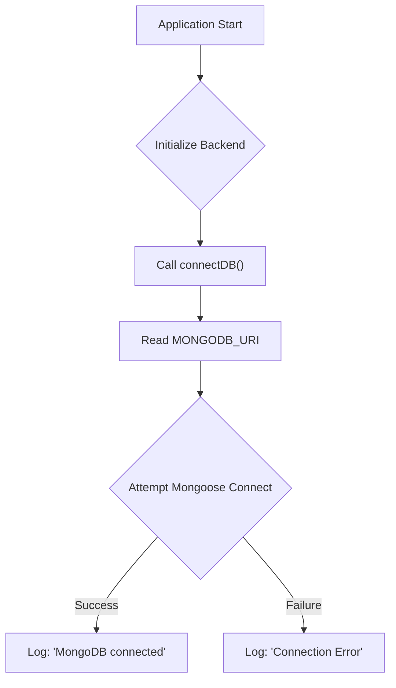
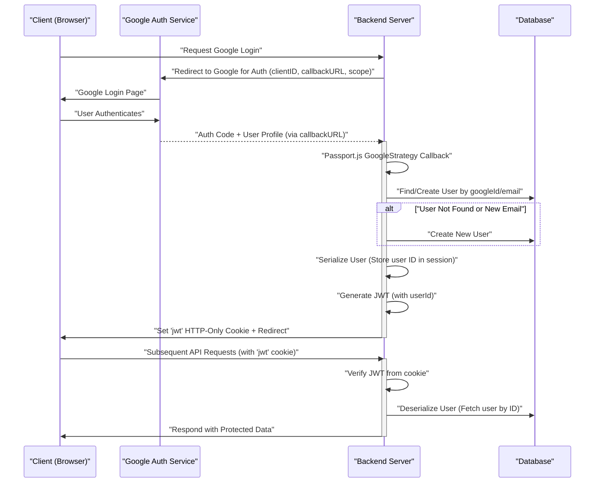

# Backend Utilities and Services

<TOC />

This section explores the foundational utility functions and service integrations crucial for the backend's operation. These modules provide essential capabilities such as database connectivity, cloud storage integration, authentication strategies, and token generation, ensuring the backend is robust and efficient.

## Database Connection

The `db.js` file handles the establishment of the connection to the MongoDB database using Mongoose. This ensures that the application can interact with its data store effectively.

The `connectDB` function attempts to connect to the MongoDB URI specified in the environment variables. Upon a successful connection, it logs the host; otherwise, it logs any encountered errors. This setup centralizes database connection logic, making it easy to manage and monitor.

```javascript showLineNumbers
import mongoose from "mongoose"

export const connectDB = async () => {
  try {
    const conn = await mongoose.connect(process.env.MONGODB_URI);
    console.log(`MongoDB connected:  ${conn.connection.host}`);
  }
  catch(error){
    console.log("MongoDB connection error: ", error);
  }
}
```

[View on GitHub](https://github.com/shinymack/Chat-App-MERN/blob/main/backend/src/lib/db.js)

### Database Connection Flow

The following diagram illustrates the simple, yet critical, flow of establishing the database connection.





## Cloudinary Integration

For handling image and video uploads, the backend integrates with Cloudinary, a cloud-based media management service. The `cloudinary.js` utility configures the Cloudinary SDK with necessary credentials, enabling secure and efficient file storage and retrieval.

This module initializes the Cloudinary SDK using API keys and cloud name from environment variables, abstracting the configuration details from other parts of the application.

```javascript showLineNumbers
import {v2 as cloudinary} from "cloudinary"
import { config } from 'dotenv'

config();

cloudinary.config(
    {cloud_name: process.env.CLOUDINARY_CLOUD_NAME,
    api_key: process.env.CLOUDINARY_API_KEY,
    api_secret: process.env.CLOUDINARY_API_SECRET,}
);

export default cloudinary;
```

[View on GitHub](https://github.com/shinymack/Chat-App-MERN/blob/main/backend/src/lib/cloudinary.js)

## Authentication with Passport.js (Google OAuth2.0)

The `passport.config.js` file sets up the authentication strategy for the application, specifically using Google OAuth 2.0 via Passport.js. This integration allows users to sign in using their Google accounts, simplifying the authentication process and enhancing security.

The `configurePassport` function defines the GoogleStrategy, handling the callback from Google after a user authenticates. It checks for existing users, creates new ones if necessary, and manages user serialization and deserialization for session management.

```javascript showLineNumbers
import passport from 'passport';
import { Strategy as GoogleStrategy } from 'passport-google-oauth20';
import User from '../models/user.model.js';
import dotenv from 'dotenv';

dotenv.config();

export const configurePassport = () => {
    passport.use(new GoogleStrategy({
        clientID: process.env.GOOGLE_CLIENT_ID,
        clientSecret: process.env.GOOGLE_CLIENT_SECRET,
        callbackURL: process.env.GOOGLE_CALLBACK_URL,
        scope: ['profile', 'email']
    },
    async (accessToken, refreshToken, profile, done) => {
        try {
            let user = await User.findOne({ googleId: profile.id });

            if (user) {
                return done(null, user);
            } else {
                let username = profile.displayName.replace(/\s+/g, '').toLowerCase() || `user${Date.now()}`;

                const existingUserByUsername = await User.findOne({ username });
                if (existingUserByUsername) {
                    username = `${username}${Date.now().toString().slice(-4)}`;
                }
                if (username.length > 20) username = username.substring(0,20);

                const newUser = new User({
                    googleId: profile.id,
                    email: profile.emails && profile.emails[0] ? profile.emails[0].value : null,
                    username: username,
                    authProvider: 'google',
                });

                if (!newUser.email) {
                    return done(new Error("Email not provided by Google. Cannot create account."), null);
                }

                const existingUserByEmail = await User.findOne({ email: newUser.email });
                if (existingUserByEmail && existingUserByEmail.authProvider !== 'google') {
                    return done(null, false, { message: `An account with email ${newUser.email} already exists. Please sign in using your original method.` });
                }

                await newUser.save();
                return done(null, newUser);
            }
        } catch (error) {
            return done(error, null);
        }
    }));

    passport.serializeUser((user, done) => {
        done(null, user.id);
    });

    passport.deserializeUser(async (id, done) => {
        try {
            const user = await User.findById(id);
            done(null, user);
        } catch (error) {
            done(error, null);
        }
    });
};
```

[View on GitHub](https://github.com/shinymack/Chat-App-MERN/blob/main/backend/src/lib/passport.config.js)

### User Serialization and Deserialization

Passport.js requires methods to serialize and deserialize user objects to store and retrieve user data from the session. `serializeUser` stores only the user ID (`user.id`) in the session, while `deserializeUser` uses this ID to fetch the full user object from the database, making it available as `req.user` in subsequent requests.

```javascript showLineNumbers
// ... (inside configurePassport function)
    passport.serializeUser((user, done) => {
        done(null, user.id); // user.id is the _id from MongoDB
    });

    // Deserialize user from session (fetch user from DB using the ID)
    passport.deserializeUser(async (id, done) => {
        try {
            const user = await User.findById(id);
            done(null, user); // This user object is attached to req.user
        } catch (error) {
            done(error, null);
        }
    });
// ...
```

[View on GitHub](https://github.com/shinymack/Chat-App-MERN/blob/main/backend/src/lib/passport.config.js#L73-L84)

## JWT Token Generation

The `utils.js` file contains helper functions, prominently `generateToken`, which is responsible for creating and setting JSON Web Tokens (JWTs) for authenticated users. This is essential for maintaining user sessions and securing API endpoints.

The `generateToken` function signs a JWT with the user's ID and a secret key, setting an expiration time. It then sets this token as an HTTP-only cookie, providing a secure way to manage user sessions without exposing the token directly to client-side JavaScript.

```javascript showLineNumbers
import jwt from 'jsonwebtoken';


export const generateToken = (userId, res) => {

    const token = jwt.sign({userId}, process.env.JWT_SECRET,
        {expiresIn: "7d"});

    res.cookie("jwt", token, {
        maxAge: 7 * 24 * 60 * 60 * 1000,
        httpOnly: true,
        sameSite: "strict",
        secure: process.env.NODE_ENV !== "development",
    });
    return token;
};
```

[View on GitHub](https://github.com/shinymack/Chat-App-MERN/blob/main/backend/src/lib/utils.js)

### Authentication Flow with Google and JWT

This diagram illustrates the comprehensive authentication process involving Google OAuth and JWT token generation.





## Key Integration Points

The utility files form the backbone of the backend's core functionalities.
*   **`db.js`**: Critical for any data interaction, ensuring the application can store and retrieve information. It's the first point of failure if connectivity issues arise.
*   **`cloudinary.js`**: Essential for features involving media uploads, such as user profile pictures or shared files in a chat application. Without it, the application cannot manage user-generated media effectively.
*   **`passport.config.js`**: Manages user identity and authentication. It's the gatekeeper for access to protected resources and forms the foundation for secure user interactions. The user serialization/deserialization ensures that once a user is authenticated, their session can be consistently managed.
*   **`utils.js`**: The `generateToken` function in `utils.js` complements the authentication strategy by providing a mechanism for stateless session management via JWTs. This is crucial for securing API endpoints and maintaining user sessions efficiently.

These modules are invoked at various stages of the application lifecycle, from server startup (database connection) to user interaction (authentication, file uploads). Their proper configuration and robust error handling are vital for the overall stability and security of the backend system.

Next: [Frontend Architecture and Implementation](./3_frontend-architecture-and-implementation.mdx)