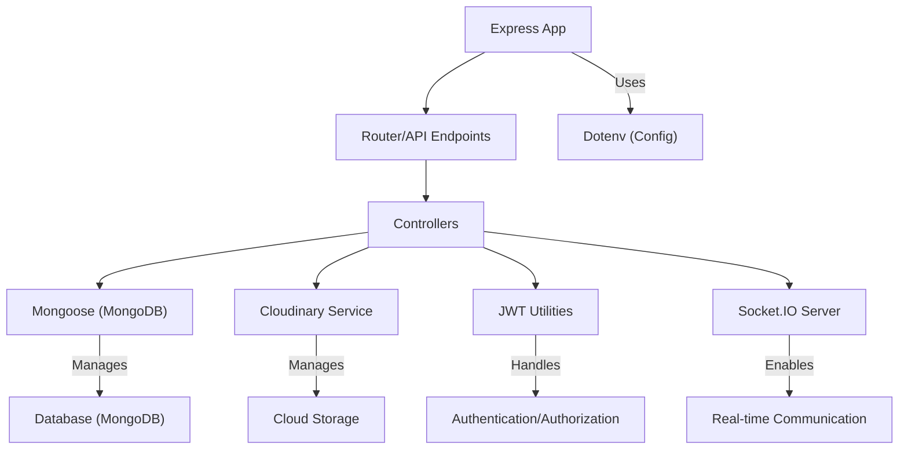
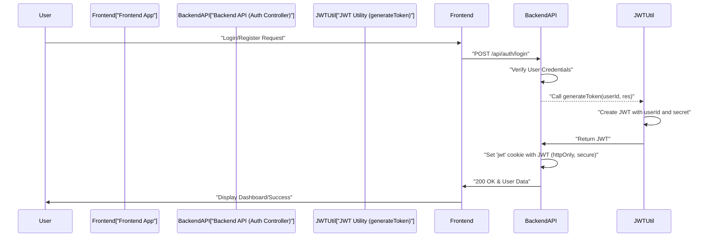

 # Backend Utilities and Services

The backend of any robust application relies on a well-structured set of utilities and services to handle essential tasks. In this DeepWiki document, we explore the core helper functions, database connection mechanisms, and external service integrations that form the backbone of our server-side operations. These components ensure data persistence, secure authentication, file management, and efficient request handling, contributing to a scalable and maintainable architecture.

## Core Technologies and Dependencies

The `backend/package.json` file serves as the manifest for all server-side dependencies, outlining the essential libraries that power our application. Understanding these dependencies is crucial for grasping the capabilities and underlying architecture of the backend.

```json
// backend/package.json
{
  "name": "backend",
  "version": "1.0.0",
  "main": "src/index.js",
  "scripts": {
    "dev": "nodemon src/index.js",
    "start": "node src/index.js"
  },
  "author": "",
  "type": "module",
  "license": "ISC",
  "description": "",
  "dependencies": {
    "bcryptjs": "^2.4.3",
    "cloudinary": "^2.5.1",
    "cookie-parser": "^1.4.7",
    "dotenv": "^16.4.7",
    "express": "^4.21.2",
    "express-session": "^1.18.1",
    "jsonwebtoken": "^9.0.2",
    "mongoose": "^8.9.5",
    "passport": "^0.7.0",
    "passport-google-oauth20": "^2.0.0",
    "socket.io": "^4.8.1"
  },
  "devDependencies": {
    "nodemon": "^3.1.9"
  }
}
```
[View on GitHub](https://github.com/shinymack/Chat-App-MERN/blob/main/backend/package.json)

Key dependencies include:

*   **`express`**: The fundamental web framework for building RESTful APIs.
*   **`mongoose`**: An ODM (Object Data Modeling) library for MongoDB, simplifying database interactions.
*   **`bcryptjs`**: For hashing passwords securely.
*   **`jsonwebtoken`**: For implementing token-based authentication (JWTs).
*   **`cloudinary`**: Integration for cloud-based image and video management.
*   **`socket.io`**: Enables real-time, bidirectional event-based communication.
*   **`dotenv`**: Loads environment variables from a `.env` file, crucial for configuration.
*   **`cookie-parser`**: Parses incoming request cookies into `req.cookies`.
*   **`passport`**, **`passport-google-oauth20`**, **`express-session`**: For flexible authentication strategies, including Google OAuth.

This combination of libraries equips the backend with capabilities for API creation, database management, secure authentication, real-time features, and external service integrations.

### Backend Core Stack Diagram

The following diagram illustrates the primary components and their relationships within the backend stack.





## Database Connection Management

The `backend/src/lib/db.js` file is responsible for establishing and managing the connection to our MongoDB database using Mongoose. A stable database connection is paramount for any data-driven application, ensuring that our backend can store, retrieve, and manipulate application data effectively.

```javascript
// backend/src/lib/db.js
import mongoose from "mongoose"

export const connectDB = async () => {
  try {
    const conn = await mongoose.connect(process.env.MONGODB_URI);
    console.log(`MongoDB connected:  ${conn.connection.host}`);
  }
  catch(error){
    console.log("MongoDB connection error: ", error);
  }
}
```
[View on GitHub](https://github.com/shinymack/Chat-App-MERN/blob/main/backend/src/lib/db.js)

The `connectDB` asynchronous function attempts to connect to the MongoDB instance specified by `process.env.MONGODB_URI`. In case of a successful connection, it logs the host; otherwise, it catches and logs any connection errors, which is critical for debugging and operational monitoring. This modular approach centralizes database connection logic, making it easy to manage and reuse across the application.

## Cloudinary Integration for Media Management

For handling media uploads and storage, the application integrates with Cloudinary, a powerful cloud-based image and video management service. The `backend/src/lib/cloudinary.js` file configures the Cloudinary SDK using environment variables, ensuring secure access to our cloud storage account.

```javascript
// backend/src/lib/cloudinary.js
import {v2 as cloudinary} from "cloudinary"

import { config } from 'dotenv'

config();

cloudinary.config(
    {cloud_name: process.env.CLOUDINARY_CLOUD_NAME,
    api_key: process.env.CLOUDINARY_API_KEY,
    api_secret: process.env.CLOUDINARY_API_SECRET,}
);

export default cloudinary;
```
[View on GitHub](https://github.com/shinymack/Chat-App-MERN/blob/main/backend/src/lib/cloudinary.js)

After loading environment variables with `dotenv.config()`, the `cloudinary.config()` method is called to initialize the Cloudinary client. This setup allows other parts of the application to use the `cloudinary` object to upload, transform, and manage media files without exposing sensitive API keys directly in the codebase. This abstraction is vital for scalability and maintainability, offloading media handling to a dedicated service.

## Authentication Utility Functions

Authentication is a critical aspect of any application, and the `backend/src/lib/utils.js` file houses helper functions designed to streamline this process, specifically for JSON Web Token (JWT) management.

```javascript
// backend/src/lib/utils.js
import jwt from 'jsonwebtoken';


export const generateToken = (userId, res) => {

    const token = jwt.sign({userId}, process.env.JWT_SECRET, 
        {expiresIn: "7d"});

    res.cookie("jwt", token, {
        maxAge: 7 * 24 * 60 * 60 * 1000, 
        httpOnly: true,
        sameSite: "strict",
        secure: process.env.NODE_ENV !== "development",
    });
    return token;
};
```
[View on GitHub](https://github.com/shinymack/Chat-App-MERN/blob/main/backend/src/lib/utils.js)

The `generateToken` function performs two key actions:
1.  **JWT Creation**: It signs a new JWT containing the `userId` payload, using a secret key from environment variables (`process.env.JWT_SECRET`) and setting an expiration of 7 days.
2.  **Cookie Management**: It sets this generated JWT as an `httpOnly` cookie named "jwt" on the response object. The `httpOnly` flag prevents client-side JavaScript from accessing the cookie, mitigating XSS attacks. `sameSite: "strict"` helps prevent CSRF attacks, and `secure: true` (in production) ensures the cookie is only sent over HTTPS.

This utility centralizes the logic for issuing secure authentication tokens, making it consistent and easy to manage throughout the application's authentication flow.

### JWT Generation and Cookie Setting Flow

This sequence diagram illustrates the steps involved when a user successfully authenticates, leading to the generation and setting of a JWT.





## Key Integration Points

The utilities and services described above are not isolated; they form a cohesive ecosystem within the backend.

*   **Database Integration**: The `connectDB` function is typically called once during application startup (e.g., in `backend/src/index.js`) to establish a persistent connection.
*   **Authentication Flow**: After a user successfully logs in or registers, the `generateToken` utility is invoked by an authentication controller to issue a JWT and set it in a secure cookie. Subsequent authenticated requests will carry this cookie, allowing the backend to verify the user's identity.
*   **Media Handling**: Whenever user-uploaded content (like profile pictures or chat attachments) needs to be stored, the Cloudinary service is utilized by relevant controllers (e.g., user profile controllers, message controllers) to upload the files and retrieve their secure URLs for storage in MongoDB.
*   **Environment Configuration**: `dotenv` is universally employed across all these services to securely load sensitive configurations such as database URIs, API keys, and JWT secrets, preventing hardcoding and facilitating environment-specific settings.

These integrations highlight the modular design of the backend, where each utility serves a specific purpose but works in concert with others to deliver the application's full functionality. Maintaining clear separation of concerns while ensuring seamless data flow and process orchestration is key to a robust backend architecture.

Next: [Frontend Application](./3_frontend-application.mdx)