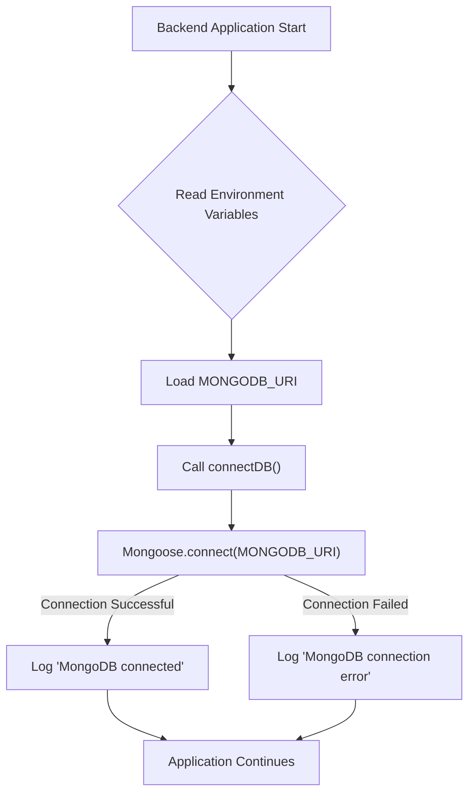
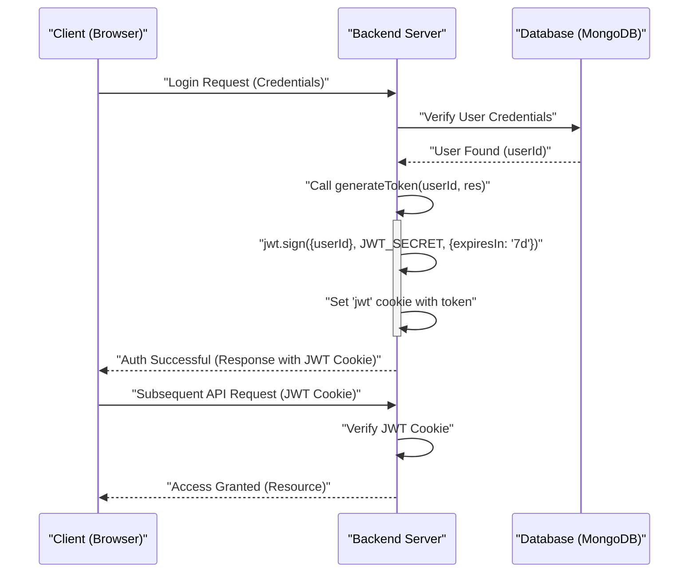

# Backend Utilities and Services

The `backend` directory houses the server-side logic, API endpoints, and essential utility services that power the application. This section delves into core backend components, including database connectivity, third-party integrations like Cloudinary for media management, and essential utility functions for security and general operations. Understanding these components is crucial for comprehending how the application handles data persistence, external services, and secure communication.

## Core Backend Dependencies

The `package.json` file in the `backend` directory lists all essential dependencies and development tools required for the server-side application. These packages enable various functionalities from database interaction to authentication and real-time communication.

### Key Dependencies Overview

The following table summarizes the primary dependencies and their roles within the backend system:

| Dependency            | Version   | Description                                                                                             |
| :-------------------- | :-------- | :------------------------------------------------------------------------------------------------------ |
| `bcryptjs`            | `^2.4.3`  | Hashing passwords for secure storage.                                                                   |
| `cloudinary`          | `^2.5.1`  | Node.js SDK for Cloudinary, used for cloud-based image and video management.                           |
| `cookie-parser`       | `^1.4.7`  | Parses `Cookie` header and populates `req.cookies` with an object keyed by the cookie names.            |
| `dotenv`              | `^16.4.7` | Loads environment variables from a `.env` file into `process.env`.                                      |
| `express`             | `^4.21.2` | Fast, unopinionated, minimalist web framework for Node.js, used for building APIs.                      |
| `express-session`     | `^1.18.1` | Simple session middleware for Express, often used with Passport.js.                                     |
| `jsonwebtoken`        | `^9.0.2`  | Implements JSON Web Tokens (JWT) for secure, stateless authentication.                                  |
| `mongoose`            | `^8.9.5`  | MongoDB object data modeling (ODM) library for Node.js, providing a schema-based solution.              |
| `passport`            | `^0.7.0`  | Authentication middleware for Node.js, offering flexible strategies.                                    |
| `passport-google-oauth20`| `^2.0.0` | Passport strategy for authenticating with Google using the OAuth 2.0 API.                             |
| `socket.io`           | `^4.8.1`  | Enables real-time, bidirectional, event-based communication between client and server.                  |

**Development Dependencies:**
- `nodemon`: `^3.1.9` - Automatically restarts the Node.js application when file changes are detected.

[View `package.json` on GitHub](https://github.com/shinymack/Chat-App-MERN/blob/main/backend/package.json)

## Database Connection

The application uses MongoDB as its primary data store, managed through Mongoose. The `connectDB` utility establishes a robust connection to the MongoDB instance, ensuring data persistence and retrieval capabilities.

### Mongoose Connection Setup

The `backend/src/lib/db.js` file contains the logic for connecting to MongoDB. It leverages Mongoose to manage the connection pool and provides error handling.

```javascript
import mongoose from "mongoose"

export const connectDB = async () => {
  try {
    const conn = await mongoose.connect(process.env.MONGODB_URI);
    console.log(`MongoDB connected:  ${conn.connection.host}`);
  }
  catch(error){
    console.log("MongoDB connection error: ", error);
  }
}
```
*Snippet: MongoDB connection utility in `backend/src/lib/db.js`.*
[View `db.js` on GitHub](https://github.com/shinymack/Chat-App-MERN/blob/main/backend/src/lib/db.js)

This asynchronous function attempts to connect to the MongoDB URI specified in the environment variables (`process.env.MONGODB_URI`). Upon successful connection, it logs the host; otherwise, it logs a connection error.

### Database Connection Flow

The following diagram illustrates the typical flow for establishing a database connection within the backend service:





*Mermaid Diagram: MongoDB Connection Flow*

## Cloudinary Integration

Cloudinary is a third-party service used for managing and serving media assets, such as user profile pictures or shared images. The `backend/src/lib/cloudinary.js` file handles the configuration and initialization of the Cloudinary SDK.

### Cloudinary Configuration

To interact with the Cloudinary service, the application needs specific credentials (cloud name, API key, and API secret), which are loaded from environment variables for security.

```javascript
import {v2 as cloudinary} from "cloudinary"
import { config } from 'dotenv'

config(); // Load environment variables

cloudinary.config(
    {cloud_name: process.env.CLOUDINARY_CLOUD_NAME,
    api_key: process.env.CLOUDINARY_API_KEY,
    api_secret: process.env.CLOUDINARY_API_SECRET,}
);

export default cloudinary;
```
*Snippet: Cloudinary configuration in `backend/src/lib/cloudinary.js`.*
[View `cloudinary.js` on GitHub](https://github.com/shinymack/Chat-App-MERN/blob/main/backend/src/lib/cloudinary.js)

This setup ensures that any part of the application importing this `cloudinary` instance can seamlessly upload, retrieve, or manage media assets.

## Utility Functions

The `backend/src/lib/utils.js` file contains general-purpose utility functions that abstract common operations, promoting code reusability and maintainability. A key utility here is for generating JSON Web Tokens (JWT) for user authentication.

### JWT Token Generation

Authentication in the application relies on JWTs. The `generateToken` function securely creates a token and sets it as an HTTP-only cookie.

```javascript
import jwt from 'jsonwebtoken';

export const generateToken = (userId, res) => {
    const token = jwt.sign({userId}, process.env.JWT_SECRET, 
        {expiresIn: "7d"});

    res.cookie("jwt", token, {
        maxAge: 7 * 24 * 60 * 60 * 1000, // 7 days
        httpOnly: true, // Prevent XSS attacks
        sameSite: "strict", // CSRF protection
        secure: process.env.NODE_ENV !== "development", // Use HTTPS in production
    });
    return token;
};
```
*Snippet: `generateToken` utility in `backend/src/lib/utils.js`.*
[View `utils.js` on GitHub](https://github.com/shinymack/Chat-App-MERN/blob/main/backend/src/lib/utils.js)

This function takes a `userId` and an Express `response` object (`res`). It signs a JWT with the user's ID and a secret from environment variables, setting an expiration of 7 days. The token is then attached to the response as an HTTP-only, strict `sameSite` cookie, enhancing security against Cross-Site Scripting (XSS) and Cross-Site Request Forgery (CSRF) attacks. The `secure` flag ensures the cookie is only sent over HTTPS in production environments.

### Authentication Flow with JWT

Here's an overview of how JWTs are generated and managed during a user authentication process:





*Mermaid Diagram: JWT Authentication Flow*

## Key Integration Points

The utilities and services discussed form the backbone of the backend system, enabling crucial functionalities:

*   **Database Connectivity:** The `connectDB` function is typically called once at the application startup (`src/index.js`), ensuring that all subsequent API requests can interact with MongoDB without re-establishing connections. This centralized approach simplifies data access and connection management.
*   **Media Management:** The `cloudinary` instance is imported wherever image or video uploads/retrievals are necessary, such as in user profile updates or message handlers. It provides a standardized and efficient way to offload media storage to a specialized third-party service, reducing server load and storage requirements.
*   **Authentication and Authorization:** The `generateToken` utility is a critical part of the user authentication workflow. It ensures that after a successful login or registration, a secure token is issued and managed client-side via HTTP-only cookies, providing stateless authentication for subsequent requests. This integrates deeply with Express routes and middleware to protect sensitive endpoints.

These shared utilities abstract complex operations, making the codebase cleaner, more modular, and easier to maintain. By centralizing common tasks, developers can focus on business logic rather than boilerplate code for database connections, external service configurations, or security primitives.

Next: [Frontend Implementation and UI](./3_frontend-implementation-and-ui.mdx)