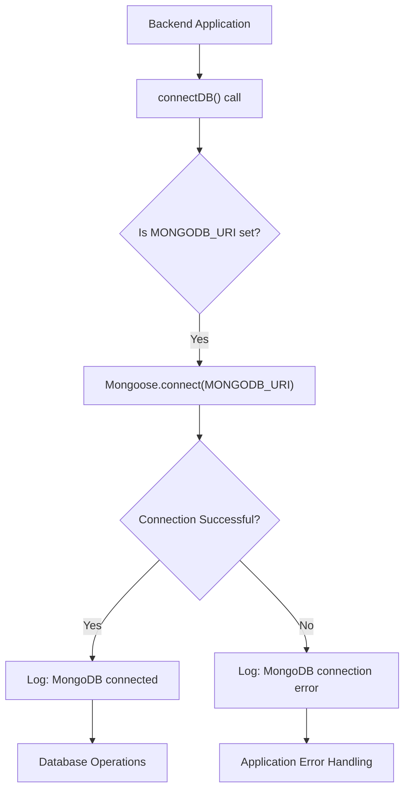

# Utilities and External Services

This section details the auxiliary functions and integrations with external services critical for the backend's operation. These utilities range from connecting to the database, managing media uploads, to handling authentication tokens, ensuring the application's robustness and scalability. We leverage established third-party services like Cloudinary for efficient media storage and delivery, and Mongoose for robust database interactions.

## Dependencies Overview

The `backend/package.json` file outlines the core dependencies that empower these utilities and services. Key packages include `cloudinary` for cloud-based media management, `mongoose` for MongoDB interactions, and `jsonwebtoken` for secure authentication token generation.

```json title="backend/package.json - Key Dependencies"
{
  "dependencies": {
    "bcryptjs": "^2.4.3",
    "cloudinary": "^2.5.1",
    "cookie-parser": "^1.4.7",
    "dotenv": "^16.4.7",
    "express": "^4.21.2",
    "express-session": "^1.18.1",
    "jsonwebtoken": "^9.0.2",
    "mongoose": "^8.9.5",
    "passport": "^0.7.0",
    "passport-google-oauth20": "^2.0.0",
    "socket.io": "^4.8.1"
  }
}
```
[View on GitHub](https://github.com/shinymack/Chat-App-MERN/blob/main/backend/package.json)

The inclusion of `cloudinary`, `mongoose`, and `jsonwebtoken` directly supports the features discussed in this document, highlighting the reliance on external libraries for specialized tasks.

## External Service Integrations

### Cloudinary for Media Management

Cloudinary is integrated for efficient and scalable image and video management. This service handles uploads, storage, and delivery of media assets, offloading the burden from the application's backend and ensuring high availability and performance. The configuration is centralized in `backend/src/lib/cloudinary.js`.

```javascript title="backend/src/lib/cloudinary.js - Cloudinary Configuration"
import {v2 as cloudinary} from "cloudinary"
import { config } from 'dotenv'

config();

cloudinary.config(
    {cloud_name: process.env.CLOUDINARY_CLOUD_NAME,
    api_key: process.env.CLOUDINARY_API_KEY,
    api_secret: process.env.CLOUDINARY_API_SECRET,}
);

export default cloudinary;
```
[View on GitHub](https://github.com/shinymack/Chat-App-MERN/blob/main/backend/src/lib/cloudinary.js)

This snippet demonstrates how environment variables are used to securely configure Cloudinary, ensuring credentials are not hardcoded. The `cloudinary` object is then exported, making it available for media upload operations throughout the application.

### Database Connection

The application connects to a MongoDB database using Mongoose, an ODM (Object Data Modeling) library for Node.js. The `connectDB` function in `backend/src/lib/db.js` establishes this connection, providing a robust and asynchronous way to interact with the database.

```javascript title="backend/src/lib/db.js - MongoDB Connection"
import mongoose from "mongoose"

export const connectDB = async () => {
  try {
    const conn = await mongoose.connect(process.env.MONGODB_URI);
    console.log(`MongoDB connected:  ${conn.connection.host}`);
  }
  catch(error){
    console.log("MongoDB connection error: ", error);
  }
}
```
[View on GitHub](https://github.com/shinymack/Chat-App-MERN/blob/main/backend/src/lib/db.js)

This function attempts to connect to MongoDB using the `MONGODB_URI` environment variable. It includes error handling to log connection failures, which is crucial for monitoring and debugging database issues.





## Authentication Helpers

### JWT Generation

A utility function, `generateToken`, handles the creation and assignment of JSON Web Tokens (JWTs) for user authentication. Located in `backend/src/lib/utils.js`, this function signs a token with a user ID and sets it as an HTTP-only cookie, enhancing security by making the token inaccessible to client-side JavaScript.

```javascript title="backend/src/lib/utils.js - JWT Token Generation"
import jwt from 'jsonwebtoken';

export const generateToken = (userId, res) => {
    const token = jwt.sign({userId}, process.env.JWT_SECRET,
        {expiresIn: "7d"});

    res.cookie("jwt", token, {
        maxAge: 7 * 24 * 60 * 60 * 1000,
        httpOnly: true,
        sameSite: "strict",
        secure: process.env.NODE_ENV !== "development",
    });
    return token;
};
```
[View on GitHub](https://github.com/shinymack/Chat-App-MERN/blob/main/backend/src/lib/utils.js)

This method ensures that user sessions are maintained securely. The `maxAge` parameter defines the token's validity period, `httpOnly` prevents client-side script access, `sameSite: "strict"` mitigates CSRF attacks, and `secure` ensures the cookie is only sent over HTTPS in production environments.


```mermaid
sequenceDiagram
    participant A as "User Login Request"
    participant B as "Backend (Auth Controller)"
    participant C as "generateToken()"
    participant D as "Browser"

    A->>B: "POST /api/auth/login"
    B->>C: "Call generateToken(userId, res)"
    C->>C: "jwt.sign({userId}, JWT_SECRET, options)"
    C-->>B: "Returns JWT"
    B->>D: "Set-Cookie: jwt=token; ... (httpOnly, secure)"
    D->>A: "Login Successful Response"
```


## Key Integration Points

The utilities and external services described are foundational to the application's overall architecture.
*   **Media Upload Flow**: When a user uploads a profile picture or sends an image in a chat, the backend utilizes the configured Cloudinary instance to handle the upload, returning a secure URL for storage in the database and subsequent display.
*   **User Authentication**: Upon successful user login or registration, the `generateToken` utility is invoked to create a JWT, which is then set as a secure cookie. This token is subsequently used by the frontend to authenticate requests to protected routes.
*   **Application Startup**: The `connectDB` function is crucial for the application's initialization, ensuring that a robust connection to MongoDB is established before other services attempt to interact with the database. This pattern prevents runtime errors due to an unavailable database.

These well-defined utility functions and integrations with external services simplify complex tasks like media management and authentication, allowing developers to focus on core application logic.

Next: [Frontend Implementation and UI](./3_frontend-implementation-and-ui.mdx)