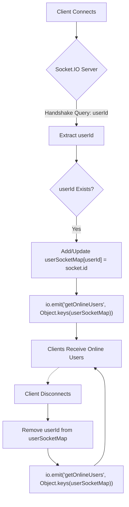
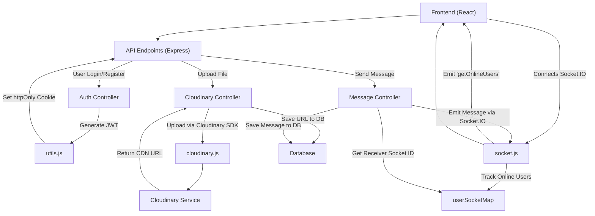

 # Utility Services and Libraries

This section details the core utility services and libraries used across the backend application. These components provide essential functionalities ranging from secure token generation and real-time communication to external file management, abstracting complex operations into reusable modules.

The services discussed here are fundamental for handling various aspects of the application's lifecycle, including user authentication, real-time presence, and media content management. By centralizing these functionalities, the application maintains a clean, modular, and scalable architecture.

## Cloudinary Integration

The application leverages Cloudinary for robust and scalable media asset management. This service handles file uploads, storage, and delivery, offloading media infrastructure concerns from the main application. The integration involves configuring Cloudinary with necessary API credentials and exposing a configured instance for use throughout the backend.

### Configuration

The `cloudinary.js` file is responsible for initializing the Cloudinary SDK with credentials loaded from environment variables. This ensures secure access and allows for flexible deployment configurations.

```javascript
// backend/src/lib/cloudinary.js
import {v2 as cloudinary} from "cloudinary"
import { config } from 'dotenv'

config(); // Load environment variables

cloudinary.config(
    {
        cloud_name: process.env.CLOUDINARY_CLOUD_NAME,
        api_key: process.env.CLOUDINARY_API_KEY,
        api_secret: process.env.CLOUDINARY_API_SECRET,
    }
);

export default cloudinary;
```
[View on GitHub](https://github.com/shinymack/Chat-App-MERN/blob/main/backend/src/lib/cloudinary.js)

This configuration snippet demonstrates how the `cloudinary` object is initialized. Once configured, this object can be imported and used anywhere in the application to perform operations like uploading images, videos, or other assets, receiving optimized URLs, and managing media transformations.

## Socket.IO for Real-time Communication

Socket.IO is central to enabling real-time functionalities within the application, such as displaying online users and facilitating instant message delivery. The `socket.js` module sets up the Socket.IO server, manages user connections, and tracks online user statuses.

### Server Setup and User Tracking

The Socket.IO server is initialized alongside an Express app and an HTTP server, ensuring seamless integration with the existing backend. It handles incoming connections, identifies users by their `userId` from the handshake query, and maintains a map of online users.

```javascript
// backend/src/lib/socket.js
import { Server } from "socket.io";
import http from "http";
import express from "express";

const app = express();
const server = http.createServer(app);
const io = new Server(server, {
    cors: {
        origin: ["http://localhost:5173"] // Frontend origin for CORS
    }
});

// Stores online users: {userId : socketId}
const userSocketMap = {};

export function getReceiverSocketId(userId) {
    return userSocketMap[userId];
}
```
[View on GitHub](https://github.com/shinymack/Chat-App-MERN/blob/main/backend/src/lib/socket.js#L1-L18)

This initial setup creates the `io` instance and the `userSocketMap`. The `getReceiverSocketId` function provides a convenient way to retrieve a specific user's socket ID, crucial for targeted message delivery.

### Connection and Disconnection Handling

The `io.on("connection")` event listener is vital for managing the lifecycle of user connections. It updates the `userSocketMap` when a user connects and emits `getOnlineUsers` to all connected clients, ensuring the online user list is always current.

```javascript
// backend/src/lib/socket.js
// ... (previous code)

io.on("connection", (socket) => {
    console.log("A user connected", socket.id);

    const userId = socket.handshake.query.userId;
    if(userId) userSocketMap[userId] = socket.id;

    // Emit online users to all clients
    io.emit("getOnlineUsers", Object.keys(userSocketMap));

    socket.on("disconnect", ()=>{
        console.log("A user disconnected", socket.id);
        delete userSocketMap[userId]; 
        // Re-emit updated online users
        io.emit("getOnlineUsers", Object.keys(userSocketMap));
    })
})

export { io, app, server };
```
[View on GitHub](https://github.com/shinymack/Chat-App-MERN/blob/main/backend/src/lib/socket.js#L21-L36)

Upon connection, the `userId` is extracted, and the `userSocketMap` is updated. When a user disconnects, their entry is removed, and the `getOnlineUsers` event is re-emitted, maintaining real-time accuracy of user presence.

### Socket.IO Flow





## Utility Functions

The `utils.js` file contains general-purpose helper functions designed to support various backend operations. Currently, it focuses on authentication-related tasks, specifically JWT generation and cookie management.

### JWT Generation and Cookie Setting

The `generateToken` function securely signs a JSON Web Token (JWT) with the provided `userId` and sets it as an HTTP-only cookie in the response. This approach enhances security by making the token inaccessible to client-side JavaScript.

```javascript
// backend/src/lib/utils.js
import jwt from 'jsonwebtoken';

export const generateToken = (userId, res) => {
    const token = jwt.sign({userId}, process.env.JWT_SECRET, 
        {expiresIn: "7d"});

    res.cookie("jwt", token, {
        maxAge: 7 * 24 * 60 * 60 * 1000, // 7 days
        httpOnly: true, // Prevent client-side JS access
        sameSite: "strict", // CSRF protection
        secure: process.env.NODE_ENV !== "development", // Use HTTPS in production
    });
    return token;
};
```
[View on GitHub](https://github.com/shinymack/Chat-App-MERN/blob/main/backend/src/lib/utils.js)

The token is configured to expire in 7 days, and its cookie options are carefully set to enhance security: `httpOnly` prevents XSS attacks from accessing the token, `sameSite: "strict"` mitigates CSRF risks, and `secure` ensures the cookie is only sent over HTTPS in production environments.

## Key Integration Points

### Authentication Flow and Token Management
The `generateToken` utility is a critical part of the user authentication and authorization process. After a user successfully logs in or registers, this function is invoked to issue a new JWT. This token is then stored as an HTTP-only cookie, ensuring that subsequent requests from the client include the token for authentication, while keeping it secure from client-side script access.

### Real-time User Presence
The `socket.js` module forms the backbone of the application's real-time capabilities. It not only tracks online users but also serves as the communication hub for instant messaging. When a user logs in, their `userId` is passed to the Socket.IO server upon connection, allowing the backend to map `userId` to `socketId`. This mapping is then used by the messaging service to retrieve the `socketId` of the recipient and emit messages directly, ensuring instant delivery.

### Media Uploads
The Cloudinary integration is typically used within API routes that handle user profile updates or message attachments. When a user uploads an image or video, the backend route receives the file, passes it to the configured `cloudinary` instance (imported from `backend/src/lib/cloudinary.js`), and then saves the returned secure URL in the database. This offloads storage and processing to Cloudinary, making the application more efficient and scalable.

### Inter-Service Communication
The `io` instance exported from `backend/src/lib/socket.js` is imported into other parts of the backend, particularly in the controllers that handle message creation. When a new message is saved to the database, the controller can use `getReceiverSocketId` to find the recipient's socket and emit the new message in real-time, bypassing the need for the recipient to poll the server.

### System Overview





Next: [Frontend Development](./3_frontend-development.mdx)