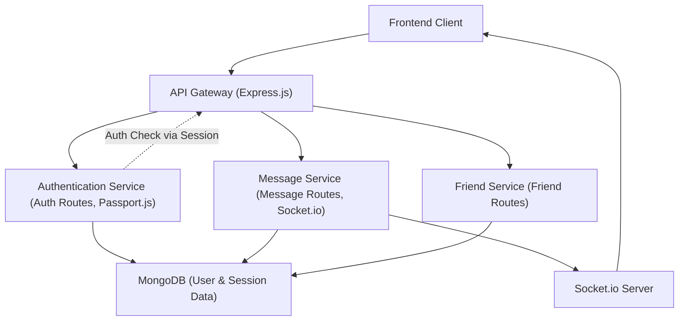

# Backend Architecture and API

This document provides a comprehensive overview of the backend architecture for the chat application, detailing its core components, technology stack, and the structure of its exposed API endpoints. The server-side is built to be robust, scalable, and secure, handling user authentication, message processing, friend management, and real-time communication.

## Core Technology Stack

The backend leverages a modern JavaScript ecosystem, primarily built on Node.js and the Express.js framework. This setup provides a powerful and flexible foundation for building RESTful APIs and integrating real-time functionalities.

### Key Dependencies

The `backend/package.json` file outlines the core dependencies that power the server. Below is a breakdown of the significant packages and their roles:

```json
// backend/package.json (excerpt)
{
  "name": "backend",
  "version": "1.0.0",
  "main": "src/index.js",
  "type": "module",
  "dependencies": {
    "bcryptjs": "^2.4.3",
    "cloudinary": "^2.5.1",
    "cookie-parser": "^1.4.7",
    "dotenv": "^16.4.7",
    "express": "^4.21.2",
    "express-session": "^1.18.1",
    "jsonwebtoken": "^9.0.2",
    "mongoose": "^8.9.5",
    "passport": "^0.7.0",
    "passport-google-oauth20": "^2.0.0",
    "socket.io": "^4.8.1"
  },
  "devDependencies": {
    "nodemon": "^3.1.9"
  }
}
```
[View on GitHub](https://github.com/shinymack/Chat-App-MERN/blob/main/backend/package.json)

*   **`express`**: The core web framework for handling HTTP requests, routing, and middleware.
*   **`mongoose`**: An ODM (Object Data Modeling) library for MongoDB, providing a straightforward way to interact with the database.
*   **`socket.io`**: Enables real-time, bidirectional, event-based communication between the server and clients, crucial for chat functionalities.
*   **`bcryptjs`**: Used for hashing user passwords securely.
*   **`jsonwebtoken`**: For creating and verifying JSON Web Tokens (JWTs) used in authentication.
*   **`cookie-parser`**: Parses cookies attached to the client request object.
*   **`dotenv`**: Loads environment variables from a `.env` file, keeping sensitive configurations separate from the codebase.
*   **`express-session`**: Middleware for managing user sessions.
*   **`passport`**, **`passport-google-oauth20`**: Authentication middleware for Node.js, supporting various strategies including Google OAuth 2.0.
*   **`cloudinary`**: Integration for cloud-based image and video management, likely used for user avatars or media sharing.
*   **`nodemon` (dev)**: A utility that monitors for any changes in your source and automatically restarts your server, enhancing developer productivity.

## Server Initialization and Configuration

The `backend/src/index.js` file serves as the entry point for the backend application, responsible for setting up the Express server, configuring middleware, connecting to the database, and initializing routes.

```javascript
// backend/src/index.js (excerpt)
import express from "express";
import cors from "cors";
import authRoutes from "./routes/auth.route.js";
import messageRoutes from "./routes/message.route.js";
import friendRoutes from "./routes/friend.route.js";
import dotenv from "dotenv";
import cookieParser from "cookie-parser";
import { connectDB } from "./lib/db.js";
import { app, server } from "./lib/socket.js"; // 'app' is Express app, 'server' is HTTP server
import session from "express-session";
import passport from "passport";
import { configurePassport } from "./lib/passport.config.js";

// ... (path resolution and dotenv config) ...

configurePassport(); // Initialize Passport strategies

app.use(cookieParser());
app.use(express.json({limit : '2mb'})); // Parses JSON request bodies
app.use(express.urlencoded({ limit: '2mb', extended: true })); // Parses URL-encoded request bodies
app.use(cors({
    origin: "http://localhost:5173", // Allows requests from the frontend
    credentials: true, // Allows cookies to be sent
}));

app.use(session({
    secret: process.env.SESSION_SECRET, 
    resave: false,
    saveUninitialized: false, 
    cookie: {
        secure: process.env.NODE_ENV === "production",
        httpOnly: true,
        maxAge: 7 * 24 * 60 * 60 * 1000 
    }
}));

app.use(passport.initialize()); // Initializes Passport
app.use(passport.session());  // Enables Passport session support

// Route Middlewares
app.use("/api/auth", authRoutes );
app.use("/api/messages", messageRoutes );
app.use("/api/friends", friendRoutes);

// ... (production build serving logic) ...

server.listen(PORT, () => {
    console.log("server is running on PORT: " + String(PORT));
    connectDB(); // Connects to MongoDB
});
```
[View on GitHub](https://github.com/shinymack/Chat-App-MERN/blob/main/backend/src/index.js)

### Middleware Configuration

The server is configured with several important middleware components:
*   **`cors`**: Enables Cross-Origin Resource Sharing, allowing the frontend running on `http://localhost:5173` to make requests to the backend. Crucially, `credentials: true` ensures that cookies (for session management) are exchanged.
*   **`express.json()` and `express.urlencoded()`**: These parse incoming request bodies in JSON and URL-encoded formats, respectively. The `limit: '2mb'` option prevents large payloads from consuming excessive server resources, potentially useful for message content or profile updates.
*   **`cookie-parser`**: Parses `Cookie` header and populates `req.cookies` with an object keyed by the cookie names.
*   **`express-session`**: Manages user sessions. The `secret` is used to sign the session ID cookie, `secure` ensures the cookie is only sent over HTTPS in production, and `httpOnly` prevents client-side JavaScript access to the cookie.
*   **`passport.initialize()` and `passport.session()`**: Integrate Passport.js into the Express application for authentication. `passport.initialize()` sets up Passport, and `passport.session()` uses Express sessions to persist user login states between requests.

### Database Connection

The application connects to a MongoDB database, managed through Mongoose. The connection logic is encapsulated in `backend/src/lib/db.js`.

```javascript
// backend/src/lib/db.js
import mongoose from "mongoose"

export const connectDB = async () => {
  try {
    const conn = await mongoose.connect(process.env.MONGODB_URI);
    console.log(`MongoDB connected:  ${conn.connection.host}`);
  }
  catch(error){
    console.log("MongoDB connection error: ", error);
  }
}
```
[View on GitHub](https://github.com/shinymack/Chat-App-MERN/blob/main/backend/src/lib/db.js)

This module exports an asynchronous function `connectDB` that attempts to establish a connection to MongoDB using the URI provided in `process.env.MONGODB_URI`. It logs a success message with the host if the connection is successful, or an error message otherwise.

## API Endpoints

The backend exposes several API routes, organized by domain: `/api/auth`, `/api/messages`, and `/api/friends`. These routes handle authentication, message exchange, and friend list management, respectively.

### Authentication Endpoints (`/api/auth`)

The `backend/src/routes/auth.route.js` file defines all authentication-related API endpoints. These routes manage user registration, login, logout, profile updates, and Google OAuth integration.

```javascript
// backend/src/routes/auth.route.js (excerpt)
import express from "express"
import passport from 'passport';
import { login, logout, signup, updateProfile, checkAuth, googleAuthCallback, checkUsernameAvailability} from  "../controllers/auth.controller.js"
import { protectRoute } from "../middleware/auth.middleware.js"
const router = express.Router();

router.post("/signup", signup);
router.post("/login", login);
router.post("/logout", logout);
router.put("/update-profile", protectRoute ,updateProfile)
router.get("/username/check/:username", protectRoute, checkUsernameAvailability);
router.get("/check", protectRoute, checkAuth)
router.get(
    '/google',
    passport.authenticate('google', { scope: ['profile', 'email'] })
);
router.get(
    '/google/callback',
    passport.authenticate('google', {
        failureRedirect: 'http://localhost:5173/login', 
        failureMessage: true
    }),
    googleAuthCallback 
);

export default router;
```
[View on GitHub](https://github.com/shinymack/Chat-App-MERN/blob/main/backend/src/routes/auth.route.js)

| Method | Endpoint                              | Description                                                    | Middleware    |
| :----- | :------------------------------------ | :------------------------------------------------------------- | :------------ |
| `POST` | `/api/auth/signup`                    | Registers a new user account.                                  | None          |
| `POST` | `/api/auth/login`                     | Authenticates a user and establishes a session.                | None          |
| `POST` | `/api/auth/logout`                    | Terminates the current user session.                           | None          |
| `PUT`  | `/api/auth/update-profile`            | Updates the authenticated user's profile information.          | `protectRoute`|
| `GET`  | `/api/auth/username/check/:username`  | Checks if a given username is available.                       | `protectRoute`|
| `GET`  | `/api/auth/check`                     | Verifies if a user is currently authenticated.                 | `protectRoute`|
| `GET`  | `/api/auth/google`                    | Initiates Google OAuth authentication flow.                    | None          |
| `GET`  | `/api/auth/google/callback`           | Handles the callback from Google OAuth, completing auth.       | None          |

The `protectRoute` middleware ensures that only authenticated users can access certain endpoints, adding a layer of security.

### Other API Endpoints

*   **`/api/messages`**: Handled by `messageRoutes`, this likely includes endpoints for sending, receiving, and managing chat messages. Given the use of `socket.io`, this might focus on message persistence and retrieval, while real-time delivery is handled by WebSockets.
*   **`/api/friends`**: Handled by `friendRoutes`, this would encompass functionalities like sending friend requests, accepting/rejecting requests, and retrieving a user's friend list.

## Backend Architecture Overview

The backend operates as a centralized server that manages all application logic, data persistence, and real-time communication.





*   **Frontend Client**: The web application interface that users interact with.
*   **API Gateway (Express.js)**: The main entry point for all HTTP requests from the frontend. It routes requests to appropriate services and handles middleware.
*   **Authentication Service**: Manages user registration, login, logout, and session management using Passport.js and JWT/sessions.
*   **Message Service**: Handles message related operations like storage, retrieval and integrates with Socket.io for real-time delivery.
*   **Friend Service**: Manages friend relationships, requests, and lists.
*   **MongoDB**: The primary database for storing application data, including user profiles, messages, and friend relationships.
*   **Socket.io Server**: Facilitates real-time, bidirectional communication, enabling instant message delivery and other real-time features.

## Key Integration Points

1.  **Authentication Flow**: Users can sign up/log in using traditional email/password or Google OAuth. `passport.js` manages the strategy, `express-session` maintains user state, and `jsonwebtoken` might be used for API tokens (though sessions are primarily in play).
    


```mermaid
    sequenceDiagram
        actor U as "User"
        participant F as "Frontend"
        participant B as "Backend (Auth)"
        participant P as "Passport.js"
        participant G as "Google Auth"
        participant D as "MongoDB"

        U->>F: "Login/Signup"
        F->>B: "POST /api/auth/login"
        B->>P: "Validate Credentials"
        alt "If Credentials Valid"
            P->>D: "Retrieve User Data"
            P-->>B: "User Data"
            B->>F: "Set Session Cookie"
            F->>U: "Login Successful"
        else "If Invalid"
            B->>F: "Error Response"
        end

        U->>F: "Click 'Login with Google'"
        F->>B: "GET /api/auth/google"
        B->>P: "Authenticate Google"
        P->>G: "Redirect to Google Login Page"
        G-->>U: "User Authorizes"
        G->>B: "Redirect to /api/auth/google/callback"
        B->>P: "Handle Google Callback"
        P->>D: "Find/Create User"
        P-->>B: "User Data"
        B->>F: "Set Session Cookie & Redirect to Dashboard"
        F->>U: "Logged In via Google"
    ```


    This sequence illustrates how both direct login and Google OAuth authentication flows are handled, leveraging Passport.js for strategy management and MongoDB for user data persistence. The backend sets session cookies to maintain user state.

2.  **Real-time Messaging**: `socket.io` runs alongside the Express server, enabling a direct, persistent connection between the client and server. When a user sends a message, it can be immediately broadcast to other relevant clients without needing to poll the server. Messages are also persisted in MongoDB.

3.  **Security**: The application uses `bcryptjs` for password hashing, `protectRoute` middleware for API endpoint authorization, and `express-session` with `secure` and `httpOnly` flags for robust session management.

4.  **Environment Configuration**: `dotenv` ensures that sensitive information like database URIs, session secrets, and API keys are loaded from environment variables, promoting secure deployment practices.

The backend provides a scalable foundation for the chat application, handling user interactions, managing data, and facilitating real-time communication effectively.

---
Next: [Authentication and User Management](./2.1_authentication-and-user-management.mdx)