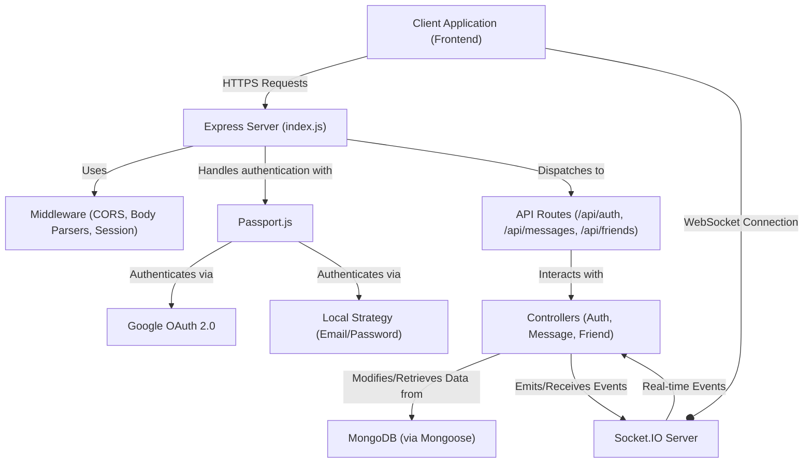
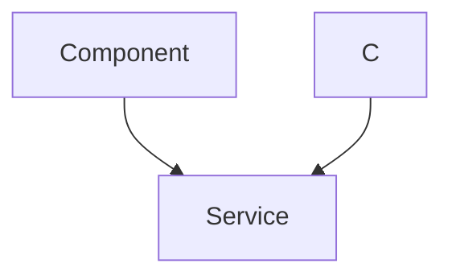

 # Backend Architecture and APIs

This document outlines the core architecture of the backend, covering its structure, key technologies, data models, and API endpoints. The backend is designed as a robust server-side application built on Node.js and Express, providing RESTful APIs, real-time communication via WebSockets, and secure authentication.

## Core Technologies and Dependencies

The backend leverages a powerful set of technologies to deliver a scalable and feature-rich application. The `package.json` file details the primary dependencies:

```json
{
  "name": "backend",
  "version": "1.0.0",
  "main": "src/index.js",
  "scripts": {
    "dev": "nodemon src/index.js",
    "start": "node src/index.js"
  },
  "dependencies": {
    "bcryptjs": "^2.4.3",
    "cloudinary": "^2.5.1",
    "cookie-parser": "^1.4.7",
    "dotenv": "^16.4.7",
    "express": "^4.21.2",
    "express-session": "^1.18.1",
    "jsonwebtoken": "^9.0.2",
    "mongoose": "^8.9.5",
    "passport": "^0.7.0",
    "passport-google-oauth20": "^2.0.0",
    "socket.io": "^4.8.1"
  },
  "devDependencies": {
    "nodemon": "^3.1.9"
  }
}
```
[View on GitHub](https://github.com/shinymack/Chat-App-MERN/blob/main/backend/package.json)

Key dependencies and their roles:
*   **Express.js**: The web application framework for handling routes and middleware.
*   **Mongoose**: An ODM (Object Data Modeling) library for MongoDB, simplifying database interactions.
*   **Socket.IO**: Enables real-time, bidirectional event-based communication between the server and clients.
*   **bcryptjs**: Used for hashing user passwords securely.
*   **jsonwebtoken (JWT)**: For generating and verifying access tokens.
*   **Passport.js**: Authentication middleware, integrated with `passport-google-oauth20` for Google OAuth.
*   **express-session**: Middleware to manage user sessions.
*   **cloudinary**: For cloud-based image and video management, likely used for profile pictures.
*   **dotenv**: Manages environment variables for configuration.
*   **cookie-parser**: Parses cookies attached to the client request object.

## Server Entry Point and Configuration

The `backend/src/index.js` file serves as the main entry point for the backend application. It sets up the Express server, configures middleware, defines API routes, and initializes the database connection and Socket.IO.

```javascript
import express from "express";
import cors from "cors";
// ... other imports ...

const __dirname = path.resolve();
dotenv.config();

configurePassport(); // Initializes Passport.js strategies

app.use(cookieParser());
app.use(express.json({limit : '2mb'}));
app.use(express.urlencoded({ limit: '2mb', extended: true }));
app.use(cors({
    origin: "http://localhost:5173", // Configured for local development
    credentials: true,
}));

app.use(session({
    secret: process.env.SESSION_SECRET, 
    resave: false,
    saveUninitialized: false, 
    cookie: {
        secure: process.env.NODE_ENV === "production", // true in production (HTTPS)
        httpOnly: true,
        maxAge: 7 * 24 * 60 * 60 * 1000 
    }
}));

app.use(passport.initialize());
app.use(passport.session());  

app.use("/api/auth", authRoutes );
app.use("/api/messages", messageRoutes );
app.use("/api/friends", friendRoutes);

// ... production static file serving ...

server.listen(PORT, () => {
    console.log("server is running on PORT: " + String(PORT));
    connectDB();
});
```
[View on GitHub](https://github.com/shinymack/Chat-App-MERN/blob/main/backend/src/index.js)

This snippet highlights:
*   **Middleware Stack**: `cookie-parser`, `express.json`, `express.urlencoded`, and `cors` are configured to handle request parsing and cross-origin requests.
*   **Session and Authentication**: `express-session` and `passport` are crucial for managing user sessions and handling various authentication strategies, including local and Google OAuth.
*   **Route Mounting**: API routes for authentication, messages, and friends are mounted under their respective base paths, ensuring modularity.
*   **Database Connection**: `connectDB()` is called upon server startup to establish a connection to MongoDB.
*   **Socket.IO Integration**: The `server` object (from `lib/socket.js`) is used to listen, implying Socket.IO runs on the same port as the Express app.

## User Data Model

The `backend/src/models/user.model.js` defines the Mongoose schema for the `User` document, which is central to the application's data structure.

```javascript
import mongoose from "mongoose"

const  userSchema = new mongoose.Schema(
    {
        email: { 
            type: String,
            required: true,
            unique: true
        },
        username: {
            type: String,
            required: [true, "Username is required"],
            unique: true,
            trim: true,
            minlength: [3, "Username must be at least 3 characters long"],
            maxlength: [20, "Username cannot be more than 20 characters long"]
        },
        password: {
            type: String,
            minlength: 6,
        },
        profilePic: {
            type: String,
            default: "",
        },
        friends: [{
            type: mongoose.Schema.Types.ObjectId,
            ref: "User",
            default: [] 
        }],
        friendRequests: [{ // Incoming friend requests
            type: mongoose.Schema.Types.ObjectId,
            ref: "User",
            default: []
        }],
        sentRequests: [{ // Outgoing friend requests
            type: mongoose.Schema.Types.ObjectId,
            ref: "User",
            default: []
        }],
        authProvider: {
            type: String,
            enum: ['email', 'google'],
            default: 'email'
        },
        googleId: {
            type: String,
            unique: true,
            sparse: true
        },
    },
    { 
        timestamps: true
    } 
);

userSchema.pre('save', async function(next) {
    if (this.authProvider === 'google' && !this.isModified('password')) {
        this.password = undefined;
    }
    // ... password requirement for email signup ...
    next();
});

const User = mongoose.model("User", userSchema);

export default User;
```
[View on GitHub](https://github.com/shinymack/Chat-App-MERN/blob/main/backend/src/models/user.model.js)

The `User` schema includes:
*   **Authentication Fields**: `email`, `username`, `password`, `authProvider` (e.g., 'email', 'google'), and `googleId`.
*   **Profile Information**: `profilePic`.
*   **Social Connections**: `friends`, `friendRequests` (incoming), and `sentRequests` (outgoing), all referencing other `User` documents.
*   **Pre-save Hook**: A `pre('save')` middleware handles logic for Google authenticated users, ensuring password is not required or saved for them, and enforces password requirements for email signups.

## API Endpoints: Authentication and User Management

The `backend/src/routes/auth.route.js` defines the API endpoints related to user authentication and profile management. These routes are central to user interaction with the application.

```javascript
import express from "express"
import passport from 'passport';
import { login, logout, signup, updateProfile, checkAuth, googleAuthCallback, checkUsernameAvailability} from  "../controllers/auth.controller.js"
import { protectRoute } from "../middleware/auth.middleware.js"
const router = express.Router();

router.post("/signup", signup);
router.post("/login", login);
router.post("/logout", logout);
router.put("/update-profile", protectRoute ,updateProfile)
router.get("/username/check/:username", protectRoute, checkUsernameAvailability);
router.get("/check", protectRoute, checkAuth)
router.get(
    '/google',
    passport.authenticate('google', { scope: ['profile', 'email'] })
);
router.get(
    '/google/callback',
    passport.authenticate('google', {
        // successRedirect: 'http://localhost:5173/', 
        failureRedirect: 'http://localhost:5173/login', 
        failureMessage: true 
    }),
    googleAuthCallback 
);
export default router;
```
[View on GitHub](https://github.com/shinymack/Chat-App-MERN/blob/main/backend/src/routes/auth.route.js)

Key authentication endpoints:
*   `POST /api/auth/signup`: Registers a new user with email and password.
*   `POST /api/auth/login`: Authenticates an existing user.
*   `POST /api/auth/logout`: Clears the user session.
*   `PUT /api/auth/update-profile`: Allows authenticated users to update their profile (requires `protectRoute` middleware).
*   `GET /api/auth/username/check/:username`: Checks if a username is available.
*   `GET /api/auth/check`: Verifies the authentication status of the current user.
*   `GET /api/auth/google`: Initiates Google OAuth authentication flow.
*   `GET /api/auth/google/callback`: Handles the callback from Google OAuth, completing the authentication process.

## Backend Architecture Flow

The following diagram illustrates the high-level architecture of the backend and how different components interact.





## API Request and Authentication Flow

This diagram details the flow for an API request requiring authentication, demonstrating how middleware and Passport.js are integrated.





## Key Integration Points

*   **Authentication & Session Management**: The backend integrates `express-session` and `passport.js` to provide robust authentication, including both traditional email/password and Google OAuth. Sessions are managed via cookies, ensuring secure and persistent user states. The `protectRoute` middleware ensures that sensitive endpoints are only accessible to authenticated users.
*   **Real-time Communication**: Socket.IO is seamlessly integrated with the Express server. This allows for real-time features like instant messaging, friend request notifications, and status updates, enhancing the interactive nature of the application. The `app` and `server` objects are designed to coexist, where `app` handles HTTP requests and `server` manages WebSocket connections.
*   **Database Interactions**: Mongoose provides an abstraction layer over MongoDB, making data modeling and querying intuitive. The `User` model, for instance, encapsulates user data and relationships, including `friends` and `friendRequests`, which are crucial for the social features of the application.
*   **API Design**: The API is structured logically with distinct routes (`/api/auth`, `/api/messages`, `/api/friends`), promoting modularity and maintainability. Each route delegates to specific controller functions, separating concerns between routing and business logic.
*   **Environment Configuration**: `dotenv` is used to manage sensitive information and configuration parameters, such as database URIs, API keys, and session secrets, keeping them out of the codebase and making the application easily configurable for different environments (development, production).

Next: [Authentication and Authorization](./2.1_authentication-and-authorization.mdx)