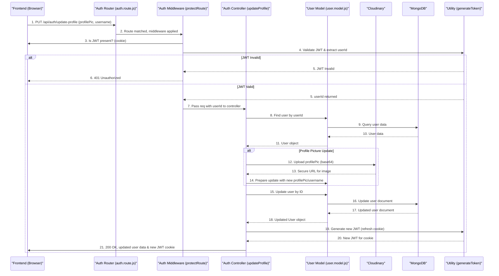

 
---
title: "Backend Architecture and APIs"
description: "Detailed documentation of the backend structure, core services, and exposed API endpoints."
sidebar_position: 2
---

# Backend Architecture and APIs

This section provides a detailed overview of the backend architecture, outlining the core services, the technologies used, and the API endpoints exposed. The backend is built on Node.js with Express, leveraging MongoDB for data persistence and a robust authentication system.

The application’s backend is designed to be scalable and maintainable, with clear separation of concerns between routes, controllers, and models. This structure facilitates development, testing, and future enhancements.

## Core Technologies and Services

The backend infrastructure relies on a modern JavaScript ecosystem and several key libraries:

*   **Node.js & Express**: The foundation for building the RESTful API. Express provides a minimalist web framework for handling routes, middleware, and request/response cycles.
*   **MongoDB & Mongoose**: MongoDB serves as the NoSQL database for flexible data storage, while Mongoose provides an ODM (Object Data Modeling) layer for interacting with MongoDB, simplifying data validation and schema definition.
*   **JWT (JSON Web Tokens)**: Used for secure authentication, allowing stateless session management.
*   **Bcrypt.js**: For hashing user passwords securely.
*   **Passport.js**: A flexible authentication middleware for Node.js, specifically used here for Google OAuth.
*   **Cloudinary**: A cloud-based image and video management service, integrated for storing user profile pictures.
*   **Socket.IO**: Powers real-time communication for features like instant messaging and live friend request updates.
*   **Cookie-Parser & Express-Session**: For managing HTTP cookies and session data, crucial for authentication and state management.

## Application Entry Point (`backend/src/index.js`)

The `index.js` file is the central entry point for the backend application. It sets up the Express server, integrates middleware, defines routes, and initiates the database connection.

```javascript
// backend/src/index.js - Main server setup
import express from "express";
import cors from "cors";
import authRoutes from "./routes/auth.route.js";
import messageRoutes from "./routes/message.route.js";
// ... other imports

const app = express();
// ... middleware setup
app.use(cookieParser());
app.use(express.json({limit : '2mb'}));
app.use(express.urlencoded({ limit: '2mb', extended: true }));
app.use(cors({
    origin: "http://localhost:5173",
    credentials: true,
}));
// ... session and passport setup

app.use("/api/auth", authRoutes );
app.use("/api/messages", messageRoutes );
app.use("/api/friends", friendRoutes);

// ... server listening and DB connection
```

[View on GitHub](https://github.com/shinymack/Chat-App-MERN/blob/main/backend/src/index.js#L1-L28)

This file demonstrates:
*   **Middleware Integration**: `cors` for cross-origin resource sharing, `cookieParser` for parsing cookies, `express.json` for parsing JSON request bodies, and `express.urlencoded` for parsing URL-encoded bodies.
*   **Session Management**: `express-session` is configured to manage user sessions, particularly important for `passport.js` and OAuth flows.
*   **Route Mounting**: API routes for authentication (`/api/auth`), messages (`/api/messages`), and friends (`/api/friends`) are mounted here, directing requests to their respective routers.

## Authentication and User Management

The authentication system handles user registration, login, logout, session management, and profile updates. It supports both traditional email/password authentication and Google OAuth.

### User Model (`backend/src/models/user.model.js`)

The `User` Mongoose model defines the schema for user data, including fields for email, username, password (hashed), profile picture, social connections (friends, requests), and authentication provider details.

```javascript
// backend/src/models/user.model.js - User Schema Definition
import mongoose from "mongoose";

const userSchema = new mongoose.Schema(
    {
        email: {
            type: String,
            required: true,
            unique: true
        },
        username: {
            type: String,
            required: [true, "Username is required"],
            unique: true,
            trim: true,
            minlength: [3, "Username must be at least 3 characters long"],
            maxlength: [20, "Username cannot be more than 20 characters long"]
        },
        password: {
            type: String,
            minlength: 6,
        },
        profilePic: {
            type: String,
            default: "",
        },
        friends: [{ type: mongoose.Schema.Types.ObjectId, ref: "User", default: [] }],
        friendRequests: [{ type: mongoose.Schema.Types.ObjectId, ref: "User", default: [] }],
        sentRequests: [{ type: mongoose.Schema.Types.ObjectId, ref: "User", default: [] }],
        authProvider: {
            type: String,
            enum: ['email', 'google'],
            default: 'email'
        },
        googleId: {
            type: String,
            unique: true,
            sparse: true
        },
    },
    {
        timestamps: true
    }
);

// Pre-save hook for password handling with Google Auth
userSchema.pre('save', async function(next) {
    if (this.authProvider === 'google' && !this.isModified('password')) {
        this.password = undefined;
    }
    if (this.authProvider === 'email' && !this.password && this.isNew) {
        return next(new Error('Password is required for email signup.'));
    }
    next();
});

const User = mongoose.model("User", userSchema);
export default User;
```

[View on GitHub](https://github.com/shinymack/Chat-App-MERN/blob/main/backend/src/models/user.model.js#L1-L69)

Key features of the User model:
*   **Unique Constraints**: `email` and `username` are unique to prevent duplicate accounts. `googleId` is also unique for Google OAuth users.
*   **Validation**: `minlength` and `maxlength` for `username` and `password` enforce data integrity.
*   **Social Graph**: Arrays for `friends`, `friendRequests`, and `sentRequests` facilitate building a social network within the application.
*   **Authentication Provider**: The `authProvider` field tracks how a user registered (`email` or `google`), influencing login logic.
*   **Pre-save Hook**: A `pre('save')` hook intelligently handles passwords: if a user logs in via Google, their password field can be `undefined`, ensuring security and flexibility.

### Authentication Controllers (`backend/src/controllers/auth.controller.js`)

This file contains the logic for all authentication-related API endpoints.

```javascript
// backend/src/controllers/auth.controller.js - Signup logic
export const signup = async (req, res) => {
    const {username, email, password} = req.body;
    try {
        if(!username || !email || !password) {
            return res.status(400).json({message: "Please fill in all fields."});
        }
        // ... username/password length validations
        const user = await User.findOne({email});
        if (user) return res.status(400).json({message: "Email already exists."});

        const existingUserByUsername = await User.findOne({ username });
        if (existingUserByUsername) {
            return res.status(400).json({ message: "Username already exists. Please choose another." });
        }

        const salt = await bcrypt.genSalt(10);
        const hashedPassword = await bcrypt.hash(password, salt);

        const newUser = new User({
            username,
            email,
            password: hashedPassword,
            authProvider: 'email'
        });
        if(newUser){
            generateToken(newUser._id, res); // Generate JWT and set as cookie
            await newUser.save();
            res.status(201).json({
                _id: newUser._id,
                username: newUser.username,
                email: newUser.email,
                profilePic: newUser.profilePic,
                authProvider: newUser.authProvider
            });
        } else {
            res.status(400).json({message: "Invalid user data."});
        }
    } catch (error) {
        console.log("Error in signup controller", error.message)
        res.status(500).json({message: "Something went wrong."});
    }
};
```

[View on GitHub](https://github.com/shinymack/Chat-App-MERN/blob/main/backend/src/controllers/auth.controller.js#L6-L56)

This `signup` function demonstrates:
*   **Input Validation**: Checks for required fields and validates username/password length.
*   **Duplicate Checks**: Ensures unique email and username before creating a new user.
*   **Password Hashing**: Uses `bcryptjs` to hash the password securely.
*   **JWT Generation**: Calls `generateToken` (from `lib/utils.js`) to create a JWT and set it in an HTTP-only cookie.
*   **Response**: Returns user details (excluding password) upon successful registration.

Other key controller functions:
*   **`login`**: Authenticates users by verifying credentials and generating a JWT.
*   **`logout`**: Clears the JWT cookie, effectively logging the user out.
*   **`updateProfile`**: Allows users to update their `profilePic` (via Cloudinary) and `username`, with appropriate validation.

    ```javascript
    // backend/src/controllers/auth.controller.js - Update Profile logic
    export const updateProfile = async (req, res) => {
        try {
            const { profilePic, username } = req.body;
            const userId = req.user._id;
            let userToUpdate = await User.findById(userId);

            if (!userToUpdate) {
                return res.status(404).json({ message: "User not found." });
            }

            const fieldsToUpdate = {};
            let newUsername = username ? username.trim() : null;

            if (newUsername && newUsername !== userToUpdate.username) {
                if (newUsername.length < 3 || newUsername.length > 20) {
                    return res.status(400).json({ message: "Username must be between 3 and 20 characters." });
                }
                const existingUserWithNewUsername = await User.findOne({ username: newUsername, _id: { $ne: userId } });
                if (existingUserWithNewUsername) {
                    return res.status(400).json({ message: "This username is already taken by someone else." });
                }
                fieldsToUpdate.username = newUsername;
            }

            if (profilePic) {
                const uploadResponse = await cloudinary.uploader.upload(profilePic);
                fieldsToUpdate.profilePic = uploadResponse.secure_url;
            }

            if (Object.keys(fieldsToUpdate).length === 0) {
                return res.status(400).json({ message: "No changes provided to update." });
            }

            const updatedUser = await User.findByIdAndUpdate(userId, { $set: fieldsToUpdate }, { new: true });
            generateToken(updatedUser._id, res); // Refresh token with potentially new info
            res.status(200).json(updatedUser);

        } catch (error) {
            console.error("Error in updateProfile controller", error.message);
            res.status(500).json({ message: "Internal Server Error while updating profile." });
        }
    };
    ```

    [View on GitHub](https://github.com/shinymack/Chat-App-MERN/blob/main/backend/src/controllers/auth.controller.js#L190-L245)

*   **`checkUsernameAvailability`**: Verifies if a given username is already taken, excluding the current user's own username.
*   **`googleAuthCallback`**: Handles the callback from Google OAuth, generating a JWT for the user.

### Authentication Routes (`backend/src/routes/auth.route.js`)

This file defines the API endpoints for user authentication and management, mapping them to their respective controller functions.

```javascript
// backend/src/routes/auth.route.js - Auth Routes Definition
import express from "express"
import passport from 'passport';
import { login, logout, signup, updateProfile, checkAuth, googleAuthCallback, checkUsernameAvailability} from  "../controllers/auth.controller.js"
import { protectRoute } from "../middleware/auth.middleware.js"
const router = express.Router();

router.post("/signup", signup);
router.post("/login", login);
router.post("/logout", logout);

router.put("/update-profile", protectRoute ,updateProfile)

router.get("/username/check/:username", protectRoute, checkUsernameAvailability);
router.get("/check", protectRoute, checkAuth)

router.get(
    '/google',
    passport.authenticate('google', { scope: ['profile', 'email'] })
);
router.get(
    '/google/callback',
    passport.authenticate('google', {
        failureRedirect: 'http://localhost:5173/login',
        failureMessage: true
    }),
    googleAuthCallback
);
export default router;
```

[View on GitHub](https://github.com/shinymack/Chat-App-MERN/blob/main/backend/src/routes/auth.route.js#L1-L32)

This router sets up the following endpoints:

*   `POST /api/auth/signup`: Registers a new user with email and password.
*   `POST /api/auth/login`: Authenticates an existing user with email and password.
*   `POST /api/auth/logout`: Logs out the current user by clearing the JWT cookie.
*   `PUT /api/auth/update-profile`: Updates the authenticated user's profile information, such as `profilePic` or `username`. Requires `protectRoute` middleware.
*   `GET /api/auth/username/check/:username`: Checks the availability of a given username. Requires `protectRoute` middleware.
*   `GET /api/auth/check`: Verifies the authentication status of the current user. Requires `protectRoute` middleware.
*   `GET /api/auth/google`: Initiates the Google OAuth flow.
*   `GET /api/auth/google/callback`: Handles the callback from Google OAuth.

The `protectRoute` middleware is crucial for securing endpoints, ensuring that only authenticated users can access them by validating the JWT.

## Backend Architecture Diagram

This diagram illustrates the main components of the backend and how they interact to handle user requests, particularly focusing on the authentication flow.


```mermaid
graph TD
    A["Frontend (React App)"] -->|"/api/auth/signup"| B["Auth Routes (auth.route.js)"]
    A -->|"/api/auth/login"| B
    B -->|Calls 'signup' or 'login'| C["Auth Controller (auth.controller.js)"]
    C -->|Interacts with DB| D["User Model (user.model.js)"]
    C -->|Uses 'bcryptjs' for hashing| E["Bcrypt.js"]
    C -->|Generates JWT & sets cookie| F["Utility: generateToken"]
    D -->|MongoDB (Data Storage)| G["Database (MongoDB Atlas)"]

    subgraph Google OAuth Flow
        A -- "Click 'Sign in with Google'" --> B_Google["/api/auth/google"]
        B_Google --> Passport["Passport.js"]
        Passport --> GoogleIDP["Google Identity Provider"]
        GoogleIDP -->|OAuth Callback| B_Callback["/api/auth/google/callback"]
        B_Callback -->|Authenticates & processes| C_Google["Auth Controller (googleAuthCallback)"]
        C_Google --> F
        C_Google --> D
    end

    A -->|"Protected routes (e.g., '/api/auth/check')"| M["Auth Middleware (protectRoute)"]
    M -->|Validates JWT| F
    M -->|If valid, proceeds to controller| C

    C -->|Updates profile pic| H["Cloudinary (Image Storage)"]
    C -->|Updates user data| G
```


## API Endpoint Interaction Flow

This sequence diagram details the interaction for a typical user profile update, demonstrating the role of middleware and various services.





## Key Integration Points

*   **Middleware First**: The `protectRoute` middleware ensures that critical authentication-related endpoints (`updateProfile`, `checkAuth`, `checkUsernameAvailability`) are only accessible to authenticated users, centralizing authorization logic.
*   **Decoupled Services**: `generateToken` is a separate utility for JWT creation, promoting reusability and keeping controllers clean. `Cloudinary` integration for profile pictures is handled directly within the controller, abstracting external service interactions.
*   **Database Interaction via ODM**: Mongoose provides a robust ODM, simplifying interactions with MongoDB and enforcing schema structures as defined in `user.model.js`. This allows for clear, object-oriented data manipulation.
*   **Error Handling**: Each controller includes `try-catch` blocks for robust error handling, returning appropriate HTTP status codes and messages to the client. Specific error handling is implemented for duplicate usernames during signup and profile updates.
*   **Google OAuth Strategy**: `passport.js` is configured to handle Google OAuth, integrating seamlessly with the `express-session` for session management and redirecting users after successful authentication to `googleAuthCallback` for JWT generation.

The backend architecture is designed to be robust, secure, and extensible, providing a solid foundation for the chat application's features.

Next: [Authentication and User Management](./2.1_authentication-and-user-management.mdx)
```