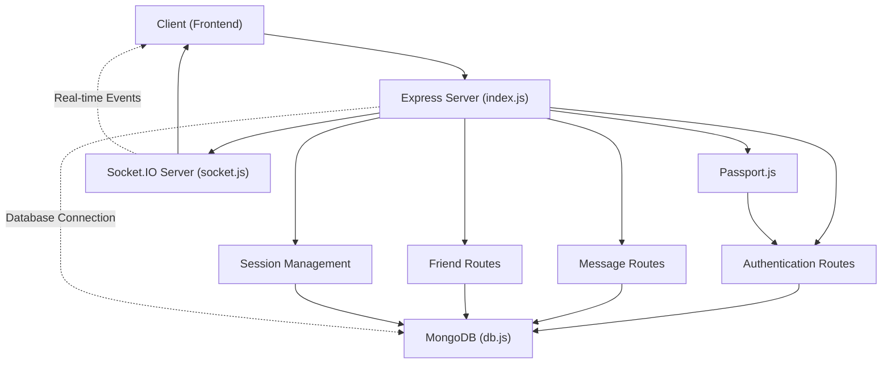
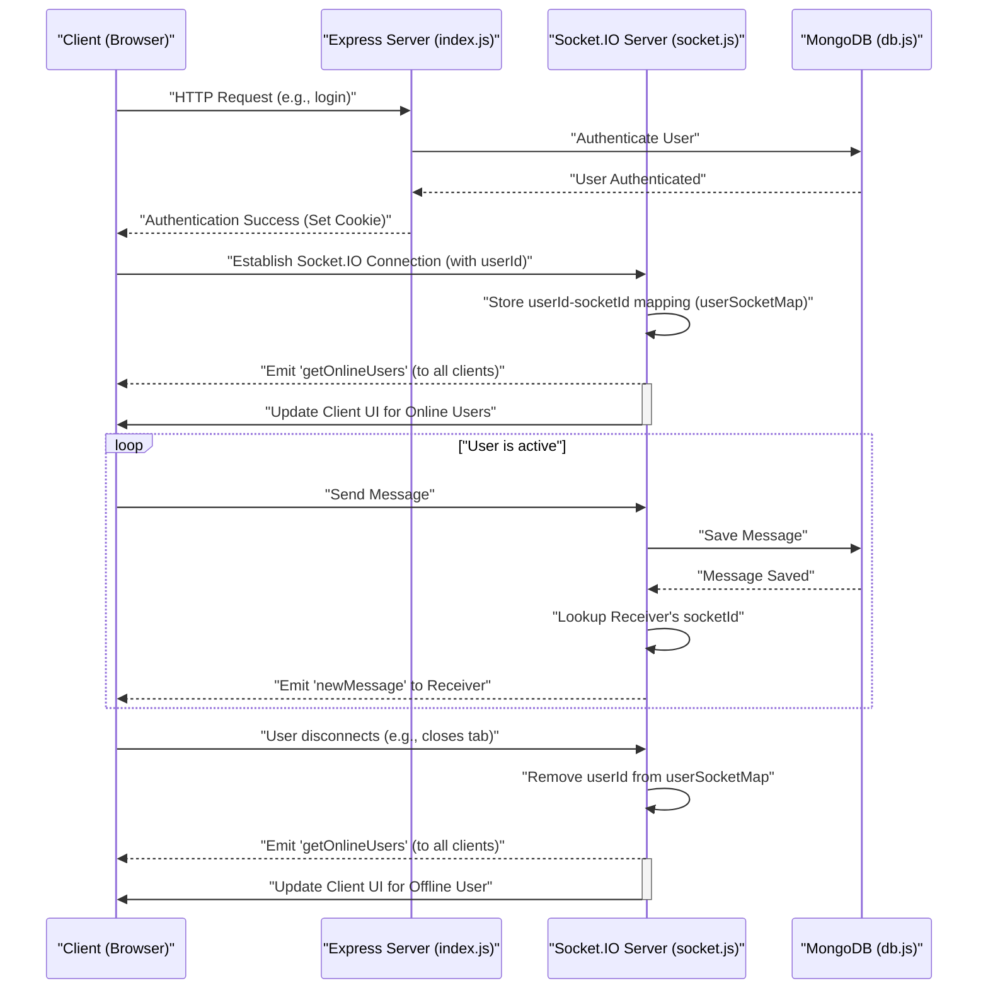

# Backend Architecture and Implementation

<TOC />

This document provides a comprehensive overview of the backend architecture, outlining the core technologies, file structure, and key functionalities. The backend is designed to support a real-time chat application, handling user authentication, message exchange, friend management, and real-time updates through WebSockets.

## Core Technologies and Dependencies

The backend is built primarily with Node.js and Express.js, leveraging a robust set of libraries to provide a scalable and efficient API. MongoDB serves as the primary data store, managed through Mongoose. Real-time communication is facilitated by Socket.IO.

Here's a breakdown of the key dependencies found in `backend/package.json`:

| Category | Dependency | Description |
| :------- | :--------- | :---------- |
| **Web Framework** | `express` | Fast, unopinionated, minimalist web framework for Node.js. |
| **Database** | `mongoose` | MongoDB object modeling tool designed to work in an asynchronous environment. |
| **Authentication** | `bcryptjs` | Used for hashing passwords securely. |
| | `jsonwebtoken` | Implements JSON Web Tokens for secure authentication and authorization. |
| | `passport` | Simple, unobtrusive authentication for Node.js. |
| | `passport-google-oauth20` | Passport strategy for authenticating with Google using the OAuth 2.0 API. |
| | `express-session` | HTTP session middleware for Express. |
| | `cookie-parser` | Parse Cookie header and populate `req.cookies`. |
| **Real-time** | `socket.io` | Enables real-time, bidirectional event-based communication. |
| **Cloud Storage** | `cloudinary` | Cloud-based image and video management. |
| **Utilities** | `dotenv` | Loads environment variables from a `.env` file. |
| **Development** | `nodemon` | Automatically restarts the node application when file changes in the directory are detected. |

You can view the full list of dependencies in the [package.json file on GitHub](https://github.com/shinymack/Chat-App-MERN/blob/main/backend/package.json).

## Application Entry Point: `backend/src/index.js`

The `index.js` file is the heart of the backend application, responsible for initializing the Express server, setting up middleware, defining API routes, and connecting to the database. It also integrates with Socket.IO for real-time capabilities.

```javascript
// backend/src/index.js
import express from "express";
import cors from "cors";
import authRoutes from "./routes/auth.route.js";
// ... other imports ...
import { connectDB } from "./lib/db.js";
import { app, server } from "./lib/socket.js";
// ... session and passport config ...

const __dirname = path.resolve();
dotenv.config();

configurePassport(); // Initialize Passport.js

app.use(cookieParser());
app.use(express.json({limit : '2mb'}));
app.use(express.urlencoded({ limit: '2mb', extended: true }));
app.use(cors({
    origin: "http://localhost:5173",
    credentials: true,
}));

app.use(session({
    secret: process.env.SESSION_SECRET,
    resave: false,
    saveUninitialized: false,
    cookie: {
        secure: process.env.NODE_ENV === "production",
        httpOnly: true,
        maxAge: 7 * 24 * 60 * 60 * 1000
    }
}));

app.use(passport.initialize());
app.use(passport.session());

app.use("/api/auth", authRoutes );
app.use("/api/messages", messageRoutes );
app.use("/api/friends", friendRoutes);

// ... Production build serving logic ...

server.listen(PORT, () => {
    console.log("server is running on PORT: " + String(PORT));
    connectDB();
});
```
[View `index.js` on GitHub](https://github.com/shinymack/Chat-App-MERN/blob/main/backend/src/index.js)

### Key Aspects of `index.js`:
- **Middleware Setup**: Configures essential middleware like `cors` for cross-origin resource sharing, `express.json()` and `express.urlencoded()` for parsing request bodies, and `cookie-parser` for handling cookies.
- **Session and Passport**: Initializes `express-session` to manage user sessions and `passport` for authentication strategies, including Google OAuth.
- **API Routes**: Defines clear endpoints for authentication (`/api/auth`), messages (`/api/messages`), and friend management (`/api/friends`), directing requests to their respective route handlers.
- **Database Connection**: Calls `connectDB()` upon server startup to establish a connection with MongoDB.
- **Production Handling**: Includes logic to serve the static frontend assets when the application is in production mode, ensuring a seamless deployment.

## Database Connection: `backend/src/lib/db.js`

The `db.js` module is solely responsible for establishing a connection to the MongoDB database using Mongoose. This modular approach centralizes database connection logic, making it reusable and easier to manage.

```javascript
// backend/src/lib/db.js
import mongoose from "mongoose"

export const connectDB = async () => {
  try {
    const conn = await mongoose.connect(process.env.MONGODB_URI);
    console.log(`MongoDB connected:  ${conn.connection.host}`);
  }
  catch(error){
    console.log("MongoDB connection error: ", error);
  }
}
```
[View `db.js` on GitHub](https://github.com/shinymack/Chat-App-MERN/blob/main/backend/src/lib/db.js)

The `connectDB` function uses `mongoose.connect()` with the `MONGODB_URI` from environment variables, promoting secure and flexible configuration.

## Real-time Communication: `backend/src/lib/socket.js`

This module sets up the Socket.IO server, enabling real-time bidirectional communication between the server and connected clients. It manages online users and facilitates instant message delivery.

```javascript
// backend/src/lib/socket.js
import { Server } from "socket.io";
import http from "http";
import express from "express";

const app = express();
const server = http.createServer(app);

const io = new Server(server, {
    cors: {
        origin: ["http://localhost:5173"]
    }
});

// used to store online users
const userSocketMap = {}; //{userId : socketId}

export function getReceiverSocketId(userId) {
    return userSocketMap[userId];
}

io.on("connection", (socket) => {
    console.log("A user connected", socket.id);

    const userId = socket.handshake.query.userId;
    if(userId) userSocketMap[userId] = socket.id;

    io.emit("getOnlineUsers", Object.keys(userSocketMap));

    socket.on("disconnect", ()=>{
        console.log("A user disconnected", socket.id);
        delete userSocketMap[userId];
        io.emit("getOnlineUsers", Object.keys(userSocketMap));
    });
});

export { io, app, server };
```
[View `socket.js` on GitHub](https://github.com/shinymack/Chat-App-MERN/blob/main/backend/src/lib/socket.js)

### Key Features of `socket.js`:
- **Socket.IO Server Initialization**: Creates a Socket.IO server instance, wrapping the HTTP server provided by Express. CORS is configured to allow connections from the frontend.
- **`userSocketMap`**: An object `userSocketMap` stores a mapping of `userId` to `socketId` for all online users, allowing the server to quickly find and send messages to specific clients.
- **`getReceiverSocketId`**: A utility function to retrieve a user's `socketId` based on their `userId`.
- **Connection Handling**:
    - On `connection`: When a user connects, their `userId` is extracted from the handshake query and stored in `userSocketMap`. The server then broadcasts an updated list of online users to all connected clients.
    - On `disconnect`: When a user disconnects, their entry is removed from `userSocketMap`, and the updated list of online users is broadcast again.

## Backend Architecture Overview

The following diagram illustrates the high-level components and their interactions within the backend architecture:





This diagram outlines the flow from the client to the Express server, which then dispatches requests to various route handlers. Authentication and session management are central, while Socket.IO handles real-time communication independently but in conjunction with the main server.

## Socket.IO User Connection Flow

Here's a detailed flow of how a user connects to the Socket.IO server and how their online status is managed:





This sequence diagram illustrates the lifecycle of a user's connection with the Socket.IO server, from initial connection and online status broadcasting to real-time message exchange and disconnection handling.

## Key Integration Points

- **Authentication and Session Management**: Passport.js is deeply integrated with Express sessions to handle user authentication, including local and Google OAuth strategies. `cookieParser` and `express-session` middleware are crucial for maintaining user sessions across requests.
- **Real-time Messaging**: Socket.IO works in tandem with the message API routes. When a new message is sent via an HTTP POST request to `/api/messages`, the message is saved to MongoDB. Subsequently, the Socket.IO server uses `getReceiverSocketId` to immediately push the new message to the intended recipient if they are online, ensuring real-time delivery.
- **Production Deployment**: The backend is configured to serve the static frontend assets from the `../frontend/dist` directory when `NODE_ENV` is set to `production`. This allows for a single server to host both the backend API and the frontend application, simplifying deployment.
- **Environment Variables**: Sensitive information like database URIs, session secrets, and API keys are managed using `dotenv`, ensuring that configurations are externalized and not hardcoded, which is vital for security and environment-specific settings.

The modular design, separation of concerns (e.g., `db.js` for database, `socket.js` for real-time), and strategic use of middleware and routing ensure a robust and maintainable backend.

Next: [Authentication and User Management](./2.1_authentication-and-user-management.mdx)