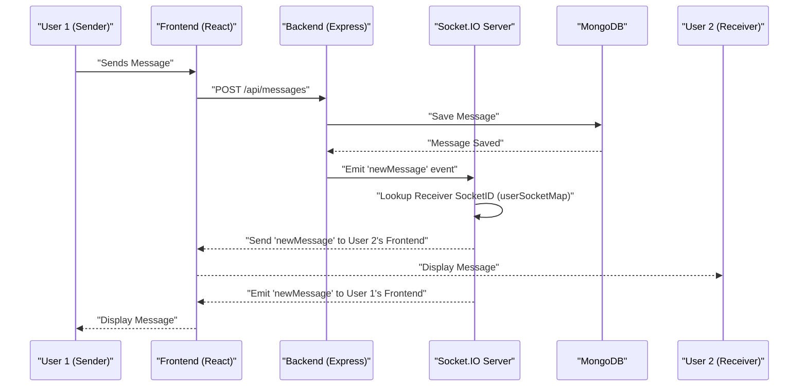

 # Backend Architecture

The backend of this application serves as the central hub for data management, user authentication, real-time communication, and API services. Built on a robust Node.js and Express.js foundation, it interacts with a MongoDB database and leverages Socket.IO for instant messaging capabilities. This document outlines the core components, technologies, and structural design of the server-side application.

## Core Technologies and Dependencies

The backend is primarily powered by Node.js and Express.js, providing a fast, scalable, and efficient environment for handling requests. MongoDB, a NoSQL database, is used for flexible data storage. Authentication is managed using JSON Web Tokens (JWT) and Passport.js, with additional support for Google OAuth2.0. Real-time features are enabled via Socket.IO.

Here's a snapshot of the key dependencies:

```json
// backend/package.json
{
  "name": "backend",
  "version": "1.0.0",
  "main": "src/index.js",
  "scripts": {
    "dev": "nodemon src/index.js",
    "start": "node src/index.js"
  },
  "dependencies": {
    "bcryptjs": "^2.4.3",
    "cloudinary": "^2.5.1",
    "cookie-parser": "^1.4.7",
    "dotenv": "^16.4.7",
    "express": "^4.21.2",
    "express-session": "^1.18.1",
    "jsonwebtoken": "^9.0.2",
    "mongoose": "^8.9.5",
    "passport": "^0.7.0",
    "passport-google-oauth20": "^2.0.0",
    "socket.io": "^4.8.1"
  },
  "devDependencies": {
    "nodemon": "^3.1.9"
  }
}
```
[View on GitHub](https://github.com/shinymack/Chat-App-MERN/blob/main/backend/package.json)

*   **`express`**: The core web framework for handling HTTP requests and routing.
*   **`mongoose`**: An ODM (Object Data Modeling) library for MongoDB, simplifying database interactions.
*   **`socket.io`**: Enables real-time, bidirectional, event-based communication between client and server.
*   **`bcryptjs`**: Used for hashing user passwords securely.
*   **`jsonwebtoken`**: For creating and verifying JSON Web Tokens, used in stateless authentication.
*   **`passport`**, **`passport-google-oauth20`**, **`express-session`**: Integrated for flexible authentication strategies, including Google OAuth.
*   **`dotenv`**: Manages environment variables for secure configuration.
*   **`cloudinary`**: For cloud-based image and video management, likely used for user avatars or media sharing.

## Application Entry Point and Configuration

The `backend/src/index.js` file serves as the main entry point for the backend application. It initializes the Express server, configures middleware, sets up API routes, and establishes a connection to the MongoDB database and Socket.IO server.

```javascript
// backend/src/index.js - Server Initialization
import express from "express";
import cors from "cors";
// ... other imports ...
import { connectDB } from "./lib/db.js";
import { app, server } from "./lib/socket.js";
// ... other imports ...

const __dirname = path.resolve();
dotenv.config();

configurePassport();

app.use(cookieParser());
app.use(express.json({limit : '2mb'}));
app.use(express.urlencoded({ limit: '2mb', extended: true }));
app.use(cors({
    origin: "http://localhost:5173",
    credentials: true,
}));

// ... session and passport middleware ...

app.use("/api/auth", authRoutes );
app.use("/api/messages", messageRoutes );
app.use("/api/friends", friendRoutes);

const PORT = process.env.PORT;
// ... production static file serving ...

server.listen(PORT, () => {
    console.log("server is running on PORT: " + String(PORT));
    connectDB();
});
```
[View on GitHub](https://github.com/shinymack/Chat-App-MERN/blob/main/backend/src/index.js#L1-L60)

Key configurations include:
*   **CORS**: Configured to allow requests from the frontend application running on `http://localhost:5173`.
*   **Body Parsers**: `express.json` and `express.urlencoded` handle incoming request bodies, with a 2MB limit for media uploads.
*   **Cookie Parser**: Processes cookies attached to client requests.
*   **Session Management**: `express-session` is used for managing user sessions, crucial for Passport.js authentication.
*   **Passport.js**: Initialized and configured for authentication strategies, including Google OAuth2.0.
*   **API Routes**: Routes are modularized into `authRoutes`, `messageRoutes`, and `friendRoutes` for better organization.
*   **Database Connection**: The `connectDB()` function is called upon server startup to establish a connection to MongoDB.
*   **Real-time Server**: The `server.listen` method initializes both the HTTP server (for Express) and the Socket.IO server.

## Database Connection

The `backend/src/lib/db.js` file encapsulates the logic for connecting to the MongoDB database. It utilizes Mongoose to establish and manage the connection, logging success or failure states.

```javascript
// backend/src/lib/db.js
import mongoose from "mongoose"

export const connectDB = async () => {
  try {
    const conn = await mongoose.connect(process.env.MONGODB_URI);
    console.log(`MongoDB connected:  ${conn.connection.host}`);
  }
  catch(error){
    console.log("MongoDB connection error: ", error);
  }
}
```
[View on GitHub](https://github.com/shinymack/Chat-App-MERN/blob/main/backend/src/lib/db.js)

The `MONGODB_URI` environment variable securely stores the connection string, ensuring sensitive information is not hardcoded.

## Real-time Communication with Socket.IO

Real-time features, such as displaying online users and instant message delivery, are handled by Socket.IO. The `backend/src/lib/socket.js` file sets up the Socket.IO server and manages user connections.

```javascript
// backend/src/lib/socket.js - Socket.IO Initialization
import { Server } from "socket.io";
import http from "http";
import express from "express";

const app = express();
const server = http.createServer(app);

const io = new Server(server, {
    cors: {
        origin: ["http://localhost:5173"]
    }
})

// used to store online users
const userSocketMap = {}; //{userId : socketId}

io.on("connection", (socket) => {
    console.log("A user connected", socket.id);

    const userId = socket.handshake.query.userId;
    if(userId) userSocketMap[userId] = socket.id;

    io.emit("getOnlineUsers", Object.keys(userSocketMap));

    socket.on("disconnect", ()=>{
        console.log("A user disconnected", socket.id);
        delete userSocketMap[userId];
        io.emit("getOnlineUsers", Object.keys(userSocketMap));
    })
})

export { io, app, server };
```
[View on GitHub](https://github.com/shinymack/Chat-App-MERN/blob/main/backend/src/lib/socket.js)

*   **`userSocketMap`**: An object ` {userId : socketId} ` stores the mapping between a user's ID and their active socket ID, allowing for targeted message delivery.
*   **Connection Handling**: On a new connection, the `userId` is extracted from the handshake query, and the user is added to `userSocketMap`. An event `getOnlineUsers` is then emitted to all connected clients, broadcasting the list of currently online users.
*   **Disconnection Handling**: When a user disconnects, their entry is removed from `userSocketMap`, and the updated online user list is broadcasted again.

## Backend Architectural Flow

The following diagram illustrates the high-level flow of requests and data within the backend application.


```mermaid
graph TD
    A["Frontend (React)"] -->|HTTP/WebSockets| B["Node.js / Express Server (index.js)"]
    B -->|API Routes (/api/*)| C["Controllers (auth, message, friend)"]
    C -->|Mongoose ODM| D["MongoDB Database"]
    B -->|Socket.IO Events| E["Socket.IO Server (socket.js)"]
    E -->|Real-time Data| A
    C -->|Authentication Middleware| F["Passport.js & JWT"]
    F -.->|"Authenticates & Authorizes"| C
    C -.->|"File Uploads"| G["Cloudinary (External)"]
    G -->|"Image/Video URLs"| D
    B -->|"Connects"| D
```


## Real-time Messaging Workflow

This diagram focuses on the workflow for real-time messaging, highlighting the interaction between users, the server, and Socket.IO.





## Key Integration Points

*   **Authentication & Session Management**: Passport.js is deeply integrated with `express-session` to handle user authentication, including local strategies (via `bcryptjs` and `jsonwebtoken` for token management) and third-party OAuth providers like Google. `cookieParser` helps manage session cookies securely.
*   **API & Real-time Synergy**: The Express API handles initial message creation and persistence to MongoDB. Once a message is saved, the Express route triggers a Socket.IO event to instantly deliver the message to the intended recipient(s) without needing them to refresh. This ensures a seamless user experience for real-time chat.
*   **Modular Routing**: The backend employs a modular routing structure (`authRoutes`, `messageRoutes`, `friendRoutes`), which enhances maintainability and scalability by separating concerns into distinct logical units.
*   **Environment Configuration**: The extensive use of `dotenv` for environment variables is a best practice for managing sensitive information like database URIs, API keys, and session secrets, making the application more secure and adaptable to different deployment environments.

This architecture provides a robust, scalable, and real-time capable foundation for the chat application, designed to handle user interactions and data persistence efficiently.

Next: [API Endpoints and Controllers](./2.1_api-endpoints-and-controllers.mdx)