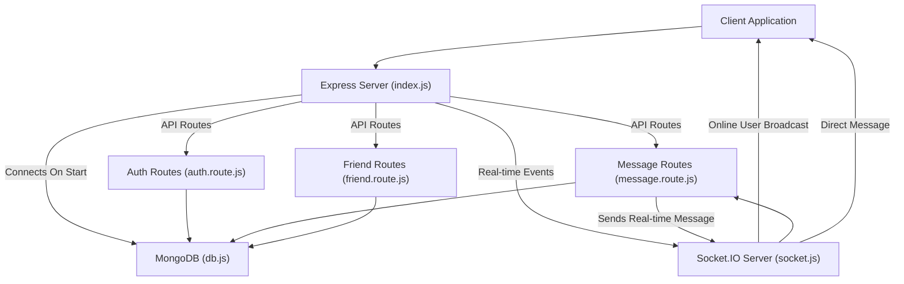
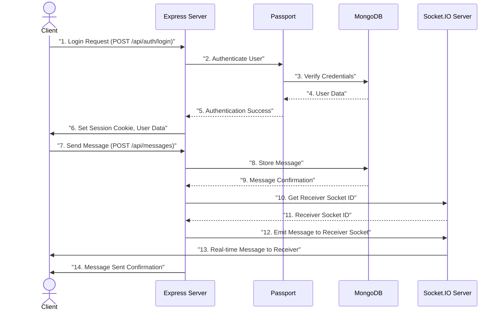

# Backend Architecture

The backend of the application is built as a robust and scalable Node.js server using the Express.js framework. It's designed to handle various functionalities including user authentication, real-time messaging, friend management, and database interactions. This document details the core components, technology stack, and overall design principles that govern the server-side operations.

## Technology Stack

The application leverages a modern JavaScript ecosystem for its backend, ensuring efficiency and maintainability.

### Core Technologies

*   **Node.js**: Asynchronous event-driven JavaScript runtime, ideal for building scalable network applications.
*   **Express.js**: A fast, unopinionated, minimalist web framework for Node.js, forming the backbone of the API.
*   **MongoDB**: A NoSQL document database known for its flexibility and scalability, managed via Mongoose ODM.
*   **Socket.IO**: A library for real-time, bidirectional, event-based communication, enabling instant messaging features.

### Key Dependencies

The `package.json` file outlines the primary dependencies that power the backend.

```json title="backend/package.json"
{
  "name": "backend",
  "version": "1.0.0",
  "main": "src/index.js",
  "scripts": {
    "dev": "nodemon src/index.js",
    "start": "node src/index.js"
  },
  "dependencies": {
    "bcryptjs": "^2.4.3",
    "cloudinary": "^2.5.1",
    "cookie-parser": "^1.4.7",
    "dotenv": "^16.4.7",
    "express": "^4.21.2",
    "express-session": "^1.18.1",
    "jsonwebtoken": "^9.0.2",
    "mongoose": "^8.9.5",
    "passport": "^0.7.0",
    "passport-google-oauth20": "^2.0.0",
    "socket.io": "^4.8.1"
  },
  "devDependencies": {
    "nodemon": "^3.1.9"
  }
}
```

[View on GitHub](https://github.com/shinymack/Chat-App-MERN/blob/main/backend/package.json)

## Application Entry Point (`src/index.js`)

The `backend/src/index.js` file serves as the main entry point for the backend application. It initializes the Express server, configures middleware, defines API routes, handles database connection, and starts the server.

### Server Setup and Middleware

The Express application is initialized here, along with critical middleware for request parsing, security, and session management.

```javascript title="backend/src/index.js (excerpt)"
import express from "express";
import cors from "cors";
import cookieParser from "cookie-parser";
import session from "express-session";
import passport from "passport";
import { configurePassport } from "./lib/passport.config.js";
import { connectDB } from "./lib/db.js";
import { app, server } from "./lib/socket.js"; // 'app' and 'server' from socket.js

dotenv.config();
configurePassport();

app.use(cookieParser());
app.use(express.json({limit : '2mb'}));
app.use(express.urlencoded({ limit: '2mb', extended: true }));
app.use(cors({
    origin: "http://localhost:5173",
    credentials: true,
}));

app.use(session({
    secret: process.env.SESSION_SECRET, 
    resave: false,
    saveUninitialized: false, 
    cookie: {
        secure: process.env.NODE_ENV === "production",
        httpOnly: true,
        maxAge: 7 * 24 * 60 * 60 * 1000 
    }
}));

app.use(passport.initialize());
app.use(passport.session());  
```

[View on GitHub](https://github.com/shinymack/Chat-App-MERN/blob/main/backend/src/index.js#L14-L44)

This section configures:
*   **`cookieParser`**: Parses incoming cookie headers.
*   **`express.json` / `express.urlencoded`**: Parses JSON and URL-encoded request bodies.
*   **`cors`**: Enables Cross-Origin Resource Sharing, allowing frontend requests from `http://localhost:5173`.
*   **`express-session`**: Manages user sessions, essential for authentication and stateful interactions.
*   **`passport`**: Integrates Passport.js for flexible authentication strategies, including Google OAuth20.

### API Routes

The core functionalities of the application are exposed through a set of well-defined API routes.

```javascript title="backend/src/index.js (excerpt)"
import authRoutes from "./routes/auth.route.js";
import messageRoutes from "./routes/message.route.js";
import friendRoutes from "./routes/friend.route.js";

// ... (middleware setup)

app.use("/api/auth", authRoutes );
app.use("/api/messages", messageRoutes );
app.use("/api/friends", friendRoutes);
```

[View on GitHub](https://github.com/shinymack/Chat-App-MERN/blob/main/backend/src/index.js#L5-L7)

These routes handle:
*   `/api/auth`: User authentication, registration, login, logout, and OAuth flows.
*   `/api/messages`: Sending and retrieving private messages between users.
*   `/api/friends`: Managing friend requests and user connections.

### Production Environment Serving

For production deployments, the backend is configured to serve the static frontend assets. This simplifies deployment by allowing a single server to host both the backend API and the frontend client.

```javascript title="backend/src/index.js (excerpt)"
const __dirname = path.resolve();
// ... (dotenv.config and passport.config)

if(process.env.NODE_ENV === "production"){
    app.use(express.static(path.join(__dirname, "../frontend/dist")));
    
    app.get("*" , (req, res) => {
        res.sendFile(path.join(__dirname,"../frontend", "dist","index.html"));
    })
}
```

[View on GitHub](https://github.com/shinymack/Chat-App-MERN/blob/main/backend/src/index.js#L51-L56)

This ensures that any request not matching an API route will be served the `index.html` file from the `frontend/dist` directory, allowing the client-side routing to take over.

### Server Initialization

The server listens on a specified port, and crucially, initiates the MongoDB connection.

```javascript title="backend/src/index.js (excerpt)"
server.listen(PORT, () => {
    console.log("server is running on PORT: " + String(PORT));
    connectDB();
});
```

[View on GitHub](https://github.com/shinymack/Chat-App-MERN/blob/main/backend/src/index.js#L58-L61)

Note that `server` is imported from `backend/src/lib/socket.js`, which wraps the `express` app in an `http` server for Socket.IO integration.

## Database Connection (`src/lib/db.js`)

The `backend/src/lib/db.js` file manages the connection to the MongoDB database using Mongoose.

```javascript title="backend/src/lib/db.js"
import mongoose from "mongoose"

export const connectDB = async () => {
  try {
    const conn = await mongoose.connect(process.env.MONGODB_URI);
    console.log(`MongoDB connected:  ${conn.connection.host}`);
  }
  catch(error){
    console.log("MongoDB connection error: ", error);
  }
}
```

[View on GitHub](https://github.com/shinymack/Chat-App-MERN/blob/main/backend/src/lib/db.js)

This module exports `connectDB`, an asynchronous function that establishes a connection to the MongoDB URI specified in environment variables. It includes error handling to gracefully manage connection issues.

## Real-time Communication (`src/lib/socket.js`)

The `backend/src/lib/socket.js` file sets up and manages the Socket.IO server, enabling real-time functionalities like instant messaging and online user presence.

### Socket.IO Server Setup

It creates an HTTP server that wraps the Express app, allowing Socket.IO to share the same port.

```javascript title="backend/src/lib/socket.js (excerpt)"
import { Server } from "socket.io";
import http from "http";
import express from "express";

const app = express();
const server = http.createServer(app);

const io = new Server(server, {
    cors: {
        origin: ["http://localhost:5173"]
    }
})
```

[View on GitHub](https://github.com/shinymack/Chat-App-MERN/blob/main/backend/src/lib/socket.js#L1-L12)

The `cors` configuration ensures that the Socket.IO server accepts connections only from the specified frontend origin.

### Online User Management

The server maintains a map of online users, associating each user's ID with their active socket ID. This allows for targeted messaging and broadcasting online status.

```javascript title="backend/src/lib/socket.js (excerpt)"
const userSocketMap = {}; //{userId : socketId}

io.on("connection", (socket) => {
    console.log("A user connected", socket.id);

    const userId = socket.handshake.query.userId;
    if(userId) userSocketMap[userId] = socket.id;

    io.emit("getOnlineUsers", Object.keys(userSocketMap));

    socket.on("disconnect", ()=>{
        console.log("A user disconnected", socket.id);
        delete userSocketMap[userId]; 
        io.emit("getOnlineUsers", Object.keys(userSocketMap));
    })
})
```

[View on GitHub](https://github.com/shinymack/Chat-App-MERN/blob/main/backend/src/lib/socket.js#L17-L30)

*   Upon connection, the user's ID (passed in the handshake query) is mapped to their `socket.id`.
*   The `getOnlineUsers` event is emitted to all connected clients, broadcasting the current list of online users.
*   On disconnection, the user is removed from the map, and the updated online user list is broadcast again.
*   The `getReceiverSocketId` function allows other modules to retrieve the socket ID of a specific user for private messaging.

```javascript title="backend/src/lib/socket.js (excerpt)"
export function getReceiverSocketId(userId) {
    return userSocketMap[userId];
}
```

[View on GitHub](https://github.com/shinymack/Chat-App-MERN/blob/main/backend/src/lib/socket.js#L14-L16)

## Backend Component Flow

The following diagram illustrates the high-level data flow and interactions between the main backend components.





## Key Integration Points

The backend architecture features several critical integration points that enable its full functionality:

*   **Express.js and Socket.IO Co-existence**: The `socket.js` module wraps the Express `app` within an `http.Server`, allowing both the RESTful API and the real-time Socket.IO server to run on the same port, simplifying deployment and network configuration.
*   **Authentication and Session Management**: `express-session` and `passport.js` work in tandem to provide robust user authentication, including local strategies and potentially third-party OAuth providers (e.g., Google). Sessions are secured using `httpOnly` cookies and `secure` flags in production.
*   **Database ORM Integration**: Mongoose acts as an Object Data Modeling (ODM) layer for MongoDB, abstracting away raw database operations and providing a schema-based solution for data management, making interactions with the database more predictable and easier to maintain.
*   **Real-time Messaging Workflow**: When a message is sent via `messageRoutes`, it's not only stored in MongoDB but also immediately relayed through the `Socket.IO` server (`socket.js`) to the intended recipient's connected client, ensuring instant delivery. The `getReceiverSocketId` function from `socket.js` is crucial for directing messages to the correct online user.
*   **Environment Configuration**: The use of `dotenv` ensures that sensitive information (like database URIs, session secrets, and API keys) is kept out of the codebase and managed via environment variables, enhancing security and configurability across different environments (development, production).

## Backend Data Flow Overview

This sequence diagram illustrates a typical user interaction from authentication to sending a real-time message.





Next: [API Endpoints and Controllers](./2.1_api-endpoints-and-controllers.mdx)