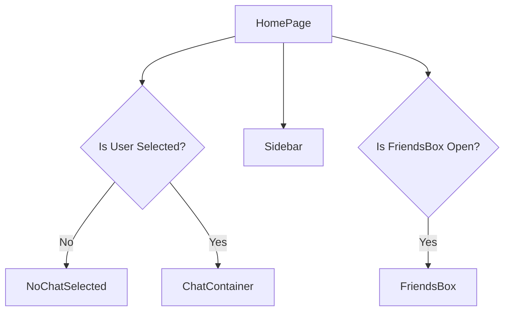
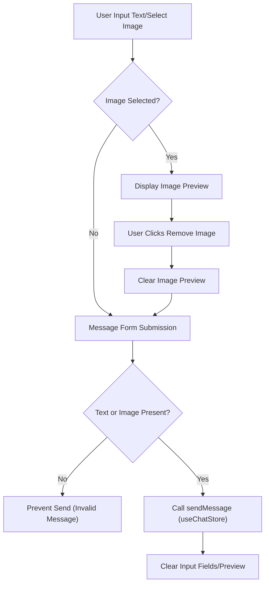

 # UI Components and Pages

This section provides detailed documentation of the reusable UI components and the main application pages within the chat application's frontend. These components are built with React and leverage Zustand for state management, providing a dynamic and responsive user experience.

## Homepage (`HomePage.jsx`)

The `HomePage.jsx` file serves as the main entry point for the application's user interface, orchestrating the layout and rendering of various components based on the application's state. It intelligently displays the chat interface or a placeholder when no chat is selected.

*   **Location**: `frontend/src/pages/HomePage.jsx`
*   **Purpose**: Renders the primary application layout, including the sidebar and the main chat area.
*   **Conditional Rendering**: Dynamically renders `ChatContainer` if a user is `selectedUser` for conversation; otherwise, it displays `NoChatSelected`.

**Key Features**:

*   **Main Layout**: Establishes the overall structure with a full-height container and a central content area.
*   **State-Driven Display**: Uses the `selectedUser` state from `useChatStore` to determine whether to show an active chat or a "no chat selected" placeholder.
*   **Component Composition**: Integrates `Sidebar`, `NoChatSelected`, `ChatContainer`, and `FriendsBox` to build the complete user interface.

```jsx title="frontend/src/pages/HomePage.jsx" {10-14}
import ChatContainer from "../components/ChatContainer";
import FriendsBox from "../components/FriendsBox";
import NoChatSelected from "../components/NoChatSelected";
import Sidebar from "../components/Sidebar";
import { useChatStore } from "../store/useChatStore"

const HomePage = () => {
  const { selectedUser } = useChatStore();
  const { isFriendsBoxOpen } = useChatStore();
  return (
      <div className="h-screen bg-base-200">
      <div className="flex items-center justify-center pt-20 px-4 w-full">
        <div className="bg-base-100 rounded-lg shadow-xl w-full max-w-6xl h-[calc(100vh-8rem)]">
          <div className="flex h-full rounded-lg overflow-hidden w-full">
            <Sidebar />
            {!selectedUser ? <NoChatSelected /> : <ChatContainer />}
            {isFriendsBoxOpen && <FriendsBox />}

          </div>

        </div>
      </div>
    </div>
  )
}

export default HomePage
```
[View on GitHub](https://github.com/shinymack/Chat-App-MERN/blob/main/frontend/src/pages/HomePage.jsx)

### HomePage Structure
The `HomePage` orchestrates the main view, dynamically showing chat components or placeholders based on user selection.





## Chat Container (`ChatContainer.jsx`)

The `ChatContainer.jsx` component is responsible for displaying the messages of a selected conversation. It manages the fetching, rendering, and real-time updates of messages, providing a dynamic chat experience.

*   **Location**: `frontend/src/components/ChatContainer.jsx`
*   **Purpose**: Displays the message history for the currently selected user and integrates the message input.
*   **Real-time Updates**: Subscribes to and unsubscribes from message updates using WebSocket connections managed by the `useChatStore`.

**Key Features**:

*   **Message Display**: Iterates through the `messages` array from the chat store to render individual message bubbles.
*   **Sender Identification**: Differentiates messages sent by the authenticated user (`authUser`) from those sent by the selected user for proper alignment (`chat-end` vs. `chat-start`).
*   **Image Support**: Renders images within message bubbles if `message.image` is present.
*   **Auto-Scroll**: Uses `useRef` and `useEffect` to automatically scroll to the latest message.
*   **Loading State**: Displays a `MessageSkeleton` while messages are being loaded.

```jsx title="frontend/src/components/ChatContainer.jsx" {23-28}
const ChatContainer = () => {
    const { messages, getMessages, isMessagesLoading, selectedUser, subscribeToMessages, unsubscribeFromMessages } =
        useChatStore();
    const { authUser } = useAuthStore();
    const messageEndRef = useRef(null);


    useEffect(() => {
        getMessages(selectedUser._id);
        subscribeToMessages();

        return () => unsubscribeFromMessages();
    }, [selectedUser._id, getMessages, subscribeToMessages, unsubscribeFromMessages]);
    
    useEffect(() => {
        if(messageEndRef.current && messages){
            messageEndRef.current.scrollIntoView({behaviour : "smooth"})
        }
    }, [messages])

    if (isMessagesLoading)
        return (
            <div className="flex-1 flex flex-col overflow-auto">
                <ChatHeader />
                <MessageSkeleton />
                <MessageInput />
            </div>
        );
    return (
        <div className="flex-1 flex flex-col overflow-auto">
            <ChatHeader />
            <div className="flex-1 overflow-y-auto p-4 space-y-4">
                {messages.map((message) => (
                    <div
                        key={message._id}
                        className={`chat ${message.senderId == authUser._id ? "chat-end": "chat-start"} `}
                        ref={messageEndRef}
                    >
                        <div className="chat-image avatar">
                            <div className="size-9 rounded-full border">
                                
                            </div>
                        </div>
                        <div className="chat-header mb-1">
                            <time className="text-xs opacity-50 ml-1">{formatMessageTime(message.createdAt)}</time>
                        </div>
                        <div className="chat-bubble flex flex-col">
                            {message.image && (
                                
                            )}
                            {message.text && <p>{message.text}</p>}
                        </div>
                    </div>
                ))}
            </div>
            <MessageInput />
        </div>
    );
};
```
[View on GitHub](https://github.com/shinymack/Chat-App-MERN/blob/main/frontend/src/components/ChatContainer.jsx)

## Message Input (`MessageInput.jsx`)

The `MessageInput.jsx` component provides the interface for users to compose and send messages, including text and image attachments.

*   **Location**: `frontend/src/components/MessageInput.jsx`
*   **Purpose**: Allows users to type text messages and attach images, then send them to the current chat.
*   **State Management**: Manages local state for message text and image preview before sending.

**Key Features**:

*   **Text Input**: A standard text field for typing messages.
*   **Image Attachment**: Allows users to select an image file, view a preview, and attach it to the message.
*   **Image Removal**: Provides an option to remove the selected image preview before sending.
*   **Validation**: Basic validation ensures only image files are selected and prevents sending empty messages.
*   **Submission Handling**: Calls the `sendMessage` action from `useChatStore` to send the message.

```jsx title="frontend/src/components/MessageInput.jsx" {26-37}
const MessageInput = () => {
    const [text, setText] = useState("");
    const [imagePreview, setImagePreview] = useState(null);
    const fileInputRef = useRef(null);
    const { sendMessage } = useChatStore();

    const handleImageChange = (e) => {
        const file = e.target.files[0];
        if (!file.type.startsWith("image/")) {
            toast.error("Please select an image file");
            return;
        }

        const reader = new FileReader();
        reader.onloadend = () => {
            setImagePreview(reader.result);
        };
        reader.readAsDataURL(file);
    };

    const removeImage = () => {
        setImagePreview(null);
        if (fileInputRef.current) fileInputRef.current.value = "";
    };

    const handleSendMessage = async (e) => {
        e.preventDefault();
        if (!text.trim() && !imagePreview) return;

        try {
            await sendMessage({
                text: text.trim(),
                image: imagePreview,
            });

            setText("");
            setImagePreview(null);
            if (fileInputRef.current) fileInputRef.current = "";
        } catch (error) {
            console.error("Failed to send message", error);
        }
    };
```
[View on GitHub](https://github.com/shinymack/Chat-App-MERN/blob/main/frontend/src/components/MessageInput.jsx)

### Message Input Flow
This diagram illustrates the user interaction and data flow when composing and sending a message with optional image attachment.





## Sidebar (`Sidebar.jsx`)

The `Sidebar.jsx` component displays a list of friends or available users, allowing the authenticated user to select a chat partner. It also indicates online status and provides a filter option.

*   **Location**: `frontend/src/components/Sidebar.jsx`
*   **Purpose**: Lists available chat partners, indicates their online status, and allows selection to open a chat.
*   **Responsiveness**: Adapts its visibility and width based on whether a user is selected on smaller screens.

**Key Features**:

*   **Friend List Display**: Fetches and renders a list of friends using `getFriends` from `useChatStore`.
*   **Online Status Indicator**: Visually indicates which friends are currently online using `onlineUsers` from `useAuthStore`.
*   **Online-Only Filter**: Provides a checkbox to filter the displayed friends to show only online users.
*   **User Selection**: Allows users to click on a friend to set them as the `selectedUser`, triggering the display of their chat.
*   **Responsive Hiding**: On small screens, hides itself when a user is selected, providing more space for the `ChatContainer`.

```jsx title="frontend/src/components/Sidebar.jsx" {26-47}
const Sidebar = () => {
    const { getFriends, users, selectedUser, setSelectedUser, isUsersLoading } =
        useChatStore();

    const { onlineUsers } = useAuthStore();
    const [showOnlineOnly, setShowOnlineOnly] = useState(false);
    useEffect(() => {
        getFriends();
    }, [getFriends]);
    const filteredUsers = showOnlineOnly
        ? users.filter((user) => onlineUsers.includes(user._id))
        : users;
    if (isUsersLoading) return <SidebarSkeleton />;
    return (
        <div className={`h-full sm:w-72 sm:border-r border-base-300  flex-col transition-all duration-200 ${selectedUser ?
                                    "hidden sm:flex w-[100vw] "
                                    : ""}`}>
            <div className="border-b border-base-300  p-5">
                <div className="flex items-center gap-2">
                    <Users className="size-6"></Users>
                    <span className="font-medium  lg:block">
                        Friends
                    </span>
                </div>
                {/* Online toggle filter remaining */}
                <div className="mt-3 lg:flex items-center gap-2">
                    <label className="cursor-pointer flex items-center gap-2">
                        <input
                            type="checkbox"
                            checked={showOnlineOnly}
                            onChange={(e) =>
                                setShowOnlineOnly(e.target.checked)
                            }
                            className="checkbox checkbox-sm"
                        />
                        <span className="text-sm">Show online only</span>
                    </label>
                    <span className="text-xs text-zinc-500">
                          ({users.filter(friend => onlineUsers.includes(friend._id)).length} online)
                    </span>
                </div>
                <div className="overflow-y-scroll h-[calc(100vh-14rem)] w-full flex flex-col py-3">
                    {filteredUsers.map((user) => (
                        <button
                            key={user._id}
                            onClick={() => setSelectedUser(user)}
                            className={`sm:w-full w-[88vw] p-3 flex items-center gap-3 hover:bg-base-300 transition-colors
                            ${
                                selectedUser?._id === user._id
                                    ? "bg-base-300 ring-1 ring-base-300"
                                    : ""
                            }`}
                        >
                            <div className="relative mx-0">
                                
                                {onlineUsers.includes(user._id) && (
                                    <span className="absolute bottom-0 right-0 size-3 bg-green-500 rounded-full ring-2 ring-zinc-900" />
                                )}
                            </div>
                            <div className=" block text-left min-w-0">
                                <div className=" font-medium truncate">
                                    {user.username}
                                </div>
                                <div className="text-sm text-zinc-400">
                                    {onlineUsers.includes(user._id)
                                        ? "Online"
                                        : "Offline"}
                                </div>
                            </div>
                        </button>
                    ))}
                </div>
                {filteredUsers.length == 0 && (
                    <div className="text-center text-zinc-500 py-4">No online friends</div>
                )}
            </div>
        </div>
    );
};
```
[View on GitHub](https://github.com/shinymack/Chat-App-MERN/blob/main/frontend/src/components/Sidebar.jsx)

## Key Integration Points

*   **State-driven UI**: The entire UI flow, particularly in `HomePage`, `ChatContainer`, and `Sidebar`, is heavily reliant on the global state managed by `useChatStore` and `useAuthStore`. `selectedUser` and `onlineUsers` are critical for determining component visibility and content.
*   **Real-time Communication**: `ChatContainer` demonstrates a key integration of real-time messaging through `subscribeToMessages` and `unsubscribeFromMessages`, ensuring that the message history is always up-to-date without requiring manual refreshes.
*   **Component Modularity**: Each component (e.g., `ChatHeader`, `MessageInput`, `SidebarSkeleton`) is designed to be reusable and responsible for a specific part of the UI, improving maintainability and scalability.
*   **User Experience**: Features like auto-scrolling to the latest message in `ChatContainer` and image previews in `MessageInput` enhance the user experience by providing intuitive interactions.

Next: [State Management and Utilities](./3.2_state-management-and-utilities.mdx)